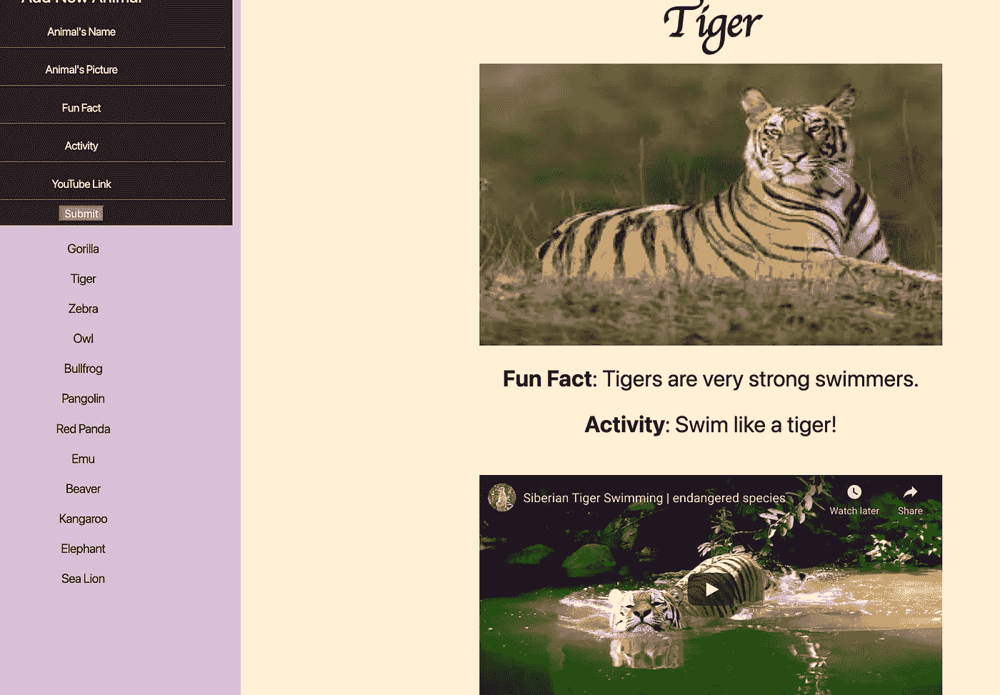

# 如何用 JavaScript 嵌入 YouTube 链接

> 原文：<https://javascript.plainenglish.io/embedding-youtube-links-with-javascript-1f55f260afff?source=collection_archive---------8----------------------->

## 用 JavaScript 嵌入 YouTube 链接的教程。

我儿子喜欢动物。对于我在熨斗学校软件工程项目中的第一个编码项目，我想为他制作一个在线动物园应用程序，在那里他可以看到他最喜欢的动物，并了解新的动物。当然，如果没有视频，这个应用就不完整。但是我只是在课堂上看到过这种情况，并没有亲自编写过代码。

在 HTML 文件中，我只创建了两个容器。一个是动物列表的侧边栏。第二个将显示关于单个动物的信息。我会在 Javascript 文件中动态呈现这些容器的实际 HTML 内容。

在侧边栏中有了动物列表后，我创建了一个事件监听器，显示被点击动物的名称、图片、事实、活动和视频。



前四个元素很容易编写，但是我怎么才能将 YouTube 视频嵌入到与图片相同大小的框架中呢？

用一个标签，我在 DOM 上为它创建了一个位置。

```
mainContainer.innerHTML = `    
<h1 class="name"><strong>${**foundAnimal.name**}</strong> </h1>    
    
<h3 class="fact"><strong>Fun Fact</strong>: ${**foundAnimal.fact**}</h3>    <h3 class="activity">Activity:${**foundAnimal.activity**}</h3>    
**<iframe id="player" class="inset-0 w-full h-full" frameborder="0" ></iframe> **   
`;
```

与其他 HTML 元素不同，我不能使用 foundAnimal 变量来插入视频链接。此变量使用。从 JSON 服务器获取的动物数组上的 find 方法，用于在单击时查找关于特定动物的数据。

```
document.addEventListener("click", (e) => {  
if (e.target.className === "animal-clicker") {    
const **foundAnimal** = animalsArray.**find**(      
(animal) => animal.id === parseInt(e.target.id));    renderMainContainerDetails(foundAnimal);  }
});
```

使用 iframe 元素的另一个挑战是，因为我是用 JavaScript 呈现 mainContainer 细节的，所以我不能用简单的 document.querySelector 通过 ID 来获取 iframe。node-getter 本质上是一个作为函数编写的全局变量 querySelector。

```
const mainContainer = document.querySelector(".animal-container");
**const videoPlayer = () => document.querySelector("#player");**
```

换句话说，“。“animal-container”在页面加载时已经是一个 DOM 元素，而“#player”则不是由于它的动态渲染。

一旦有了节点获取函数，我就可以简单地调用 renderMainContainerDetails 函数中的 videoPlayer 函数。然后，我可以使用 foundAnimal 变量将视频链接插入到后面提取视频 ID 的函数中。(记住，因为 videoPlayer 是一个函数，所以调用时我需要括号)。

```
function renderMainContainerDetails(foundAnimal) {  mainContainer.innerHTML = `    
<h1 class="name"><strong>${foundAnimal.name}</strong> </h1>        <h3 class="fact"><strong>Fun Fact</strong>: ${foundAnimal.fact}</h3>    <h3 class="activity">Activity: ${foundAnimal.activity}</h3>    <iframe id="player" class="inset-0 w-full h-full" frameborder="0" ></iframe>    `;  
**videoPlayer().src = `https://www.youtube.com/embed/${extractVideoID(    foundAnimal.video)}`;**
}
```

我们来分解一下:videoPlayer()通过 ID 调用 iframe。我用“，”指定来源。src”，然后通过调用 extractVideoID 函数插入 YouTube 地址，该函数将来自 JSON 服务器的视频链接作为其参数。

现在下一段代码看起来像魔术一样。我自己用我高超的谷歌搜索能力找到了这个。本质上，它接受提供的 URL 并将其转换成正则表达式。(如果你必须像我一样了解所有细节，YouTube 会为其视频分配一个 11 个字符的 ID，它出现在匹配数组的索引 7 处)。

```
function extractVideoID(url) {  
var regExp =    /^.*((youtu.be\/)|(v\/)|(\/u\/\w\/)|(embed\/)|(watch\?))\??v?=?([^#\&\?]*).*/;  
var match = url.match(regExp);  
if (match && match[7].length == 11) {    
return match[7];  
} else {    
alert("Could not extract video ID.");}
}
```

瞧啊。现在，为了将 iframe 居中并使其大小与上图相同，我必须添加额外的 CSS 规范。

```
#player {  
width: 400px;  
height: 400px;  
background-size: cover;  
margin-left: auto;  
margin-right: auto;  
display: block;  
width: 50%;  
padding-top: 1cm;  
padding-bottom: 1cm;
}
```

在做这个项目之前，我认为在其他网站上看到视频没什么。我现在已经对各种功能和文件之间如何通信有了深入的了解。为了重申这个特性的复杂性，最后看一下 renderMainContainerDetails 函数的最后一行:

```
**videoPlayer().src = `https://www.youtube.com/embed/${extractVideoID(    foundAnimal.video)}`**
```

这个 videoPlayer 函数调用指定了要插入到 iframe HTML 元素中的源，要求 JavaScript 插入 HTTP 地址，其中调用了 extractVideoID 函数，并使用之前定义的 foundAnimal 变量从 JSON 服务器传递了一个视频链接。

如果“合成”意味着将不同实体的组成元素组合成一个统一的有机体，那么最后一行就是教科书上的例子。保持惊讶，你们所有人。

感谢您的阅读。

*更多内容请看*[***plain English . io***](https://plainenglish.io/)*。报名参加我们的* [***免费周报***](http://newsletter.plainenglish.io/) *。关注我们关于*[***Twitter***](https://twitter.com/inPlainEngHQ)*和**[***LinkedIn***](https://www.linkedin.com/company/inplainenglish/)*。加入我们的* [***社区***](https://discord.gg/GtDtUAvyhW) *。**