# 在 Node.js 中进行本地开发时为 Localhost 启用 HTTPS

> 原文：<https://javascript.plainenglish.io/enable-https-for-localhost-during-local-development-in-node-js-96204453d72b?source=collection_archive---------0----------------------->

## 如何从 *http://localhost:PORT 到 http****s****://localhost:PORT 的教程。*

Photo by [FLY:D](https://unsplash.com/@flyd2069?utm_source=unsplash&utm_medium=referral&utm_content=creditCopyText) on [Unsplash](https://unsplash.com/s/photos/cyber-security?utm_source=unsplash&utm_medium=referral&utm_content=creditCopyText)

# 简介:

在桌面上创建 web 应用程序时，您可能会遇到类似于*[*http://localhost:8000 的应用程序 URL。*](http://localhost:3000.)*

*但是，如果你正在创建一个应用程序，它使用的 API 需要一个*安全的(****【HTTPS】****)*URL，即使是在开发期间，比如 Instagram 的 API *，那该怎么办？**

*或者您可能想在部署之前检查应用的网络性能？在这种情况下，最好确保您的本地机器模仿 HTTPS 协议。*

*在下面的教程中，我们将学习如何从[*http://localhost:*](http://localhost:8000)*端口到*[*https://localhost:*](https://localhost:8000)*端口！**

**要求:级别—初学者**

1.  *JavaScript 基础知识*
2.  *Node.js 基础知识*
3.  *Git 和 VS 代码已安装*

**如果你还没有安装 Git 或者 VS 代码，看看* [*这篇文章*](https://aunsh.medium.com/downloading-vs-code-node-js-git-and-postman-in-windows-b4184ed5f6dc) *同样适用！**

# *初始化:*

*克隆这个 [***回购***](https://github.com/aunshx/https-localhost-medium) 得到基本代码。克隆后，在终端中使用`npm i`命令安装所需的依赖项。*

*克隆安装后，使用`npm run server`启动 app。*

*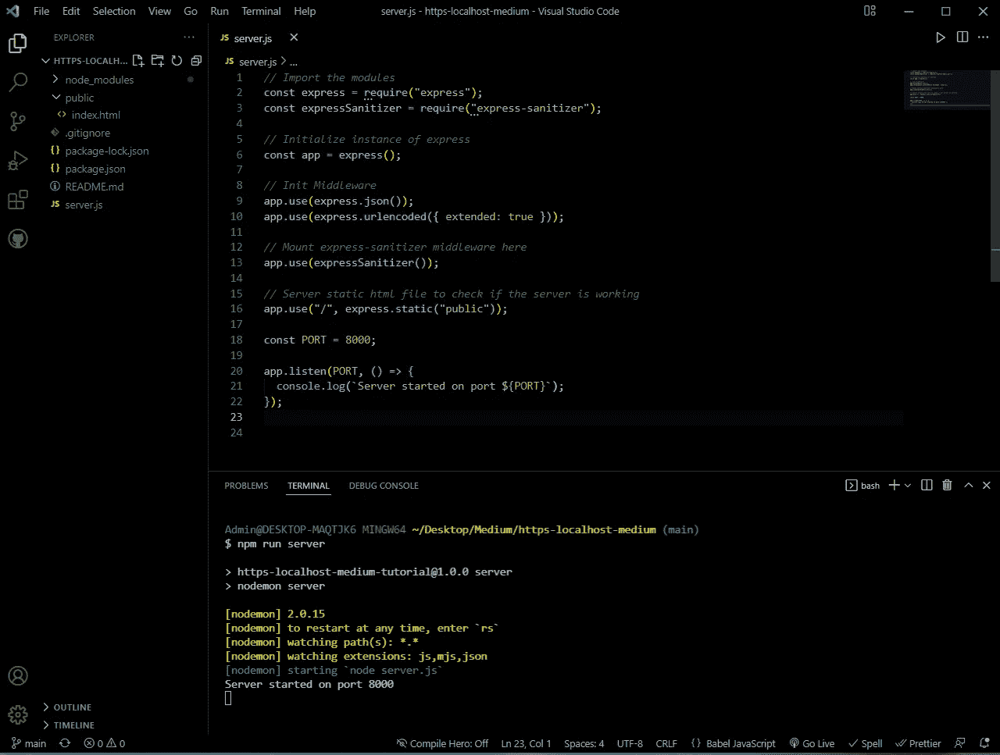*

*这是服务器开始在端口 8000 上成功运行后您将看到的。*

*如果你打开任何一个 URL 为 *http://localhost:8000* 或 *localhost:8000* 的浏览器窗口，你会看到我们的服务器提供的主页。*

*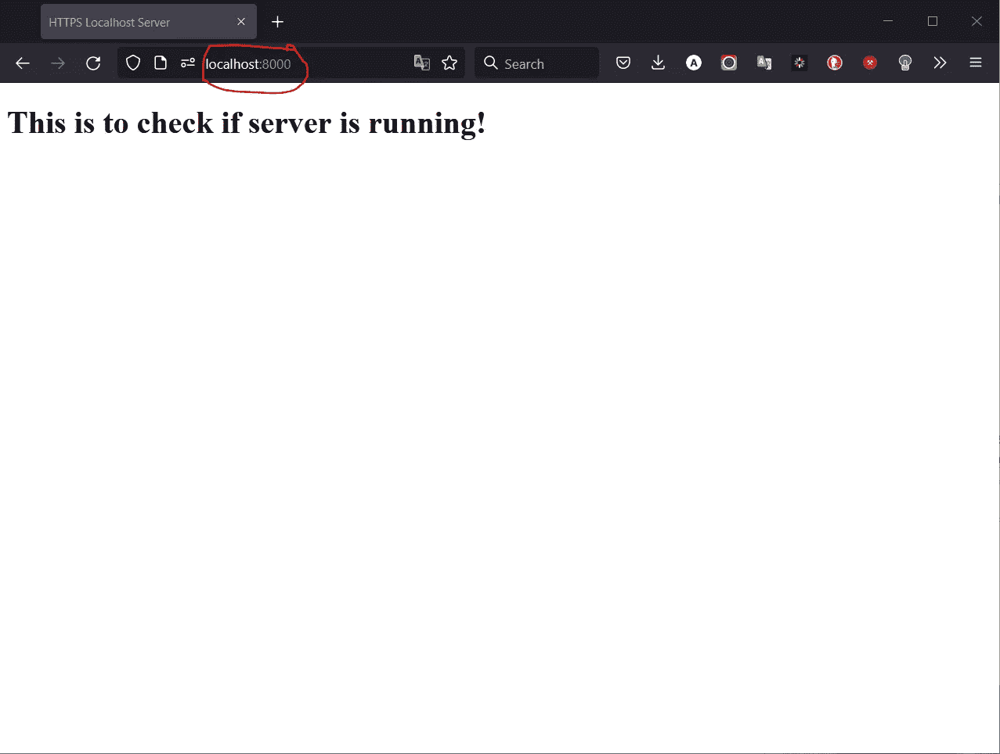*

*尽管这些文件是由我们在[*http://localhost:PORT*](http://localhost:PORT)上的服务器提供的，但本教程的目的是确保相同的文件也在[***https://localhost:***](https://localhost:8000)***PORT****上提供，其中“*https”【T21”中的“*很重要。**

**那么，事不宜迟，让我们开始吧！**

# **理论:**

***注意:如果你熟悉 HTTP 和 TLS (SSL)的概念，请随意跳过这一节。***

**HTTP 代表超文本传输协议，这是一种通过网络传输数据的协议。HTTPS 的 S 代表 Secure，它使用 TLS 或 SSL 来加密 HTTP 请求和响应。**

**因此，如果只使用 HTTP，在网络上进行间谍活动的人可以截获纯文本数据，而通过使用 HTTPS，间谍只能看到加密的随机字符串，这使得很难读取正在传输的数据，如下图所示。**

**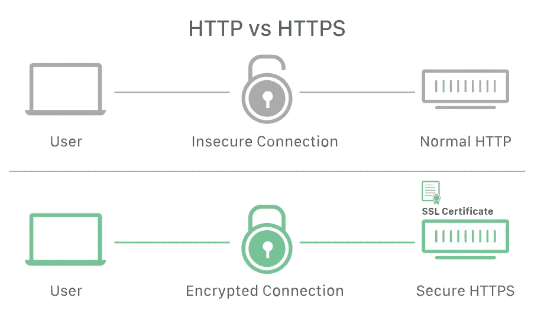**

**HTTP vs HTTPS diagram by cloudflare.com**

**为了让 HTTPS 工作，使用了[公钥加密](https://www.geeksforgeeks.org/public-key-encryption/)。这种类型的加密使用两个密钥，即。公钥和私钥。公钥通过服务器的 SSL 证书与客户端设备共享。**

**当客户机(美国)和服务器之间的连接打开时，这两个密钥用于创建特殊的会话密钥，这些密钥用于加密客户机和服务器之间的数据。这确保了对数据的增强保护。**

**加密过程如下图所示。**

**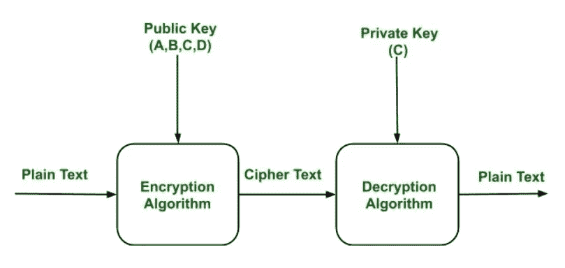**

**Public key encryption by geeksforgeeks.org**

**因此，为了让我们的本地主机拥有 HTTPS，我们需要创建一个*证书*，它将包含公钥和一个单独的*私钥。***

**为了使证书有效，它需要由可信的*认证机构* (CA)发布，该认证机构确认所使用的站点是真实的。**

**当我们在本地开发我们的应用程序时，我们需要创建一个本地的 *CA* ，它将使用可信的*域*生成本地可信的证书，在我们的例子中是 *localhost 或* `127.0.0.1`。**

***注:* `*127.0.0.1*` *是一个专用的 IPv4 地址，称为 localhost，所有计算机都将其用作自己的地址，但不能用于与其他设备通信。***

**为了完成所有这些，我们将安装 *mkcert，*这是一个用于制作本地可信开发证书的简单工具。**

# **Mkcert:**

**为了在您的机器上全局安装 *mkcert* ，打开 Git Bash 终端并输入`npm install -g mkcert`。**

**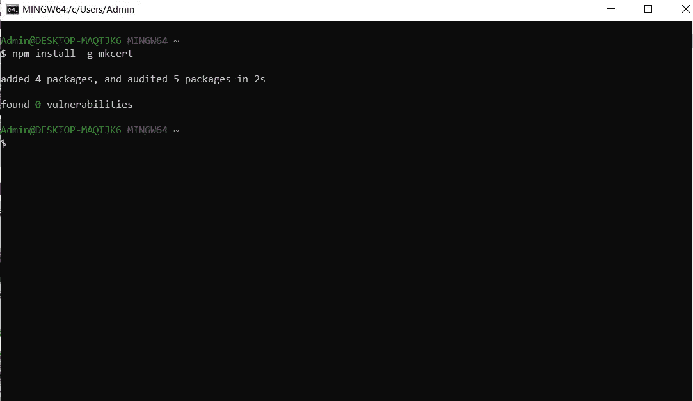**

**Mkcert globally installed on my PC**

**首要任务是创建一个*认证中心*，它将进一步向我们颁发本地证书。为此，在您的终端中输入`mkcert create-ca.`，这将创建 *CA* 私钥 *(ca.key)* 和证书 *(ca.crt)* 并将其存储在终端中给定的位置。对我来说，它们存储在 *C:\Users\Admin\* 文件夹中。**

***注意:将私钥安全地存储在不同的位置很重要，但是为了简单起见，我们不会改变它的位置。***

**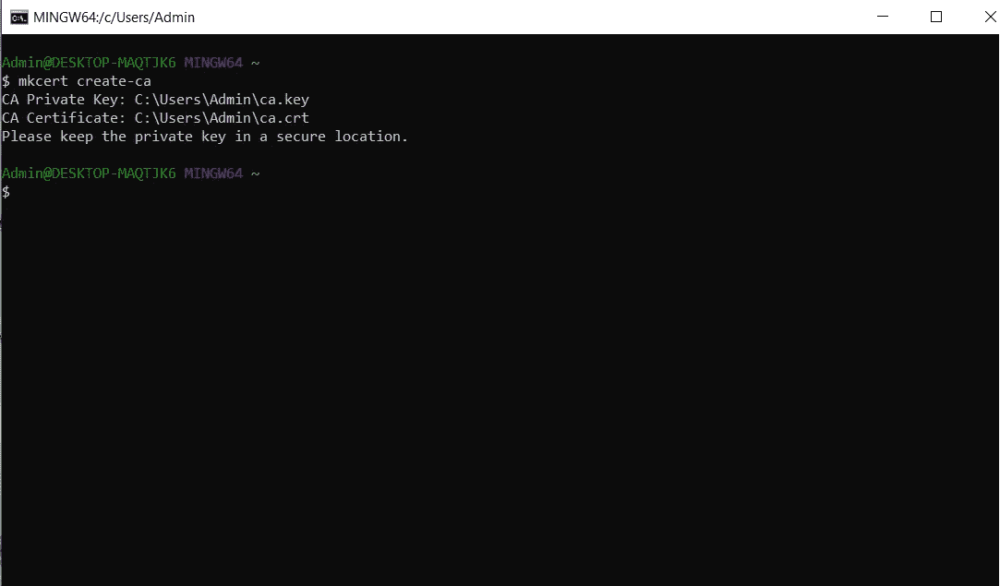**

**CA key and certificate created and stored in the C drive**

**因为我们已经有了我们的 *CA* ，下一步是创建我们的本地证书，它是私钥，这将使我们在 *localhost* 上的应用程序变得“*安全”。***

**在您的终端中，输入`mkcert create-cert.`。该命令包含一系列选项，如有效期、ca-key、ca-cert、要包含的域等等。**

**由于我们还没有将 *ca.key* 和 *ca.crt* 文件从它们所在的文件夹中移走，并且我们将要使用的域是 *localhost* 或`*127.0.0.1*` ，我们不需要为`mkcert create-cert`命令提供任何选项，因为以上所有选项都是默认的。**

**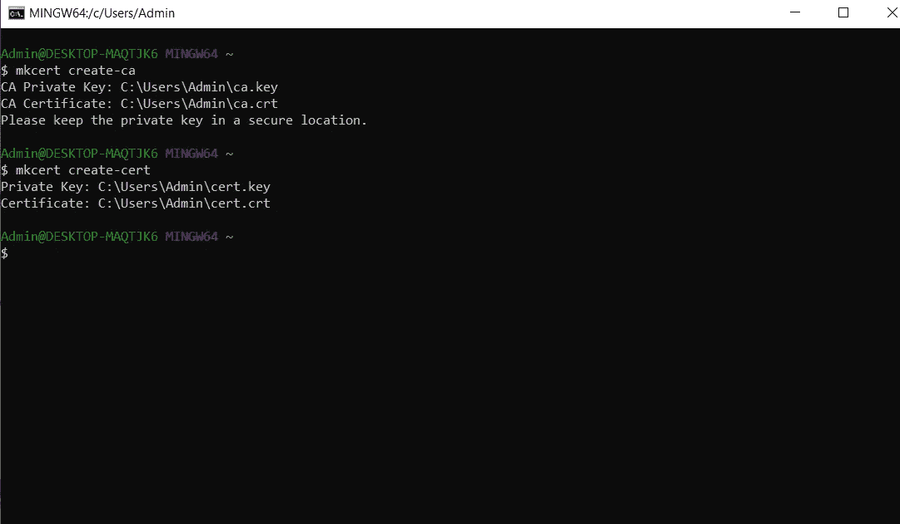**

**Local certificate and private key for localhost created and stored in the C drive**

**证书 *(cert.crt)* 和私钥 *(cert.key)* 被创建并存储在与 *ca.crt* 和 *ca.key* 相同的文件夹中。**

**现在，我们已经有了所需的文件，下一步是将 *cert.key* 和 *cert.crt* 文件复制到我们应用程序的文件夹中。在我们这样做之前，在应用程序的文件夹中创建一个名为 *config* 的文件夹。**

**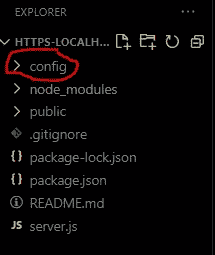**

**Updated folder structure with the config folder**

**转到存储文件的文件夹(终端中给出的位置)并将它们复制并粘贴到 *config* 文件夹中。**

****

**Copy the cert and the cert.key files**

**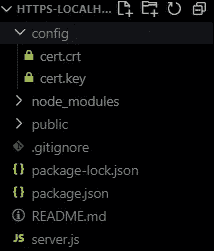**

**Config folder with the cert files**

**随着所需文件的创建和存储完成，是时候创建我们的 *HTTPS* 服务器了！**

# **HTTPS 服务器:**

**将 *https* (预装依赖)和 *fs* (内置)模块导入到 *server.js* 文件中。**

**为了在 Node.js 中启动一个 *HTTPS* 服务器，我们需要向它传递一个*选项*对象，其中将包含我们创建的私钥和本地证书。通过使用 *fs* 模块的 *readFileSync()* 方法，将需要的文件读入 *server.js* 。**

**最后一步，我们将创建并开始监听端口 8080(可以使用任何其他端口)上的 *HTTPS* 服务器，方法是用*选项*对象初始化它。**

***注意:如果两台服务器有相同的 IP 地址，它们不可能监听同一个端口(就像我们本地机器的情况一样),我们必须为我们的 HTTPS 服务器使用不同的端口号。***

**您将看到两个服务器在终端中运行。第一个在端口 8000 上，而 *HTTPS* 服务器在端口 8080 上。**

**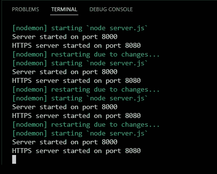**

**现在是最后一场！打开你喜欢的浏览器，进入[***https://localhost:8080。***](https://localhost:8080.)*您将看到与标准服务器(端口 8000)上相同的消息。这是因为相同的文件正在两台服务器上成功提供服务！***

***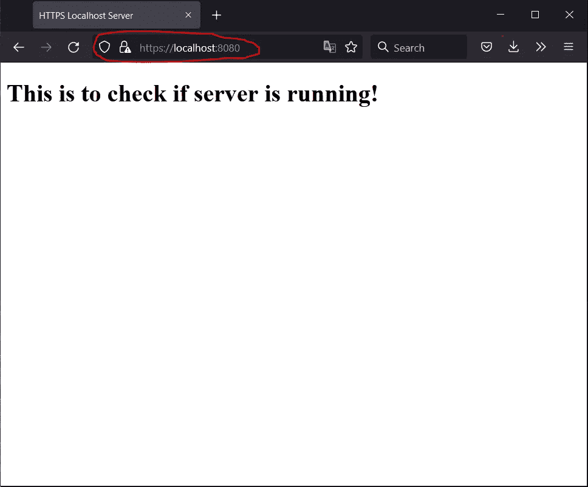***

***The file being served on https://localhost:8080***

# ***结论:***

***在本文中，我们看到了如何在 Node.js 的应用程序开发过程中为本地服务器启用 *HTTPS****

**下次见！**

# **参考资料:**

1.  **127.0.0.1 地址由 Livewire 解释**
2.  **[公钥加密](https://www.geeksforgeeks.org/public-key-encryption/)由 GeeksforGeeks**
3.  **什么是 HTTP 和 HTTPS？乘云耀斑**
4.  **菲洛·索特瓦**

***更多内容请看*[***plain English . io***](https://plainenglish.io/)*。报名参加我们的* [***免费每周简讯***](http://newsletter.plainenglish.io/) *。关注我们*[***Twitter***](https://twitter.com/inPlainEngHQ)*和**[***LinkedIn***](https://www.linkedin.com/company/inplainenglish/)*。加入我们的* [***社区不和谐***](https://discord.gg/GtDtUAvyhW) *。****