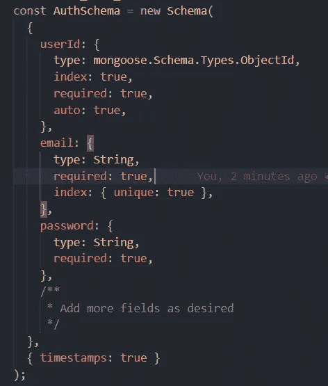
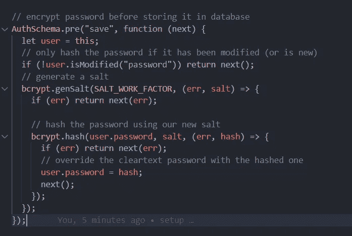
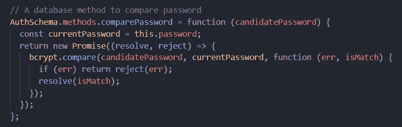
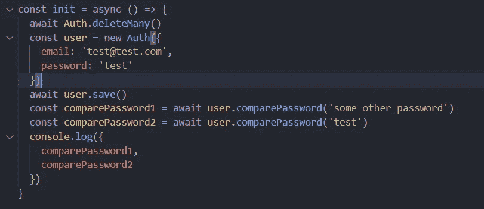
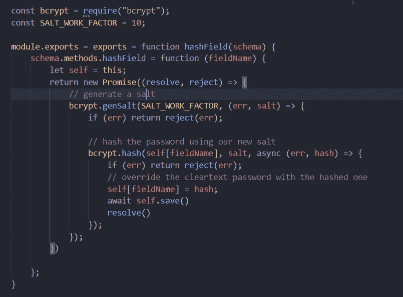

# 如何用 Mongoose 方法和插件加密字段

> 原文：<https://javascript.plainenglish.io/encrypt-fields-with-mongoose-method-and-plugin-7c2452263e2d?source=collection_archive---------3----------------------->

## 关于我们如何使用 mongoose 方法来管理需要加密或解密的密码或类似密码的字段的指南。


Photo by [Markus Spiske](https://unsplash.com/@markusspiske?utm_source=medium&utm_medium=referral) on [Unsplash](https://unsplash.com?utm_source=medium&utm_medium=referral)

# 用猫鼬管理密码

在本文中，我们将关注如何使用 mongoose 方法来管理需要根据需要加密或解密的密码或类似密码的字段。

用例的总体思路是创建一个 mongoose 方法来比较密码，并在我们保存密码时使用一个钩子来加密密码。

## 开始

让我们创建一个身份验证模式，它将包含两个具有理想属性的字段电子邮件和密码

**导入必要的模块:**

```
const mongoose = require("mongoose");const bcrypt = require("bcrypt");const { Schema } = mongoose;const SALT_WORK_FACTOR = 10;
```



Auth.js

**创建一个钩子**

现在，让我们创建一个钩子在保存密码的同时加密密码。在预保存挂钩中，只有一个参数，即基于条件逻辑触发的下一个回调。`next`是第一个错误回调，其中第一个参数是一个错误。在数据的情况下，数据可以作为 setter 直接附加到这个实例上，因此根据模型的思想，每个字段都有自己的 getter 和 setter。

在这里，如果密码字段未被修改，我们将让用户通过，但如果被修改，我们将为此创建一个哈希，并通过每次生成一个新的 salt，将其附加到保存在用户变量中的这个实例。



pre-save hook

**创建一个方法**

将会有一个用例，您可能想要获取解密的数据或比较输入是否与加密版本相同，然后我们可以创建一个 mongoose 方法，通过向它添加自定义逻辑来实现这个目的。

要创建一个方法，我们可以将已经可用的方法对象用于所有模式，并将自定义方法附加到它上面。用 ES5 语法保留方法的未命名函数，否则它将无法在这个实例中持久化。

不要使用 arrow 方法，因为它不会持久化`this`实例。

在下面的函数中，我们获取参数，并使用 bcrypt 将它与存储在数据库中的参数进行比较，然后返回基于匹配状态的布尔值。



custom mongoose method to compare

## 测试

为了测试我们构建的版本，我们可以创建任何小应用程序或在任何可用的应用程序中进行测试。

在本例中，我们传递密码字段，但不对其进行哈希处理，但是在保存该字段时，我们的预保存钩子将被触发，它会将该字段的哈希存储在数据库中。

在下一行中，我们使用刚刚创建的自定义方法来比较输入密码是否与存储的密码相同。



test case for the above scenarios

```
Output
- false
- true
```

由于我们在第一次检查时传递了错误的密码，下面方法的输出将是 false，然后是 true。

## 如何让这个全球化

为了使一个方法是全局的，并且能够访问所有的模式，我们需要使用[mongose 插件](https://mongoosejs.com/docs/plugins.html)。

**创建一个插件**

要创建一个插件，我们可以创建一个包含以下内容的文件。在这里，我们首先必须用模式作为输入来定义对象实例。相同的模式将从子模式传递到插件。一旦我们有了模式，我们就可以放置我们用于密码散列的相同方法逻辑

为了实现相同的功能，我们将其提取到 self 中，然后使用 self 作为对文档的引用来更新和获取字段。因为我们有了文档实例，所以我们也可以使用所有其他方法，比如`save`来保存文档

插件是独立于钩子的，可以用它们来定制。



custom mongoose plugin

**初始化一个插件**

要初始化插件，我们需要首先将它添加到模式中。

```
const hash = require("../plugin/hash");/.../
AuthSchema.plugin(hash);/../
```

为此，Auth collection 中的所有文档都可以访问我们刚刚创建的自定义插件，我们可以按如下方式使用它:


hash fields

## 结论

希望现在您能理解如何在模式和全局级别上创建自定义方法，以便以更好的方式管理您的操作。

您可以在这里找到本文的源代码:

[](https://github.com/Piyush-Use-Personal/mongoose-plugin) [## GitHub-Piyush-使用-个人/猫鼬-插件

### 此时您不能执行该操作。您已使用另一个标签页或窗口登录。您已在另一个选项卡中注销，或者…

github.com](https://github.com/Piyush-Use-Personal/mongoose-plugin) 

谢谢大家！

*更多内容看* [***说白了就是 io***](https://plainenglish.io/) *。报名参加我们的* [***免费周报***](http://newsletter.plainenglish.io/) *。关注我们关于*[***Twitter***](https://twitter.com/inPlainEngHQ)*和**[***LinkedIn***](https://www.linkedin.com/company/inplainenglish/)*。加入我们的* [***社区***](https://discord.gg/GtDtUAvyhW) *。**