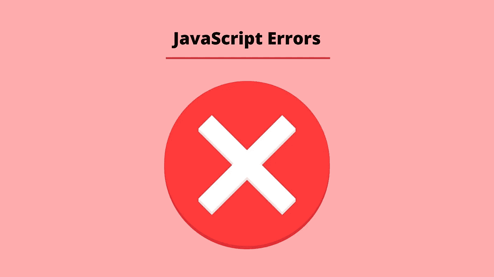
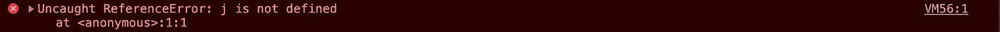

# 如何在 JavaScript 中读取错误对象(附示例)

> 原文：<https://javascript.plainenglish.io/error-objects-in-javascript-by-example-6b871484fc85?source=collection_archive---------9----------------------->



了解如何读取错误对象至关重要，这样您就可以调试代码并修复错误。在这篇文章中，我们将通过你可能遇到的例子来浏览一些主要的错误。

## 什么是错误对象？

JavaScript 中的错误对象包含一组属性，帮助我们更好地理解问题，这些属性是:

*   名称:错误类型
*   消息:错误描述
*   文件名:包含错误的文件的名称
*   行号:错误的行号



在上图中， *ReferenceError* 是错误名称； *j 未定义*是错误描述。然后在最右边，我们有了*文件名*和*行号*。在本例中，这是 VM56:1，因为错误是在控制台中创建的。

有几种类型的内置错误对象，理解这些将有助于您更快地理解问题。以下是您最有可能看到的:

*   错误
*   语法错误
*   参考错误
*   类型错误
*   范围误差
*   URIError
*   错误

## 错误

Error 是创建上述所有错误对象的对象原型。我们可以用它来创建我们自己的错误对象。

```
let ourError = new Error('Some custom error message');
throw ourError;//Returns ---> Uncaught Error: Some custom error message
    at <anonymous>:1:16
```

我们还可以进一步扩展它，向我们的错误对象添加一些额外的属性。

```
let ourError = new Error('Some custom error message');
ourError.name = 'ValidationError';
console.log(ourError);ValidationError: Some custom error message
    at <anonymous>:1:16
```

## 语法错误

当代码语法不正确并且 JavaScript 引擎无法解析代码时，我们会得到一个语法错误。通常这可能只是一个简单的打字错误。让我们看一些例子。

```
let ourString = "a string';
//Returns ---> Uncaught SyntaxError: Invalid or unexpected token
```

上面的示例返回错误是因为混合了引号。

```
console.log('a'
//Returns ---> Uncaught SyntaxError: missing ) after argument list
```

由于缺少右括号，上面的示例返回了错误。

```
let ourObject = {
  person one: "Bob"
};//Returns ---> Uncaught SyntaxError: Unexpected identifier
```

上面的例子返回了错误，因为关键人物一中的间距不正确。

```
let ourArray = [1 2, 3];
//Returns Uncaught SyntaxError: Unexpected number
```

上面的示例返回错误，因为元素 1 和 2 之间缺少逗号。

## 参考误差

当我们试图访问一个根本不存在或者在我们试图访问的范围内不存在的变量时，引用错误就产生了。让我们看一些例子:

```
let one = 1;
let sum = one + two;
// Returns ---> Uncaught ReferenceError: two is not defined
```

在上面的例子中，我们得到了错误，因为 sum 试图将一个名为 one 的变量添加到一个名为 two 的变量中，但是我们只声明了一个名为 one 的变量。

```
console.log(aFunction());
//Returns ---> Uncaught ReferenceError: aFunction is not defined
```

上面的例子返回了错误，因为我们试图在 console.log 中调用一个名为 *aFunction* 的函数，但是我们从未声明过这个函数。

## 类型错误

当我们试图使用一个不存在的方法或者某个操作无法运行时，通常会出现类型错误。

```
let anotherObject = {};
anotherObject.one();
//Returns ---> VM363:1 Uncaught TypeError: anotherObject.one is not a function
```

我们在上面的例子中得到错误，因为我们试图在 *anotherObject* 对象上使用一个名为 *one* 的方法，但是这个方法不存在。

```
Window.open();
//Returns ---> Uncaught TypeError: Window.open is not a functionwindow.Open();
//Returns ---> Uncaught TypeError: window.Open is not a function
```

对于第一个示例，上述两个示例都使用了不正确的大小写。与窗户相对的窗户。对于第二个示例，open 与 Open 相反。

## 范围误差

当我们试图访问一个超出预期范围的数字时，就会出现范围错误。下面的例子应该对此有更多的解释。

```
let ourArray = new Array(-10);
//Returns ---> Uncaught RangeError: Invalid array length
```

在上面的例子中，我们得到了错误，因为我们不能创建一个有-10 个元素的数组。

```
let ourValue = 1009.99;
ourValue.toFixed(211);
//Returns ---> Uncaught RangeError: toFixed() digits argument must be between 0 and 100
```

我们在上面的例子中得到错误，因为我们不能将 211 传递给 toFixed 参数。

```
let num = 5.4321;
num.toPrecision(200);
//Returns ---> Uncaught RangeError: toFixed() digits argument must be between 0 and 100
```

在上面的例子中，我们得到了错误，因为我们不能将 200 传递给 *toPrecision* 方法的参数。

## URIError

当编码或解码或 URI 不工作时，我们会看到一个 URIError。

```
decodeURI('https://www.awebsite.com/%a%b%c');
//Returns ---> Uncaught URIError: URI malformed
    at decodeURI
```

在上面的例子中，我们得到了错误，因为使用了无效的字符编码。

我希望你喜欢这篇文章，请随时发表任何意见，问题或反馈，并关注我的更多内容！

*更多内容看* [***说白了。报名参加我们的***](http://plainenglish.io/) **[***免费周报***](http://newsletter.plainenglish.io/) *。在我们的* [***社区获得独家访问写作机会和建议***](https://discord.gg/GtDtUAvyhW) *。***