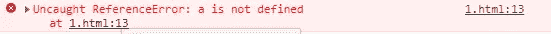

# ES6 增加了“let”属性而不是函数闭包来解决这个问题

> 原文：<https://javascript.plainenglish.io/es6-adds-the-let-property-instead-of-the-function-closure-to-solve-the-problem-b887af954039?source=collection_archive---------7----------------------->


首先，了解 ES6 的 let 关键字和 var 的区别。

let 和 var 的区别:

1.  var 没有块作用域，而 let 有块作用域。
2.  在 JavaScript 中，只有函数有自己独立的作用域。

如果你理解有困难，这里有一个例子:

```
{var a=10}
console.log(a);
```

1.  网页运行时，可以直接打印。
2.  如果用字母代替 var。

```
{let a=10}
console.log(a);
```



1.控制台显示 a 未定义。
2。这说明 let 有自己独立的作用域。
3。既然有独立的作用域，let 可以代替函数解决函数闭包问题。

例如:
我们使用一个 For 循环来绑定和监听 5 个按钮的事件。单击每个按钮打印相应的数字。

```
<body>
 <button>1</button>
 <button>2</button>
 <button>3</button>
 <button>4</button>
 <button>5</button>
</body><script>
    var btn=document.getElementsByTagName("button");//Get a list of all buttons
    for(var i=0;i<btn.length;i++){
        btn[i].onclick=function(){console.log(i+1);}
    }
```

1.这样，无论我们点击哪个控制台，都只会打印最后一个数字 5。

2.前面 1234 条已被覆盖，点击按钮打印 5 条。

3.说明 for 的{ }没有块级范围。

## 以前的解决方案(函数闭包)

```
for(var i=0;i<btn.length;i++){
     (function a(i){
            btn[i].onclick=function(){console.log(i+1);} 
     })(i);   
    }
```

用一个即时函数包装它，并传入 I 的值(不推荐)

## 当前解决方案(ES6 的 let: var 的升级版本)

只需将 var 替换为 let:

```
for(let i=0;i<btn.length;i++){
            btn[i].onclick=function(){console.log(i+1);} 
    }
```

直接、简单、方便地解决问题(**推荐**)。

现在正在学习 JavaScript 的同学可以养成写 let 的习惯，这也是 var 的完美版本！

恭喜你，你已经看完了这篇文章。如果你认为这篇文章写得好，请给我打个👋！

*更多内容看* [***说白了就是 io***](https://plainenglish.io/) *。报名参加我们的* [***免费周报***](http://newsletter.plainenglish.io/) *。关注我们关于*[***Twitter***](https://twitter.com/inPlainEngHQ)，[***LinkedIn***](https://www.linkedin.com/company/inplainenglish/)*，*[***YouTube***](https://www.youtube.com/channel/UCtipWUghju290NWcn8jhyAw)*，* [***不和***](https://discord.gg/GtDtUAvyhW) *。对增长黑客感兴趣？检查* [***电路***](https://circuit.ooo/) *。*