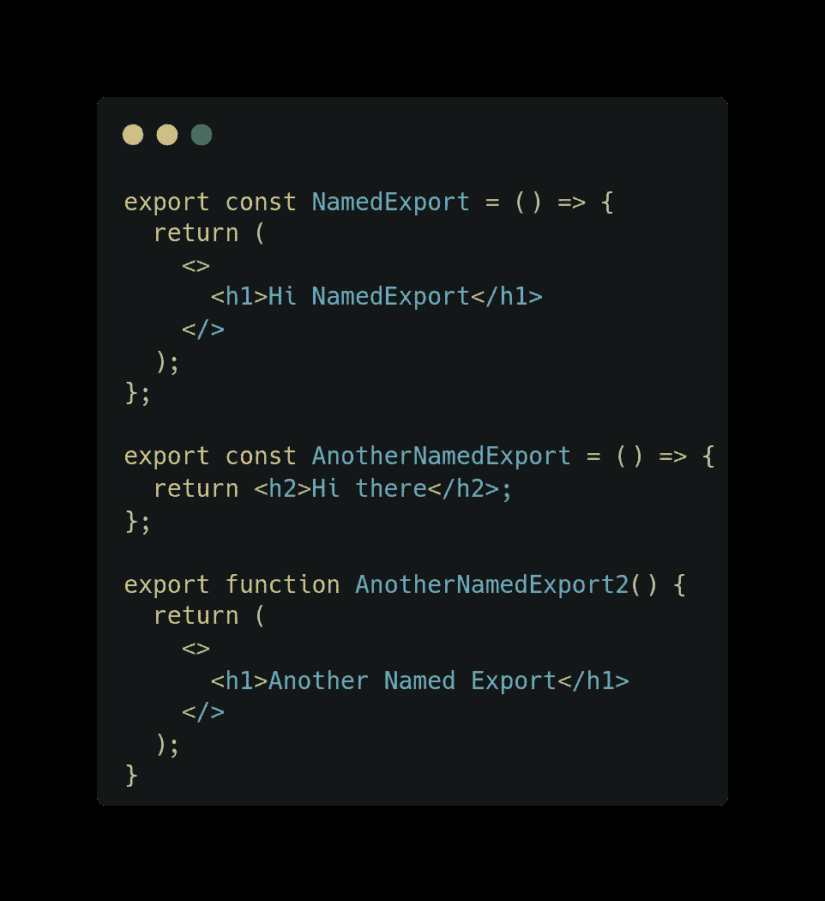
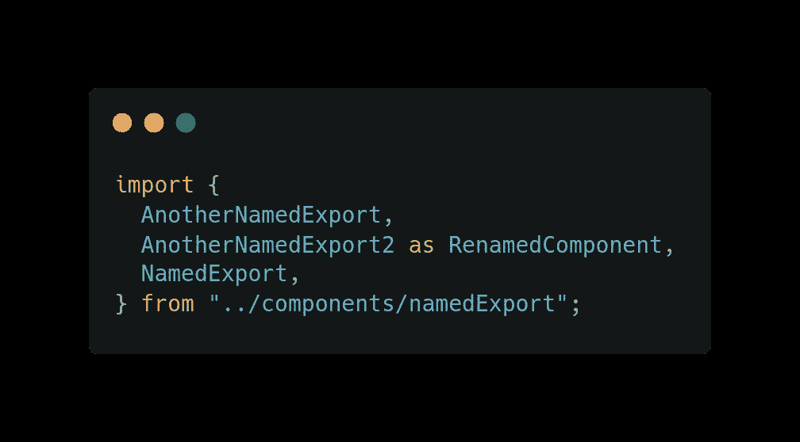
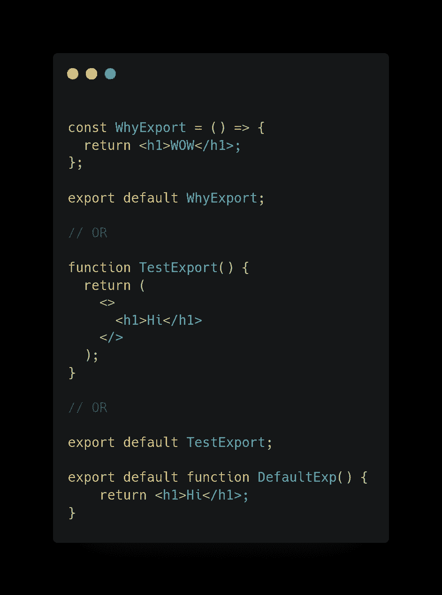
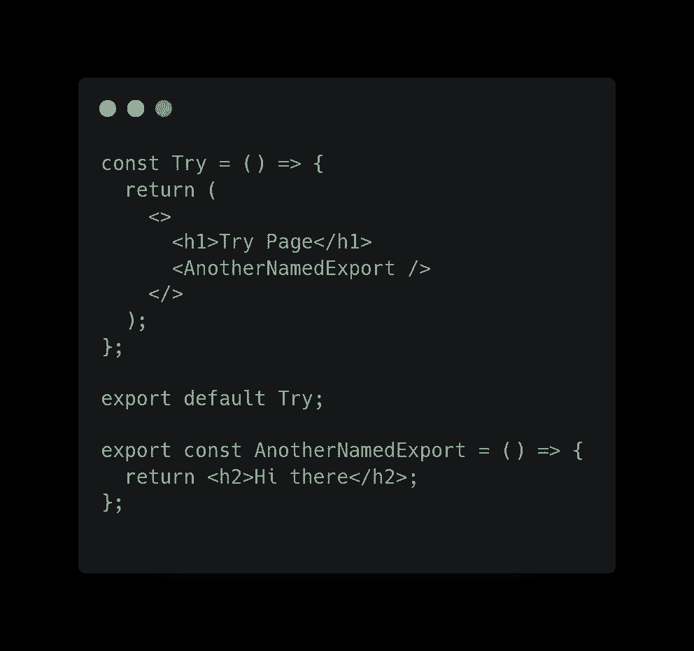

# 命名导出和默认导出的区别

> 原文：<https://javascript.plainenglish.io/es6-difference-between-named-and-default-export-af4c33d20762?source=collection_archive---------4----------------------->

## 命名和默认导出对 React 生态系统的影响。


Photo by [Andrea De Santis](https://unsplash.com/@santesson89?utm_source=medium&utm_medium=referral) on [Unsplash](https://unsplash.com?utm_source=medium&utm_medium=referral)

ES6 提供了两种从文件中导出模块的方式:`named`导出和`default`导出。

在处理 React 项目时，您可能想知道为什么有些组件用`default`标签导出，而有些用`named`导出。
在本文中，我们将了解何时以及为何使用默认和命名导出，最后，您将找到差异的分类，这将消除您的困惑。

命名和默认导出不是以反应为中心的想法。它们是 ES6 特性。然而，本文将讨论它们对 React 生态系统的影响。

## 命名导出:(导出)

使用命名导出，每个文件可以有多个命名导出。然后，当您想要导入一个命名的组件时，您可以使用与其导出时相同的名称。
名称必须在**花括号**内导入。



Multiple exports per file

如果文件中有冲突，可以使用别名重命名导入。

```
import { MyTestComponent as NewComponent } from '../MyTestComponent'
```

您可以导入多个命名导出。

```
import {MyComponent,MyComponentNew,...} from './MyComponent'
```



Importing multiple modules and renaming component

**用法:** 一个真实世界的例子是，假设你要开发一个助手函数，将你的日期时间对象转换成你想要的日期格式，一个可能是 2022 年 4 月 30 日，或者另一个助手返回一个日期格式，如 2022 年 4 月 30 日。
这两个助手的函数可以写在一个文件中，因为它们都用于日期转换，并使用命名导出导出。

## 默认导出:(导出默认值)

默认导出是通过在导出中包含一个`default`标签来创建的。每个文件只能有一个默认导出。当我们导入时，我们必须指定一个名称并像这样导入:



请注意，每个文件只能有一个默认导出。

当导入默认导出时，不要使用花括号。在默认导出中，导入的命名是完全独立的，我们可以使用任何我们喜欢的名称。

```
import AnyNameYouWant from "./MyComponent"
```

# 我们可以将命名导出和默认导出合并到一个文件中吗？

是的，你可以。



named and default export in one file

## 结论/差异:

*   一个模块中只能有一个默认导出。
*   默认导出中导入的命名取决于程序员，比如我可以导入一个默认模块

```
import example from './example';But aother developer import a default export likeimport ex from './example';
```

*   在一个名为 export 的文件中可以有多个导出。
*   当导入一个命名的导出时，它应该用花括号括起来，你必须使用与导出时相同的名字，但是你可以使用`as.`重命名它

*请在评论区分享您的观点，欢迎反馈。*

*希望你会喜欢并分享这篇文章，以便更好地推广。*

*结帐我的其他文章上—*[【https://medium.com/@aayushtibra1997】](https://medium.com/@aayushtibra1997)

****感谢阅读:)****

**更多内容看* [***说白了就是***](https://plainenglish.io/) *。报名参加我们的* [***免费周报***](http://newsletter.plainenglish.io/) *。关注我们关于*[***Twitter***](https://twitter.com/inPlainEngHQ)*和*[***LinkedIn***](https://www.linkedin.com/company/inplainenglish/)*。查看我们的* [***社区不和谐***](https://discord.gg/GtDtUAvyhW) *加入我们的* [***人才集体***](https://inplainenglish.pallet.com/talent/welcome) *。**