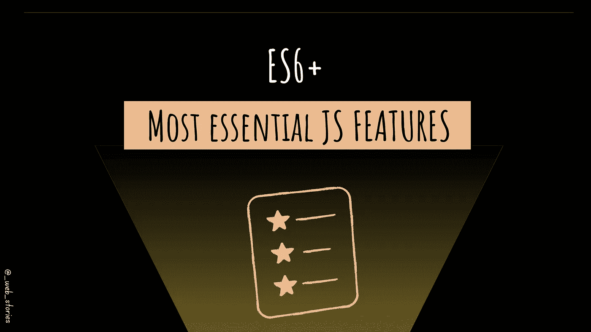

# ES6+最基本的功能

> 原文：<https://javascript.plainenglish.io/es6-most-essential-features-cbd2a1cf423b?source=collection_archive---------9----------------------->

## 了解如何充分利用 JavaScript。

By FAM

## 你好👋

我将这篇文章添加到 JS 章节，因为我们倾向于查看互联网和 StackOverFlow，并复制/粘贴一个确实有效但通常用旧 JS 编写的解决方案。因此，您失去了到目前为止添加到 JS 中的新 JS 特性的力量。

我特别从 ES6 开始，因为这是 JS 变得更有趣的地方！这些令人惊叹的新特性使您的代码更加现代、易读，并且用更少的代码做事情。

ES6+里的东西我就不一一赘述了，为你说的轻巧。我只展示最相关和最常用的东西。

## 箭头功能

了解有关箭头函数的更多信息:

 [## JavaScript 中的箭头函数

### 功能和箭头功能

famzil.medium.com](https://famzil.medium.com/arrow-functions-in-js-235b5ade3958) 

## 默认函数参数

## 反斜杠“`”或模板字符串

## 解构

*   **阵列**

*   **对象**

了解有关析构的更多信息:

 [## JS 中的析构和展开语法

### 如何使用数组/对象析构

medium.com](https://medium.com/geekculture/destructuring-spread-syntax-in-js-d9260a725c99) 

## 对象属性分配

了解有关 JS 对象的更多信息:

 [## JavaScript 中的对象

### 创建和使用 JS 对象

medium.com](https://medium.com/codex/objects-in-javascript-64fa3e82765f) 

## 传播算子

了解有关扩展运算符的更多信息:

 [## JS 中的析构和展开语法

### 如何使用数组/对象析构

medium.com](https://medium.com/geekculture/destructuring-spread-syntax-in-js-d9260a725c99) 

## 承诺

了解有关承诺的更多信息:

 [## JavaScript 如何向您承诺！

### JavaScript 中的承诺

levelup.gitconnected.com](https://levelup.gitconnected.com/how-javascript-promises-you-e0039fe341ba) 

## 异步等待

了解更多关于`async/await`的信息:

 [## 让异步代码看起来像 JS 中的同步代码

### JavaScript 中的异步/等待

medium.com](https://medium.com/geekculture/making-async-code-looks-like-sync-code-in-js-b0f5133e14ae) 

## JS 模块

*   **导出**

*   **导入**

了解有关 JS 模块的更多信息:

 [## 把你的应用分成几个盒子！

### JavaScript 中的模块

levelup.gitconnected.com](https://levelup.gitconnected.com/break-your-app-into-boxes-e876937e3206) 

令人兴奋的新功能将于下个月(2022 年 6 月)推出，关于新功能，我将在另一篇文章中介绍。在那之前，请继续关注😉

今天就到这里，看阿雅🙋

如果您有任何问题或反馈，请点击评论或通过 LinkedIn 联系我— **我洗耳恭听！**

[**想请我喝杯咖啡吗？☕️**](https://www.buymeacoffee.com/fatimaamzil)

> 让我们为 2022 年打造一个更好的‘我们’！

## 了解有关 2022 年网络快车计划的更多信息:

I- [网络常识](https://medium.com/geekculture/2022-web-program-chapter-n-1-is-done-499fb0707220?source=your_stories_page----------------------------------------)

[II-网页框架:HTML](https://famzil.medium.com/your-html-essentials-69d9b2349355?source=your_stories_page----------------------------------------)

[III-网页样式:CSS](https://medium.com/geekculture/recap-of-the-css-chapter-ae388d51e564?source=your_stories_page----------------------------------------)

## IV- Web 交互:JavaScript

*   [异步代码](/can-the-web-live-without-asynchronous-code-7f61fe2e862e?source=your_stories_page----------------------------------------)
*   [这个](https://medium.com/geekculture/this-for-developers-5dc91d499677?source=your_stories_page----------------------------------------)
*   [变量](https://medium.com/codex/js-variables-what-you-need-to-know-fb8994ed9d0d?source=your_stories_page-------------------------------------)
*   [范围&吊装](/js-mechanism-you-should-know-12431e094103?source=your_stories_page-------------------------------------)
*   [操作员](/js-operators-3511c8545719?source=your_stories_page-------------------------------------)
*   [关闭](https://famzil.medium.com/js-closures-99666fe36a6a?source=your_stories_page-------------------------------------)
*   [高阶函数](https://famzil.medium.com/whats-hof-in-javascript-9fb68a9c3f6f?source=your_stories_page-------------------------------------)
*   [对象&方法](https://famzil.medium.com/objects-in-javascript-64fa3e82765f?source=your_stories_page-------------------------------------)
*   [数组，设置&贴图](/data-structures-in-js-9a13f7aa82b3?source=your_stories_page-------------------------------------)
*   [功能&箭头功能](https://famzil.medium.com/arrow-functions-in-js-235b5ade3958?source=your_stories_page-------------------------------------)
*   [超时&间隔](https://famzil.medium.com/timing-events-in-javascript-d44c24ed8641?source=your_stories_page-------------------------------------)
*   [破坏&蔓延](https://famzil.medium.com/destructuring-spread-syntax-in-js-d9260a725c99)
*   [回调](https://famzil.medium.com/call-me-back-later-in-javascript-9cdb74aafca3?source=your_stories_page-------------------------------------)
*   [承诺](https://famzil.medium.com/how-javascript-promises-you-e0039fe341ba?source=your_stories_page-------------------------------------)
*   [异步，等待](https://famzil.medium.com/making-async-code-looks-like-sync-code-in-js-b0f5133e14ae)
*   [模块](https://famzil.medium.com/break-your-app-into-boxes-e876937e3206?source=your_stories_page-------------------------------------)
*   [类](https://famzil.medium.com/yes-js-does-have-classes-82b1093d1362?source=your_stories_page-------------------------------------)

> **ES6+语法**

 [## 2022 网络计划启动！

### 改变来自心态和习惯

medium.com](https://medium.com/geekculture/2022-web-program-is-launched-f38a3280af1a) 

与想成为 web 开发人员的人分享该程序！这将有助于保持进步，并在旅途中互相帮助。

> 如果你喜欢我的文章， [**订阅**](https://famzil.medium.com/subscribe) 获取我的最新文章。如果你自己喜欢体验媒介，可以考虑通过[**注册会员**](https://famzil.medium.com/membership) 来支持我和其他几千个作家。它只需要每月 5 美元，它支持我们，作家，你也有机会用你的作品赚钱。当然，你可以随时取消会员资格。通过注册[这个链接](https://famzil.medium.com/membership)，你将直接用你的一部分费用来支持我，不会花你更多的钱。如果你这样做了，万分感谢！

让我们在 [**中**](https://medium.com/@famzil/)**[**Linkedin**](https://www.linkedin.com/in/fatima-amzil-9031ba95/)**[**脸书**](https://www.facebook.com/The-Front-End-World)**[**insta gram**](https://www.instagram.com/the_frontend_world/)**[**YouTube**](https://www.youtube.com/channel/UCaxr-f9r6P1u7Y7SKFHi12g)**或**上【联系一下************

** [## 通过我的推荐链接——FAM 加入 Medium

### 作为一个媒体会员，你的会员费的一部分会给你阅读的作家，你可以完全接触到每一个故事…

famzil.medium.com](https://famzil.medium.com/membership) 

*更多内容请看*[***plain English . io***](https://plainenglish.io/)*。报名参加我们的* [***免费周报***](http://newsletter.plainenglish.io/) *。关注我们关于*[***Twitter***](https://twitter.com/inPlainEngHQ)*和*[***LinkedIn***](https://www.linkedin.com/company/inplainenglish/)*。查看我们的* [***社区不和谐***](https://discord.gg/GtDtUAvyhW) *加入我们的* [***人才集体***](https://inplainenglish.pallet.com/talent/welcome) *。***