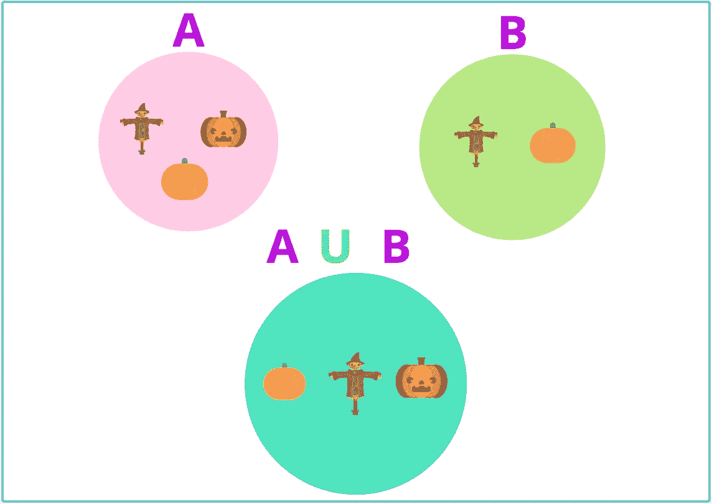
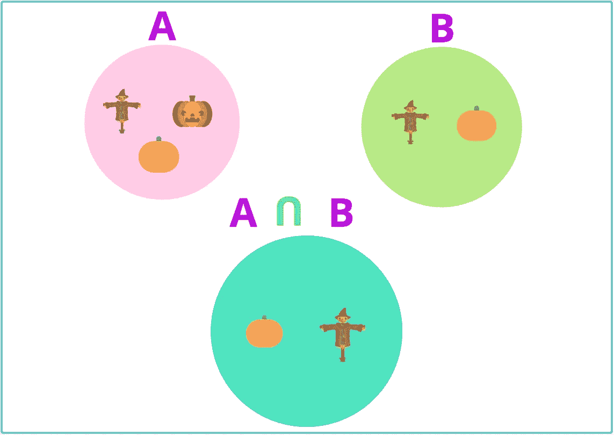
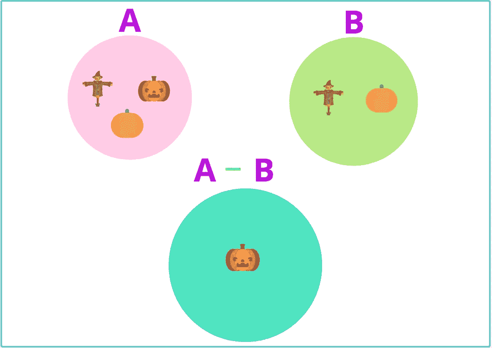
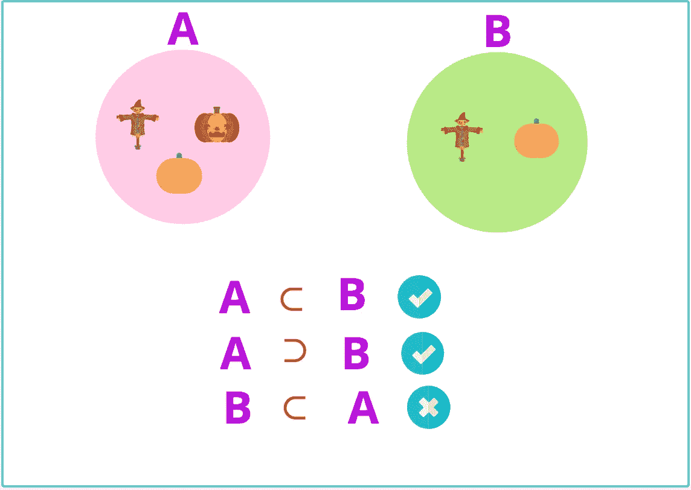

# ES6 套装和我的定制套装

> 原文：<https://javascript.plainenglish.io/es6-set-and-my-customised-set-819325d23c9a?source=collection_archive---------9----------------------->

## 你要自己用 ES6 `Set`实现像 ***并******交、******差*** 这样的基本集合运算。

**Image by:** [**Lauren Mancke**](https://unsplash.com/@laurenmancke) **@** [**Unsplash**](https://unsplash.com/)

作为 JS 开发人员，我们使用了`Set`对象，它允许存储任何类型的唯一值，无论是[原始值](https://developer.mozilla.org/en-US/docs/Glossary/Primitive)还是对象引用。

你可以用很多方法创建 JavaScript `Set`。

`Set`对象有一组内置方法和一个属性:`size`。在 [MDN](https://developer.mozilla.org/en-US/docs/Web/JavaScript/Reference/Global_Objects/Set) 可以了解到更多关于`Set`的内容。

我假设你对`Set`对象很熟悉，我就不深究`Set`了。所以让我们转移到我们的话题…😎

虽然 JavaScript 有`Set`对象，但是它没有像**并集**、**交集**、**差集**、**超集、**和**子集**这样的基本集合操作。所以我们必须自己实现那些操作。

下面是我们在使用`Set`对象时如何实现基本的集合操作。注意，下面的代码样本是直接从 [MDN](https://developer.mozilla.org/en-US/docs/Web/JavaScript/Reference/Global_Objects/Set) 复制的。

通过我们自己实现定制的 set，我们可以在每个需要执行基本 Set 操作的地方使用它们，而不是手动开发它们。

让我们创建`CustomSet`类并实现基本的`Set`方法:`has()`、`add()`、`delete()`、`values()`和`size()`，如下所示。out `CustomSet`中唯一的区别是，`size`是一个方法(`size`是`Set`中的一个属性)。

您可以按如下方式签出 CustomSet 类:

## 联合操作

**Union Set of Set A and Set B**

两个或更多集合的**并集**是包含所有集合中所有元素的集合。让我们将新函数(`union()`)添加到我们的`CustomSet`类中。

## 交集运算

**Intersection Set of Set A and Set B**

两个或多个集合的**交集**是包含所有集合的公共元素的集合。让我们给我们的`CustomSet`类添加新的函数(`intersection()`)。

## 差(减)运算

**Difference Set of A — B**

**差异**可以定义为一个集合中的一组元素，而不是另一个集合中的一组元素。

A — B 表示集合 A 中的所有元素，但不在集合 B 中。

让我们给我们的`CustomSet`类添加新的函数(`difference()`)。

## 子集和超集运算

**Superset and Subset**

在上图中， **A ⊂ B** 表示 b 是 a 的子集， **A ⊃ B** 表示 a 是 b 的超集。让我们向我们的`CustomSet`类添加两个新函数(`subset()`和`superset()`)。

我们完成了我们的 ***自定义设置*** 类的实现。完整的代码如下。

感谢阅读。😍

希望你从这篇文章中学到一些新东西。请 ***关注我*** *以后看这种类型的文章。干杯！*

*更多内容请看*[***plain English . io***](https://plainenglish.io/)*。报名参加我们的* [***免费周报***](http://newsletter.plainenglish.io/) *。关注我们关于*[***Twitter***](https://twitter.com/inPlainEngHQ)**和*[***LinkedIn***](https://www.linkedin.com/company/inplainenglish/)*。查看我们的* [***社区不和谐***](https://discord.gg/GtDtUAvyhW) *加入我们的* [***人才集体***](https://inplainenglish.pallet.com/talent/welcome) *。**