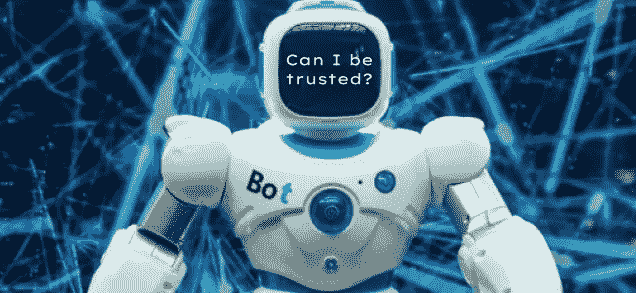
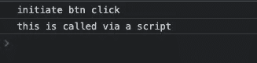
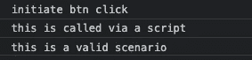

# Event.isTrusted，保护您的网站免受僵尸程序攻击

> 原文：<https://javascript.plainenglish.io/event-istrusted-safeguard-your-site-from-bots-cf10eca6e604?source=collection_archive---------5----------------------->

## 检查事件是由人还是由脚本触发的。



因此，我一个多月来一直试图购买一双 Air Jordan 1，但它们会在进货的前 30 秒内售罄。老实说，如果这是一场公平的比赛，我会接受它，但然后通过社交媒体，看到经销商和黄牛弯曲他们只是觉得他们有优势。这让我想到，他们怎么能这么快就拿到这些东西？机器人是显而易见的答案，但让我更好奇的是它们是如何工作的？

为了弄清楚它们是如何工作的，我必须做一个(*免责声明*我不支持机器人*)。这比我想象的要简单得多，主要是:

```
// not a recipe to generate bot scripts
document.getElementById('buy').triggerEvent()
//wait for some changes
document.getElementById('cart').triggerEvent()
//wait for some change and do the next action required
```

## 试图防范机器人

在构建了这个机器人之后，我想了解的是我们如何保护应用程序免受这些机器人的攻击？

因此，最常见的策略是检查每个被触发事件之间的时间差，这有助于区分自动操作和用户生成的操作。一些大公司利用这一点来阻止用户 id，但从长远来看，这并没有帮助，因为创建一个新的 id 比购买这些限量版的项目更容易。但是如果我们作为开发人员可以帮助区分用户/脚本生成的事件呢？

这就是作为事件接口一部分的**被信任的**属性发挥作用的地方。根据 MDN:

*`[*Event*](https://developer.mozilla.org/en-US/docs/Web/API/Event)`*接口的* `*isTrusted*` *只读属性是一个布尔值，当事件由用户动作生成时为* `*true*` *，当事件由脚本创建或修改或通过* `[*EventTarget.dispatchEvent()*](https://developer.mozilla.org/en-US/docs/Web/API/EventTarget/dispatchEvent)` *调度时为* `*false*` *。**

*我们可以用它来检查我们需要(或者需要)用户生成动作的事件，比如登录或者在上面的例子中购买一双限量运动鞋。*

*让我们看一个例子:*

*输出:*

**

*when setTimeout function gets invoked*

**

*when user clicks on button*

*这种基本检查有助于提高安全性，并帮助您区分人工事件和脚本生成的事件。这些信息可以帮助我们创建更加人性化的用户界面。*

*老实说，我很惊讶为什么大多数公司不增加这项检查，但我猜重点是不同的。*

*这个题目到此为止。感谢您的阅读。*

**更多内容请看*[***plain English . io***](https://plainenglish.io/)*。报名参加我们的* [***免费周报***](http://newsletter.plainenglish.io/) *。关注我们关于*[***Twitter***](https://twitter.com/inPlainEngHQ)*和*[***LinkedIn***](https://www.linkedin.com/company/inplainenglish/)*。加入我们的* [***社区不和谐***](https://discord.gg/GtDtUAvyhW) *。**