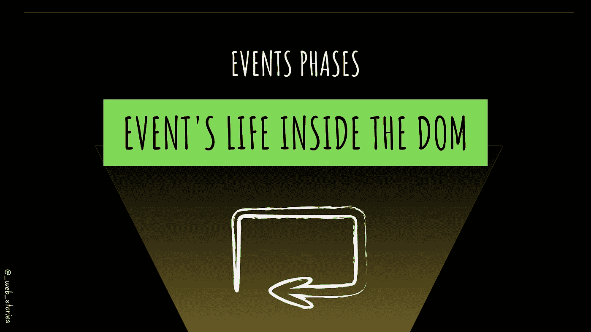
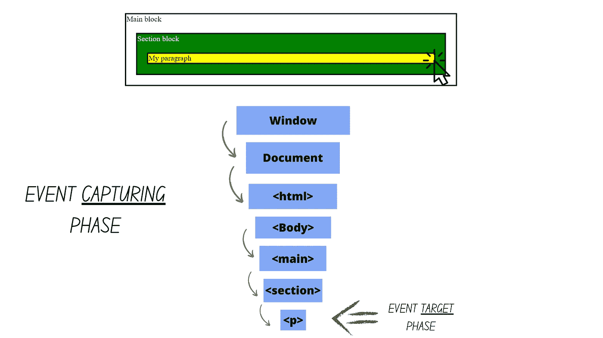
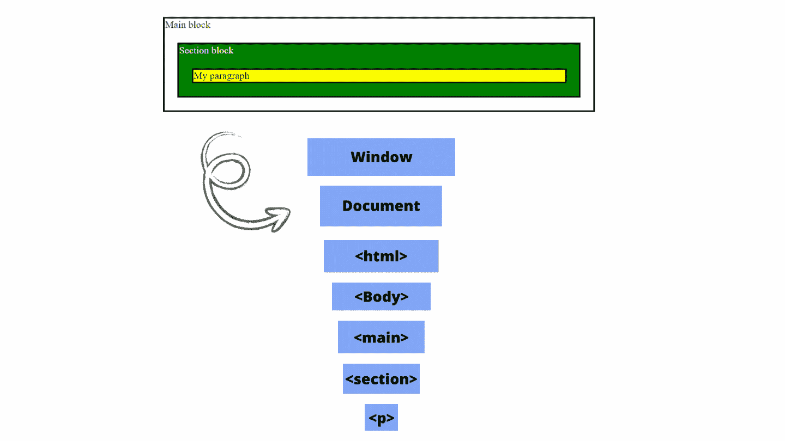

# DOM 中事件的阶段

> 原文：<https://javascript.plainenglish.io/events-phases-inside-the-dom-8ca5d8929ade?source=collection_archive---------8----------------------->

## JavaScript 中的事件捕捉和冒泡是什么？



## 你好👋

这次是为了了解事件在 DOM 中是如何存在的。事件经历 3 个阶段:

*   ***攻下*** 相
*   ***目标*** 阶段
*   ***冒泡*** 阶段

让我们了解更多！文章结尾提供了一个代码示例。

# 捕获阶段

这个很少用。这就是为什么它不太为人所知，因为它是无形的。当我们点击( *click 是一个事件的例子，它可以是你想要的任何东西*在一个元素上，我们经常对被点击的元素感兴趣。捕获从根元素开始，一直到触发事件的被单击元素。始终向“向下”方向移动，直到到达目标元素。



By FAM

默认情况下，它是禁用的。要启用它:

```
htmlElt.**addEventListener**(..., **{capture: true}**)
// or
htmlElt.**addEventListener**(..., **true**)
```

# 目标阶段

在这个阶段，事件达到了目标点。如果我们启用捕获阶段和冒泡阶段，这个阶段就会被触发。这不是一个单独的阶段。

# 起泡阶段

这是一个事件从内部 HTML 元素向上通过父元素冒泡的过程，就像水中的气泡一样。

如果我点击`p`元素，那么如果有一个点击事件处理程序与之相关联，它将被触发。然后，对其父元素`section`进行同样的操作，直到我们到达文档或窗口对象。

它与捕捉相反。我们从目标元素到父母的方向。总是“向上”方向，直到它到达顶部，文档对象(DOM)或窗口对象(BOM)。


By FAM

冒泡过程只能通过使用`stopPropagation()`方法来停止。

# 整个画面

在下面的示例中，我们将为所有 DOM 元素添加两个侦听器(第一个用于捕获阶段，第二个用于冒泡事件),以可视化整个过程。`querySelectorAll`对于性能来说一点也不好，但是我想让你理解的是事件阶段以及它们是如何工作的。



By FAM

## 示例代码

今天就到这里，看阿雅🙋

如果您有任何问题或反馈，请点击评论或通过 LinkedIn 联系我— **我洗耳恭听！**

[**想请我喝杯咖啡吗？☕️**](https://www.buymeacoffee.com/fatimaamzil)

> 让我们为 2022 年打造一个更好的‘我们’！

## 了解有关 2022 年网络快车计划的更多信息:

I- [通用网络知识](https://medium.com/geekculture/2022-web-program-chapter-n-1-is-done-499fb0707220?source=your_stories_page----------------------------------------)

[II-网页框架:HTML](https://famzil.medium.com/your-html-essentials-69d9b2349355?source=your_stories_page----------------------------------------)

[III-网页风格:CSS](https://medium.com/geekculture/recap-of-the-css-chapter-ae388d51e564?source=your_stories_page----------------------------------------)

[四网互动:JavaScript](https://levelup.gitconnected.com/congrats-to-js-chapter-finishers-e38a3ca1612c)

## 虚拟物料清单和 DOM

*   [什么是 BOM 和 DOM](https://medium.com/geekculture/what-are-the-dom-and-bom-9fb1a3ed736f?source=your_stories_page-------------------------------------) ？
*   [元素选择器](/selecting-dom-elements-e33fb235e81d?source=your_stories_page-------------------------------------)
*   [操作 DOM](https://famzil.medium.com/dom-manipulation-13959986300?source=your_stories_page-------------------------------------)
*   [Ajax &获取](https://levelup.gitconnected.com/calling-for-data-d9523c7c62e2?source=your_stories_page-------------------------------------)

> **DOM 事件阶段**

*   事件循环
*   阴影 DOM
*   蜜蜂

[](https://medium.com/geekculture/2022-web-program-is-launched-f38a3280af1a) [## 2022 网络计划启动！

### 改变来自心态和习惯

medium.com](https://medium.com/geekculture/2022-web-program-is-launched-f38a3280af1a) 

与想成为 web 开发人员的人分享该程序！这将有助于保持进步，并在旅途中互相帮助。

> 如果你喜欢我的文章， [**订阅**](https://famzil.medium.com/subscribe) 获取我的最新。如果你自己喜欢体验媒介，可以考虑通过[**注册会员**](https://famzil.medium.com/membership) 来支持我和其他成千上万的作家。它只需要每月 5 美元，它支持我们，作家，你也有机会用你的作品赚钱。当然，你可以随时取消会员资格。通过注册[这个链接](https://famzil.medium.com/membership)，你将直接用你的一部分费用来支持我，它不会花费你更多。如果你这样做了，万分感谢！

让我们在 [**上**取得联系****](https://medium.com/@famzil/)**[**Linkedin**](https://www.linkedin.com/in/fatima-amzil-9031ba95/)**[**脸书**](https://www.facebook.com/The-Front-End-World)**[**insta gram**](https://www.instagram.com/the_frontend_world/)**[**YouTube**](https://www.youtube.com/channel/UCaxr-f9r6P1u7Y7SKFHi12g)**或**[](https://twitter.com/FatimaAMZIL9)********

******[](https://famzil.medium.com/membership) [## 通过我的推荐链接——FAM 加入 Medium

### 作为一个媒体会员，你的会员费的一部分会给你阅读的作家，你可以完全接触到每一个故事…

famzil.medium.com](https://famzil.medium.com/membership) 

*更多内容看* [***说白了就是***](https://plainenglish.io/) *。报名参加我们的* [***免费周报***](http://newsletter.plainenglish.io/) *。关注我们关于*[***Twitter***](https://twitter.com/inPlainEngHQ)*和*[***LinkedIn***](https://www.linkedin.com/company/inplainenglish/)*。查看我们的* [***社区不和谐***](https://discord.gg/GtDtUAvyhW) *加入我们的* [***人才集体***](https://inplainenglish.pallet.com/talent/welcome) *。*******