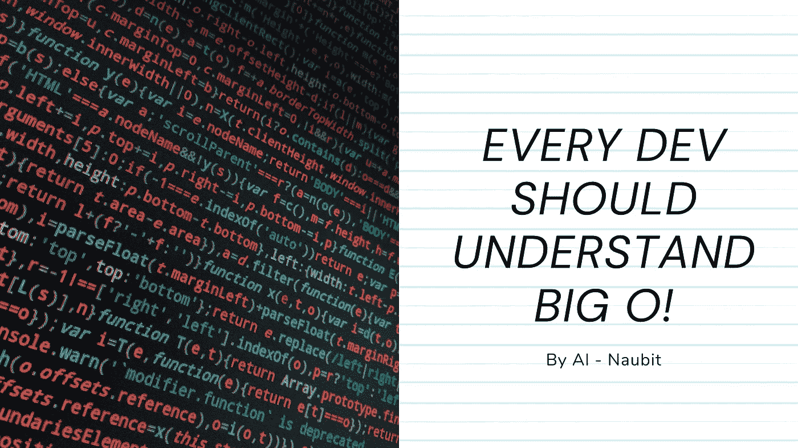
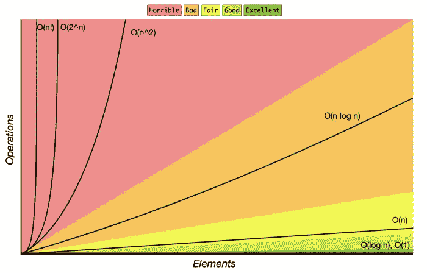
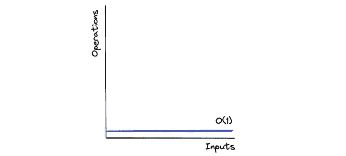
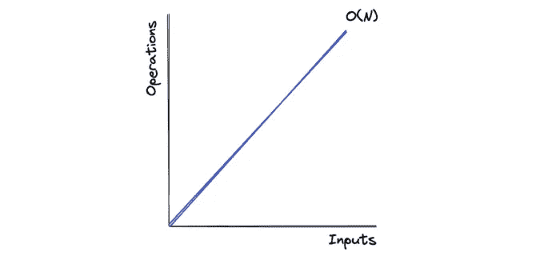
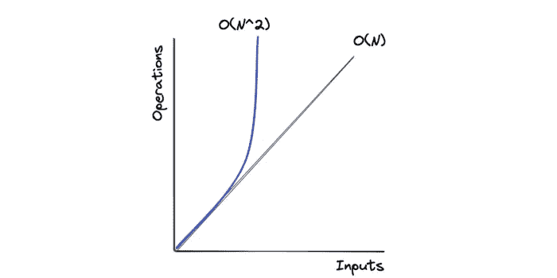
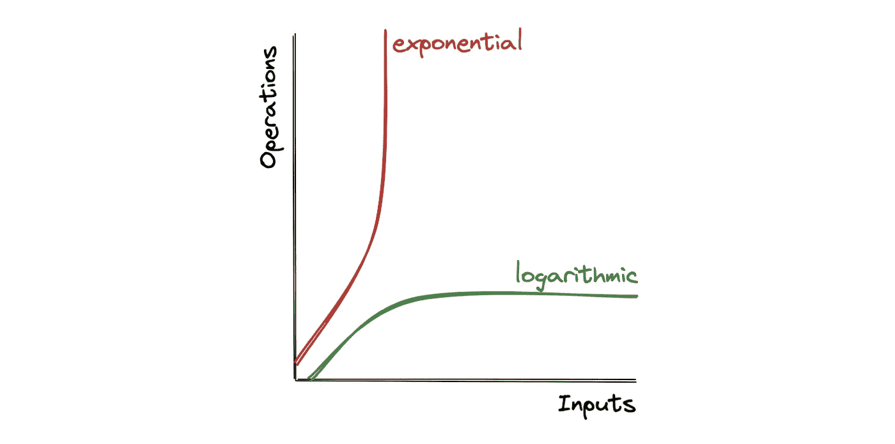
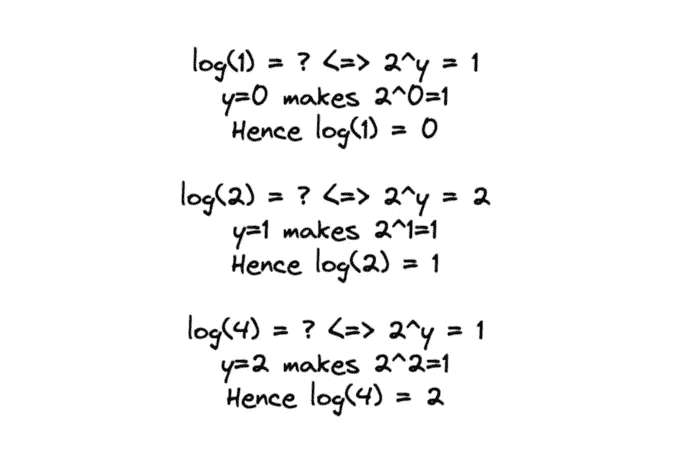
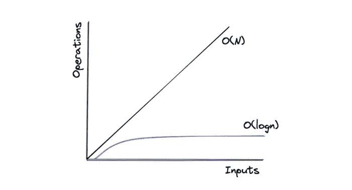

# 每个开发者都应该理解大 O

> 原文：<https://javascript.plainenglish.io/every-dev-should-understand-big-o-279b2f57fa73?source=collection_archive---------4----------------------->

## 初学者指南:7 分钟以内理解算法的大 O 和时间复杂度。



本节讲的都是在 7 分钟(*或更少*)内理解算法的大 O 和时间复杂度。是入门级别的章节，应该不会太难理解。

# 大 O

[大 O 符号](https://en.wikipedia.org/wiki/Big_O_notation)衡量一个算法的执行效率，以及它消耗了多少内存。它可以被认为是其时间复杂度**或空间复杂度**。

每当我们谈论大 O 和它的效率度量时，我们感兴趣的是当我们的输入规模增加时，算法的表现如何。

大 O 有助于区分好代码和坏代码，也有助于区分好代码和好代码。



Big-O Complexity Chart from [https://www.bigocheatsheet.com/](https://www.bigocheatsheet.com/)

你可能听说过或者遇到过的最常见的时间复杂度是 **O(n)** 、 **O(n^2)** 、 **O(log-n)** 、 **O(n log-n)** 。我会一点一点地详细谈论每一个。

# O(1) —常数时间

如果一个算法需要相同的时间，不管输入大小如何，就说它在恒定时间内运行。



该算法的时间复杂度为 O(1)。

# O(n) —线性时间

时间复杂度为 O(n)的算法被编程为具有与输入大小成正比的执行时间。这种符号也称为“线性时间”



以下算法的时间复杂度为 O(n)，其中 n 是输入数组的长度。

# 大 O 分析—最佳、一般和最差情况

在我们继续更基本的大操作系统之前，有必要了解不同的情况。

**最佳情况分析** —在这里，我们计算算法完成所需的最佳或最短时间。

**平均案例分析** —为了计算我们算法的平均案例，我们需要知道它将接收的所有可能的输入。然后，我们将每次使用该输入的时间除以输入次数。

**最坏情况分析** —这里，我们计算算法完成的最大时间。

看看这个例子。这里我们有一个从玩家列表中搜索名为 **Kane** 的玩家的函数。如果玩家被找到，它返回 true 否则返回 false。

这里的**最佳**情况是凯恩在开头(*第一个元素*)，我们只需要循环一次玩家列表。

最坏的情况是 Kane 不是第三个元素，而是出现在最后，或者更糟的是，不在列表中，我们的程序需要遍历列表中的每个元素。

当我们谈论时间复杂性时，我们只关心最坏的情况。也许你想知道为什么。

假设您的代码在一般输入下表现良好，但是对于特定输入，它花费了不可接受的时间。

作为一名程序员，了解这些场景并找出优化它们或修改算法的方法是至关重要的。这就是为什么**人们在面试中只讨论或关心你的项目的最坏情况的复杂性。**

# O(n)

随着迭代的元素数量(n)的增加，算法所用的时间呈指数增加。因此，举例来说，如果您将输入增加 10 倍，您可能需要等待 17 倍的时间来获得您想要的输出。

为了更好地理解这一点，考虑下面的例子。如您所见，计算时间以 n 的指数速度增长:

*   1 个项目= 1 秒
*   10 个项目= 100 秒
*   100 个项目= 10，000 秒



通常(*，但不总是*)，嵌套 for 循环的时间复杂度为 O(n)。

面试通常认为 O(n)解决方案是一种蛮力方法。因此，这通常意味着找到更好的方法，如 O(n log n)甚至 O(n) **是可能的。**

# o(登录号)

为了理解这一点，我们将首先研究对数背后的[数学，然后研究它们与复杂性分析的关系。](https://en.wikipedia.org/wiki/Logarithm)

[维基百科](https://en.wikipedia.org/wiki/Logarithm)对对数有如下定义:

*数学上，对数是幂的反函数。*



A logarithmic function is the opposite of an exponential function.

*这意味着给定数字 x 的对数是另一个固定数字(以 b 为底)的指数，它必须被提升以产生该数字 x。*


*二进制对数以 2 为底(b = 2)，常用于计算机科学。(* [*为什么基数为 2？这里解释了*](https://stackoverflow.com/a/6701841/1182982) *)。*


乍一看，这可能有点难以理解，所以让我们通过一些例子来理解这些方程:



Understanding log(N) calculation with examples.

既然我们已经学会了如何计算 **log(n)** ，让我们继续增加 N，观察时间复杂度的增加:

```
log(8) = 3log(16) = 4log(32) = 5log(64) = 6log(128) = 7log(256) = 8…log(1024) = 10log(~1M) = 20log(~4B) = 32
```

很简单，我们可以看到当输入 **N** 加倍时，时间复杂度 **log(N)** 只增加 1。并且对比 **O(N)** 可以看出 **O(log(N))** 的表现有多好。



The time complexity of O(log n) vs. O(n)

这种时间复杂性经常出现在分治算法中，该算法在再次合并它们之前递归地将问题分成子问题。比如[二分搜索法](https://www.geeksforgeeks.org/binary-search/)、[归并排序](https://www.geeksforgeeks.org/merge-sort/) (O(N log N))等。

# 一些最后的想法

一旦你牢牢掌握了 O(n)，O(n)和 O(log n)的基本时间复杂性，就很容易理解其他类型的复杂性，如 O(n)，O(n log n)，O(n！)…以及它们是如何工作的。

我想回到我在本文开头分享的时间复杂度图。


Big-O Complexity Chart from [https://www.bigocheatsheet.com/](https://www.bigocheatsheet.com/)

# 在你离开之前！

理解 Big O 是开发人员进步的关键，因为它将帮助您理解如何优化您的代码，因为您将能够计算其复杂性。

但是，如果你喜欢这个帖子，**我会在我的时事通讯中发布更多令人兴奋的内容；您可以在这里免费查看:** [**立即查看 Coderpreneurs！**](https://coderpreneurs.substack.com/)

此外，我喜欢在 Twitter 上发布引人入胜的内容和帖子，所以我也建议关注我！[这是我的推特:@thenaubit](https://twitter.com/thenaubit) 。

*更多内容看* [***说白了。报名参加我们的***](https://plainenglish.io/) **[***免费周报***](http://newsletter.plainenglish.io/) *。关注我们关于*[***Twitter***](https://twitter.com/inPlainEngHQ)，[***LinkedIn***](https://www.linkedin.com/company/inplainenglish/)*，*[***YouTube***](https://www.youtube.com/channel/UCtipWUghju290NWcn8jhyAw)*，以及* [***不和***](https://discord.gg/GtDtUAvyhW) *。对增长黑客感兴趣？检查出* [***电路***](https://circuit.ooo/) *。***