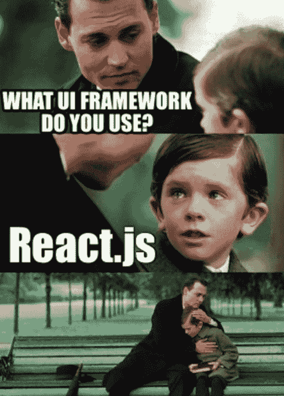
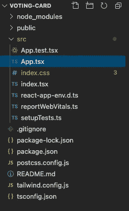
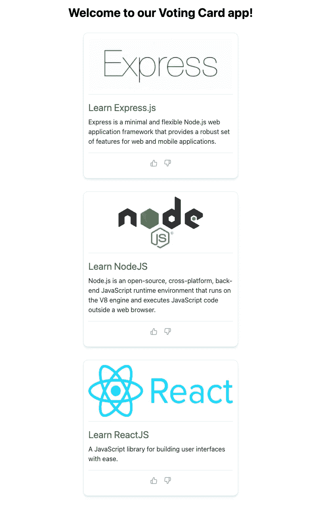
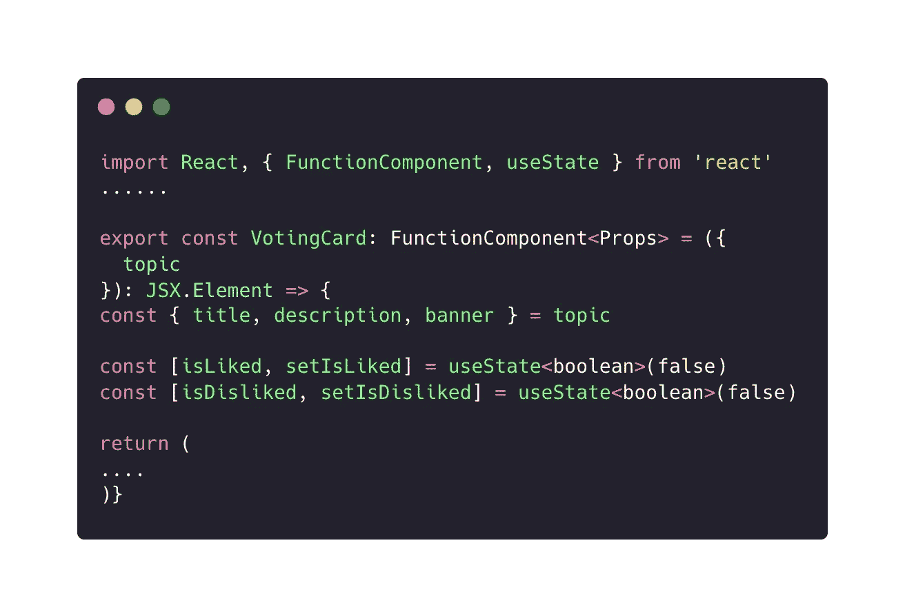
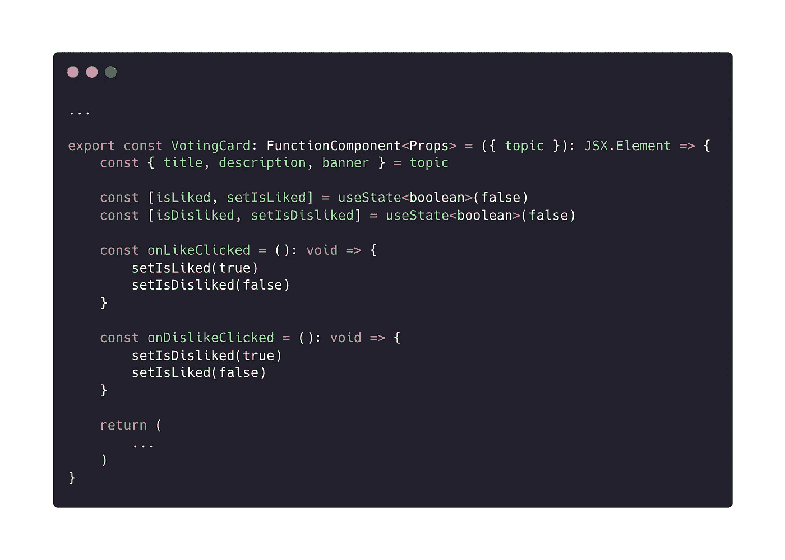
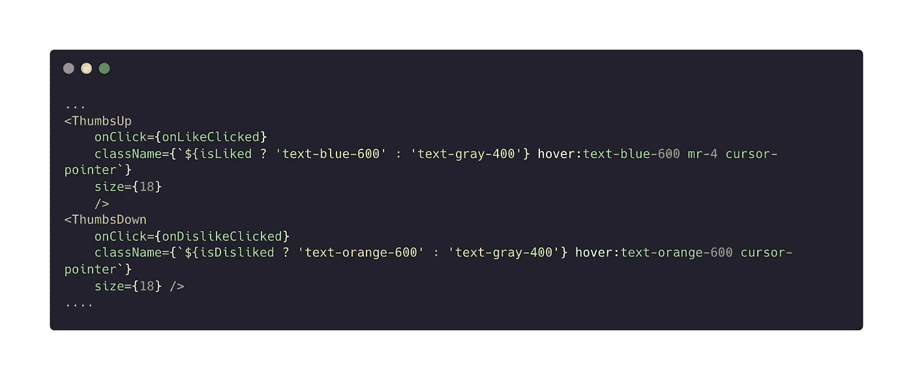
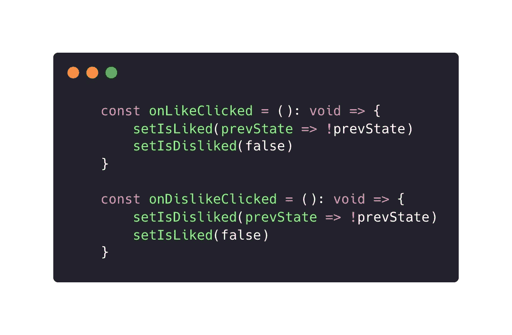

# 你需要知道的关于反应使用状态的一切

> 原文：<https://javascript.plainenglish.io/everything-about-react-use-state-a2439e3dc29b?source=collection_archive---------3----------------------->

## 关于 React 的 useState 钩子，你需要知道的一切，用一个简单的 React 项目来解释。

几周前，我在世界各地的同事中调查了前端库的使用率。几年来，我第一次惊喜地看到 jQuery 最终被现代 JS 库推翻，王者归来👑。

根据[的这些](https://www.statista.com/statistics/1124699/worldwide-developer-survey-most-used-frameworks-web/)统计，超过 40%的前端开发人员首选 React。太棒了，🕺🎊！



不幸的是，在我写这篇文章的时候，我找不到任何相关的统计数据来看有多少 React 项目是以老式的方式开发的，基于类组件，有多少是类和函数组件的混合，以及只有函数组件有钩子。如果要我猜的话，我会选择 mixt 方法，因为大多数项目已经有几年了，如果团队想要采用钩子，就必须从类迁移到函数。

我决定撰写一系列 React hooks 文章，帮助当前的 React 开发人员轻松地将他们的遗留代码迁移到现代 React，并帮助新开发人员和技术爱好者理解 React 和 hooks。

在本文中，我们将深入探究 React 的`useState`。

# 什么是使用状态？

`useState`是一个*反应钩。*

*挂钩是一种特殊功能，可让您“挂钩”React 功能。例如，* `*useState*` *是一个钩子，可以让你给函数组件添加反应状态。【* [*来源*](https://reactjs.org/docs/hooks-state.html#whats-a-hook)*】*

# 什么时候需要使用状态？

每当你编写一个功能组件时，你都需要这个钩子，你必须在组件中定义一些状态变量。

# 我们在建造什么？

我们准备建一个**投票卡 App** 。我知道这是一个基本的应用程序，但我们的目的是了解所有的`useState`功能和概念。

我为你准备了一个用[打字稿](https://www.typescriptlang.org/)和[顺风 CSS](https://tailwindcss.com/) 连线的 React app。

你可以克隆这个回购，这样我们就可以开始了😄：

[](https://github.com/stedda/card-voting) [## GitHub - stedda/card-voting:博客文章公共存储库

### 这个项目是用 Create React App 引导的。在项目目录中，您可以运行:在…中运行应用程序

github.com](https://github.com/stedda/card-voting) 

只需`cd where/you/cloned/the/project`并运行`npm i`。一旦软件包安装完成，运行`npm start`，你的应用就会启动并运行。

# 项目结构和技术

首先，让我给你一个项目的快速演练。这是一个标准的 CRA 项目，带有 TypeScript 预置和 Tailwind CSS。

我为什么喜欢这种结构？

*   这在大多数项目中很常见
*   对于我们当前的例子来说，这已经足够了
*   它把我们所有的工作文件放在同一个深度和同一个地方



voting-card project structure

我为什么选择这种技术设置？

*   我认为 TypeScript 在任何现代 web 应用程序中都是必不可少的，不管团队规模或应用程序规模如何，因为它在预防错误、共享数据类型和实施一些急需的规则集方面帮了你很多
*   Tailwind CSS 是一个实用优先的 CSS 框架。那是什么意思？嗯，它有许多实用类供你使用，而不是写经典的 CSS。一旦你习惯了，它会变得非常有用。

# 让我们开始编码吧🚀 💻

首先，让我们定义我们的数据类型。让我们在`src`文件夹下创建一个`VotingUtils.ts`文件。在这里，如果需要，我们将按照数据类型和实用函数来存储所有内容。

src/VotingUtils.ts

我们的下一步是创建投票卡组件。在`src`文件夹下，我们创建一个名为`VotingCard.tsx`的文件:

src/VotingCard.tsx

现在让我们转到我们的`App.tsx`，用下面的代码来修改它:

到目前为止，我们所做的是设置我们的应用程序并显示我们的投票主题。除此之外，我们已经为我们所有的卡准备了一个可重用的组件，我们将要使用的数据模型，以及一个连接在一起的模拟数据常量😄。
现在让我们添加投票图标。让我们安装`react-feather`:

```
npm i react-feather
```

这将为我们的应用程序提供一组开源图标，我们可以用它们来投票决定我们的主题👍。

让我们编辑`VotingCard`组件并添加投票按钮:

如果之前一切正常，我们的应用程序应该是这样的:



Voting card app design

最后，我们到了有趣的部分。我们将使用 React `useState`钩子创建两个状态变量，`isLiked`和`isDisliked`。这就是我们将如何能够确定是否有任何卡已被投票或没有。



useState declaration

我们从`react`中导入了`useState`并在上面使用。我们为什么需要这个？因为我们需要以某种方式确定，在 **VotingCard** 组件中，这张卡是喜欢还是不喜欢。

`useState` hook 返回一对值。第一个值是状态，第二个值是更新该值的 Dispatch 函数。这是什么意思？也就是说`isLiked`和`isDisliked`代表当前的*状态值，*和`setIsLiked` *与`setIsDisliked`一起，是*更新*的功能。*

由于我们希望每次使用`useState`时都存储 2 个变量，因此我们可以用[数组破坏](https://developer.mozilla.org/en-US/docs/Web/JavaScript/Reference/Operators/Destructuring_assignment#array_destructuring)来优雅地写这个。

***归根结底，更新状态变量的正确方法是调用相应的函数并向它们传递新值。***

现在让我们稍微解释一下`useState<boolean>(false)`是做什么的。通过在 useState 之后附加`<boolean>`，我们具体地告诉 TypeScript，我们的状态值是属于 ***类型布尔的。*** 而在`useState`中作为参数传递的值，在我们的例子中为`false`，表示一旦渲染了我们的 **VotingCard** 组件，则*状态变量*将具有的初始值。

有鉴于此，让我们在`VotingCard`组件内部创建两个函数，一个用于 LIKE，另一个用于 rehave，将它们附加到按钮上，同时为按钮添加活动颜色状态:

现在，如果我们进入我们的浏览器并测试这一点，我们应该能够喜欢或不喜欢的投票卡。

我们增加了 2 个新功能。让我们把它分解一下:



第一个功能`onLikeClicked`，将我们的状态变量`isLiked`设置为`true`，同时将`isDisliked`变量设置为假，无论其值如何。

第二个遵循几乎相同的行为，但这一次，我们只是在`isLiked`和`isDisliked`变量之间互换角色。

让我们跳转到我们的 **JSX 语法**，看看我们在那里更新了什么:



我们在两个图标上都添加了一个`onClick`处理程序，同时，我们也考虑到了是否有任何相应的状态变量处于活动状态，我们希望用蓝色*或红色*来突出显示它们。

***需要注意的一个重要的事情是，在我们的 JSX 中读取状态就像把我们的状态变量加上花括号*** `***{ isLiked } / { isDisliked }***` ***一样简单。***

对于熟悉 ***类语法*** 的人来说，我们到目前为止所做的一切相当于下面的代码:

## setState 回调

到目前为止，我们在代码中很容易发现的一点是，当我们试图多次单击同一个动作(喜欢或不喜欢的按钮)时，状态不会改变。那是因为我们总是将点击的按钮设置为`true`。

嗯，在将`ifs`创建到您的`onClick`函数中之前，让我告诉您，我们可以通过`setState`函数回调轻松处理这个场景。

到目前为止，我们说`setIsLiked`和`setIsDisliked`接受一个值作为参数，但那只对了一半。它也接受一个函数作为参数。该函数将采用先前的状态值，并且必须返回一个新的状态值。让我们看看这是如何工作的:



setState callback function

我们已经改变了我们的功能，那就是每次我们点击`onLikeClicked`，都要考虑到之前的`isLiked`，重视并否定它。

同样适用于`onDislikeClicked`功能和`isDisliked`状态变量。

## setState 重新呈现

使用由`useState`提供的 ***设置状态回调*** 的一个最重要的方面是，每次调用任何 ***设置状态回调*** 时，它将对该组件进行重新渲染操作。通过重新渲染，React 可以更新您的状态并转换屏幕上的 UI 元素。

在我们的例子中，每次我们调用`setIsLiked`或`setIsDisliked`时，我们的 **VotingCard** 组件都会在某个时间点执行一次重新渲染操作。这个操作队列由 React 管理。

另一件重要的事情是，在多次状态更新期间，`useState`返回的第一个值将总是应用更新后的最新状态。

## setState 函数标识

值得一提的是，React 保证 ***setState 函数*** 在重新渲染时具有相同的身份。

这意味着，在场景背后，函数将在重新渲染之间指向相同的引用，并且不会被检测为变化。

该组件中定义的其他函数或变量将在重新渲染之间指向不同的引用。在 React 的帮助下，我们有一些例外，但是我们将在以后了解它们。

## 懒惰初始状态

我们提到了这样一个事实，即`useState`接收一个参数，该参数代表状态变量的初始值，但是它也可以接收一个函数作为参数。

通常，当您有繁重的操作要执行时，您希望将函数作为回调来传递，并用它来初始化状态。

```
const [likes, setLikes] = useState(() => {
 return ***someHeavyComputationFunction()***})// or depending on how you write the function
// you can also write it something like thisconst [likes, setLikes] = useState(***someHeavyComputationFunction***)
```

在这种情况下，通常最好只使用[惰性初始状态](https://reactjs.org/docs/hooks-reference.html#lazy-initial-state)模式，并将一个函数传递给 useState，它将只返回您计算的状态一次。

**记住:**将函数作为参数调用将导致与传递值相同的行为，并且它将在重新呈现之间调用该函数。

```
// bad
const [likes, setLikes] = useState(computeHugeAmountOfLikes())// good
const [likes, setLikes] = useState(computeHugeAmountOfLikes)
```

## setState 更新拯救

为什么我说 setState 在拯救我们？这是非常优化的，只会更新与以前不同的值的状态。换句话说，如果你试图用相同的值更新当前状态，React 将[退出](https://reactjs.org/docs/hooks-reference.html#bailing-out-of-a-state-update)，而不渲染子元素或点火效果。

# 结论

通过这篇文章，我们学到了很多东西。让我们再回顾一遍:

*   我们开发了一个投票应用程序
*   我们添加了 *Tailwind CSS 和 TypeScript* ，并在本文中使用它们
*   我们了解了什么是使用状态以及它所有的秘密

这看起来微不足道，但是相信我，你会在你的 React 之旅中经常使用`useState`，为了掌握 React 和 hooks，你必须完全理解它所有的怪癖和秘密。

我希望这篇文章对你有用！如果你有任何问题或建议，请拍下来，我会尽快参与。

注意安全，下次再见🙌！

*更多内容请看*[***plain English . io***](https://plainenglish.io/)*。报名参加我们的* [***免费周报***](http://newsletter.plainenglish.io/) *。关注我们关于*[***Twitter***](https://twitter.com/inPlainEngHQ)*和*[***LinkedIn***](https://www.linkedin.com/company/inplainenglish/)*。加入我们的**[***社区不和谐***](https://discord.gg/GtDtUAvyhW) *。**