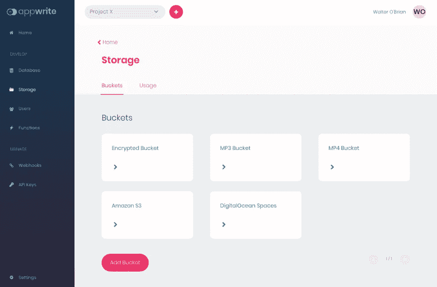
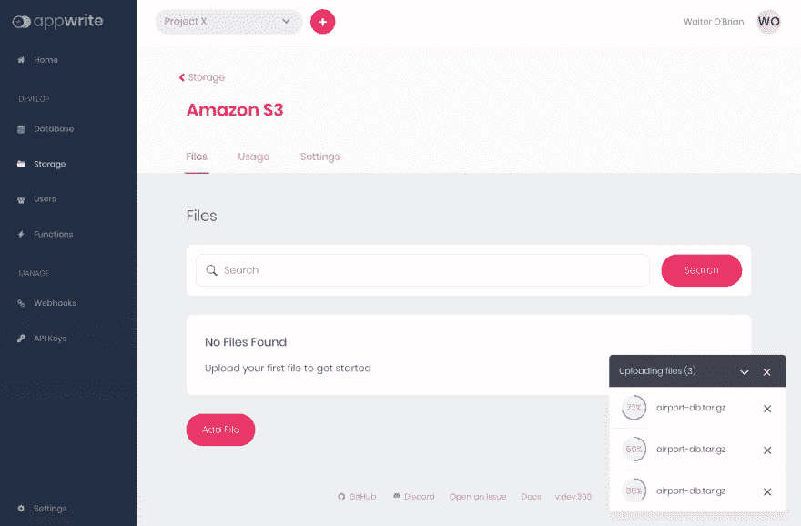
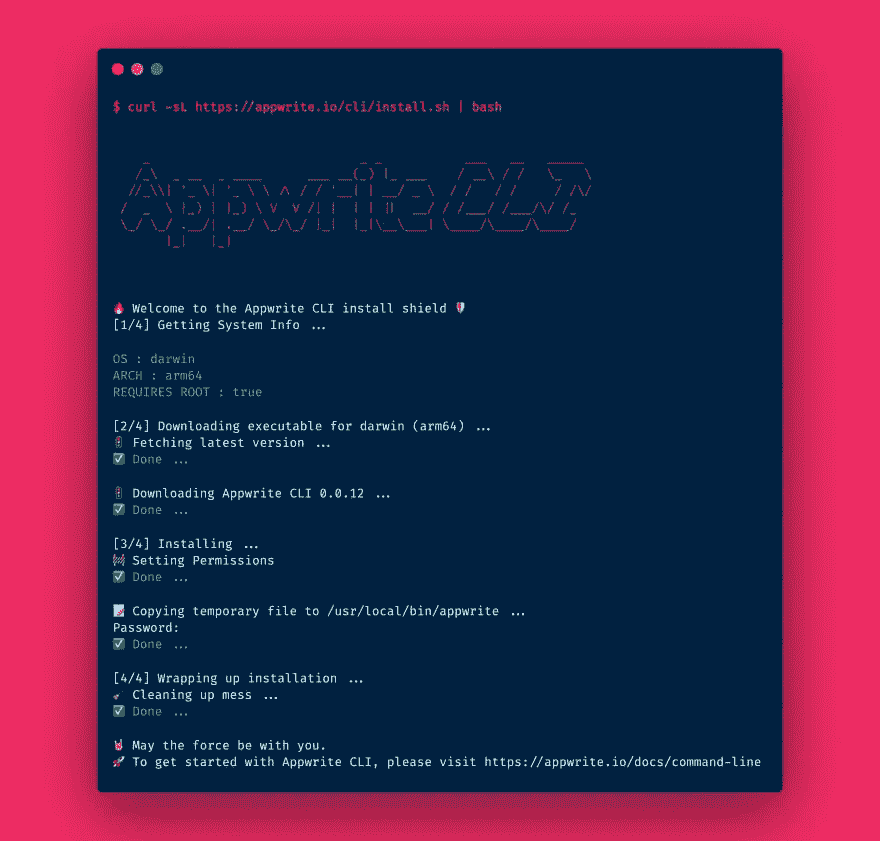
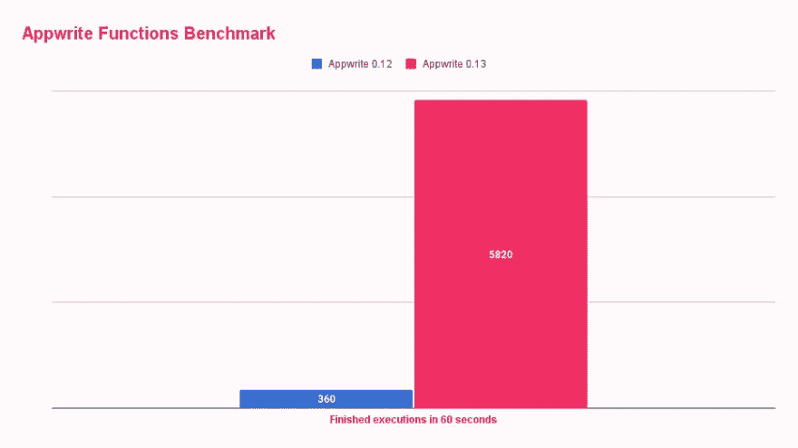
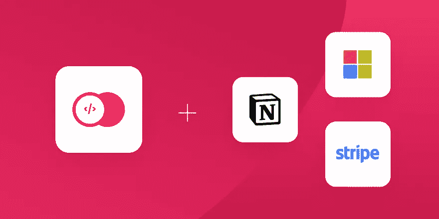

# 您需要了解的关于 Appwrite 0.13 的一切，它是 100%开源的 Firebase 替代品

> 原文：<https://javascript.plainenglish.io/everything-you-need-to-know-about-appwrite-0-13-the-100-open-source-firebase-alternative-e17f647ff44f?source=collection_archive---------2----------------------->

**在**[**app write 0.12**](https://dev.to/appwrite/its-here-announcing-the-release-of-appwrite-012-5c8b)**发布仅一个月后，Appwrite 0.13 已经可用。新版本包括多项主要功能，旨在将您的 Appwrite 体验发挥到极致，并帮助您在闪亮的、** [**开源和自我托管的 Firebase Alternative**](https://github.com/appwrite/appwrite)**之上实现一些新的令人兴奋的用例。**

# TL；速度三角形定位法(dead reckoning)

这个新版本主要关注两个方面。第一个是 [**应用写存储**](https://appwrite.io/docs/storage) 。增加了许多新功能，包括**桶**、(特别是)**大文件支持**、**流下载**，以及用于 **S3、数字海洋空间**和其他 S3 兼容设备的新**存储适配器**。

第二个改进领域是 [**Appwrite 的云功能**](https://appwrite.io/docs/functions) **。**新的 Appwrite Functions API 在开放运行时的基础上使用了新的 executor build(下面将详细介绍开放运行时),将 Appwrite Functions 的执行性能提高了 10 倍以上(！)并且现在允许焦虑地期待着 [**同步&异步**](https://dev.to/appwrite/everything-you-need-to-know-about-appwrite-functions-013-5bga) 执行。

除了这些主要的新增功能之外，您还可以期待多个新的和改进的 OAuth 适配器、新的日志记录提供程序、许多错误修复以及 Appwrite 控制台的一些 UI 改进。继续阅读，学习你需要了解的关于 0.13 版本的一切。

> **app write 新功能？**
> 
> Appwrite 是一个开源的后端即服务，它通过为您提供一组 REST APIs 来满足您的核心后端需求，从而抽象出构建现代应用程序的所有复杂性。Appwrite 为开发人员承担重任，处理用户认证和授权、数据库、文件存储、云功能、webhooks 等等。Appwrite 是完全开源的，你可以把它放在任何你想放的地方。Appwrite 是开放开发的，该项目拥有超过 16k 个 GitHub stars，以及一个由全球超过 550 名开发人员组成的贡献者社区。

# 存储桶

**存储桶**非常类似于 Appwrite 数据库的集合。存储桶允许您在相同的权限和设置下对不同的文件进行分组。对于每个桶，您可以**定义它应该接受哪种文件类型**、允许的最大文件大小**以及切换**文件加密**和**文件防病毒扫描**。**

使用存储桶，您可以在存储桶级别或文件级别权限之间进行选择，并为每个用户设置一个专用存储桶，或者为您的应用程序需要存储的每种类型的文件(如配置文件图像或 PDF 文件)设置一个存储桶。

# 存储适配器和 S3 支持

Appwrite 的设计是灵活的和技术不可知的，其理念是您应该能够将 Appwrite 与您喜欢的技术堆栈集成。有了这个版本，你现在可以使用你的 [**S3 或 S3 兼容的**服务](https://dev.to/appwrite/appwrite-storage-meets-limitless-s3-1g89)如 [**数字海洋空间**](https://dev.to/appwrite/scale-appwrite-storage-with-digitalocean-spaces-36kh) 作为你的 Appwrite 文件的存储适配器。

这允许您使用所有 Appwrite 持久服务(存储和数据库)的托管解决方案快速扩展 Appwrite。有了这一改变，设置的 Appwrite 层变得完全无状态，并且在自托管设置上更容易管理。此外，借助 AWS、DigitalOcean 和其他等云提供商，您还可以利用托管备份和监控解决方案，无忧无虑地管理您的 Appwrite 存储层。

这个版本开启了新的可能性，Appwrite 团队已经开始开发新的存储适配器，以获得更大的灵活性。使用存储[贡献指南](https://github.com/utopia-php/storage/blob/main/CONTRIBUTING.md)贡献一个新的存储适配器也是可能且相对简单的。

# 支持(非常)大的文件

Appwrite 0.13 对存储 API 的另一个重大改进是支持**超大文件上传**。在以前的 Appwrite 版本中，每个文件都被加载到服务器内存中，这意味着您可以上传的最大文件受到可用内存量的限制。现在情况不再是这样了。Appwrite 0.13 现在在内部处理小块文件，以确保您始终有足够的内存来服务其他 API 调用和后台作业。

理论上，一旦你改变了你的`_APP_STORAGE_LIMIT` env 变量，Appwrite 不会对你上传的文件大小进行任何限制。也就是说，您可能会遇到其他文件系统或供应商限制。例如， **AWS 和**[**digital ocean S3**](https://dev.to/appwrite/scale-appwrite-storage-with-digitalocean-spaces-36kh)服务的文件大小限制为 **5TB** ， **ext4 文件系统**的限制为 **16TB** ， **NTFS** 的限制为 **256TB** 。

在 Appwrite 中启用大文件支持后，Appwrite 服务器仍将支持压缩和加密文件的内置功能，但这些功能仅限于小于或等于 20MB 的文件。这种设计确保了 Appwrite 在灵活性和性能之间保持了一种适当的平衡。借助存储桶支持，您还可以自行决定完全禁用文件压缩和加密。

# CLI v2.0 和新的构建工作器

在 0.13 版本旁边，新的[**Appwrite CLI 2.0 版本**](https://dev.to/appwrite/deploying-functions-just-got-easier-with-appwrite-cli-20-2cmm) 已经发布。新版本完全重写，将 CLI 从 Docker 中分离出来，并为部署新的云功能提供了更好、更简单的工作流程。

新的 CLI 2.0 将有两个新命令，`init`用于创建资源，`deploy`用于部署资源。新的 CLI 还将支持不同语言函数的启动模板、管理项目创建的控制台范围、API 密钥等，以及存储您的配置并部署在不同 Appwrite 实例上的`appwrite.json`文件。

# 改进和加快函数的运行时间

Appwrite 0.13 最大的改进之一就是 [**新函数运行时和执行架构**](https://dev.to/appwrite/everything-you-need-to-know-about-appwrite-functions-013-5bga) 。新架构使用 TCP 通信代替 Docker CLI 来启动、运行和执行功能。与以前的 Appwrite 版本相比，新的通信方法允许热函数运行 [**快 10 倍以上**](https://dev.to/appwrite/take-your-serverless-functions-to-new-speeds-with-appwrite-013-5868) 。

新架构还允许 Appwrite 函数 API 同步和异步执行函数**。这项新功能应该允许在 Appwrite 功能的基础上构建大量新的用例，并使 Appwrite 非常接近 GCP 和 AWS 等主要云提供商的无服务器功能。**

# **更多功能**

****

**Appwrite 0.13 包含了更多的新功能。为**条带和概念**添加了两个新的 OAuth 提供者。微软 OAuth 适配器已经升级，可以接受新的设置，更加灵活。添加了对 **OAuth 刷新令牌**的新支持，并且引入了一个**新的错误日志适配器**，用于管理带有 LogOwl 的 Appwrite 服务器错误。**

**在新版本中，Appwrite API 显示的错误的[格式得到了改进。现在，每个错误都包括一个特定类型的代码，记录在官方文档的更新错误代码页中。](https://appwrite.io/docs/error-codes)**

# **了解更多信息**

**Appwrite 0.13 包括更多你应该真正关心的功能、错误修复和安全补丁，这些在一篇博客文章中是无法描述的。你可以通过查看[官方发布说明](https://github.com/appwrite/appwrite/blob/master/CHANGES.md)了解更多。**

***更多内容请看*[***plain English . io***](https://plainenglish.io/)*。报名参加我们的* [***免费周报***](http://newsletter.plainenglish.io/) *。关注我们关于*[***Twitter***](https://twitter.com/inPlainEngHQ)*和*[***LinkedIn***](https://www.linkedin.com/company/inplainenglish/)*。加入我们的* [***社区不和谐***](https://discord.gg/GtDtUAvyhW) *。***