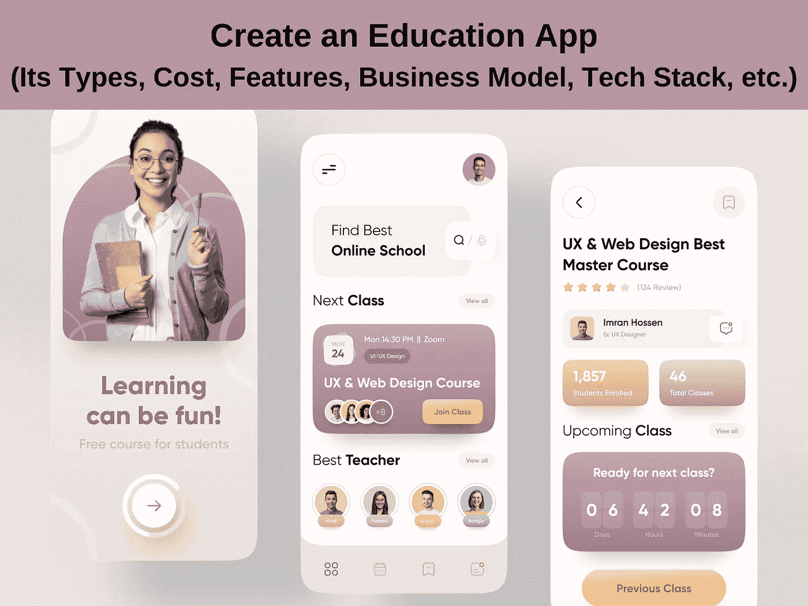

# 创建一个教育应用程序:它的类型、成本、功能、商业模式、技术栈等。

> 原文：<https://javascript.plainenglish.io/everything-you-need-to-know-about-creating-an-education-app-b020e5516d9?source=collection_archive---------9----------------------->

## 关于创建一个教育应用程序，你需要知道的一切——它的类型、成本、功能、商业模式、技术栈等等。

在后 Covid 时代，最显著的变化是远程工作和教育。没有比电子学习平台更好的学习解决方案了，它不仅允许全球各地的导师和学生相互联系和合作，还允许家长通过一些智能报告工具和分析来跟踪他们的进展。因此，要尽可能地让父母保持最新状态。

如果你也在寻找开发一个可以在导师和学生之间架起桥梁的应用程序，那么毫无疑问，这是最好的时机。由于教育是永远不会停止增长的关键行业，因此在适当的时候抓住这个不断增长的市场是有意义的。但是在开始这个旅程之前，让我们先来看一下细节。

**目录:**

*   *有哪些不同类型的教育应用？*
*   *教育类 app 的商业模式有哪些？
    -点对点学习 app
    -小组辅导 app
    -自定进度学习 app*
*   *开发教育类 app 是个好主意吗？*
*   *开发教育应用时需要考虑的关键领域。*
*   *教育类移动应用的必备功能。*
*   *其他需要考虑的重要特性。*
*   *开发一个教育类手机 app 要多少钱？*
*   *结论*

# **有哪些不同类型的教育应用？**

教育应用程序的开发有多种方式。以下是不同类型的教育应用程序:

1.**点对点学习应用:**这涉及到一个导师和一个学生，他们可以通过平台使用各种过滤选项(如语言、科目、价格、位置和专业知识)进行联系。学生们按小时雇佣导师，并通过视频电话上课。

2.**小组辅导应用**:小组辅导应用允许学生根据导师安排的课时加入课程并参加课程。这允许多个学生加入一个批次并参加课程。

3.自定进度的学习应用程序:这涉及到学生购买已经由专家创建的课程。该课程是预定义的，允许学生根据应用程序的政策在有限的/终生的时间内购买和访问。

# **教育类 app 的商业模式有哪些？**

在你雇佣应用开发者之前，根据要开发的教育应用的类型来确定商业模式是很重要的。由于商业模式可以极大地影响应用程序的受欢迎程度，因此尽可能清晰地定义收入模式也至关重要。以下是一些教育应用巨头已经使用的一些方法:

1.基于小时的模式:这种模式最适用于点对点教育应用，导师可以根据他们的专业知识收费，学生可以根据自己的喜好雇佣。

2.**基于价值的模型**:基于产品的价值。例如，一个高价值和高需求的认证课程的价格可以远远超过实际成本。这不仅允许增加一个良好的标记，而且确保佣金也提取舒适。

3.**固定价格模式**:在竞争激烈、卖家众多的情况下，最好保持价格固定，让顾客选择最好的。

# 开发教育应用程序是个好主意吗？

昨天是推出一款教育 app 的最佳时机。因为那已经是过去的事情了，所以毫无疑问，现在是在教育行业占有一席之地的最好机会。自 Covid 以来，电子学习已成为热门话题，每个人都想在自己舒适的家中接受教育。现在就雇佣 iOS 应用开发者来帮助你将梦想变成现实吧！

已经在 2020 年增长了 20%,并且还计划再平均增长 26%,这是让你自己出现在世界地图上的最好时机。

还是不相信我们？检查应用程序商店，你会发现它在第三个位置，在 Play 商店，教育应用程序在第二个位置。

这种从传统教育体系的转变只是提供了证据，证明了世界是如何接受这种变化的。最终，你越早占领市场份额，就越有利于获得更多用户，从而增加收入。

# **开发教育应用时需要考虑的关键领域。**

一旦你下定决心开始开发教育应用程序，下一步就是 [**雇佣最适合开发预想应用程序的移动应用程序开发者**](https://www.appsdevpro.com/hire-developers/hire-mobile-app-developers.html) 。

以下是寻找团队开始开发之旅时需要考虑的一些重要参数:

1.  **能力**:检查开发公司到目前为止开发的教育应用的曝光率是很重要的。有一个非常了解这个行业的人可以确保设定正确的预期，并且让你知道要准备的事情。

这不仅是根据你的意愿创建应用程序，也是让某人知道事情并能帮助创建一个适合满足你的业务需求的应用程序。

2.**经验**:拥有经验丰富的开发人员将确保工作不会在关键时刻停滞不前，也有助于加快应用程序的开发。

3.**团队规模**:理解团队规模，以确保不要有太多或太少的开发人员在项目中工作。理想的方式

4.技术:从趋势来看，雇佣一个跨平台的开发人员不仅可以确保开发成本更低，还可以让你有一个更小的团队来处理内部维护的事情。

# **教育类移动应用的必备功能。**

当每个人想到他们想要开发的应用程序时，总会有一个清单。但是，在开发教育类 app 时，有一些功能是不能跳过的。它们列举如下:

1.**角色:**明确定义平台上可以存在的用户角色类型很重要。虽然学生是一个显而易见的问题，但(取决于商业模式)，导师甚至家长或大学是否会成为生态系统的一部分仍有待观察。你当然可以和你将要雇佣的 android 应用开发者详细讨论这个问题。

2.**个人资料:**对于学生和导师来说，拥有一份包含各种重要信息的个人资料是很重要的，如所讲的语言、评分、学习时间，对于导师来说，如平均评分、小时工资、总收入等。

3.**聊天**:预约搭车的时候，需要聊天，对吧？然后你就不跟司机说话了！但是在这里，上课的时候，你们交流。展示了在应用程序中建立聊天功能的重要性，让学生和导师能够相互协作和聊天。好的功能可能包括视频聊天、发送附件的能力等。

4.匹配算法:当你想有一个好的生意时，给你的导师提供同样的东西也很重要！如果合适的学生雇佣他们，这是可以做到的。就像如果你希望跨平台(这意味着只能用一个代码来开发 iOS 和 Android 应用)，那么 [**雇佣一个 Flutter 应用开发者**](https://www.appsdevpro.com/hire-developers/hire-flutter-developers.html) 是很重要的。这一切都取决于有一个基于应用程序的深思熟虑的匹配算法。

5.**无缝支付**:拥有一个良好且易于访问的支付系统将对降低支付跳出率起到巨大作用。你甚至可以有能力自动支付导师一旦他们完成他们的工作。听起来不错，对吧？

6.**推送通知**:定制通知是一种很好的营销方式，也可以成为一个关键点。

7.**仪表盘**:一个醒目的仪表盘可以确保用户专注于他们的统计数据，并推动他们实现目标。这些统计数据不仅清晰明了，还为用户提供了更多使用该应用程序的理由，并通过更多使用该应用程序开发了他们的个人资料。

## **其他需要考虑的重要特性:**

–学生/家长仪表盘
–测验和考试
–线下课堂
–课后支持
–进度跟踪和成绩解锁
–游戏化
–多因素认证
–家教收入仪表盘
–社交媒体帖子
–课堂调度和提醒
–微培训

## **开发一个教育类的手机 App 要多少钱？**

开发教育应用的成本取决于多种因素，例如:

*   **固定成本与基于时间的对比:**重要的是要明白，固定成本模型不会给你提供太多的自由，只要你关注动态变化。但是，如果你想按照你的意愿进行更改，那么建议 [**雇佣一个专门的开发团队**](https://www.appsdevpro.com/dedicated-development-team.html) ，他们可以按照你的要求工作。
*   **使用的平台:**考虑:根据应用程序将要启动的地区，将在很大程度上影响您的目标平台。如果你只针对一个平台，那么可以考虑 iOS 和/或 Android 的原生开发。否则，您应该进行跨平台开发以降低成本。
*   **维护和支持能力**:就像汽车一样，维护应用程序和网站非常重要，以确保在不断增长的市场中阻止安全漏洞并迎合新的更新。
*   **位置**:开发团队根据他们所处的位置极大地定义了定价结构。雇佣印度的应用程序开发人员将确保你一直有大量的可用资源，并保持低成本。

## 应用程序可以分为三种类型:

## **-基础**:

如果你愿意先试水，那么基本的应用程序是一个不错的选择。了解关键特性并确保最终结果是提供一种将学生与教育领域联系起来的方法，这将有助于开发一个确保实现最大投资回报的平台。基本应用程序的开发费用大约在 20，000-30，000 美元之间。

## -标准:

标准应用程序将是基本的应用程序功能，加上大多数用户所期望的某些功能。游戏化等功能总是受到用户的高度评价，但它们只能鼓励应用程序的无声推广。这样一款应用的价格从 3 万美元到 4.5 万美元不等。

## -高级:

一个高度先进的应用程序可以确保功能可以作为卖点，并作为一些现有应用程序中不可用的功能，这将确保你有一个引人注目的平台，可以像蜜蜂一样吸引用户。这可能包括添加聊天机器人、24 小时协助和基于人工智能的功能。这种应用程序的起价为 5 万美元，可能会根据待开发的高级功能而上涨。

# **结论**

*本文的要点:*

–各种垂直行业正在开发许多不同类型的教育平台，如内部培训机构、课程学校/学院以及可以联系学生的个人导师。

–平台的业务模型可以是基于小时、基于价值和基于固定成本的，这些都可以根据业务模型来定义。

–虽然理解初始阶段的最终目标很重要，但开发团队也要完成大量工作。因此，雇佣一个能够帮助你将梦想变成现实的移动应用开发者是很重要的。

–教育应用的成本可以根据各种参数进行分解，例如团队类型、团队规模、持续维护和位置。

希望这些信息能帮助你了解你现在所处的位置，以及你下一步需要做什么。如果你需要问我们什么，我们洗耳恭听！请使用下面的评论部分将您的疑问发送给我们，或者随时联系我们。

========================================

*更多内容请看*[***plain English . io***](https://plainenglish.io/)*。报名参加我们的* [***免费周报***](http://newsletter.plainenglish.io/) *。关注我们关于*[***Twitter***](https://twitter.com/inPlainEngHQ)*和*[***LinkedIn***](https://www.linkedin.com/company/inplainenglish/)*。查看我们的* [***社区不和谐***](https://discord.gg/GtDtUAvyhW) *加入我们的* [***人才集体***](https://inplainenglish.pallet.com/talent/welcome) *。*