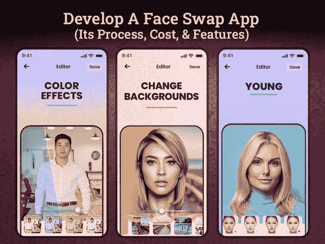

# 关于换脸 App 你需要知道的一切，以及要花多少钱？

> 原文：<https://javascript.plainenglish.io/everything-you-need-to-know-about-face-changing-app-and-how-much-will-it-cost-you-49054c5f3f7c?source=collection_archive---------9----------------------->

## 创建一个面部交换应用程序需要多少成本:**它的成本、功能、流程和技术栈。**

社交媒体应用的月活跃用户超过 35.8 亿，毫无疑问，社交媒体领域正在快速扩张。随着社交媒体领域新平台和趋势的不断涌现，营销人员和企业越来越难跟上时代的步伐。但当你了解这个快速增长的市场的脉搏时，你就能找到成功之路。

说到现实，你们很多人都进退两难，到底是什么让社交媒体行业快速崛起？

如果你打算进入照片编辑应用类型，你需要熟悉那些在 2022 年迅速成为潮流引领者的变脸应用。

照片滤镜和编辑功能的病毒式浪潮让 Instagram 或 Snap-chat 等社交媒体应用火了起来。将自拍转换为各种基于人工智能的滤镜的趋势推动了社交媒体行业的发展。最近，一个席卷社交媒体世界的趋势是 Reface 和 Face-App。

是的，像 Reface 这样的面部交换应用已经在社交媒体上疯传，并席卷了互联网。事实上，这些应用程序是如此的吸引人和迷人，以至于数百万用户正在下载应用程序。这些应用程序最流行的功能之一是让用户将自己的脸与名人的脸互换。此外，使用这些照片编辑应用程序的这些令人兴奋的功能，可以让你尝试各种照片滤镜，尝试新的外观。但随着这些应用越来越受欢迎，由于缺乏创新和独特性，它们正在失去对用户的吸引力。

如果你正在开发一个全新的人工智能面部交换应用程序，那么这可能是一个将计划付诸行动的好时机。人们更乐于尝试拥有全新功能的应用。早在你通过雇佣移动应用程序开发公司投资这个令人兴奋的应用程序想法时，你的项目就可以让它在市场上大受欢迎。用户可能会沉迷于此类照片编辑工具，而不仅仅是与喜爱的演员交换面孔或创建 gif。如果你仍然想知道投资照片编辑或面部改变应用程序是否值得，那么你需要了解市场统计数据…

## **照片交换应用的市场洞察和未来范围**

不可否认的事实是，每个人都喜欢尝试一些有趣和搞笑的事情，让他们的谈话更有吸引力，更令人印象深刻。使用像 Reface 或 Face-App 这样的面部改变应用程序，用户可以在几秒钟内将他们的脸添加到流行的电影 gif 或增强他们的面部特征。事实上，推出人脸交换应用程序的独特想法是提供一个平台，让用户可以展示他们的编辑技能，并通过尝试这种基于人工智能的快速滤镜，让他们的照片看起来更令人印象深刻。

Snap-chat 和 Instagram 等社交媒体应用已经在利用面部交换功能的优势，征服照片编辑市场。

*   *根据一份调查报告，2019 年照片编辑应用市场价值为 2.9302 亿美元，预计到 2027 年* [*将达到 3.8783 亿美元*](https://www.verifiedmarketresearch.com/product/photo-editing-app-market/) *。*
*   *预计从 2019 年到 2027 年* *，照片编辑应用市场将以 3.57%的* [*CAGR 增长。*](https://www.verifiedmarketresearch.com/product/photo-editing-app-market/)

根据这些统计数据，很明显照片编辑市场正在增长，并且始终有空间调整像 Reface 这样的新换脸应用程序。然而，开发一个可以在市场上树立标杆的照片替换应用程序是一项艰巨的工作。通过雇佣一个[**app 开发公司**](https://www.xicom.biz/services/mobile-app-development/) ，可以更进一步。如果你一开始就准备好了这个项目，那么你需要了解它到底是如何工作的，是什么让它如此困难？想知道在哪里可以找到所有这些问题的答案和解决方案吗？那么这个博客将帮助你在这里得到完整的细节。

在你直接进入应用程序开发过程之前，是时候了解一下博客的关键亮点了…

**目录**

*   *了解 Reface 或 Face-App 等变脸 App 的机制*
*   *能让你的应用病毒式传播的顶级过滤器*
*   *创建照片编辑应用程序的主要特性和功能*
*   *Swap 应用开发要考虑的技术组合*
*   *照片编辑 App 如何盈利？*
*   *创建一个像 Reface 或 Face-App 这样的照片编辑 App 需要多少钱？*
*   *结论*

## **1。了解 Reface 或 Face-App 等变脸 App 的机制**

像 Reface 或 Face-app 这样的照片交换应用程序的简单，直观和高度参与的界面让用户疯狂。事实上，对创建照片交换应用程序感兴趣的企业家需要明白，这些应用程序类型使用假深度技术，该技术进一步嵌入了人工智能技术，以快速执行面部替换。

照片编辑或换脸应用程序的机制简单明了。人像人工智能应用程序通过高清自拍或视频捕捉用户的面部表情和动作，并上传到应用程序上。应用程序中预先存在的图像和镜头将进一步与实时图像相结合，并允许用户使用一些非凡的编辑工具来获得出色的效果。

另一种选择是上传高清照片或视频，以进一步添加滤镜。这项技术非常有效，它可以自动裁剪用户的面部，以匹配原始过滤器中的面部表情，使其看起来真实。可以考虑 [**聘请手机 app 开发者**](https://www.xicom.biz/offerings/hire-mobile-developers/) 定制一个 app，提供库中上百个 GIF 文件和滤镜。事实上，您可以允许用户使用正确的关键字搜索这些特定的过滤器或 gif，并选择它们进行下一步操作。

虽然 gif 和人脸过滤器可以改变你的照片交换应用程序的游戏规则。但是，你仍然需要寻找使 Reface 类型照片编辑应用程序在市场上大受欢迎的过滤器。

## **2。可以让你的应用病毒式传播的顶级过滤器**

Reface 或 Face-app 的流行刺激了企业家，并鼓励他们建立一个克隆应用程序，以利用照片编辑平台的成功。如果你也有兴趣创建一个应用程序，并且很好奇创建一个改变照片的应用程序需要多少钱，那么外包一个应用程序开发公司。像 Reface 一样，确保你的面部交换应用程序也可以免费下载和访问，但不要忘记为付费版本添加高级功能。

*根据市场分析，Face-app 在 App Store 获得 4.7+的评分，在谷歌 Play 商店获得 4.5+的评分，下载量超过 1 亿次。*

但问题是是什么促成了它的流行？

**以下是使 Face-App 或 Reface app 成为趋势的顶级过滤器:**

*   **性别互换:**该功能有助于接触数百万用户，并帮助该应用产生数百万收入。使用这个过滤器，任何人都可以交换他们的性别。照片转换器应用程序可以让你看起来是女性还是男性，并允许用户检查他们在异性中的样子。
*   **年龄过滤器:**现在，这个过滤器已经被证明是一张黄金门票，让应用程序制造商通过简单地允许他们即时改变他们的年龄来达到数十亿用户。使用这个照片过滤器，用户可以检查他们自己在老版本和年轻版本中的样子。这个滤镜甚至引起了名人的注意，并随着#FaceAppChallenge 和#AgeChallenge 等标签而变得流行。
*   发型过滤器:Reface type photo change 应用程序让用户虚拟地尝试不同的发型，并让他们了解什么最适合他们。当你可以使用这个滤镜尝试各种发型时，为什么要在现实生活中尝试呢？
*   **肤色增亮滤镜:**这通常是任何照片交换应用的主要照片滤镜，但 Reface 已经考虑在不同版本中提供它。
*   **微笑滤镜:**让用户通过简单地使用不同的微笑滤镜来增强他们的微笑。

在你直接开始复制应用克隆并考虑推出类似 Reface 的照片交换应用之前，你需要花点时间。开发 Faceapp 或 Reface app 的副本不会让你成功。虽然你们中的许多人可以选择 [**雇佣一名应用程序开发人员**](https://www.xicom.biz/solutions/hire-developers/) 来定制应用程序结构。它们不是复制 Faceapp 的应用克隆，而是帮助你整合最好的功能选择，使其独一无二。这些是用户已经在现有应用程序中获得的过滤器。那么，你能在你的应用程序上为他们提供什么新内容呢？

*来看看吧！*

## **3。创建照片编辑应用程序的主要特性和功能**

开发一个变脸 app 总是很有娱乐性的。但不要采取其他方式。应用程序的成功主要取决于应用程序的界面及其功能。因此，在这里，我们将讨论你可以在你的克隆应用程序中考虑的主要特性和功能，如果你打算建立一个的话。

*   **用户注册:**这是你手机 app 最重要的功能之一。允许用户使用电子邮件 ID 或联系信息注册您的应用程序。为了使您的注册过程更快更简单，您可以添加社交媒体集成注册选项。
*   **上传图片:** Reface like photo changing 应用程序允许用户从手机的图库或直接从社交媒体应用程序上传他们的个人资料图片。为了让这项功能更上一层楼，你可以允许他们在照片上应用滤镜，并提供应用内编辑工具。
*   **图像增强工具:**为了让照片看起来更有趣、更有吸引力，你可以提供一些图像增强工具，比如发型、眼镜、化妆、胡须等等。这些工具只需轻点几下，就能立刻改变你的形象。
*   **面部编辑工具:**无论用户是在捕捉实时图像还是从手机的图库中上传图像，都可以通过提供编辑选项来帮助他们进行编辑，如调整对比度、光线、旋转、裁剪等。
*   **搜索框:**在你的应用程序中添加一个搜索栏，允许用户通过使用关键字进行搜索来直接查找特定的过滤器。这一部分将帮助用户搜索他们最喜欢的视频，并能够访问热门视频。
*   **个性化建议:**在你的应用中实现这一功能，让你的应用在市场中脱颖而出。由于该应用程序运行在人工智能驱动的深度伪造技术上，因此更容易确定用户行为。通过雇佣一个 [**应用程序开发公司**](https://www.xicom.biz/services/mobile-app-development/) 你可以把这个功能提升到一个新的水平。利用这项技术，向用户推荐一些顶级过滤器。
*   **社交分享:**每个人都喜欢与他人分享自己出色的照片编辑技巧。此功能允许用户共享在您的应用程序中编辑的 GIF。这项功能将在两个方面发挥作用——确保令人满意的用户体验，并让你在社交媒体平台上免费推广。
*   **上传内容:**在你的应用上花时间点击图片，用人工智能过滤器编辑它，大多数用户会喜欢用快速上传按钮立即上传到应用上。
*   **下载或删除内容:**如果用户制作了他们不想上传的 GIF 或 face swap 视频，则提供保存和下载的选项。后期用户可以通过 app 删除这类不想要的内容。

这些是创建照片交换应用程序的几个主要功能，可以帮助你与领先的照片编辑应用程序竞争。但是为了让它完美地工作，你需要寻找支持后端和前端的技术。

## **3。Swap 应用开发要考虑的技术堆栈**

毫无疑问，基于人工智能的算法和过滤器是人脸交换应用的核心和灵魂。然而，要让它在不同的平台上工作，你需要寻找各种工具和第三方集成来让它更快地工作。无论你开发的是 MVP 解决方案还是完全成熟的高级版本，Google API 都是链接用户帐户和服务器之间的应用程序的最有效的服务之一。

*   *接下来，您可以考虑 GANs，它致力于创建一个集成数据网络，用于建立不同图像之间的比较，然后综合它们以获得更好的结果。*
*   *对于服务器端脚本，建议使用 Python，因为它可以确保高度的灵活性、动态性和可用性。另外，Python 使用 MySQL 来存储信息。*
*   *对于 Android 应用程序开发，使用 Kotlin 或 Java 编程语言都是值得的。*
*   *对于 iOS app 开发，Objective C 或者 Swift 一直是开发者的热门选择。*
*   对于混合人脸应用交换应用开发，您可以利用 React Native、Flutter 或 Xamarin 的丰富功能。
*   *此外，OpenCV 可以用作 3D 图形渲染工具。*

这些是你在开发照片交换应用时可以寻找的基本技术选择。休息，你可以咨询应用程序开发人员，以获得更先进和现代的技术替代品。

## **4。照片编辑 App 如何盈利？**

无论你是一家初创公司还是一名领先的企业家，你开发一款应用的最终目的是了解它能在多大程度上帮助你赚钱。为了获得成功，你的应用程序能够赚到足够的钱是很重要的。为此，你可以雇佣一家 [**软件开发公司**](https://www.xicom.biz/) 来实施最佳的盈利策略，或者创建自己的策略。通过 snap swapping 应用赚钱的方法有很多种，但要获得足够的利润，请确保选择正确的策略。

**根据市场调查，我们在此解释一些将你的照片更换应用货币化的方法:**

*   要想创收，一定要为第三方商家添加应用内广告。
*   第二种盈利模式是通过收费来获取高级功能。
*   每月、每季度或每年提供订阅计划。您可以收取订阅费用，并允许用户在应用程序中访问这些高级功能。

## **5。创建一个像 Reface 或 Face-App 这样的照片编辑 App 需要多少成本？**

对于开发人员来说，估算照片更换应用程序的开发成本一直是一项令人头疼的任务。由于它包括各种过滤器、过多的功能和先进的技术，因此，预测一个标准的应用程序开发成本总是一个巨大的挑战。

但是确定应用程序开发成本并不是火箭科学，尤其是当你知道什么因素影响应用程序开发成本的时候。因此，在你得出任何结论之前，你需要知道什么是成本影响因素，以及它们如何帮助你设定正确的预算。

**下面是 app 开发成本影响因素:**

*   应用程序的复杂性
*   操作平台的选择
*   应用程序设计的复杂性
*   应用程序的特性和功能
*   应用测试
*   应用开发团队
*   应用程序开发人员的每小时成本，等等

如果根据这些因素来估算应用程序开发成本，那么每个平台的成本将在 20，000 美元到 25，000 美元之间浮动。而高级应用程序版本可能需要 30，000 至 35，000 美元以上，具体取决于应用程序的复杂程度和业务需求。所以在你做任何决定之前，建议预定一个免费的专家咨询时段，以做出公平的决定。

## **结论**

随着提供多种面部变化滤镜的社交媒体应用程序越来越受欢迎，毫无疑问，面部变化应用程序的市场目前也在蓬勃发展。如果你已经决定进入基于人工智能的照片交换市场，那么你可以聘请一家移动 [**应用开发公司**](https://www.xicom.biz/services/mobile-app-development/) 来创建一个像 Reface 或 Face-app 这样的照片交换应用。通过正确选择功能和实施技术，您可以创建自己的移动应用程序，在面部交换业务中发挥重要作用。你所需要做的就是记住，你要让你的应用程序在两个平台上都可用。

因此，如果你心中有一个与面部交换市场相关的应用程序开发想法或概念，并在寻找一个可以将其转化为强大解决方案的团队，那么你可以 [**联系我们**](https://www.xicom.biz/contact/) 或在下面提出疑问。

=======================================

*更多内容请看*[*plain English . io*](https://plainenglish.io/)*。报名参加我们的* [*免费周报*](http://newsletter.plainenglish.io/) *。关注我们的*[*Twitter*](https://twitter.com/inPlainEngHQ)*和*[*LinkedIn*](https://www.linkedin.com/company/inplainenglish/)*。加入我们的* [*社区不和谐*](https://discord.gg/GtDtUAvyhW) *。*