# 关于 JavaScript Spread 语法您需要知道的一切

> 原文：<https://javascript.plainenglish.io/everything-you-need-to-know-about-the-javascript-spread-syntax-e87adf90de35?source=collection_archive---------20----------------------->

## 对象和数组是旧的。spread 语法相对较新(ES6)，但它可能是 JavaScript 中最有用的语法特性之一。这是你必须知道的一切。

JavaScript 在过去十年中有了显著的改进。自 2015 年以来，EcmaScript 一直在推出新的语法功能，它们都让 JavaScript 编程变得更加有趣。最流行的语法改进之一是 arrow 函数。一个鲜为人知的语法增强是 spread 运算符。

spread 操作符使得用数组和对象自动完成简单的任务变得容易。这个操作符仅仅是三个点(省略号),用于前置一些数据。

我将从一些基本的介绍性例子开始。然后，我将展示 spread 语法的全部功能。首先，我将从使用数组的例子开始。然后我将向您展示 JavaScript 对象有多酷。

# 数组扩展算子

## 向函数传递参数

数组是一种在线性结构中存储数据的便捷方式。它们很棒，因为你知道每个元素的索引保持不变(除非你改变它)。

假设你有一个三维坐标。表示这一点的简单方法是使用包含三个元素的数组。假设你想写一个函数，把数组打印成一组坐标。您的代码如下所示:

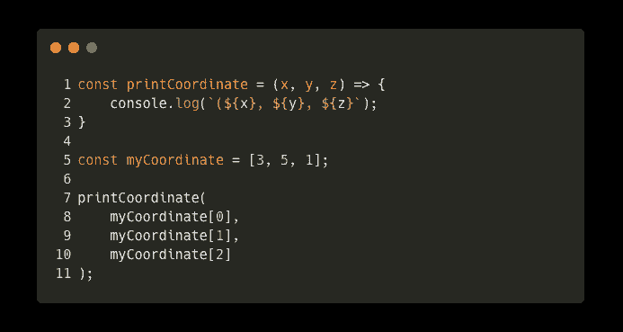

Individually passing array elements to a parameter list

注意第 7 行是如何调用 printCoordinate 的，但是参数列表多次引用了`myCoordinate`。在 JavaScript 中，引用连续的索引现在被认为是不好的做法。请记住，您不能简单地将`myCoordinate`数组传递给`printCoordinate`；否则，它会将一个三元素数组赋给参数`x`。

扩展运算符可以帮助我们解耦值:

*   取阵:`[3, 5, 1]`
*   来传播一下:`console.log(...[3, 5, 1])`
*   扩展将在参数列表中评估为`3, 5, 1`，有效地解耦元素。

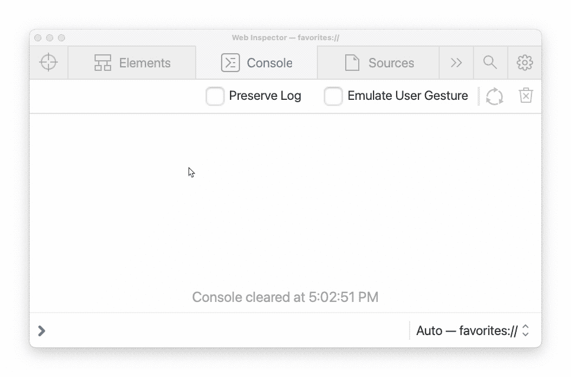

An example of how the spread operator separates (decouples) elements in an array

对于我们的坐标打印功能，使用 spread 操作符来解耦数组可以很容易地实现。

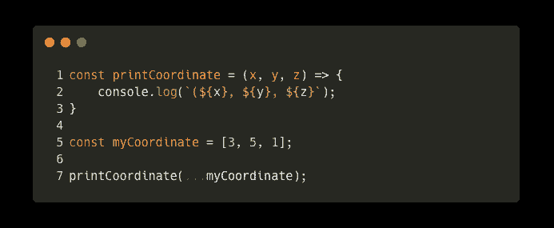

Passing a decoupled array into a parameter list using the spread syntax

使用 spread 操作符来分离数组中的元素非常有用。您的代码变得更短、更清晰、更易读、更高效。

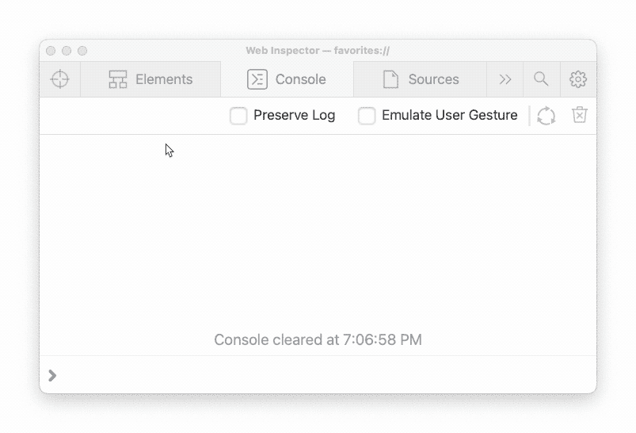

Demonstration of how JavaScript interprets decoupled arrays in a parameter list

## 复制元素

下面是我们通常将元素从一个数组复制到另一个数组的几种方法:

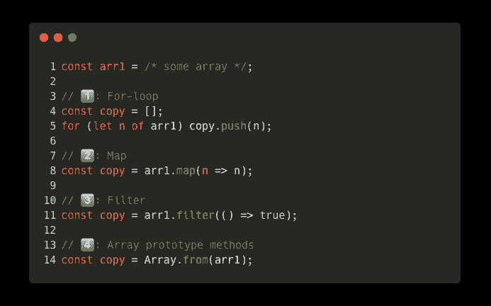

**Correction:** #4 is not a prototype method, it is a static method | Map/Filter are prototype methods.

简单的做`copy = arr1`只会让两个变量指向同一个数组。以上过程创建了一个新数组，它不引用原始数组，但具有相同的值。

扩展操作员可以更容易地完成这项任务:

Using the spread operator to copy elements from one array into another

好多了，对吧？

您甚至可以轻松地追加、前置或合并两个列表:

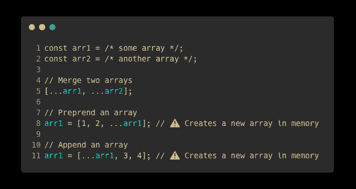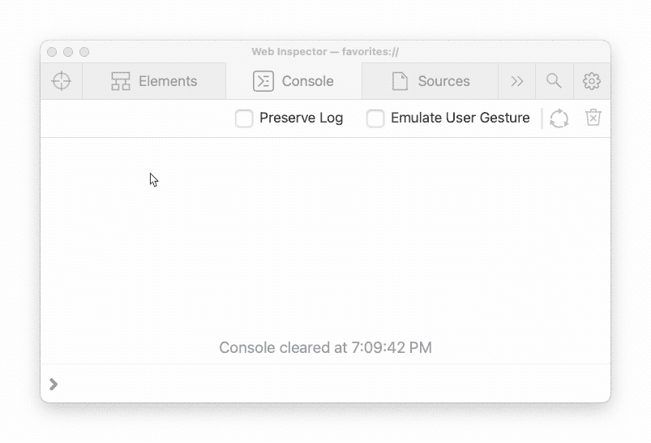

## 接受无限参数列表

您以前使用过接受无限参数列表的函数。最受欢迎的两个是`console.log`和`Array.prototype.push`。

在以前版本的 JavaScript 中，你必须使用`arguments`关键字。每个函数都有一个`arguments`属性；它只是传递给函数的所有参数的列表。以前使用它是可以的，但是开发人员在使用它的时候会遇到很多问题。

您可以使用 spread 运算符来定义参数列表:

Defining an infinite parameter list using the spread operator

# 目标

对象很酷，但是使用它们时保持最新状态更酷。对象的扩展操作符是惊人的，你可以用它们做很多事情。

与数组类似，spread 运算符对对象的键值对进行解耦。spread 语法允许您将值从一个对象复制到另一个对象。

## 复制对象属性

将对象的属性复制到另一个数组与使用 spread 运算符复制数组是一样的。唯一的区别是你将使用`**{**`花括号`**}**`而不是`**[**`方括号`**]**`。

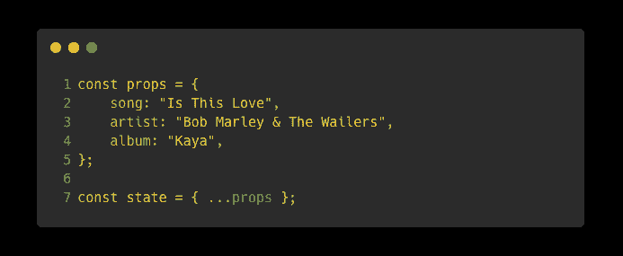

Copying object properties using the spread operator

与复制对象属性的旧方法相比，使用“扩展”操作符要容易得多，也干净得多:

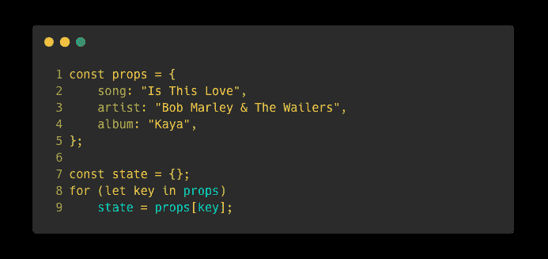

The old way of copying object properties

## 提供回退值

假设您有一个接受`config`参数的函数。为特定属性设置后备值或默认值是一种很好的做法。JavaScript 通过在展开对象之前提供默认值来实现这一点:

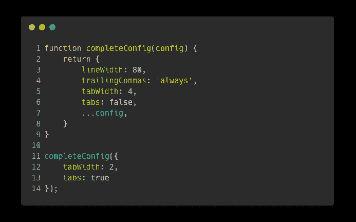

Notice how config is spread at the end of the object

## 覆盖值

除了提供默认值之外，有时您可能希望复制对象的属性，同时只更改特定的属性。这可以通过在列出修改之前展开对象来实现。

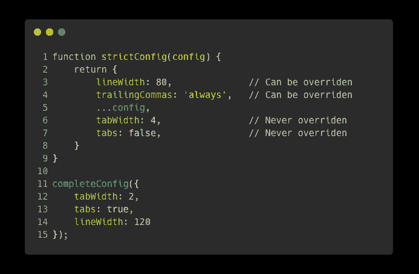

Notice how config is spread before tabWidth and tabs. This means those properties will override config.

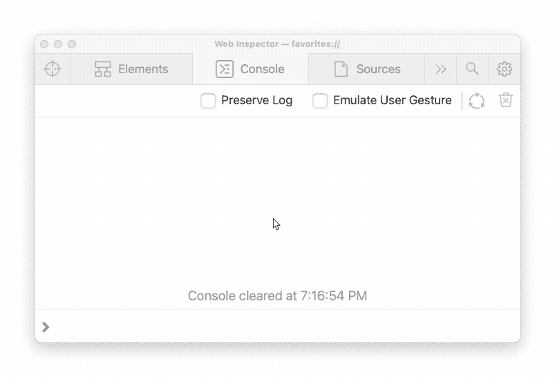

Demonstration of overriding object properties

如果你读到这里，我想感谢你阅读这篇文章。我希望您学到了一些以前不知道的 JavaScript spread 语法。

如果您认为我遗漏了与扩展操作符相关的任何内容，请告诉我；我会确保将它添加到本文中(并通过留下您的媒体页面链接来引用您)。

编码快乐！👨‍💻👍

 [## 停止使用 For 循环，改用迭代器

### For 循环不再是 JavaScript 中迭代数组的最佳方式。相反，使用数组迭代器函数。这里…

javascript.plainenglish.io](/stop-using-for-loops-use-iterators-instead-javascript-62682c74427d)  [## 请停止编写 Sh*t JavaScript

### 你做错了什么，以及如何弥补。

medium.com](https://medium.com/@thesoggywaffle/please-stop-writing-sh-t-javascript-ba8fd4e1cd9e)  [## 停止使用逻辑 OR，使用？？代替

### 你可以在很多事情上使用逻辑操作符，但是不要在任何事情上都使用它们！我们现在有更好的东西了。

javascript.plainenglish.io](/stop-using-logical-or-use-null-coalescing-instead-f7668c96b0db)  [## 你从来不知道的 4 个很酷的 JavaScript 控制台功能

### 这些 JavaScript 控制台函数在 web 开发课上很少谈到。

javascript.plainenglish.io](/4-cool-javascript-console-functions-you-never-knew-about-c769d24d7c18) 

*更多内容请看*[***plain English . io***](https://plainenglish.io/)*。报名参加我们的* [***免费周报***](http://newsletter.plainenglish.io/) *。关注我们关于*[***Twitter***](https://twitter.com/inPlainEngHQ)*和*[***LinkedIn***](https://www.linkedin.com/company/inplainenglish/)*。查看我们的* [***社区不和谐***](https://discord.gg/GtDtUAvyhW) *加入我们的* [***人才集体***](https://inplainenglish.pallet.com/talent/welcome) *。*