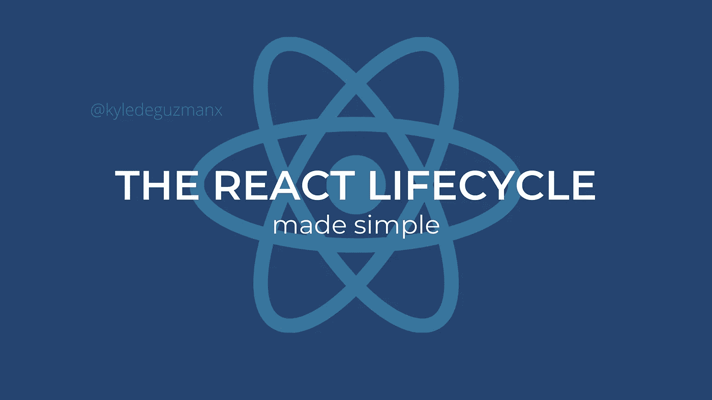

# 关于 React 生命周期您需要知道的一切

> 原文：<https://javascript.plainenglish.io/everything-you-need-to-know-about-the-react-lifecycle-9834019fb26f?source=collection_archive---------11----------------------->

## 下一次面试前你需要阅读的简单解释！

嘿朋友们，

如果你像我一样，你可能会在简历上吹嘘自己擅长反应。也许如果你正在开始你的职业生涯，你有一堆 React 项目列为你的经验。我就是这么做的。

毫无疑问，我很擅长反应。我的 GitHub 有很多项目可以证明。但是有一件事我从来没有在我的任何项目中真正探索过——甚至直到现在——就是 React 生命周期。

想象一下当我的面试官问我关于 React 生命周期方法的时候我有多惊讶。令人欣慰的是，尽管我从未在任何项目中实现过这些生命周期方法中的大部分，但我仍然通过阅读了解了它们的用途。

不幸的是，在采访过程中，我无法回忆起这些方法的确切名称；但是我确实能够传达这些方法所扮演的角色——最终，由于更高权力的恩惠，我得到了这份工作。

今天，我想帮助你做得比我更好。今天，我们将讨论您需要了解的生命周期方法、它们的作用以及您可能想要使用它们的场景。如果你声称你熟练于 React，你绝对应该知道这些生命周期方法。

让我们开始吧。

# React 的生命周期是什么？

众所周知，React 使我们能够创建单页面、基于组件的应用程序。因此，你的网站不是由多个 HTML 文件组成的，我们只是有一个 HTML 文件，当用户与网站交互时，我们会不断地动态重写这个文件。

通常，这些单页应用程序将由多个组件组成。因此，当用户发出请求，而不是加载一个全新的页面时，可能只有部分网站会重新呈现。例如，如果您使用电子邮件或脸书，您可能会注意到，当页面的其余部分加载新内容时，侧边栏和导航栏不会重新呈现。

因此，react 生命周期完全是关于组件的。这些组件都有自己的生命周期。这个生命周期分为三个阶段:安装、更新和卸载。

挂载是组件第一次被创建并呈现到 DOM 的时候。

更新是指组件将被强制再次呈现。这是因为状态或者道具变了。每当状态或道具发生变化时，UI 必须更新以反映这些变化。

最后，当组件将要从 DOM 中删除时，就会发生卸载。也许您想用另一个组件替换这个组件(从而将它从 DOM 中移除)。或者，浏览器窗口或选项卡将被关闭(从而将其从 DOM 中移除)。如果有人登录到他们的银行账户，并简单地关闭标签而不是注销，这将非常有帮助。

希望你能明白。

总之，生命周期包括安装、更新和卸载(按此顺序)。进一步探索，每个阶段都有方法(或功能)。

安装有以下方法:

*   静态 getDerivedStateFromProps(props，state)
*   渲染()
*   构造函数()
*   componentDidMount()

更新的方法有:

*   静态 getDerivedStateFromProps(props，state)
*   shouldComponentUpdate()
*   渲染()
*   getsnapshotbeforupdate(previousProps，previousState)
*   componentDidUpdate()

卸载的方法是:

*   componentWillUnmount()

让我们对此进行进一步的分析，并进一步了解这些方法。

# 安装生命周期方法

我们将从第一阶段开始:安装。安装有四种方法，我想看一下。

## 构造函数()

让我们从`constructor()`开始。这个方法是创建新组件并呈现给 DOM 时调用的第一个方法。

根据 React 官方文档，[构造函数方法](https://reactjs.org/docs/react-component.html#constructor)非常适合初始化状态和绑定事件处理程序。

## 静态 getDerivedStateFromProps (props，state)

接下来，我们有方法`static getDerivedStateFromProps (props, state)`。这个方法主要用于根据来自 props 的值更新状态。回想一下，props 本质上是由父组件提供的值。

现在，官方文档坚持认为应该少用这种方法。事实上，文档甚至发布了一篇名为[的博文，你可能不需要派生状态](https://reactjs.org/blog/2018/06/07/you-probably-dont-need-derived-state.html#when-to-use-derived-state)。对于大多数情况，您可能只需忘记这个方法，并在构造函数中初始化组件的状态。文档坚持认为寻找替代解决方案更好，因为这种方法可能不可预测且难以维护，但它肯定有其用例。

## 渲染()

接下来，我们有非常熟悉的方法`render()`。Render 是我们用来将 JSX 渲染到 DOM 中的方法。render 方法是 React 类组件实际需要的唯一方法。

## componentDidMount()

最后，我们有`componentDidMount()`。首次完全呈现组件后，会自动调用此方法。

许多消息来源一致认为这是执行 AJAX 调用的最佳场所。如果你想和 API 交流，这是个好地方。为什么？我们的首要任务是将组件呈现给 DOM。只有在这种情况下，我们才应该发出网络请求，请求数据，然后将数据提供给组件。

文件坚持认为这个过程是优越的。我们不应该在呈现 DOM 之前发出网络请求和请求数据。这是因为我们不知道 AJAX 调用需要多长时间，数据需要多长时间才能返回给我们。在数据检索时间比预期长的情况下，我们要么会在网站上看到错误，要么会看到更长的加载时间——这些都不是我们希望看到的。

也就是说，这个方法非常适合那些没有 DOM 就无法执行的操作。例如，这包括创建事件侦听器。当没有 DOM 元素与之连接时，如何创建一个事件监听器呢？

这就结束了 Moutning 的生命周期。

# 更新生命周期方法

与挂载阶段类似，更新阶段也有`static getDerivedStateFromProps (props, state)`。它的用途完全相同，因此我们将快速跳过这一步。

并且更新生命周期阶段也有一个`render()`方法。每次组件的状态和道具改变，组件都必须重新渲染。这就是`render()`方法的用武之地。它与安装阶段的`render()`方法用途完全相同，因此我们将跳过它。

## shouldComponentUpdate()

此方法返回 true 或 false。并且它将确定组件是否应该更新和重新呈现。

你可以执行任何你想要的操作。检查状态，添加数字，比较字符串。尽你所能。只要确保在最后，你返回一个 true 或 false 值，告诉 React 组件是否应该更新和重新渲染。

或者你也可以完全跳过这个方法。这不是必需的。同样，React 类组件只需要 render 方法。

## getsnapshotbeforupdate(prev props，prevState)

接下来，我们有了这个非常酷的方法:`getSnapshotBeforeUpdate(prevProps, prevState)`

这个方法允许我们查看组件的先前属性和先前状态。也许你需要它来计算什么的。发疯吧。

## componentDidUpdate()

最后，我们有了方法`componentDidUpdate()`

在组件被更新并在 DOM 中重新呈现后，立即调用该方法。有些情况下，如果组件已经重新呈现，您可能希望执行某些操作。这是做这件事的地方。

# 卸载生命周期方法

卸载是组件生命周期的最后一个阶段。这是组件将要从 DOM 中移除的部分。如前所述，出于一些原因，组件可能会从 DOM 中删除。也许你会用另一个组件替换它。也许你正在关闭你的标签或浏览器窗口。不管怎样，想法是一样的:组件将从 DOM 中消失。

这个阶段只有一个方法。

## componentWillUnmount()

这个方法在从 DOM 中移除之前被调用。

也许你正在开发一款安全的金融应用，比如 PayPal、CashApp 或银行应用。如果用户关闭选项卡，这是强制注销操作的机会。

或者你正在做一个游戏。如果用户在游戏进行中关闭应用程序，这是保存玩家进度数据的机会。

或者，也许你可以完全跳过这个方法。这根本不是必需的。它只是你工具箱里的一个很酷的工具，用于某些情况。

我们对 React 生命周期的回顾到此结束。如果你想了解更多，查看由 Meta 维护的官方文档。

如果你做进一步的研究，你一定会发现一些我没有提到的其他方法。其中一些已经被否决和放弃，所以要小心。

为我的开发者伙伴干杯。

*更多内容看* [***说白了。报名参加我们的***](https://plainenglish.io/) **[***免费周报***](http://newsletter.plainenglish.io/) *。关注我们关于*[***Twitter***](https://twitter.com/inPlainEngHQ)*和*[***LinkedIn***](https://www.linkedin.com/company/inplainenglish/)*。查看我们的* [***社区不和谐***](https://discord.gg/GtDtUAvyhW) *，加入我们的* [***人才集体***](https://inplainenglish.pallet.com/talent/welcome) *。***