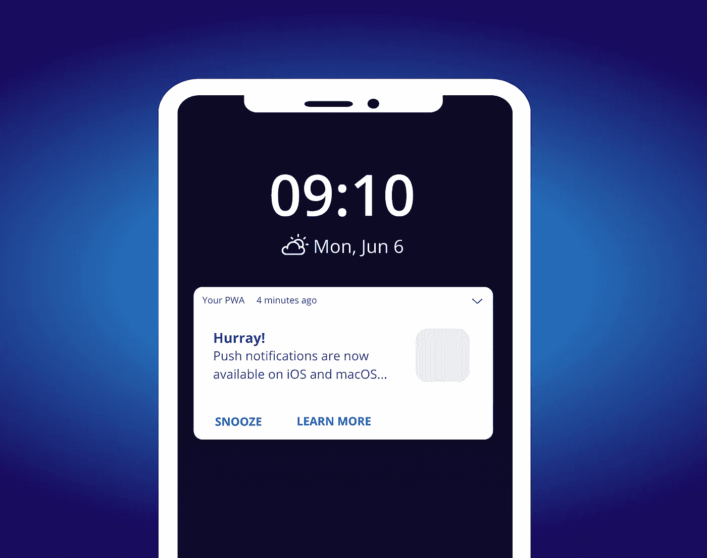

# 关于 iOS/macOS 上的网络推送，您需要了解的一切

> 原文：<https://javascript.plainenglish.io/everything-you-need-to-know-about-web-push-on-ios-macos-5a4b3b715b24?source=collection_archive---------4----------------------->

> 凯文·巴塞特(Kevin Basset)是 Progressier(T1)的创始人，这是一个软件工具包，被 5000 多个应用程序用来将自己从应用程序商店中解放出来。

苹果[在 WWDC22](https://twitter.com/jensimmons/status/1533893843799748610) 上宣布网页推送终于要来 Safari 了。macOS 上的 Safari 16 Beta 已经有了。明年，它也将登陆 iOS 和 iPadOS。

万岁！在 [Progressier](https://progressier.com?ref=wwdc22) ，iOS 推送通知是迄今为止最受欢迎的功能。这是有充分理由的——pwa 是标准 Google Play/App Store 应用范例的日益可行的替代方案:

*   PWA 只需要一个代码库
*   更新不需要批准。
*   应用内购买没有高额佣金
*   PWAs 可以通过编程方式[创建](https://progressier.com/features/programmatic-pwa-creation)
*   没有人能禁止你的 PWA。它生活在免费网络上。

推送通知是一个瓶颈。以前只能在 Android、Windows 和 macOS 上使用(通过 Chrome)，在 iOS 上缺乏支持意味着整个平台根本不可能发送通知。

有了苹果对网络推送的支持，你可以说没有什么可以用本地应用做的事情是 PWA 做不到的。

# Safari 什么时候可以使用 Web Push？

我们不知道开发者什么时候能够提示普通大众允许 Safari 上的通知。但我们知道的是:

*   macOS Ventura 上的 [Safari 16 Beta](https://webkit.org/blog/12824/news-from-wwdc-webkit-features-in-safari-16-beta/) 中提供网页推送。测试版今天可以下载。
*   网页推送将于 2023 年[来到 iOS 16](https://twitter.com/jensimmons/status/1533908770853638147)。

由此，我们可以对一般可用性进行一些有根据的猜测。

*   Safari 15 于 2021 年 9 月 20 日发布。
*   Safari 14 于 2020 年 9 月 16 日发布。
*   Safari 13 于 2019 年 9 月 19 日发布。

可以肯定的是，Safari 16 将在 2022 年 9 月 15 日至 9 月 25 日期间公开发布。

此外，到目前为止，只宣布了 macOS Ventura 上 Safari 的网络推送。Maximiliano Firtman 问当 Safari 16 发布时，macOS Monterey 或更老的 macOS 版本是否也可以使用该功能。T2 的回应似乎是否定的——至少目前是这样。

那么 macOS Ventura 什么时候发布呢？

*   2021 年 10 月 25 日，马科斯·蒙特利上映。
*   macOS Big Sur 于 2020 年 11 月 12 日发布。
*   macOS Catalina 于 2019 年 10 月 7 日发布。

因此，保守估计，一旦 macOS Ventura 和 Safari 16 都可用，Web Push 在 macOS 上的全面可用时间大约是 2022 年 11 月 15 日。

iOS 16 很可能会在 2022 年 9 月和 Safari 16 一起发布。然而，苹果[明确表示](https://twitter.com/jensimmons/status/1533908770853638147)iOS 上的网络推送将是以后更新的一部分(不是 16.0)。通常每月都会有[到两月一次的 iOS 更新](https://en.wikipedia.org/wiki/IOS_version_history#iOS_16_/_iPadOS_16)。我们不知道哪个会包含推送通知功能。但它会在 2023 年的某个时候到来。我的钱是 2023 年 3/4 月底的。

# 在 iOS 上实现 Web 推送需要做什么？

这一次，苹果似乎遵循了 W3C 的规范。因此不需要像以前一样[实现. P12 证书](https://twitter.com/kvnbsst/status/1533991902973861888)。使用推送通知也不一定要成为 Apple Developer Program 会员。

对于开发人员来说，让他们的应用程序兼容 iOS、iPadOS 和 macOS 上的 Web Push 应该不需要太多工作。

然而，如果您的推送实现先前通过浏览器检测排除了 Safari，您将需要切换到功能检测来使其工作。下面是一个 JavaScript 函数的示例，它告诉您当前浏览器是否与推送通知兼容:

以上目前在 Safari 上返回 **false** ，在 Safari 16 上应该会返回 **true** 。

其次，如果你在你的服务器上管理推送端点，你也必须允许来自**push.apple.com**的任何子域的 URL。

 [## 满足 Safari 的 Web 推送- WWDC22 -视频-苹果开发者

### 通过 web Push，在 macOS 上的 Safari 中为您的网站和 Web 应用程序带来更好的通知。我们将向您展示如何…

developer.apple.com](https://developer.apple.com/videos/play/wwdc2022/10098) 

# PWAs 会被允许在 iOS 上使用 Web Push 吗？

正如 Arye Shalev 指出的那样，在 iOS 上，pwa 是 Safari 一旦添加到主屏幕后的孤立实例。他们还能访问 Web 推送 API 吗？我们还不知道。但如果答案最终是“不”，将会有一些值得注意的后果:

1.  开发者将不得不实现一个新的流程，他们要求用户在安装 PWA 之前允许通知——因为一旦应用程序安装完毕，就不可能再要求他们了。
2.  当用户点击推送通知时，它将打开 Safari 而不是已安装的 PWA。

# 哪些推送服务可以在 iOS 上使用 Web Push？

[Progressier](https://progressier.com?ref=wwdc22a) 已经兼容。在 Safari 16 和 iOS 16 全面上市之前，其他推送服务，如 [OneSignal](https://onesignal.com/) 、 [Firebase 应用内消息](https://firebase.google.com/products/in-app-messaging/)和 [PushAlert](https://pushalert.co/) 很可能也会提供支持。

换句话说，如果你使用的是第三方服务(而且[你可能应该](/building-a-push-service-that-scales-to-1m-subscribers-with-firebase-958b502a2a3d))，那你就没什么可做的了。但是你很快就会有一批新的 iOS 和 macOS 用户——这不是很好吗？

关于 iOS/macOS 上即将到来的 Web Push 更新，您有什么问题或反馈吗？请在评论中告诉我。

*更内容于* [***普通英语***](https://plainenglish.io/) *。报名参加我们的* [***免费周报***](http://newsletter.plainenglish.io/) *。* [***推特***](https://twitter.com/inPlainEngHQ) *和*[***LinkedIn***](https://www.linkedin.com/company/inplainenglish/)*追随我们。查看我们的* [***社区不和***](https://discord.gg/GtDtUAvyhW) *并加入我们的* [***人才集体***](https://inplainenglish.pallet.com/talent/welcome) *。*