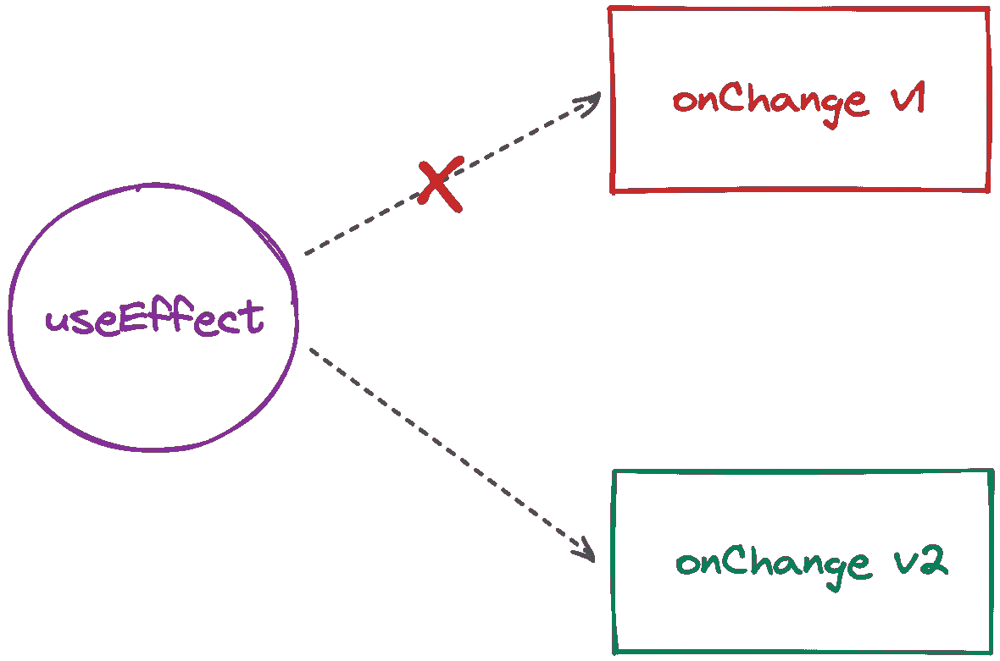

# 关于 React 中的效果，你应该知道的一切

> 原文：<https://javascript.plainenglish.io/everything-you-should-know-about-effects-in-react-6d824549f598?source=collection_archive---------3----------------------->

## 关于如何应对 React 效应的思考？你可能没听说过的技巧和诀窍。

Image by [Omkar Jadhav](https://unsplash.com/@jadhav24omkar) from [Unsplash](https://unsplash.com/photos/s5xNLPMxHZU)

这不是一个关于反应效果如何在引擎盖下工作的教程。本文的主要目的是简明地描述最佳实践、技巧和诀窍。如果您需要 React 效果/挂钩如何工作的详细信息，您可能会发现以下链接很有用:

*   [StackOverflow 线程关于 React 钩子](https://stackoverflow.com/questions/53729917/react-hooks-whats-happening-under-the-hood)
*   [关于 Eliav Louski 的 React hooks 的精彩阅读](https://eliav2.github.io/how-react-hooks-work/)
*   [关于](https://overreacted.io/how-does-setstate-know-what-to-do/) `[useState](https://overreacted.io/how-does-setstate-know-what-to-do/)` [的论文由丹·阿布拉莫夫](https://overreacted.io/how-does-setstate-know-what-to-do/)

# 关于一般反应效果

你可能已经看到了关于 React 是否遵循[反应式编程](https://gist.github.com/staltz/868e7e9bc2a7b8c1f754)原则的讨论。这里长话短说，我现在就来回答。 [React 不遵循](https://dev.to/this-is-learning/how-react-isn-t-reactive-and-why-you-shouldn-t-care-152m)基本反应式编程原则。但同时，我们可以说 [React 是](https://stackoverflow.com/questions/71855096/reactive-programming-in-react)的“反应性”。这里的要点是“反应式编程”和“反应式”是不一样的。更多详情可在[这里](https://gist.github.com/sw-yx/9bf1fad03185613a4c19ef5352d90a09)找到。

我从反应性开始这一部分，因为理解反应的效果很重要。本质上，由于反应性，效果是可能的。

让我们来看看下面这段简单的代码:

Code Snippet 1

让我们试着一行一行地理解这段代码做了什么。

*   1 —这是状态块定义。我们希望有一个动态的、可观察的`counter`值。可通过`setCounter`功能改变。但是如何观察它的变化呢？
*   2-为了观察 React 中的可变值，我们可以使用`useEffect`钩子。即，当`counter`值改变时，回调被调用。这是 React 如何处理引擎盖下的这个。
*   这就是我们如何安排可观察实体的变化。同样，我们还需要一个`useEffect`来设置它。为什么？这是因为 React 渲染的方式。正如你所看到的，依赖列表在这里是空的，这意味着这个动作只发生一次，后续的渲染不会再次触发它。当调用间隔回调时，`counter`被更新，然后调用效果回调(2)，并重新开始。
*   4 —我们不想渲染任何内容。然后`null`又回来了。

实际上，说`counter`是一个可观测值是不正确的。根本看不到！我们可以看到它的变化，这要归功于 React 渲染内部机制(参见上面的参考资料)。那么，如何用简单的词语描述 React 效应项呢？让我们试试。

*React Effect 是一种安排值的变化，然后观察这种变化并对其做出反应的机制。*

再一次关于反应性。

*React 效果不遵循反应式编程的基本原则。主要区别在于实现细节。但是我们可以认为这种影响依赖于一种特殊类型的反应。*

# 使用 ESLint 验证依赖性

我鼓励你使用 ESLint 来验证你(和你的队友)的代码。你的 ESLint 配置质量的最好指标是你如何进行代码审查。如果您只需要检查业务逻辑和模式，这是一个高质量的 ESLint 配置。但是如果你总是被迫检查代码风格，这样的配置肯定应该改进…

有一堆标准的 ESLint 规则你可以开箱即用。但最有可能的是，它们不足以满足快速增长的项目。然后 [ESLint 插件](https://github.com/dustinspecker/awesome-eslint)登场。这个话题值得单独一篇文章来详细描述。现在我们只对`[eslint-plugin-react-hooks](https://www.npmjs.com/package/eslint-plugin-react-hooks)`插件感兴趣。它迫使你和你的团队遵循钩子的规则。

有多种方法可以禁用 ESLint 规则。有很多情况下，开发人员认为他真的知道他的代码应该如何工作，而不想遵循钩子的规则。在这种情况下，开发人员很可能会做以下事情。

Code Snippet 2

只要记住以下几点:

*如果你不想遵循钩子的规则，这并不意味着你更了解你的代码。这意味着你不明白反应效果如何工作，只是试图侵入系统！*

下面我们将看看像`useComponentDidMount`这样丑陋的钩子。在大多数情况下，他们使用这样的禁用语句。这也是为什么这些钩子只是黑客的另一个原因。

下面我们将看到我们如何有一个合法的变通办法，避免使用 deps 列表中的一些依赖项。

# 逮到你了

React 的反应系统基于这样一种方法，即开发者知道什么依赖关系应该触发一个效果。而且有些问题是`eslint-plugin-react-hooks`无法检查的。

## 1.定制钩子中的记忆函数

让我们看看下面的例子。想象我们遵循了钩子的所有规则。

Code Snippet 3

你看到这里的问题了吗？让我描述一下。问题出在`incrementCounter`函数上。`component`在`useEffect`的 deps 列表中使用它。但是这个功能在`useCounter`自定义挂钩中没有记忆。这意味着`Component`的每一次渲染都会生成一个对`incrementCounter`函数的新引用，并导致一个效果再次发生！

实际上，这在这里不是一个大问题，因为我们关心的是事件，并在消除效果之前清除间隔。这是我希望你永远记住的一件重要的事情。

*始终清除* `*useEffect*` *s 中的事件。避免这一点会导致难以修复的问题。*

解决这个问题的唯一合法选择是在`useCounter`钩子中记忆`incrementCounter`函数。

Code Snippet 4

## 2.小心输入函数

这种情况并不明显。我面临着一大堆与之相关的问题，这些问题很难抓住。让我们来看看吧。

Code Snippet 5

存在与前一个例子相同的问题。当`Component`呈现时，生成一个到内联函数(`*`)的新链接。然后在`useCounter`自定义钩子中造成意外效果。

有两种方法可以修复它。第一种方法是去掉内联函数并记忆它。

Code Snippet 6

这很好。但是我不喜欢这种方法，因为这有点冗长。

*   你总是被迫去记忆输入函数。
*   你要确定每个人都会做这个记忆化，这是最大的问题。

让我告诉你第二种方法。这是一个合法的变通办法，允许摆脱依赖，仍然符合钩子的规则。请小心使用这种方法，只有在没有其他方法解决问题时才使用它。

Code Snippet 7

让我们一行一行地研究这段代码。

*   1 —我们将输入函数保存为反应参考。这是访问该功能的合法方式，并且不会被强制在 deps 列表中指定。
*   2 —这是这种方法的重要组成部分。当输入函数改变时，我们应该更新对输入函数的引用。
*   3 —然后，当我们想要使用输入函数(`onChange`)时，我们使用对它的引用来代替(`onChangeRef.current`)。
*   4 —现在，由于我们在幕后使用 React Ref，输入函数的记忆是多余的，我们可以自由地内联它。

看起来不错。对吗？

你可能会问这个地狱实际上是如何运作的。有一个简单的原则。JavaScript 中的函数是对象。然后，当我们将内联函数作为参数传递时，我们实际上传递的是对函数的引用，而不是函数本身。当参考更新时，`useEffect`只使用更新的输入功能。

如果你不知道这个概念，推荐你看看[这一页](https://javascript.info/object-copy)。如果你很着急，下图描述了这一点。

Picture 1\. Dynamic reference to the function

# 关于类组件生命周期方法的思考

我猜你有一些使用 React 类组件的经验。有一套[生命周期方法](https://reactjs.org/docs/react-component.html#the-component-lifecycle)。(你可能会发现这张图也很有用。)有时候开发人员喜欢混合功能组件和类组件的生命周期原则。我指的是像`useComponentDidMount`、`useComponentWillUnmount`等定制挂钩。

我对这种混合原则进行了很多讨论。此外，我想了很多，并试图为自己创造一个明确的理由，无论这是正确的还是错误的。甚至试图说服我这是好的，因为这样的代码在大多数情况下工作良好。

Emm…在某些边缘情况下，这种混合可能是有用的。如果应用程序有规则认为这是一种可接受的建筑效果方法，这肯定会工作得很好。但是我仍然认为这样的代码是丑陋的，并且违反了 React 的反应原则！如果您不是一个熟练的 React 黑客，甚至会导致难以重现的问题。

让我们试着理解出了什么问题。

首先，正如我们上面已经讨论过的，在大多数情况下，这样的解决方案不遵循钩子的规则。这意味着反应性被破坏了——它只能半正确地工作，并导致难以修复的错误。

但是你可能会说 React Refs 有一个合法的解决方法，我们可以用它来构建这些定制的钩子！你说得对。但这并不能改变很多事情。无论你使用合法或非合法的解决方案，这种反应仍然是被破坏的。

其次，这是一个巨大的误解，混淆了这两个不同的世界:基于类和基于函数的组件。当 React 团队在几年前设计类组件时，这是过去几天可以接受的解决方案。但是现在我们生活在一个完全不同的世界。前端正慢慢转向功能概念，因为它们允许构建更可靠的运行时和高性能的解决方案。由于这个原因，React 团队被迫引入一种更现代的描述组件的方式——功能组件。

试着在你的脑海中构建这个画面。React 为您提供了一个比旧的基于类的组件更加灵活和强大的现代 API。你仍然不能重建你的思想，继续使用过时的概念。你明白我的意思吗？

不要再坚持围绕基于类的组件构建的旧的 React 概念。刷新您的思维，构建基于效果的 React 应用程序！并且没有强迫性的尝试去入侵系统和引入像`useComponentDidMount`这样丑陋的自定义 API。

# 为什么我们要析构函数

我还想和你讨论一个话题。这和钩子的规则有关。如果你已经使用过`eslint-plugin-react-hooks`，你可能会遇到钩子的规则不允许你直接使用“道具”的功能的情况(比如`props.onChange`)。在将它添加到 deps 列表之前，您总是被迫析构它。在大多数情况下，开发人员只需使用 ESLint disabling 语句来禁用此警告。这是错误的。

这段代码违反了钩子的规则:

Code Snippet 8

这个代码符合钩子的规则:

Code Snippet 9

让我们试着理解为什么钩子的规则强迫我们在将函数添加到 deps 列表之前，从“props”中析构函数。你可以在 React 问题讨论中找到[的最佳答案，其中](https://github.com/facebook/react/issues/16265#issuecomment-517518539)[丹·阿布拉莫夫](https://medium.com/u/a3a8af6addc1?source=post_page-----6d824549f598--------------------------------)详细描述了这个问题。

我强烈推荐阅读该讨论。但是如果你想快速浏览一下，我可以给你一个简短的回答。

问题在于纯度。React 希望在 deps 列表中看到纯函数。不能认为`props.onChange()`调用是纯调用，因为`props`对象是`onChange`的`this`。

但是为什么重要呢？这是因为变化应该是可以观察到的。还记得我们上面关于反应性的讨论吗？

其实就是这样！关于反应效果有很多有趣的事情要说。但它们是下一篇论文的主题。希望你喜欢这次阅读。

*更多内容看* [***说白了。报名参加我们的***](https://plainenglish.io/) **[***免费周报***](http://newsletter.plainenglish.io/) *。关注我们关于*[***Twitter***](https://twitter.com/inPlainEngHQ)**和*[***LinkedIn***](https://www.linkedin.com/company/inplainenglish/)*。查看我们的* [***社区不和谐***](https://discord.gg/GtDtUAvyhW) *加入我们的* [***人才集体***](https://inplainenglish.pallet.com/talent/welcome) *。****