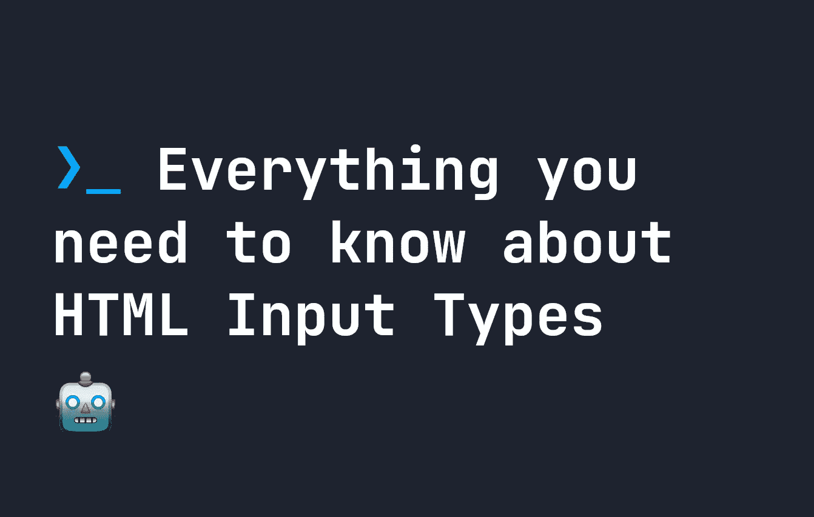

# 关于 HTML 输入类型你需要知道的一切

> 原文：<https://javascript.plainenglish.io/everything-youll-ever-need-to-know-about-html-input-types-af4b376161d2?source=collection_archive---------12----------------------->

## 在构建应用程序时，我们每天都在使用输入，所以这里是你需要知道的关于 HTML 输入类型的一切。



几乎我们使用 HTML 开发的每个应用程序都在某个地方使用了`input`,但是有很多输入`type`你可能不知道。所以让我们来看看你可能不知道的关于`input`类型的一切。

# 常见的 HTML 输入类型

在 HTML 中，我们可以给输入一个特定的类型。例如，一个简单的`text`输入，用户可以在框中键入文本，如下所示:

```
<input type="text" />
```

我们最常用的输入类型是:

*   `hidden` -隐藏的表单输入，通常用于存储用户不需要看到的值
*   `text` -简单的文本输入。
*   `password` -文本用星号标出的输入，因为它是一个密码。
*   `submit` -用于提交表单的提交按钮。
*   `button` -像一个提交，但它不提交表单！
*   `radio` -可从一系列列表项目中选择的按钮。
*   `checkbox` -一组可以勾选和取消勾选的按钮。

以及这些基本类型:

*   还有`search`——虽然没那么常用，但是可以用于搜索输入栏，当你输入的时候会显示一个小十字。
*   我们还有`reset`，它创建了一个不提交表单的按钮，并显示`reset`。它将重置所有其他表单元素。

这些常见的`input`类型到处都是，它们看起来像这样:

# 带有类型验证的基本 HTML 输入

除了这些简单的类型之外，还有一些非常有用的类型，例如:

*   `tel` -用于电话号码。
*   `url` -验证输入是一个 URL。
*   `email` -验证输入是电子邮件。
*   `number` -验证输入是一个数字。
*   `range` -验证输入是一个范围。

**注意**:这些输入类型确实在客户端验证输入，但是它不应该被用作确保输入只包含该类型的方法。例如，`email`只接受电子邮件类型，但是用户可以很容易地改变前端来提交不是`email`的东西。所以确保你也在后台检查。

# 日期 HTML 输入类型

我们大多数人都熟悉`type="date"`，但是 HTML 输入有很多日期类型，包括:

*   `date` -任意日期输入。
*   `month` -选择一个月。
*   `week` -选择一个星期。
*   `time` -让您选择特定的时间。
*   `datetime-local` -选择日期/时间组合。

每一个都显示如下。这些非常有用，尽管仅限于浏览器的 UI 实现:

# 其他超文本标记语言输入类型

除了所有这些，我们还有以下附加类型:

*   `file` -用于向服务器上传文件。
*   `image` -最奇怪的是，对于图形提交按钮！

# 输入的文件类型

输入的文件类型创建文件上传界面:

```
<input type="file" />
```

# 输入的图像类型

这可能是您最不可能使用的一个。它允许您为输入赋予一个`src`和`alt`属性，该属性用作表单的提交按钮-最终使您的输入表现得像一个图像:

```
<input type="image" alt="Login" src="login-button.png" />
```

# 结论

这涵盖了您今天可以使用的每一种 HTML 输入类型。我希望你已经学到了一些新东西，即使它只是古怪的`type="image"`输入类型。如果你想了解更多关于网络开发的信息，你可以在[推特](https://twitter.com/smpnjn)上关注我，或者查看 [Fjolt](https://fjolt.com/) 。

*更内容于*[](https://plainenglish.io/)**。为我们报名* [***免费周报***](http://newsletter.plainenglish.io/) *。在* [***推特***](https://twitter.com/inPlainEngHQ)[***领英***](https://www.linkedin.com/company/inplainenglish/) *，以及*[**T51**](https://discord.gg/GtDtUAvyhW)*上追随我们。**