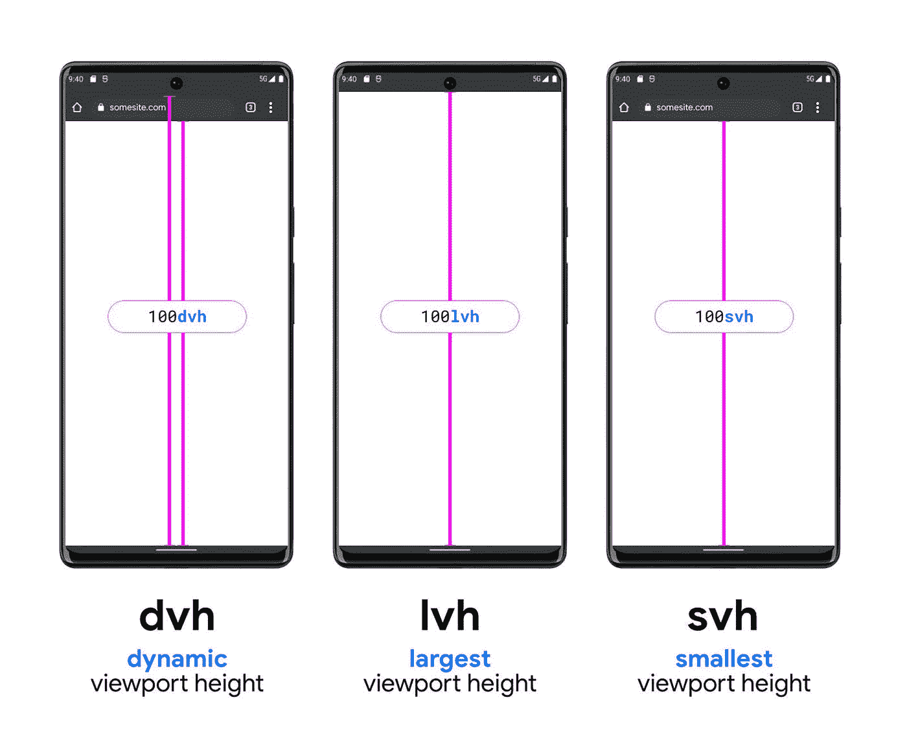
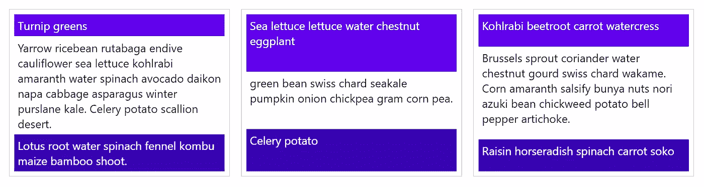
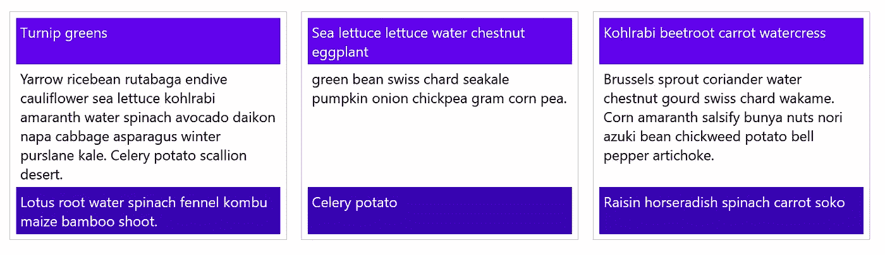

# 2022 年激动人心的 CSS 新特性

> 原文：<https://javascript.plainenglish.io/exciting-new-css-features-in-2022-8a054342a9f8?source=collection_archive---------2----------------------->

## 未来几个月，所有主流浏览器都将推出许多新功能。


Photo by [Callum Hill](https://unsplash.com/@inkyhills?utm_source=medium&utm_medium=referral) on [Unsplash](https://unsplash.com?utm_source=medium&utm_medium=referral)

所有主流浏览器都同意在 2022 年实现一组特定的功能。所谓的“互操作 2022”的进展可以在这里追踪:【https://wpt.fyi/interop-2022?stable】T2。我会告诉你我最期待的将在 Interop 2022 期间登陆的功能。

## 一个新的 HTML 标签:对话框元素

我已经就此写了一篇文章；您可以在这里找到它:

[](https://towardsdev.com/you-can-finally-make-use-of-the-html-dialog-element-f4b7c591b1b6) [## 您终于可以使用 HTML 对话框元素了

### 新的 safari 版本现在支持它！

towardsdev.com](https://towardsdev.com/you-can-finally-make-use-of-the-html-dialog-element-f4b7c591b1b6) 

TLDR；我们有一个新功能，将帮助我们所有人。在大多数项目中，我们必须实现一个模型。通常，我们会使用一个 div，并向它添加一些打开/关闭逻辑。这已经成为一种非常普遍的模式，因此我们为它提供了一个新元素:对话框。在这里看到浏览器支持:【https://caniuse.com/?search=dialog】T4。现在适应真的很好；请记住，Safari 仅从 15.4 版本开始支持它。

## 新视口单位

如果你曾经编写过跨平台的移动 web 应用程序，那么你就知道其中的艰难。用户的实际视口高度是多少？消失的地址栏、软键盘和其他怪异的行为(安全区……)让我们陷入绝望。但是不要害怕，我的开发伙伴。终于有希望了！请看新的视口单位:dvh、lvh 和 svh。



[https://twitter.com/jensimmons/status/1499441043930062854](https://twitter.com/jensimmons/status/1499441043930062854)

图像是不言自明的。我认为 dvh 将是一个生命的救星。可惜还没有登陆 Chrome:[https://caniuse.com/?search=dvh](https://caniuse.com/?search=dvh)

## CSS 子网格

我喜欢网格显示类型得到越来越多的关注。它一直处于 flexboxes 的阴影之下。然而，如果使用得当，它会更加强大。

在做评论的时候，我经常被问到这个问题:“什么时候使用 flex 还是 grid？”
我已经在另一篇关于 RAM 布局模式的文章中回答了这个问题。TLDR；柔性盒用于一维布局；网格用于二维布局。有时候就是这么简单！

[](https://towardsdev.com/ram-css-layout-pattern-38d2a9c090fc) [## RAM — CSS 布局模式

### 了解 RAM 布局模式。

towardsdev.com](https://towardsdev.com/ram-css-layout-pattern-38d2a9c090fc) 

众所周知，使用 CSS 网格很难解决两个问题。

第一个是砖石网格。不幸的是，用纯 CSS 解决方案来实现它们是不可能的，而且这种情况也不会很快改变。

第二个是处理子网格，即网格中的网格。考虑下面的例子(web.dev 的原始例子)

如果它在你的浏览器上看起来像这样，那么你可能正在使用 Chrome 或 Safari:



The web.dev Codepen without CSS subgrid support

当使用支持 CSS 子网格的浏览器(比如 Firefox)时，应该是这样的



The web.dev Codepen with CSS subgrid support

如你所见，这是一个救命稻草！在 CSS 中，让各个列的布局具有相同的高度仍然很难做到。下面是当前浏览器支持:【https://caniuse.com/?search=subgrid T3

## CSS 级颜色函数

您现在将要了解的功能可能没有我向您展示的其他功能有用。但是我肯定也能找到这个的一些用例！

今年 CSS 至少增加了两个新的颜色函数，我最期待的是`color-mix`。下面是语法:

```
div {
  background-color: color-mix(in hsl, red 50%, yellow 50%);
}
```

`color-mix`期望第一个参数是颜色空间(如 RGB、hsl、lch 或 oklch)。第二个和第三个参数是颜色及其百分比。结果将是一个混合的颜色，在你想要的颜色空间中有给定的份额。

如果你想了解更多关于这个特性的信息，这是 https://drafts.csswg.org/css-color-5/[的官方规格](https://drafts.csswg.org/css-color-5/)

你可以使用 Firefox nightly 或者 Safari beta:[https://caniuse.com/?search=color-mix](https://caniuse.com/?search=color-mix)

## 级联层

最后但同样重要的是:级联层，当然。我现在提到它们是因为它们已经跨浏览器登陆了，并且你可能已经看到了它们的运行(例如，当使用 Tailwind 的时候)。

基本语法如下:

```
@layer name {
  /* rules */
}
```

因此，这将是一个有效的级联层:

```
@layer utilities {
  .padding-sm {
    padding: .5rem;
  }

  .padding-lg {
    padding: .8rem;
  }
}
```

(来自 MDN 的示例)

图层是一个复杂的话题。如果您想了解更多，请阅读 MDN 文档(我将在下面提供链接)。不过，我会给你 TLDR；您可以定义多个层。它们的定义顺序很重要。因此，最后定义的层中的规则是最重要的。因此，它们优先。这可以帮助你解决特殊性问题。

继续读:[https://developer.mozilla.org/en-US/docs/Web/CSS/@layer](https://developer.mozilla.org/en-US/docs/Web/CSS/@layer)

就这些了，伙计们！

感谢您的阅读；关注我，了解最新的网络平台特性！

*更多内容请看*[***plain English . io***](https://plainenglish.io/)*。报名参加我们的* [***免费周报***](http://newsletter.plainenglish.io/) *。关注我们关于*[***Twitter***](https://twitter.com/inPlainEngHQ)*和*[***LinkedIn***](https://www.linkedin.com/company/inplainenglish/)*。查看我们的* [***社区不和谐***](https://discord.gg/GtDtUAvyhW) *加入我们的* [***人才集体***](https://inplainenglish.pallet.com/talent/welcome) *。*