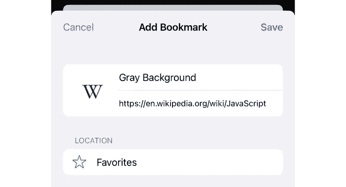
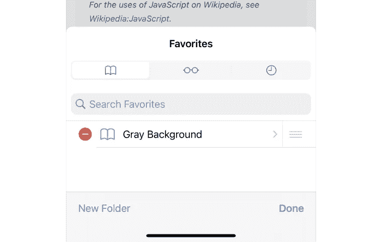
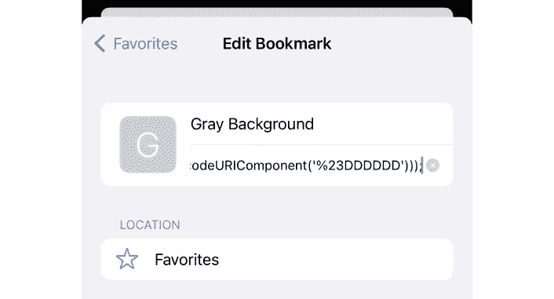
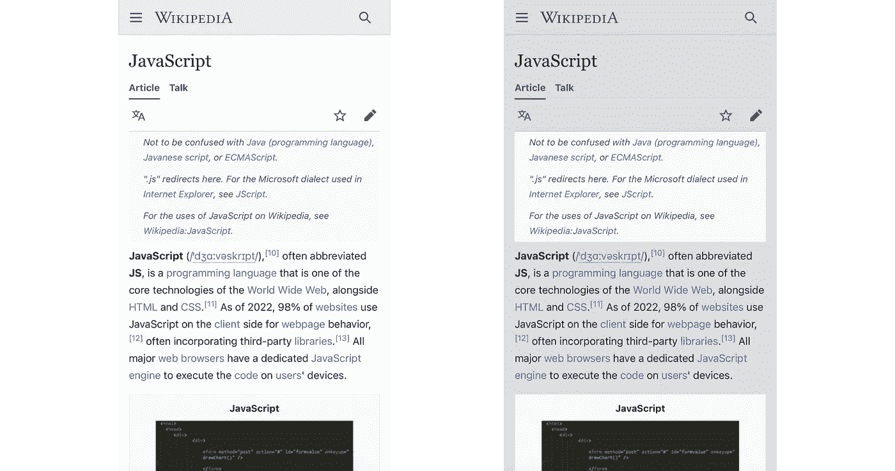

# 无需开发人员工具，即可在移动浏览器上执行自定义 JavaScript

> 原文：<https://javascript.plainenglish.io/execute-custom-javascript-on-mobile-browsers-without-developer-tools-dda075feba95?source=collection_archive---------6----------------------->

## 使用书签在网站上执行定制的 JavaScript 代码，并在您的移动浏览器上向网站注入定制的 cookies。


Photo by [Martin Sanchez](https://unsplash.com/@martinsanchez) on Unsplash

如今，大多数现代浏览器都支持开发者工具功能，这使我们能够通过控制台分析网页并在这些页面上运行定制的 JavaScript。

然而，几乎所有的移动浏览器都缺少这一功能。如果我们想在我们的移动设备上执行自定义 JavaScript，我们将不得不使用另一个看似无关的浏览器功能:书签。

在这一系列文章中，我将向您展示如何使用书签在网站上执行自定义 JavaScript 代码，以及如何使用书签在移动浏览器上将自定义 cookies 注入网站。我们开始吧！

# 制作和编辑我们的书签

从添加书签开始。根据您使用的浏览器，方法会有所不同；我将使用 Safari 浏览本教程。在您选择的任何网页上按下“共享”按钮，然后选择“添加书签”。给书签和适当的名称，然后按“保存”。



Adding the bookmark

您将它添加到哪个页面并不重要，因为为了执行我们的 JavaScript 代码，我们将更改书签的地址属性。

完成所有这些后，按下“Book”按钮，导航到书签所在的位置。在右下角，你会发现一个写着“编辑”的按钮。单击它并选择您刚刚创建的书签。



Editing the bookmark

现在是有趣的部分！在书签的地址栏中，输入`javascript:`,然后输入您想要执行的 JavaScript。

# 代码语法

现在，代码的语法将变得非常重要:您放入该字段的字符必须都是 URL 可以包含的字符。这意味着没有空格，没有换行符，没有括号，没有花括号，没有双引号，等等。

要解决这个问题，我们可以遵循新的语法规则，用逗号替换分号，用圆括号替换大括号等等，或者我们可以在将代码放入书签的地址部分之前，简单地通过 encodeURIComponent 函数运行代码。

例如，`alert("Hello world?!");`可以写成`alert(decodeURIComponent('Hello%20World%3F!'));`，也可以写成`alert(%22Hello%20world%3F!%22)%3B`。无论你喜欢哪一个。

如果您使用 Safari，您可以简单地将整个 JavaScript 代码粘贴为一行(确保在必要时使用分号)，当您按下 save 时，Safari 会自动为您格式化。

# JavaScript 代码示例

我将把下面这段代码存储在我的书签中:

```
javascript:tagNames='main---header---footer---body'.split('---');for(i=0;i!=4;i++)(element=document.getElementsByTagName(tagNames.at(i)).item(0),element&&(element.style.backgroundColor=decodeURIComponent('%23DDDDDD')));
```

看起来有点混乱，但这是格式化后的版本:

```
javascript:
tagNames = 'main---header---footer---body'.split('---');
for(i = 0; i != 4; i++) (
    element = document.getElementsByTagName(tagNames.at(i)).item(0),
    element && (
        element.style.backgroundColor = 
            decodeURIComponent('%23DDDDDD')
    )
);
```

当您执行代码时，它将选择它在页面上遇到的第一个`main`、`header`、`footer`和`body`元素，如果它存在，则将背景颜色设置为漂亮的灰色。如果你遇到一个很长的网页，它只支持纯白背景的光线模式，这对于保护你的眼睛和电池寿命都很方便。



Inserting the code

你可以在这里看到之前和之后:



当然，现在你可以做的不仅仅是改变一些背景颜色。如果屏蔽掉特定的元素，就可以修改 DOM 树的整个部分。您甚至可以发送请求和设置定制 cookies，后者我们将在本系列的下一篇文章中探讨。

敬请期待！

*更多内容看* [***说白了就是***](https://plainenglish.io/) *。报名参加我们的* [***免费周报***](http://newsletter.plainenglish.io/) *。关注我们关于* [***推特***](https://twitter.com/inPlainEngHQ) ， [***领英***](https://www.linkedin.com/company/inplainenglish/) *，*[***YouTube***](https://www.youtube.com/channel/UCtipWUghju290NWcn8jhyAw)*，以及* [***不和***](https://discord.gg/GtDtUAvyhW) *。*