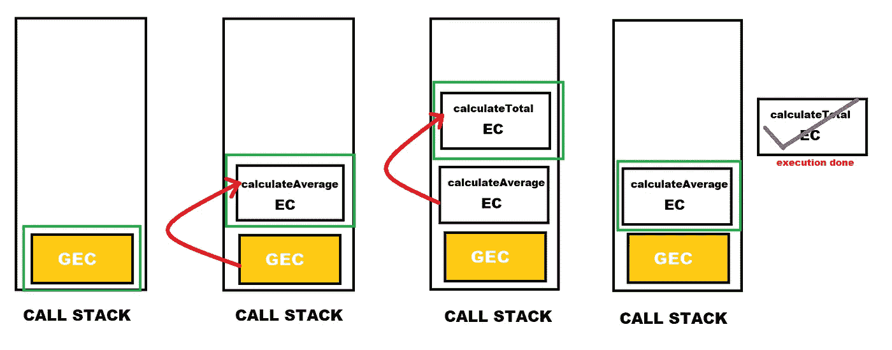

# JavaScript 中的执行上下文

> 原文：<https://javascript.plainenglish.io/execution-context-in-javascript-abe424d000b?source=collection_archive---------7----------------------->

## JavaScript 中的执行上下文是什么？执行上下文(EC)是一段代码执行的环境。

要理解 JavaScript 的工作原理，首先需要理解执行上下文，因为 JavaScript 中发生的所有事情都发生在执行上下文中。

The above image is created by Divyojyoti Ghosh(me) on [www.canva.com](http://www.canva.com/) using different elements available for making designs.

# 基本概述

执行上下文(EC)是一段代码执行的环境，它保存这段代码执行的所有必要信息。

执行上下文包含三个要素—

1.  变量环境- let、const 和 var 声明、函数和参数对象
2.  范围链
3.  这个关键字

代码编译完成后，JavaScript 引擎会为顶层代码(不在任何函数中的代码)创建一个全局执行上下文(GEC)。顶层代码的执行从 GEC 内部开始，每当一行代码调用一个函数时，就会创建该函数的执行代码。只有一个全局执行上下文，但是每个函数调用都有自己的执行上下文。

# 执行上下文中的阶段

在执行环境中基本上有两个阶段——

1.  创建阶段
2.  执行阶段

我们也可以这样理解，执行上下文有两个部分:内存(可变环境)和代码(执行线程)。

在第一阶段，即创建阶段，所有变量都存储在变量环境或内存中。函数之外的变量被赋予一个未定义的**，而函数的变量保存各自函数的文字代码**。****

****在下一个阶段，开始执行代码。由于 Javascript 是一种同步单线程语言，代码的执行是以特定的顺序一次执行一条语句。****

****我将使用下面的代码片段来进一步解释执行上下文中的各个阶段。****

****在编译完上面的代码后，全局执行上下文将被创建，如上所述，执行上下文有两个阶段创建和线程执行。****

## ****创建阶段****

****在**创建阶段**，顶层代码中的所有变量都将存储在变量环境中。函数以外的变量，即`name`、`marksInMaths`、`marksInScience`、`marksInEnglish`、`marksInArts`、`averageMarks`被赋予一个**未定义的**，而函数的变量，即`calculateAverageMarks`、`calculateTotalMarks`保存各自的函数。****

********

****The variable environment in the Creation Phase****

## ****执行阶段****

****在下一阶段，代码开始从上到下一次执行一条语句，只有函数不被执行，因为函数只有在任何语句调用它们时才被执行。所以，如果我们再次看到代码，第 18 行直接在第 5 行之后执行。****

****在执行过程中，变量的值会根据代码中的语句在变量环境中发生变化。因此，对于第 1 行，即`const name = "Joy"`，名称的值从未定义变为`"Joy"`，类似地，所有的值都变了。****

## ****执行线程—为被调用的函数创建新的执行上下文****

****当第 18 行被执行时，即`const averageMarks = calculateAverageMarks(marksInMaths, marksInScience,... );`，为被调用的函数`calculateAverageMarks()`创建一个新的执行上下文。由于 JavaScript 只有一个执行线程，一次只能执行一个执行上下文(EC ),因此前一个 EC(即 GEC)的执行会停止，而新 EC 的执行会开始。****

********

****新的执行上下文也有与 GEC 相同的两个阶段。在这个函数的执行阶段，当行`const totalMarks = calculateTotalMarks(maths, science, english, arts);`被执行时，一个新的执行上下文被创建。一旦 calculatTotalMarks()阶段的两个阶段结束，**该函数的返回值被发送到调用它的执行上下文**，即 calculateAverageMarks()，并且该值被保存在该执行上下文的变量环境中( **totalMarks** 的值从未定义的初始值变为返回值),并且该 EC 的执行继续返回该值。****

********

****类似地，一旦 calculateAverageMarks()函数的所有行的执行完成，返回值将替换全局执行上下文的变量环境中的 AverageMarks 变量的值，并且 GEC 的执行将从之前停止的位置继续。****

# ****调用栈****

****对于上面有两个调用函数的代码片段，创建了两个执行上下文(每个上下文一个)以及一个全局执行上下文。这意味着对于现实生活中的应用程序，每个应用程序都有数百个执行上下文(EC)。但是如何管理执行上下文的顺序呢？这由 JavaScript 引擎中的调用堆栈来管理。****

****调用堆栈跟踪执行上下文。一旦调用了一个函数，就会为它创建一个新的 EC，并将其推到调用堆栈的顶部，位于顶部的 EC 控制着执行，它的执行首先发生。****

********

****The sequence of execution in the call stack****

****并且一旦该 EC 的执行结束，就从堆栈中移除该 EC，并且控制返回到前一个 EC。****

********

****EC that gets executed is removed from the call stack****

****调用栈通过管理整个执行线程，在 JavaScript 引擎中扮演着重要的角色。****

# ****摘要****

****执行上下文(EC)是一段代码执行的环境。为应用程序创建单个全局执行上下文，并创建多个执行上下文(每个函数调用一个)。在执行上下文中基本上有两个阶段，创建阶段和执行阶段。对于每个函数调用，都会创建一个新的 EC，并且控制转移到新的 EC，一旦该 EC 的执行结束，控制就转移到前一个 EC。这种控制和执行的转换顺序是由调用堆栈管理的。****

# ****资源****

****[https://www.udemy.com/course/the-complete-javascript-course](https://www.udemy.com/course/the-complete-javascript-course)****

**** [## 发现要点

### 你好。在本文档中，我们将介绍如何在一个…

gist.github.com](https://gist.github.com/)**** 

*****更多内容看* [***说白了。报名参加我们的***](https://plainenglish.io/) **[***免费周报***](http://newsletter.plainenglish.io/) *。关注我们关于* [***推特***](https://twitter.com/inPlainEngHQ)[***LinkedIn***](https://www.linkedin.com/company/inplainenglish/)*[***YouTube***](https://www.youtube.com/channel/UCtipWUghju290NWcn8jhyAw)*[***不和***](https://discord.gg/GtDtUAvyhW) *。对增长黑客感兴趣？检查* [***电路***](https://circuit.ooo/) *。*********