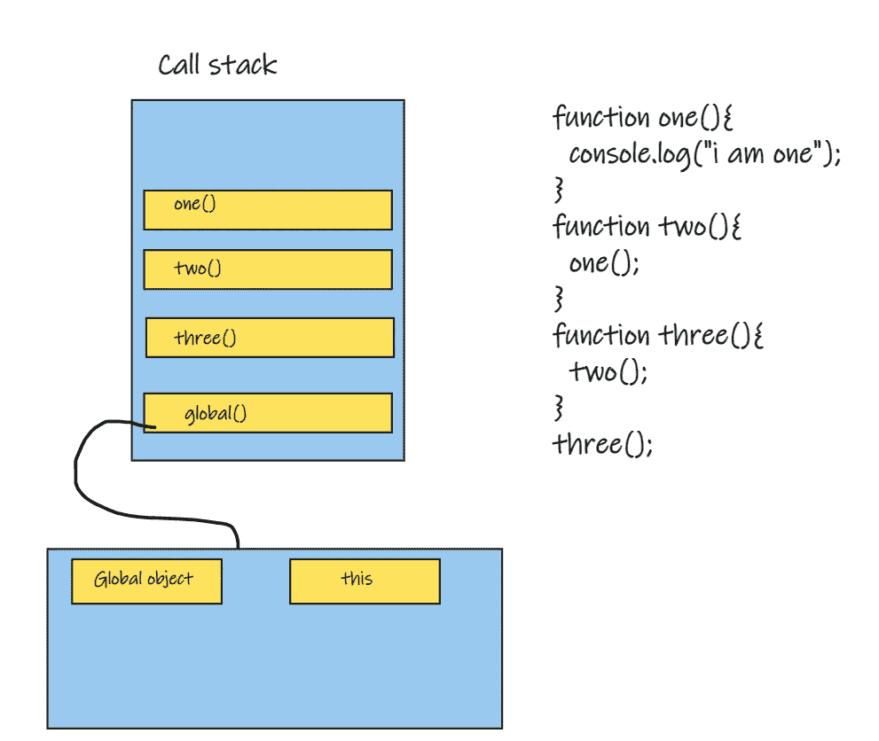
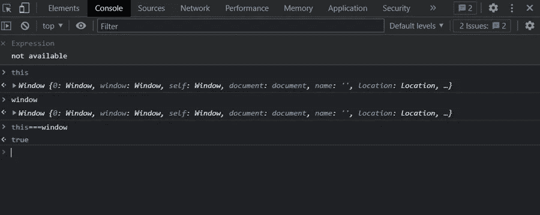
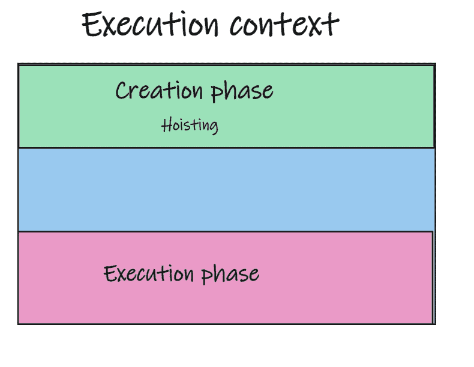
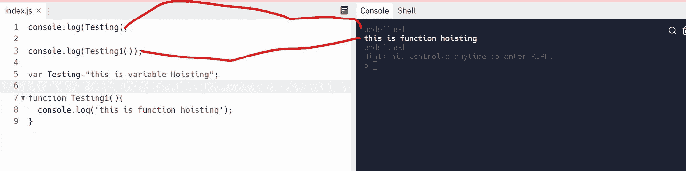
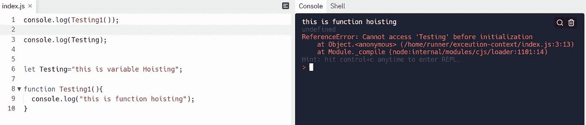

# JavaScript 中的执行上下文、词法环境和提升:为初学者解释

> 原文：<https://javascript.plainenglish.io/execution-context-lexical-environment-hoisting-explained-for-complete-beginners-with-some-7dd726ddc35d?source=collection_archive---------8----------------------->

## 以及一些面试问题。

Photo by [Clément Hélardot](https://unsplash.com/@clemhlrdt?utm_source=medium&utm_medium=referral) on [Unsplash](https://unsplash.com?utm_source=medium&utm_medium=referral)

如果你一直在研究 JavaScript 如何工作，你可能已经听说过 JavaScript 中的“执行上下文”、“词法环境”和“提升”。理解这些主题可以帮助您编写更好的代码，并防止在下一个 web 应用程序中出现不希望的情况。

# **执行上下文**

它是一个允许 JavaScript 代码执行的环境。在执行上下文期间，指定的代码被**逐行解析**，变量和函数被存储在内存中。每次我们调用一个函数时，都会为要执行的函数创建一个执行上下文。

global object and call stack

**全局对象:**每当脚本文件运行时，调用栈开始填充函数，每个函数都有自己的执行上下文。但是 JavaScript 引擎读取的第一个函数不会是调用堆栈中的第一项。填充堆栈的第一项是由浏览器创建的全局执行上下文，它有两个对象来表示浏览器窗口对象——第一个是一个**全局对象(window)** ，另一个是“**this”**，这两个对象彼此相等。

**this** and **window** objects

# **词汇环境**

正如我们前面提到的，每次 JavaScript 代码开始运行时，调用栈开始填充函数，每个函数都有自己的执行上下文。每当 JavaScript 引擎创建一个执行上下文时，都会为该函数创建一个新的词法环境，以便在该函数执行期间存储该函数中定义的变量。

Lexical environment

执行上下文的创建分两个阶段进行:

**1。创建阶段:**创建阶段在执行上下文被创建时开始，但是在代码运行之前，执行阶段开始填充信息。

**2。执行阶段:**在执行阶段，JavaScript 遍历代码并开始执行。

# **吊装**

它是在编译阶段将变量和函数移动到其环境(作用域)顶部的行为。

**函数:**函数声明全部提升。

**变量:**变量是部分吊起。

让我们更好地理解上面的定义:

正如我们之前提到的，用**“var”**关键字声明的变量被部分提升，这意味着 JavaScript 引擎提升的变量不是实际值，而是**“未定义”。**函数被完全提升，这意味着 JavaScript 引擎在创建阶段为函数声明分配内存。用 **let** 和 **const** 声明的变量也被提升，但与 **var** 不同，在创建阶段不会用默认值初始化，并且会抛出异常。

# **吊装面试问题:**

1.什么是吊装，它是如何工作的？

2.变量和函数提升的区别？

3.JavaScript 是唯一使用提升的语言吗？

4.猜测产量。

5.猜测产量。

6.猜测产量。

> 我是一名自由职业的全栈 web 开发人员和技术作家，请随时联系我🤓

**在 LinkedIn 上关注我:**

 [## 阿里·穆斯塔法-网络开发者-自由职业者| LinkedIn

### 查看阿里穆斯塔法在全球最大的职业社区 LinkedIn 上的个人资料。阿里有 4 个工作列在他们的…

www.linkedin.com](https://www.linkedin.com/in/ali-mustafa-195a321a0/) 

**在 GitHub 上关注我:**

 [## Ali11Mustafa -概述

### 热情，自我驱动，注重细节，有强烈的野心和动力按时开发软件解决方案

github.com](https://github.com/Ali11Mustafa) 

*更多内容请看* [***说白了就是***](https://plainenglish.io/) *。报名参加我们的* [***免费每周简讯***](http://newsletter.plainenglish.io/) *。关注我们*[***Twitter***](https://twitter.com/inPlainEngHQ)*和*[***LinkedIn***](https://www.linkedin.com/company/inplainenglish/)*。查看我们的* [***社区不和谐***](https://discord.gg/GtDtUAvyhW) *加入我们的* [***人才集体***](https://inplainenglish.pallet.com/talent/welcome) *。*