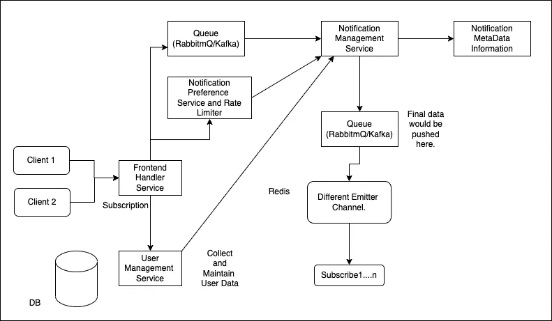
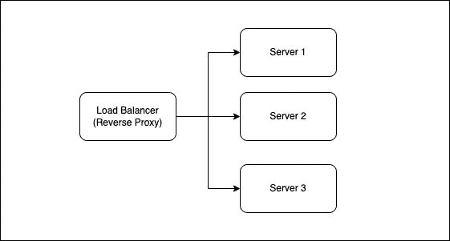

# 探索典型通知背后的架构

> 原文：<https://javascript.plainenglish.io/explore-the-architecture-behind-a-typical-notification-f7ea531b6a55?source=collection_archive---------4----------------------->

## 让我们试着理解一个通知服务系统的设计。

我们都很清楚我们从不同的应用程序收到的通知。我们会收到各种活动/服务的通知，比如当我们在任何相关平台上从 Zomato、MakeMyTrip 或优步订购东西时。然而，由于这个过程已经刻在了系统中，我们从来没有费心去了解任何这样的系统的功能。

Photo by [bruce mars](https://unsplash.com/@brucemars?utm_source=medium&utm_medium=referral) on [Unsplash](https://unsplash.com?utm_source=medium&utm_medium=referral)

作为一个软件开发人员或技术爱好者，了解负责发送通知的系统设计会非常有趣。通知服务通常是整个产品的一部分，但很少是一个独立的应用程序，除非您为它提供 SAAS 产品。我们以某种方式将通知服务嵌入到我们的应用程序中。

# 通知系统的要求

因此，在我们的通知服务中，我们应该知道我们想要实现的不同功能，以及通知系统应该包含的基本要求。因此，让我们讨论这样一个系统的基本能力。

Photo by [Corinne Kutz](https://unsplash.com/@corinnekutz?utm_source=medium&utm_medium=referral) on [Unsplash](https://unsplash.com?utm_source=medium&utm_medium=referral)

## 高度可扩展和可用

至于任何系统，它应该是高度可伸缩和可用的。由于我们可以将通知系统构建为一个 SASS 或一个独立的服务，所以我们想要的一件事是系统应该是高度可用的。为此，我们可以使用各种概念，比如使用排队机制、自动伸缩/按需伸缩、缓存机制等。

## 限速器

在向最终用户发送通知时，我们应该始终有约束。客户通常会对发送给他们数以千计的通知感兴趣。因为对于最终用户来说，清除重要通知和促销通知的混乱总是一件很麻烦的事情。我们需要为基于客户端的速率限制准备一些机制。

## 跟踪能力

此外，我们需要跟踪谁在发送消息。我们需要更好地理解我们使用系统传输的信息类型。这只会帮助我们访问网络和其他要求。我们可以根据我们将得到的统计数据进行缩放。

## 优先

此外，拥有某种优先级机制也是必要的，因为与其他通知(如事务性消息、OTP 等)相比，一些通知具有更高的优先级。

# 通知系统

通知制度是几乎每一种产品的一种强制性服务。如果你没有一个合适的通知系统，那么你很有可能会失去一些可以提供给客户的最好的用户体验。这篇文章主要是为愿意开发这样一个系统的软件开发人员准备的，也可以作为你下一次系统设计面试的一个简要的理解。

所以我们已经有了一个基本的架构。至于构建任何复杂的产品，我们需要有清晰的基础，因为罗马不是一天建成的，所以我们怎么能期望我们的产品也是如此。

开发人员可以在开发过程中探索许多特定于产品或服务的用例。让我们从通知服务 saas 模型的设计开始。

Possible system design for the notification system.

由于我们有一个 saas 通知系统，我们当然会有各种各样的客户。让我们按时间顺序讨论所有的服务。

## 前端处理程序服务。

前端处理器服务将负责执行各种活动，如注册客户端和存储用户数据，如订阅的频道、设备 id 和其他基本元信息。此外，它会将所有消息添加到队列中，这样我们就有了一个可以支持大量通知的系统。

## 用户管理服务和通知偏好服务

我们将为用户管理和通知参考和速率限制器提供单独的服务，我们的前端处理器服务将与这些服务进行通信。用户管理服务将处理与用户相关的数据。该服务还将使用 Redis 进行更快的读取访问，因为它是读取密集型数据。

另一方面，将有一个通知偏好服务，它将维护我们在发送通知时将使用的时间偏好、优先级和速率限制等信息。我们不想给客户发送成千上万的通知而激怒他们。

## 排队机制(兔子 MQ)。

我们需要在系统中有某种排队机制，因为我们会有各种各样的客户，他们会一次又一次地发送通知。通知有不同的优先级，我们不能失去它们。

Photo by [Ethan Hu](https://unsplash.com/@ethanhjy?utm_source=medium&utm_medium=referral) on [Unsplash](https://unsplash.com?utm_source=medium&utm_medium=referral)

如果没有得到适当的通知，依赖于通知系统的各种任务关键型应用程序将会受到影响。这将有助于我们的产品处理大量的请求，因为我们不必一次处理所有的请求。该请求可以等待。

## 负载平衡器

虽然我们在图中没有画出负载平衡器，但我想提醒您注意负载平衡器的功能，它将在任何服务器前使用。负载平衡器为您提供了一个可适度伸缩的应用程序。反向代理将有助于解决各种目的，如对不同服务器的请求进行负载平衡、添加适当的状态代码、为请求添加标题等。这将有助于我们消除停机时间，也就是说，如果任何一台服务器出现故障，我们都有其他服务器来处理。

Sample Load Balancer Design

我不想在任何地方都显式地添加负载平衡器，因为我们知道负载平衡器的用途。我们可以在任何我们认为需要的地方添加它们。此外，还有一个自动伸缩的概念，它有助于在负载增加时扩展我们的应用程序。我们可以根据流量百分比、服务器利用率和各种其他因素进行配置。

## 通知管理服务

通知管理服务是我们整个应用程序的核心。我们的通知管理服务将与 Rabbitmq 通信，即我们的排队服务、用户管理服务、通知首选项和速率限制及服务。

它将通过订阅特定的 RabbitMq 通道来接收通知。收到消息后，通知服务将与用户管理服务连接，以收集与用户相关的数据，如名称、设备 id 和用户提供的其他元数据。

除了获取与用户相关的数据和通知管理服务，还应该知道用户选择的通知首选项。例如，用户可能要求在上午 10 点到晚上 10 点之间在他们的电子邮件上发送通知。

我们将用户相关服务的数据与通知管理服务合并。我们可以将解析后的数据最终推入另一个队列。因此，将数据放入另一个队列的原因是为不同的设备创建多个通道，如电子邮件、电话通知 SMS 等。

## 通知元数据信息服务

我想要一个通知元数据信息服务，它什么都不是，但可以被认为是一个跟踪器，将存储关键任务的信息。

这项服务将有助于我们跟踪、维护和绘制不同类型的图表和其他统计数据，这些数据将用于升级我们的系统。

通过统计特定服务与其他服务相比需要更多的负载，我们将能够实现功能。此外，收集元数据将帮助我们更好地设计我们的系统，了解关键信息，如通常使用的通知类型。

## 最后的队列

根据我们计划发送给最终用户的通知类型，队列最常用于存储最终解析的数据。我们可以直接触发来自通知管理服务的消息。这种方法的问题可能是丢失关键通知。很多时候，这些设备可能没有连接到互联网。这样很容易导致需要传递的信息丢失。

通知总是至关重要的，我们不能失去它们。添加最终队列将使我们的产品具有弹性，因为我们不会丢失任何数据。

一个队列将支持确认信号，这将确保设备完全连接并且已经接收到通知。一旦我们得到确认信号，那么只有它将从队列中删除通知数据，否则它将让它等待。

# 最后的想法

因此，我们现在已经为我们的通知系统定义了一个基本结构。尽管这决不是一个详尽的清单。任何应用程序都会面临成千上万的用例。我们可以集成各种其他服务，如适当的缓存机制和数据库，这将帮助用户存储数据，用于其他分析等。

slack 最近通过流程图分享的一个非常流行的用例是当用户登录到各种设备时。但是很多时候，用户只想一次在一个设备上接收通知。所以我们需要处理这样的用例。

这是产品的不断升级，并且将一直持续下去。因此，不断探索并为您的服务添加新功能。

更重要的是，有一句我最近学到的话想和大家分享。希望你会喜欢。

# 今日引语。

> 一个人可能有一天会结束在这个世界上的时间，但我们分享的知识将永远存在。我们应该总是考虑分享我们学到的东西。在某个地方，有人可能从中得到好处。

**关于作者**

Apoorv Tomar 是一名软件开发人员，是[**mind bake**](https://mindroast.com/)的一部分。你可以在 [**Twitter**](https://twitter.com/apoorvtomar_) 、 [**Linkedin**](https://www.linkedin.com/in/apoorvtomar/) 、 [Telegram](https://t.me/ApoorvTomar) 和 **Instagram** 上和他连线。订阅 [**简讯**](https://www.mindroast.com/newsletter) 获取最新策划内容。不要犹豫在任何平台上说“嗨”,只要说明你是在哪里找到我的资料的。

*更多内容请看*[***plain English . io***](https://plainenglish.io/)*。报名参加我们的* [***免费周报***](http://newsletter.plainenglish.io/) *。关注我们关于*[***Twitter***](https://twitter.com/inPlainEngHQ)*和*[***LinkedIn***](https://www.linkedin.com/company/inplainenglish/)*。查看我们的* [***社区不和谐***](https://discord.gg/GtDtUAvyhW) *加入我们的* [***人才集体***](https://inplainenglish.pallet.com/talent/welcome) *。*