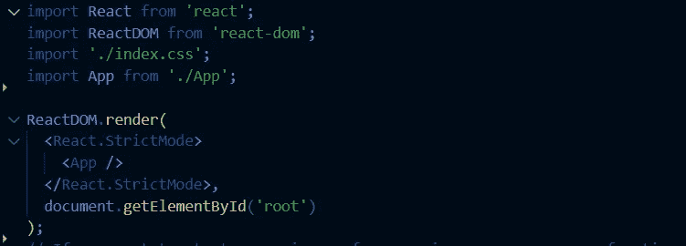
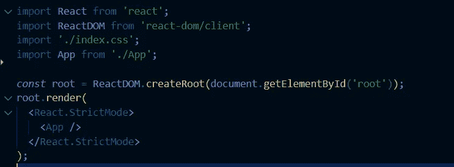
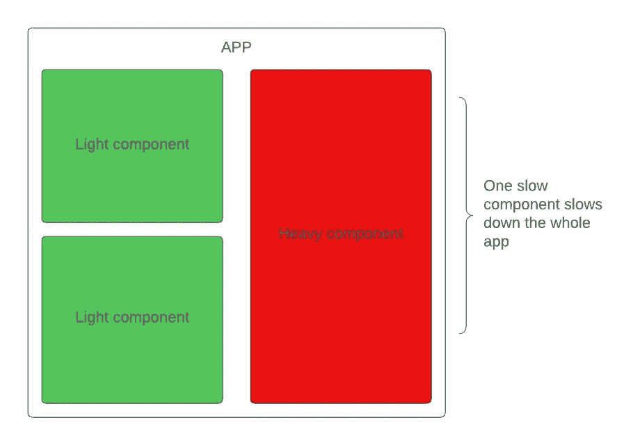

# 探索 React 18 中的新功能

> 原文：<https://javascript.plainenglish.io/explore-the-new-features-in-react-18-fb476b5bcc5c?source=collection_archive---------8----------------------->


看来又到了一年中的这个时候了。React 刚刚发布了其最新版本 18，它包含了一系列为您的开发增添巨大推动力的功能。在本文中，我将带您了解这些特性。

以下是我们将在本文中涉及的内容。

## **概述**:

*   ***反应 18 并发渲染***
*   ***反应过渡***
*   ***反应自动配料***
*   ***在服务器端反应悬念***
*   ***结论***

# 环境设置:

首先，让我们使用 create-react-app 来设置我们的开发环境并探索新特性。

```
npx create-react-app react-18
```

这将自动安装最新的 react18 版本。现在运行`npm start`，React 应用应该开始运行。往下看 **index.js** 文件，一眼就能看到呈现语法的细微变化。

**反应 17:**



**反应 18:**



在 React18 中，***react DOM . render***被替换为***react DOM . create root***用于创建你的 app 的根，然后调用 render 方法渲染根。这个 ***createRoot*** 是并发渲染机制的一部分，用于主动并发渲染。

# ***反应 18 并发渲染***

React 18 的第一个更新是并发性。React 的核心是并发算法，它是 React 生态系统的主要部分。React 18 引入了一个特性，允许我们中断当前的并发任务，稍后再继续。

在 React 18 之前，一旦并发渲染任务开始，就没有办法停止它，直到它完成执行。这实际上是一个单一的同步任务，正如我们已经知道的，同步任务一个接一个地进行。

随着 React18 的出现，并发机制得到了改进，现在允许 React 中断渲染。并发渲染带来了一些新功能，如悬念、流服务器渲染和由并发渲染驱动的过渡。这是 React 核心渲染模型的基础更新，但只需要对它有高层次的理解，因为它是在场景本身的背后处理的。并发模式仍然是一个实验性的特性，正在慢慢适应 React API 的其他部分。

# 新功能

## 1.反应转换

React 中的更新有两种类型。DOM 事件更新和转换更新。DOM 事件更新在事件触发器上非常明显，而转换更新需要等待一段时间才能在视图中看到。

有了 React 并发，我们现在可以将紧急更新优先于过渡更新，这样用户就不会有用户体验不佳的感觉。

为了使用这个特性，React 制作了一个`**startTransition**` API 来通知 React 哪些更新具有更高的优先级/紧急性，哪些是过渡。

为了访问这个，我们将使用 ***useTransition*** 钩子。我们可以从钩子或者直接从基于类的组件中的 React 访问`**startTransition**`。

## 使用过渡挂钩:

***use transition***返回一个过渡状态，和一个函数。我们可以使用 isPending 来知道转换何时进行。

```
const [isPending, startTransition] = useTransition();
```

在上面的例子中，有一个按钮需要紧急反映结果，还有一个 transitionValue 显示 1k+数据的列表。我们希望在按钮点击时更新列表，并增加计数。

*   点击按钮将增加`urgentValue`，然后调用`startTransition`方法让 React 知道`transitionValue`不紧急，因此它将继续慢慢更新它，给`urgentValue`更多的优先权。
*   在这个过程中，我们可以添加一个带有`isPending`状态的加载效果，向用户显示列表处于挂起状态。
*   如果我们从 click 事件中移除`startTransition`方法，然后继续增加计数器，我们可以观察到屏幕上有轻微的延迟，这给人一种用户体验不佳的印象。

我们也可以在基于类的组件中使用 startTransition API，如下所示。

```
import {startTransition} from 'react';
```

## 2.自动配料

React 在 React18 中引入了自动批处理。React 中的批处理是什么，我们到底为什么需要它？好吧，无论何时，使用`setState`在 React 中有一个状态改变，组件立即重新呈现。React 17 已经为我们处理配料了。然而，它仅限于事件处理程序。请允许我解释。

```
onHandleChange = (*event*) *=>* {
 setLoader();
 setValue(); 
 setCounter(); 
}
// Render at the end of event once
```

每当事件处理程序中有状态更改时，它们都被视为批处理，因此在事件完成执行后只呈现一次。但是事件之外的任何状态变化每次都会单独呈现。

```
onHandleChange = (*event*) *=>* {
 this.apiCall().then(*res=>*{
  setLoader();  // 1 render
  setValue();  // 2 render
  setCounter(); // 3 render
 })
}
```

如你所见，这是很不恰当的。幸运的是，React 18 在所有微任务(如承诺和`setTimeout`函数)中都自动批处理。我们可以随时使用`flushSync`退出该功能。

## 3.在服务器上反应悬念

React 18 在服务器端引入了悬念。在不涉及太多细节的情况下，让我简单概述一下什么是服务器端以及它是如何工作的。网页可以通过两种方式加载。在客户端称为客户端呈现(CSR ),或者在服务器端称为服务器端呈现(SSR)。CSR 在加载时间上往往很慢，因为它严重依赖 JavaScript，并且动态加载数据。

为了解决这个问题，使用服务器端呈现来增强一次性加载页面的用户体验，并减少交互页面的时间。

尽管这是一种更好、更快的加载页面的方法，但是 React 中存在一个瓶颈，导致页面在等待数据加载时没有响应。

例如，如果我们正在加载 3 个组件，其中一个相对较慢，这将挂起屏幕，而不是加载其他组件，从而破坏用户体验。



React SSR bottleneck

为了处理这一点，React 18 引入了悬念。通过悬念，我们可以用悬念组件包装应用程序的慢速部分，它会告诉 React 延迟重组件的渲染。这样，最轻的组件会先加载，在这个过程中用户体验不会受到干扰。

# 结论🎉

React 18 带来了一系列底层的变化，这无疑会在 React 中工作时有所帮助。虽然其中一些是实验性的，但它们最终会完全集成到库中，带来完整的体验。

> *我希望这篇文章对你有帮助，如果你有，* ***关注我的*** [***中的***](https://medium.com/@mrahmedkhan019) ***和***[***Twitter***](https://twitter.com/50shadeofkhan)***获取更多软件开发文章的通知，别忘了点击*** *。终于！感谢阅读，快乐学习！*

*更多内容请看*[***plain English . io***](https://plainenglish.io/)*。报名参加我们的* [***免费周报***](http://newsletter.plainenglish.io/) *。关注我们关于*[***Twitter***](https://twitter.com/inPlainEngHQ)*和*[***LinkedIn***](https://www.linkedin.com/company/inplainenglish/)*。加入我们的* [***社区不和谐***](https://discord.gg/GtDtUAvyhW) *。*