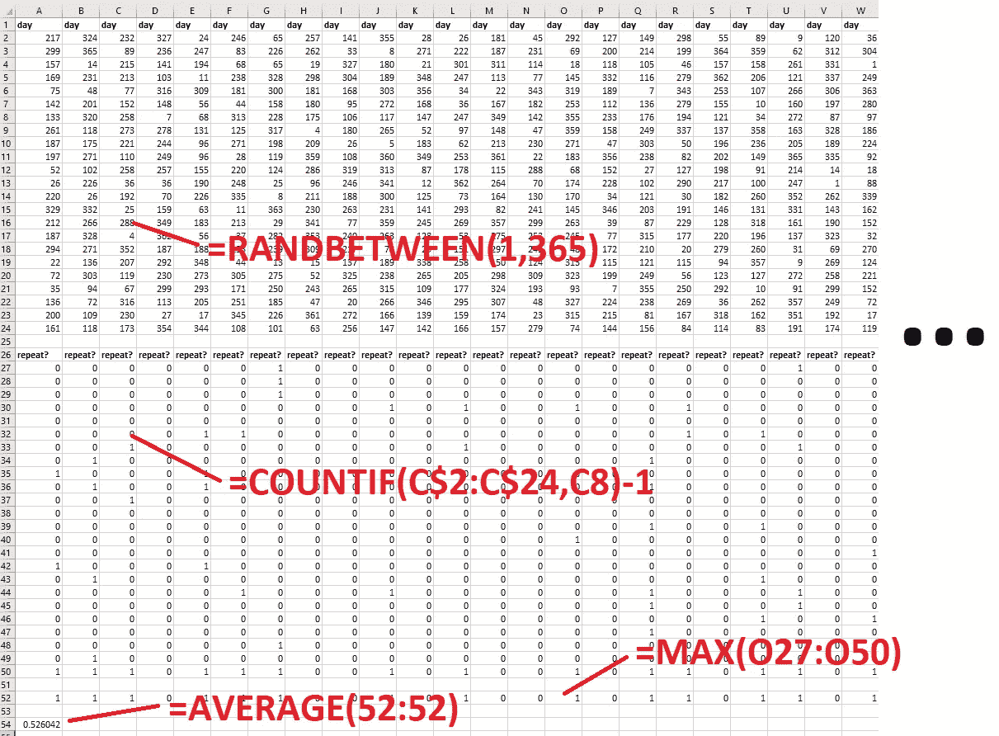
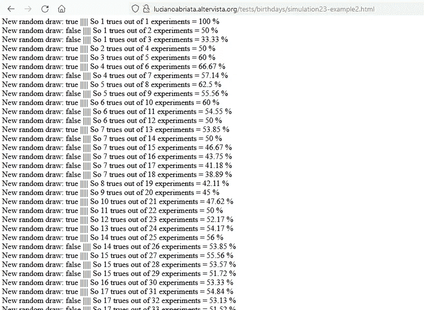
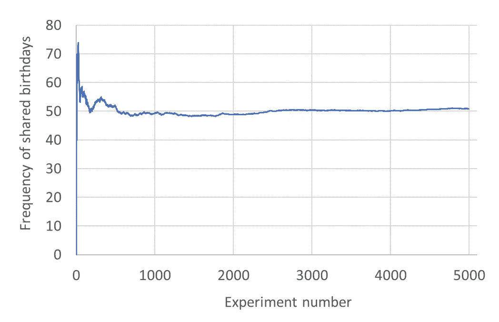
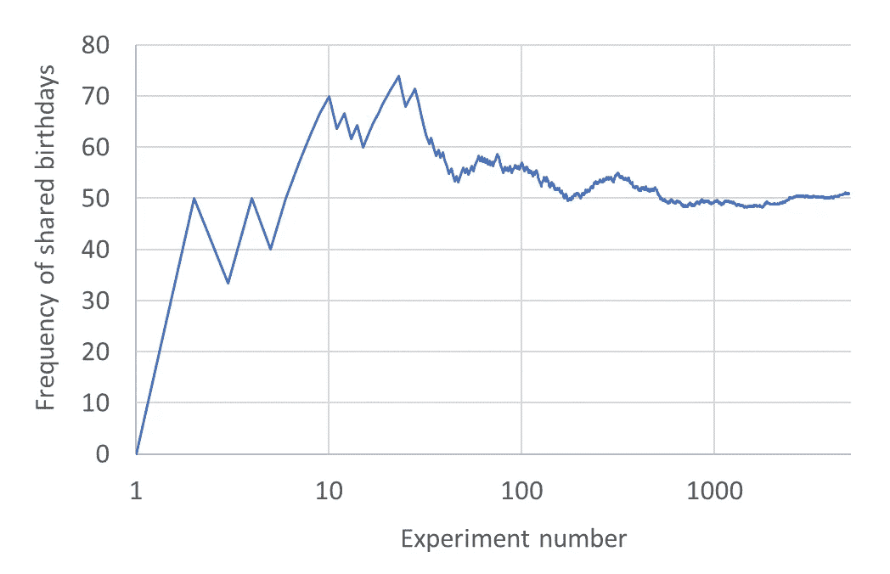
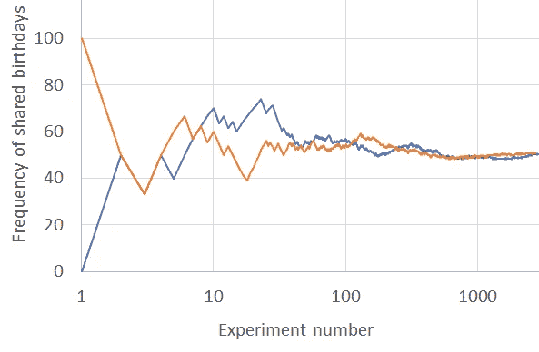
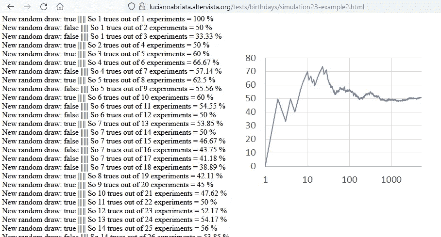

# 在你的网络浏览器上模拟探索生日悖论

> 原文：<https://javascript.plainenglish.io/exploring-the-birthday-paradox-with-simulations-on-your-web-browser-eaecada9e1d7?source=collection_archive---------14----------------------->

## 这是一个很好的理解概率如何来源于随机过程的方法，用我们最喜欢的语言编码。


Photo by [Annie Spratt](https://unsplash.com/@anniespratt?utm_source=medium&utm_medium=referral) on [Unsplash](https://unsplash.com?utm_source=medium&utm_medium=referral)

在最近的一篇文章中， [Eric Kleppen](https://medium.com/u/1e2ea32699c9?source=post_page-----eaecada9e1d7--------------------------------) 通过用 Python 模拟和可视化生日分布，探索了所谓的“生日悖论”。作为一名 JavaScript 爱好者，我忍不住将这个想法用于 web 浏览器。

生日悖论提出了一个违反直觉的事实，即**找到两个同一天生日的人并不是不可能的**，即使是在一个小团体中…

正如 Eric 举例说明的那样，根据从[二项式分布](https://en.wikipedia.org/wiki/Binomial_distribution)中推导出的分析公式，在一个只有 23 人的小组中，有大约 50%的机会有人过同一天生日。而且，在一个 70 人的群体中，他们两个同一天生日的几率是 99.9%！

# 模拟而不是推导方程

如果分析数学不能说服你，那么最好的办法就是模拟例子…很多很多例子，然后收集频率。

我在 Excel 中很容易地做到了这一点(以 23 个人为例)。当然，这不能很好地扩展，所以我们接下来将使用 JavaScript 来实现。但是，让我们先看看电子表格，以掌握协议的本质。

本质上，我们多次执行以下“模拟实验”:

*   模拟 1 到 365 之间的 23 个整数(第 2 到 24 行)
*   检查是否有任何两个数字重复(第 27 到 50 行),如果为真，则指定 1，否则指定 0

最后，我们将实验中所有实现的 1 相加，然后除以实现的数量。为简单起见，由于我们选择分配 1 和 0，这对应于计算的所有 0 和 1 的平均值。这个数字就是我们要找的结果。

举个例子，在这里我做了 192 个实验(每个实验是一列)在 1 到 365 之间抽取 23 个随机数(从 2 到 24 的每一行都是这些随机数中的一个)。你可以看到平均值是 0.52，非常接近于 0.5 左右的分析推导值。



# 用 JavaScript 模拟 23 个生日

用 JavaScript 模拟 23 个生日并检查是否至少有两个人过生日非常简单:

```
<script>
var birthdays=[]  //Array that will contain the birthdays//A function to generate the birthdays
function generatebirthdays() {
 birthdays=[]                  //Clear array
 for (var i=0;i<23;i++)        //Push 23 random numbers   
   {birthdays.push(parseInt(Math.random()*365+1))}
}//A function to print the birthdays
function printbirthdays() {
 for (var i=0;i<23;i++) {document.write(birthdays[i] + “<br>”)}
}//Function to check if there's a repeat in the list
//Notice each number is checked against all the others
function istherearepeat() {
 var repeatfound=false
 for (var i=0;i<23;i++) {
 for (var j=i+1;j<23;j++) {
 if (birthdays[i] == birthdays[j]) {
 repeatfound=true
 return repeatfound
 }
 }
 }
 return repeatfound
}//Now call the functions to generate and print the birthdays
generatebirthdays()
printbirthdays()//Also print whether there is a repeat or not.
document.write(“<br>” + istherearepeat())
</script>
```

您可以在这里看到这一点:

[**http://lucianabriata . alter vista . org/tests/birthdays/simulation 23-example 1 . html**](http://lucianoabriata.altervista.org/tests/birthdays/simulation23-example1.html)

(在大多数浏览器中用 CTRL+U，可以看到网页的完整代码。)

在这个小的网络应用程序中，每次你按下 F5(刷新),你就会得到一个新的 23 个数字的列表，范围从 1 到 365，并且在最后有一个标志指示是否有重复。如果你运行它很多次，并计算点击次数，在几次刷新后，你的平均值应该接近 50%。但是，我们当然可以自动完成这项工作，接下来我将向您展示。

# 重复模拟 23 个生日，以收敛频率

我们可以将上述函数嵌套在一个循环中，反复调用。

这里我不使用 for 循环，而是使用 setInterval 函数，该函数将从 1-365 的范围内抽取 23 个随机数，并计算是否每 100 毫秒重复一次:

```
var ntrue = 0
var ntotal = 0
setInterval(function() {
 generatebirthdays()
 //printbirthdays()
 var repeated = istherearepeat()
 if (repeated == true) {ntrue++}
 ntotal++
 document.write(“New random draw: “ + repeated + “ ||||| So “ + ntrue + “ trues out of “ + ntotal + “ experiments = “ + Math.round(ntrue/ntotal*10000)/100 + “ %<br>”)
 } , 100)
```

该函数统计*中重复的次数，以及*中“实验”的总次数(即抽取 23 个数字)。我们要寻找的概率是由重复频率近似得到的，也就是 ntrue/ntotal 的比值。请注意，代码将此比率格式化为不超过两位小数的%:**

```
**Math.round(ntrue/ntotal*10000)/100**
```

**您可以通过以下链接测试这个示例:**

**[**http://lucianabriata . alter vista . org/tests/birthdays/simulation 23-example 2 . html**](http://lucianoabriata.altervista.org/tests/birthdays/simulation23-example2.html)**

**一旦加载了页面，计算就会开始。程序将添加报告 ntrue、total 和相应频率的行:**

****

**Screenshot by author from the example page given above.**

**只要你愿意，你可以全选(通常是 CTRL+A)，复制(CTRL+C)并粘贴到你最喜欢的电子表格程序中，以得到你想要的任何分析或图形。**

**最简单的方法是监控频率如何随时间演变，以验证它如何缓慢收敛到 50%左右:**

****

**请注意，将 X 轴切换到对数刻度可以更清楚地看到第一轮实验中的波动。例如:**

****

**请注意，每次新的运行可以开始完全不同，但应该在足够数量的回合后再次收敛到 50%左右。在这里，我将上面的运行(蓝色)与另一个从头开始的运行(橙色)进行了比较:**

****

**这就是你要做的:你已经通过模拟亲自解决了一个统计问题，而且是用 JavaScript 编写的，没有任何开销。只需编写代码并在浏览器中运行它——这就是我最喜欢这种语言的地方！**

**我希望你已经发现这是有用的。感谢您的阅读。**

# **进一步的想法和阅读**

**如果你想要一些挑战，你可以尝试使用谷歌图表库在网页上绘制结果图。有一天我会发布一个关于这个库的简单教程。**

**另一个挑战是编写一个应用程序来计算不同人数的概率，这是 Eric 工作的最后一部分。提示:每 100 毫秒做一次实验是有益的，因为你会看到结果在更新，但是你可能想要改变循环来运行得更快。此外，不要写每个实验的结果，因为这将冻结浏览器。**

**这里有一些你可能会感兴趣的进一步阅读:**

**关于随机数以及如何将它们从平方分布转换为其他类型的分布:**

**[](https://lucianosphere.medium.com/get-random-numbers-with-normal-gaussian-distributions-from-random-numbers-with-uniform-bcc4b7db6e9e) [## 从均匀分布的随机数得到正态(高斯)分布的随机数…

### 尤其是在用低级语言编程时，这些语言只能模拟从统一的随机数中抽取的随机数…

lucianosphere.medium.com](https://lucianosphere.medium.com/get-random-numbers-with-normal-gaussian-distributions-from-random-numbers-with-uniform-bcc4b7db6e9e) 

关于在 web 浏览器中进行数据分析:

[](https://towardsdatascience.com/websites-for-statistics-and-data-analysis-on-every-device-ebf92bec3e53) [## 在每台设备上进行统计和数据分析的网站

### 我对网络浏览器中数据分析在线工具的选择。

towardsdatascience.com](https://towardsdatascience.com/websites-for-statistics-and-data-analysis-on-every-device-ebf92bec3e53) 

一个特殊的例子是:PCA:

 [## 主成分分析权威指南

### 一个教程剥离低层次的代码，您可以编辑和运行在您的浏览器，以了解 PCA 一劳永逸…

towardsdatascience.com](https://towardsdatascience.com/the-definitive-guide-to-principal-components-analysis-84cd73640302) 

最后是 Eric 用 Python 写的关于生日悖论的原创文章:

[](https://levelup.gitconnected.com/how-to-simulate-and-visualize-the-birthday-paradox-using-python-528d304f215b) [## 如何用 Python 模拟和可视化生日悖论

### 通过编码提高你对概率的理解

levelup.gitconnected.com](https://levelup.gitconnected.com/how-to-simulate-and-visualize-the-birthday-paradox-using-python-528d304f215b) 

*我是一个自然、科学、技术、编程和 DIY 爱好者。生物技术专家和化学家，在潮湿的实验室和电脑前。我写我广泛兴趣范围内的一切。查看我的* [*列表*](https://lucianosphere.medium.com/lists) *了解更多故事。* [***成为中等会员***](https://lucianosphere.medium.com/membership) *访问其所有故事和* [***订阅获取我的新故事***](https://lucianosphere.medium.com/subscribe) ***通过电子邮件*** *(我为其获得小额收入的平台的原始附属链接，无需向您支付特殊费用)。* [***这里通过各种方式***](https://lucianoabriata.altervista.org/office/donations.html)**捐赠。* [*联系我这里*](https://lucianoabriata.altervista.org/office/contact.html) *。**

**到* ***咨询关于小工作*** *(关于编程、生物技术+生物信息项目评估、科学推广+交流、分子数据分析与设计、分子图形学、摄影、分子网络教程、科学教学与辅导等。)查看我的* [***服务页面这里***](https://lucianoabriata.altervista.org/services/index.html) *。**

**

**更多内容请看* [***说白了就是***](https://plainenglish.io/) *。报名参加我们的* [***免费每周简讯***](http://newsletter.plainenglish.io/) *。关注我们*[***Twitter***](https://twitter.com/inPlainEngHQ)*和*[***LinkedIn***](https://www.linkedin.com/company/inplainenglish/)*。查看我们的* [***社区不和谐***](https://discord.gg/GtDtUAvyhW) *加入我们的* [***人才集体***](https://inplainenglish.pallet.com/talent/welcome) *。****