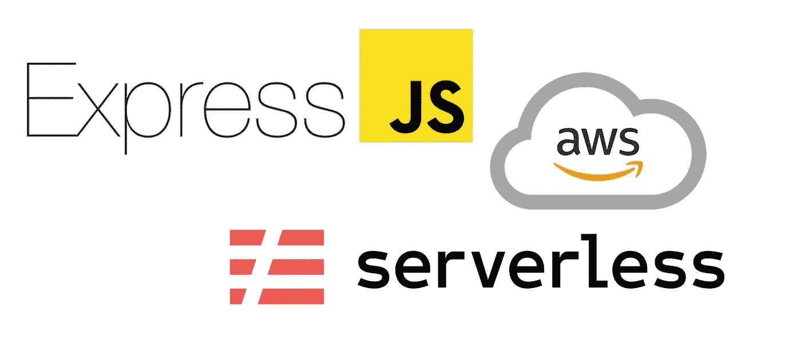
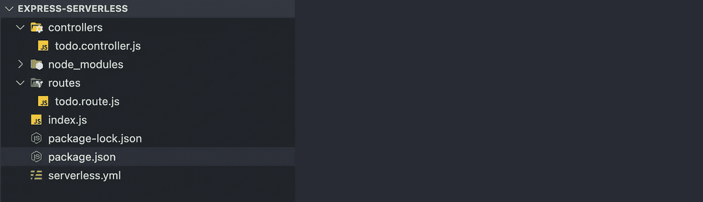

# 快速和无服务器:初学者最终指南

> 原文：<https://javascript.plainenglish.io/expressjs-and-serverless-a-beginners-ultimate-guide-a70794fa8b73?source=collection_archive---------18----------------------->



越来越多的个人使用无服务器部署 web 应用程序。按执行付费的定价、自动扩展和闪电般的安装只是众多优势中的一部分。

然而，切换到无服务器有自己的学习曲线。您必须熟悉您所使用的平台的细微差别，小到最小的细节，比如请求输入的格式和响应输出的必要形式。这可能会阻碍你，减缓你的发展。

今天我有一个好消息要告诉你:无服务器将与你当前的 web 框架工具完美结合。在本文中，我将演示如何使用众所周知的 Node web framework Express.js 安装无服务器 REST API。

## 入门指南

要开始，你需要安装[无服务器框架](https://serverless.com/framework/docs/providers/aws/guide/quick-start/)。您还需要用 [AWS 凭证](https://serverless.com/framework/docs/providers/aws/guide/credentials/)配置您的环境。

## 创建和部署 Todo 应用程序

让我们从简单的事情开始——部署一个具有基本 CRUD 功能的 todo 应用程序。

首先，用一个`package.json`文件创建一个新目录(名为`express-serverless`):

```
$ mkdir express-serverless && cd express-serverless
$ npm init --y
```

然后，让我们安装一些依赖项。我们将安装`express`框架，以及`[serverless-htt](https://github.com/dougmoscrop/serverless-http)p`和(一个非强制依赖)`nodemon`:

```
$ npm install --save express serverless-http uuid
$ npm install -D nodemon
```

管理 Node.js 应用程序和错综复杂的 API 网关之间的接口的一个有效的中间件是由 big ups 的`Doug Moscrop`创建的`serverless-http` 包！

`uuid`用于为我们的 todos 生成随机 Id，而`nodemon`用于监控我们的 javascript 文件的变化。

让我们深入研究编码本身:)。

您的`package.json`应该是这样的(您的依赖版本可能比显示的要高，但这不是问题！)

用下面这段代码创建一个`index.js`文件:

另外，在根目录下创建一个`serverless.yml`文件，内容如下:

当然，不要忘记同步你的`serverless-offline`插件。你可以通过跑步做到这一点

```
$ serverless plugin install -n serverless-offline
```

接下来，用`todos.controller.js`创建一个`controller`文件夹

现在我们有了控制器端点，我们需要一个路由器将请求路由到它们。在根目录下用`todo.route.js`文件创建一个`route`文件夹。

此时，您的文件夹结构应该如下所示:



Final folder structure

是啊，你猜对了，让我们带着这个野兽去兜风吧 xD！

如果您想在没有服务器的情况下测试运行您的应用程序:

```
$ npm run start
```

使用`serverless`，运行您的应用程序:

```
$ serverless offline start
```

耶！你做到了。

你可以在这里获得完整源代码[。](https://github.com/airscholar/express-serverless)

感谢您的阅读。

*更多内容看* [***说白了。***](https://plainenglish.io/)

*报名参加我们的* [***免费周报***](http://newsletter.plainenglish.io/) *。关注我们关于* [***推特***](https://twitter.com/inPlainEngHQ) ，[***LinkedIn***](https://www.linkedin.com/company/inplainenglish/)*，*[***YouTube***](https://www.youtube.com/channel/UCtipWUghju290NWcn8jhyAw)*，以及* [***不和***](https://discord.gg/GtDtUAvyhW) ***。***

***有兴趣缩放你的软件启动*** *？检查出* [***电路***](https://circuit.ooo?utm=publication-post-cta) *。*