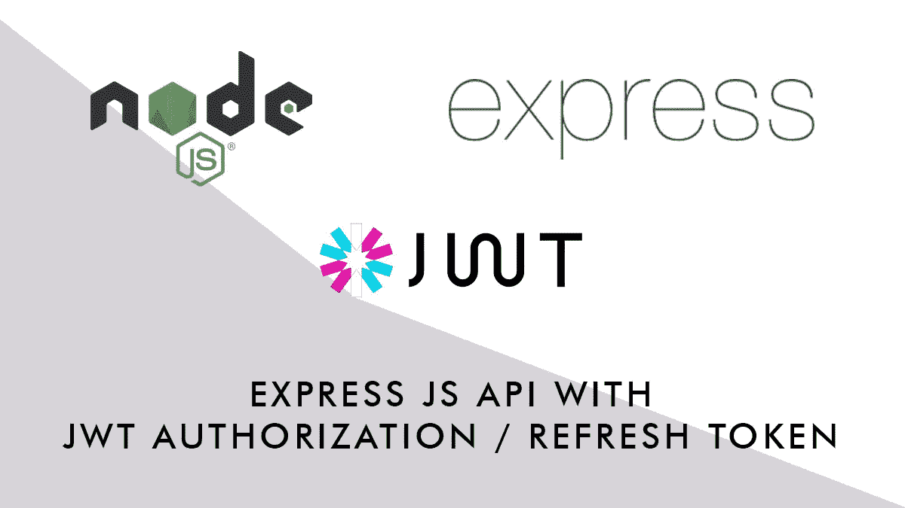
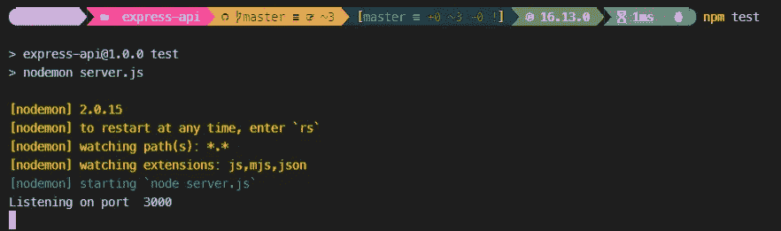
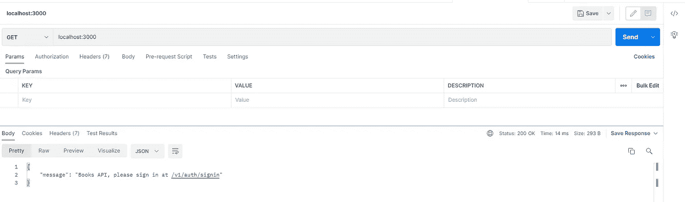
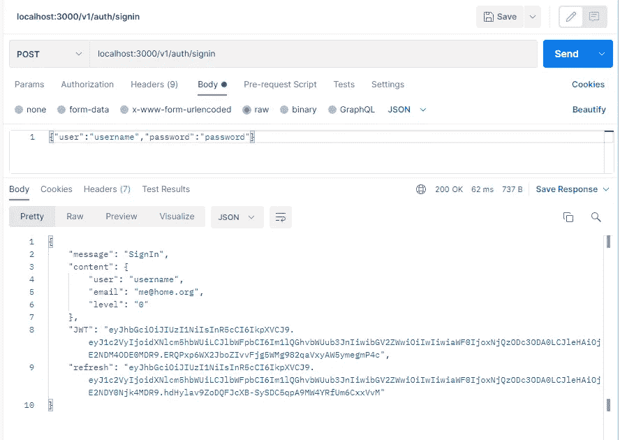
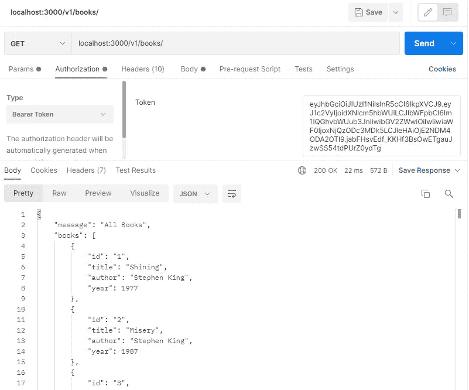
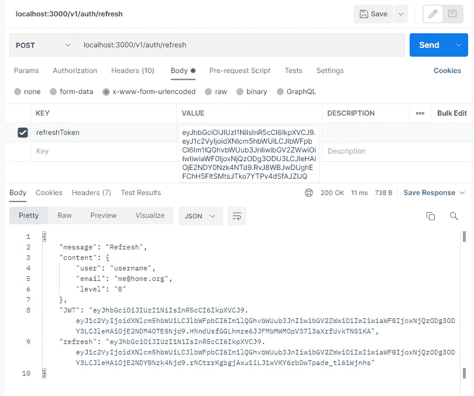

# 具有安全 JWT 访问和刷新令牌的 Express API

> 原文：<https://javascript.plainenglish.io/expressjs-api-with-secure-jwt-access-and-refresh-token-64c5478be2c0?source=collection_archive---------1----------------------->

## 用 Express 构建一个 API，用 JSON Web Token 授权保护它。



[Express](https://expressjs.com/) 被认为是构建后端和 API 服务的最佳框架之一，在本教程中，我们将使用它来构建一个最小但完全工作的 REST API 服务，并通过 JWT 授权进行保护。

## 先决条件

要跟进，您至少需要:

*   HTTP 请求工程的基本知识
*   JavaScript 的基础知识
*   认证和授权流程的基本知识
*   Node.js 和节点包管理器的基础知识

你还需要安装的 [Node.js 和 NPM，以及一个进行 HTTP 请求的工具:你可以使用 cURL，你可以使用 Visual Studio 代码的 REST 客户端扩展(](https://nodejs.org/en/download/)[https://github.com/Huachao/vscode-restclient](https://github.com/Huachao/vscode-restclient))或者像 [Postman](https://www.postman.com/) 这样的在线工具。
您还可以在以下位置克隆我们的存储库和整个项目:

[](https://github.com/popeating/express-api) [## GitHub - popeating/express-api:带 JWT 教程的 Express API

### 此时您不能执行该操作。您已使用另一个标签页或窗口登录。您已在另一个选项卡中注销，或者…

github.com](https://github.com/popeating/express-api) 

## 我们将编码什么

我们将构建一个 REST API 服务，允许客户端应用程序向它请求数据(在我们的例子中是一个图书列表)；我们将使用 JWT 保护端点，我们将编写一个 API 登录服务来获取令牌，我们还将实现一个刷新令牌工作流。

**我们不会关注**客户端开发(因为我们正在构建一个‘非个人化’的服务)，但是我们会提供我们服务的规范，这样任何人都可以为它构建一个客户端。

## 设置项目

一旦你在你的系统上安装了 Node.js 和 NPM，我们开始构建项目，创建一个文件夹:

```
mkdir express-api
```

进入文件夹并初始化项目:

```
npm init -y
```

这将创建一个`package.json`文件，我们将在几分钟后编辑该文件，但在我们安装所有需要的依赖项之前:

```
npm -i express dotenv bcrypt jsonwebtoken
npm -i nodemon --save-dev
```

我们现在创建一个`.env`文件来存储稍后将用于生成令牌的密钥。请记住，这些密钥应该保密，应该非常随机/难以猜测，你可以使用 64 位十六进制字符串(你可以在这里创建它们[https://www.browserling.com/tools/random-hex](https://www.browserling.com/tools/random-hex))，不要使用我提供的那个！

现在我们可以修改`package.json`来编辑正在运行的脚本，我们将使用`node` 进行生产，使用`nodemom` 进行开发(它的作用类似于热重装，修改代码时不需要重启服务器)；按如下方式更改脚本部分:

通过这种方式，我们在开始脚本中指明我们的服务入口点是`server.js`，我们现在将用最少的功能创建它:

用`npm test`启动开发服务器，它应该登录到控制台“监听端口 3000”并等待请求:



使用您喜欢的工具请求 [http://localhost:3000/](http://localhost:3000/) (在这种情况下，您也可以使用浏览器，因为我们正在执行一个简单的 GET 请求):



## 数据

因为我们保持最小化，所以我们不会为我们的数据使用任何数据库或对象存储，我们将简单地将数据保存在一个文件中，概念是相同的，即使您使用本地 MongoDB 或远程 Firebase 或动物群实例。我们从某个地方获取数据(在我们的例子中是一个文件),并根据请求以 JSON 格式呈现给用户。

在您的项目文件夹中创建一个`data`文件夹，并在其中保存两个文件`book.js`，我们在其中保存图书数据库:

以及`users.js`我们注册用户的存储位置:

密码是用`**bcrypt**`加密的(简单来说就是*密码*)，通常，需要访问 API 的用户通过网站注册(或者在网站上获取他们的凭证)，所以我们不提供注册的端点(但是我提供了一个 *generatepassword* 端点，这样你可以很容易地生成加密的密码)。

## 授权工作流程

如前所述，我们的一些端点不是公共的，因此我们需要一种方法来验证和授权用户。对于身份验证，我们提供一个登录端点；对于授权，受保护的端点需要一个需要验证的授权头，并随请求一起发送。工作流程的详细工作方式如下:

*   用户请求登录端点，发布用户名和密码
*   服务器尝试对用户进行身份验证，如果用户有效，服务器会发回一个 JWT (JSON Web 令牌)和一个刷新令牌，刷新令牌也存储在服务器上的某个地方(在我们的例子中是一个变量，存储在 Redis 或生产环境中的某个其他存储上)
*   客户端取回令牌并存储它们(如何/在哪里存储它们是客户端的责任)
*   客户端请求一个受保护的端点，在报头中发送 JWT
*   服务器接收 JWT，对其进行验证，如果验证通过，则发回客户端请求的数据
*   一旦 JWT 过期或即将过期，客户端可以通过向特定端点发送刷新令牌来请求新的 JWT，而无需重新登录。
*   服务器接收刷新令牌，对其进行验证，如果验证是肯定的，则发布新的 JWT 和刷新令牌，并将它们发送回客户端。

JWT 和刷新令牌采用相同的格式，获得几乎相同的信息，但使用两个不同的密钥(我们在`.env` 中设置的)，并获得两个不同的过期时间:JWT 的一个短过期时间(因为它是会话期间使用最多的令牌，我们让它很快过期，以防它被拦截)和刷新令牌的一个长过期时间。两者的持续时间取决于你需要停留的安全程度；通常，JWT 在不到一个小时内到期，而刷新令牌可以持续一个月。如果两个令牌都过期，用户需要再次登录。

## 端点

我们的服务将提供以下端点:

**POST v1/auth/generate password** 一个从普通密码生成加密密码的实用程序，我只是为了简化用户的手动创建而包含的，很可能它不会存在于现实服务中，它接受一个`**password**` post 参数，它返回加密密码。

**POST/v1/auth/sign in**
它登录用户，需要将用户名和密码作为 JSON 对象`{“user":”username", “password": “password"}`传递，它返回一个 JSON 对象，其中包含用户信息一个 JWT，以及一个刷新令牌。

**GET /v1/books/**
以 JSON 对象的形式返回图书列表，它需要一个有效的 JWT，在头中以此格式传入
*授权:Bearer eyjhbbgcioijuzi 1 niisinr5 CCI 6 ikpxvcj 9 . eyj 1c 2 vyijoidxnlcm 5 hbwuilcjlbwfpbci 6 im 1 lqghvbwub 3 jniiwibg v2 zwwioiiwiawf 0 ij xnjqzodc 2 mj 3 lcjlehaioi*

**GET/v1/books/GET/$ID** 返回 ID 为$ ID 的图书，这本书是可公开访问的(我们将它公开，以便我们可以测试登录和匿名访问)

**POST/v1/auth/Refresh**
生成并返回一个新的 JWT，刷新令牌应该作为`refreshToken` 参数传递。

## 编码路线

一旦我们确定了我们需要的端点，我们使用快速路由器路由它们，为了保持整洁，我们在外部文件中组织路由:
创建一个`routes` 文件夹，并添加`book.js`文件(它将处理与书籍相关的路由和端点)和`auth.js`文件(它将处理登录和所有与用户相关的操作)。

将这些路线添加到服务器(在`server.js`文件中):

如果一切正常，服务器应该会刷新，您现在可以在没有授权的情况下访问两个 books 端点。在保护书的路线之前，我们需要一种方法来验证用户；如下编辑`auth.js`路线文件:

并将路由添加到服务器:

正如您在`auth.js`中看到的那样，`/signin`请求有一个中间件功能`userLogin`，在获得主路由器功能之前，会执行一个中间件功能。我们将`userLogin` 函数放在`middleware`文件夹内的文件`auth.js`中，以保持有序，因为我们将继续添加更多的中间件函数。userLogin 函数将验证用户，将生成令牌，如果一切正常，将转到下一个中间件函数(在我们的例子中，将返回到主函数，因为我们只有一个中间件。
我们来码`userLogin`。

登录过程很简单(在上线之前可能需要更多的强制措施)，它主要检查被传递的用户`req.body.user`是否存在，以及提供的密码`req.body.password`对用户是否有效。

如果一切正常，它会生成两个令牌(存储在用户、电子邮件和用户级别，过期 1 小时和 30 天)，它还会将令牌保存在`**refreshList**`对象中，稍后将用于令牌刷新，请记住，refreshList 是不稳定的，如果您重新启动或刷新服务器，它将被重置，在生产环境中，您可能希望将此列表保存在更稳定的地方。a .最后，使用`next()`将所有内容发送回主函数。

此时，您应该能够发布到登录端点，提供用户名和密码，并获得一个 JWT，我们将在下一步中使用它来授权用户:



对于用户授权，我们将使用另一个中间件`verifyToken` ，它将被添加到 books 端点:

代码将在我们的中间件文件中

`verifyToken` 中间件期待一个`authorization` 头，如果它存在并被验证(用`jwt.verify(token, process.env.SECRET_TOKEN`)我们可以返回到主函数(并显示账簿)，否则，生成并显示错误消息:



最后一部分是令牌刷新程序，让我们添加一个带有`tokenRefresh` 中间件的`refresh`端点:

并将`tokenRefresh` 函数添加到`auth.js`中间件文件中:

`tokenRefresh` 只是验证作为 POST 参数传递的令牌是否在`refreshList`中，并且是有效的，如果验证通过，它将生成一个新的 JWT，刷新令牌，并将它们发送回用户(它还将这个新令牌存储在 refreshList 中):



## 后续步骤


## **客户视角**

正如我们之前所说，我们只关注服务器部分，这是一个 API 的主要范围，它应该是抽象的，它不是一个网站。客户端请求数据的方式(编程语言、库等等)是客户端开发者的选择，我们提供一个端点列表，我们的端点期望什么，我们的端点返回给客户端什么。所有的数据处理、刷新延迟等等都是客户端策略。

## 下一步是什么

这只是一个受保护 API 的工作流程的基本示例。从现在开始，它只能得到改进，尝试从本地数据库或远程服务获取数据，提高在另一台服务器上存储用户数据的登录安全性，检查并验证用户发送的数据，添加更多端点，以 GraphQL 格式返回数据，为您的 API 构建客户端，限制每小时最大调用次数，使用级别限制访问…扩展和改进是无止境的！

感谢您的阅读。

*更多内容请看* [***说白了就是***](http://plainenglish.io/) *。报名参加我们的* [***免费每周简讯***](http://newsletter.plainenglish.io/) *。在我们的* [***社区不和谐***](https://discord.gg/GtDtUAvyhW) *获取独家写作机会和建议。*