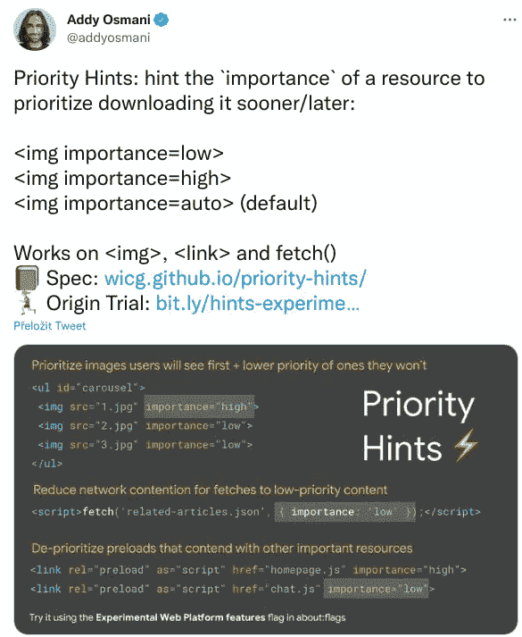
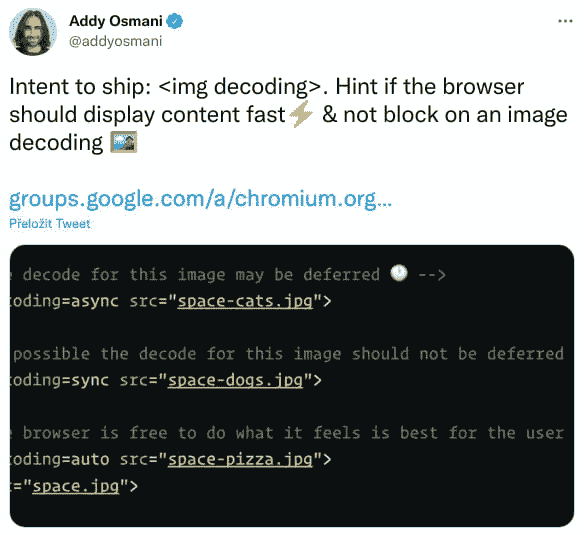
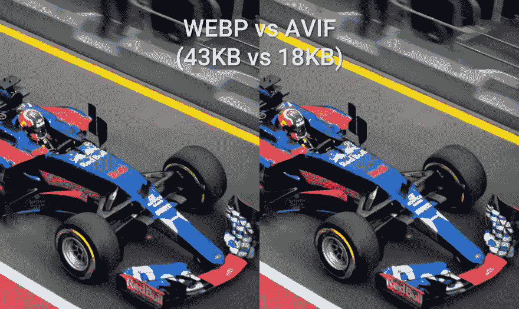
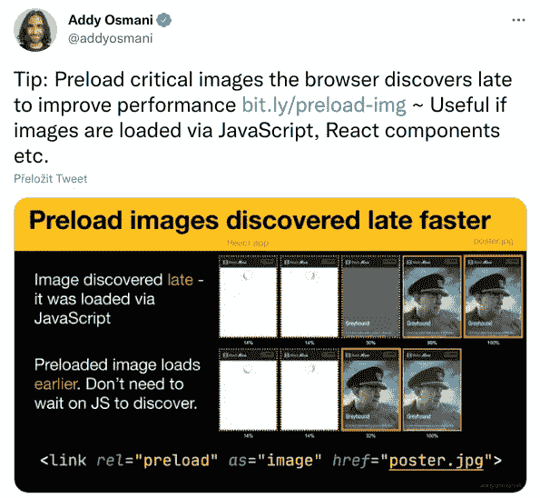
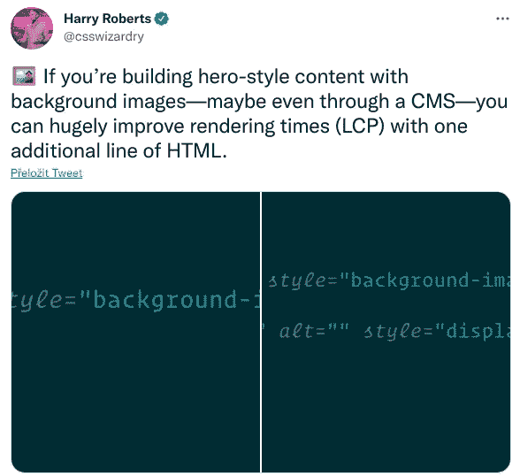

# 速度与激情的图像— Web 性能调整技巧

> 原文：<https://javascript.plainenglish.io/fast-and-furious-images-web-performance-tuning-tips-89a629cdc6a0?source=collection_archive---------9----------------------->

## 优化图像加载的一些技巧。


一个包含一些图片加载优化技巧的列表。对于现在的你和我，在未来的某个地方，当我忘记它的时候。

先是一些[主题调音音乐](https://youtu.be/3shMD13Y2uU?t=14)🤟。

让我们开始吧🚀。

# 装货

加速图像加载的最简单方法是给图像添加一个[加载属性](https://developer.mozilla.org/en-US/docs/Web/Performance/Lazy_loading):

*   不必立即加载的图像(不在视图、页脚等中)。)应该有`loading="lazy"`
*   那些需要提前加载的(在视图或 LCP 图像中)应该有`loading="eager"`

如果一个图像被标记为一个 [LCP](https://sortable.com/blog/ad-ops/what-is-largest-contentful-paint-lcp/) 元素，它不应该被惰性加载。

当一个图像被延迟加载时，确保为该图像准备好空间，这样就不会导致不必要的[布局偏移](https://web.dev/optimize-cls/)。你可以设置宽度和高度属性或者使用[填充顶部](https://css-tricks.com/preventing-content-reflow-from-lazy-loaded-images/)技巧。

# 重要

[重要性属性](https://developers.google.com/web/updates/2019/02/priority-hints)简单来说就是说[下载过程应该在什么时候开始](https://twitter.com/addyosmani/status/1087614725809160192?lang=cs)。这尤其可以改善 LCP 图像的加载。



# 解码

当一个图像有一个 [decoding="async"](https://twitter.com/addyosmani/status/938078402430382080) 属性时，当找到这样的图像时，渲染过程不会暂停，而是继续进行，并且图像被异步解码。



# 格式

可能的话，使用 [AVIF](https://avif.io/blog/comparisons/avif-vs-webp/) 。不然至少 webp。T21 的压缩率远远高于普通的 JPG。



# 大小

加载大图片时，尽量从手机加载到桌面不同大小。尺寸应该在宽度或高度上相差 200 像素左右。你可以用[像素](https://developers.google.com/web/fundamentals/design-and-ux/responsive/images#art_direction_in_responsive_images_with_picture)来代替它。

# 预加载

最好的做法是[预加载应该尽快加载的](https://twitter.com/addyosmani/status/1283295232633659392)图像。
但是不要对页面上的每一张图片都使用它。



# 背景

当你加载一些需要尽快加载的大背景图片时[添加一个隐藏的图片元素](https://twitter.com/csswizardry/status/1276854595382325248)和背景的路径。它提高了优先级，图像加载速度更快。



不需要立即加载的背景应该是 lazyloaded。您可以使用[交集观察器](https://blog.logrocket.com/lazy-loading-using-the-intersection-observer-api/)来判断带有背景的元素是否可见，然后添加一个类似`s-visible`的状态类。然后在 CSS 中添加以下内容:

```
.image-background.s-loaded {
  /* 
    Image will be loaded only 
    if the element has the s-loaded class 
  */
}
```

# 核标准情报中心

如果你有多个小图片(像图片一样的图标)在整个网站上使用，你可以使用像 [Icomoon App](https://icomoon.io/) 这样的应用将它们捆绑在一起。这将减少请求数量和总大小。


# 挽救（saving 的简写）

如果标题中的第一张图片是你的 logo，并且是 SVG 图片，直接把它添加到页面上。这样就不会减慢装载速度。
然而，也有这种方式:

1.  在第一次请求时直接加载它
2.  当页面被加载时，通过 javascript 将该图像的链接元素添加到页面中，因此它在后台加载并被缓存
3.  在另一个请求中，通过 img 元素加载它。

# 分享你的小技巧！

如果你有任何关于图片加载优化的建议，请在评论中分享。我很乐意了解它们，它肯定会帮助那些寻找如何提高他们的 web 性能的信息的其他 web 开发人员🙂。

保持联系:
👉 [@8machy](https://twitter.com/8machy)
👉[stylify . dev](https://stylify.dev/)👉[dev.to/machy8](https://dev.to/machy8)👉[medium.com/@8machy](https://medium.com/@8machy)

*更多内容请看*[***plain English . io***](https://plainenglish.io/)*。报名参加我们的* [***免费周报***](http://newsletter.plainenglish.io/) *。关注我们关于*[***Twitter***](https://twitter.com/inPlainEngHQ)*和*[***LinkedIn***](https://www.linkedin.com/company/inplainenglish/)*。加入我们的* [***社区不和谐***](https://discord.gg/GtDtUAvyhW) *。*