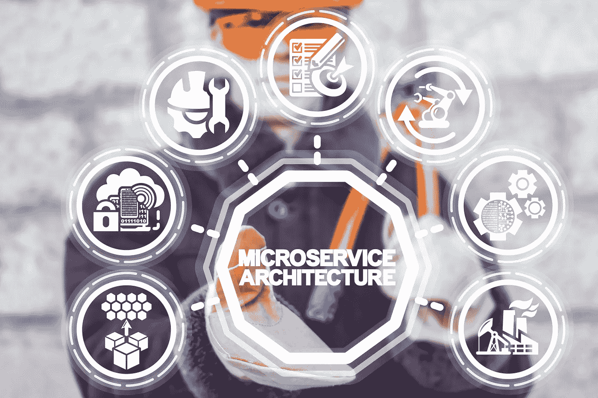

# Fathym vs. Netlify 和 Vercel:用微前端打开新的可能性

> 原文：<https://javascript.plainenglish.io/fathym-vs-netlify-and-vercel-micro-frontends-open-up-possibilities-8fd4b2883b6a?source=collection_archive---------15----------------------->

## 了解 Fathym 的独特产品如何与网站托管领域的其他平台竞争。

Microservices a.k.a. Micro Frontends break down the monolithic frontends of the past. They have many positives for companies big and small.

说到托管，Netlify 和 Vercel 中有一些熟悉的名字。Fathym 可能是新来的，但我们也带来了一些新的想法。

Fathym 最重要的区别在于微前端。Fathym 不仅托管您的网站，还托管我们的微前端平台。幕后不再有铁板一块的架构，至少我们没有。

[微前端方法](https://medium.com/@rich.kurtzman/how-our-micro-frontends-help-businesses-big-and-small-821bc055cc2e)意味着将更大的结构分解成小块，允许多个团队或多个个人同时为同一个更大的最终目标工作。这意味着更多的自主权；这意味着团队可以独立于其他团队发布和扩展产品。它还允许 QA 更早地参与手动和自动测试过程。

# Fathym 表示多个团队贡献

使用 Netlify 和 Vercel，如果多个开发人员在同一个站点上工作，只有一个 GitHub 存储库。当然，每个开发人员都可以在处理任务时创建自己的分支，并在完成任务后将其合并回主分支。但是如果“团队照片库”没有完成他们的任务，那么“团队商店”和“团队博客”都必须等待，然后才能更新生产站点——因为它们都共享同一个 GitHub 存储库。

更新:使用 Vercel、Netlify 和其他云托管解决方案，如 Amazon Lightsail 和 Azure Static Web Apps，您可以努力实现微前端的某些方面。这通常涉及到一系列的服务器重写规则，单一回购和跨多个域的托管。这可能对你的组织是正确的，但是通过 Fathym，我们正在探索将微前端作为你的团队工作流程的核心部分，正如这个领域的其他人所定义的那样。

更多:[马丁·福勒在微前端](https://martinfowler.com/articles/micro-frontends.html)。

Fathym 的与众不同之处在于，你的整个网站不需要在一个 GitHub repo 中。基于他们正在建设的网站，团队可以根据自己的意愿进行许多不同的回购。通过微前端，每个回购都与一条路线相关联，比如 website.com/blog 或/store 或/photos。这允许团队独立于其他团队来扩展和发布产品。“团队商店”和“团队博客”都可以发布生产网站的更新，而不用担心“团队照片库”是否落后于计划。

微前端是一种架构风格，其中可独立交付的前端应用程序被组合成一个更大的整体。

工程师特雷弗·理查森(Trevor Richardson)说:“微前端使工作能够同时进行。“假设一名工程师对商店进行了一些改动。独立于其他团队正在做的事情，他们可以移交给 QA 并开始测试。一旦测试通过，商店更新可以被推送到实时站点。最棒的是最终用户不知道网站在使用微前端。作为一个网站访问者，它的感觉和行为就像一个正常的网站。

除了 micro frontends，Fathym 还提供发布管理、内置安全性、使用自定义域、允许您托管任何 GitHub 分支和切换到任何构建版本，所有这些都在一个界面中完成。任何 Jamstack 语言都支持开箱即用。Fathym 甚至为旧的遗留代码提供 API 代理。这仍然是你的代码，只是管理得更好。

“Fathym 非常容易使用。这让我印象深刻！”开发者乔治·哈奇说。

# 加入法蒂姆

我们鼓励你今天就[免费加入 Fathym，并给我们反馈你喜欢什么和不喜欢什么。我们积极参与我们的社区，并希望添加您最想要的功能。](https://www.fathym.com/dashboard)

*更多内容看* [***说白了就是 io***](https://plainenglish.io/) *。报名参加我们的* [***免费周报***](http://newsletter.plainenglish.io/) *。关注我们关于*[***Twitter***](https://twitter.com/inPlainEngHQ)*和**[***LinkedIn***](https://www.linkedin.com/company/inplainenglish/)*。加入我们的* [***社区不和谐***](https://discord.gg/GtDtUAvyhW) *。**