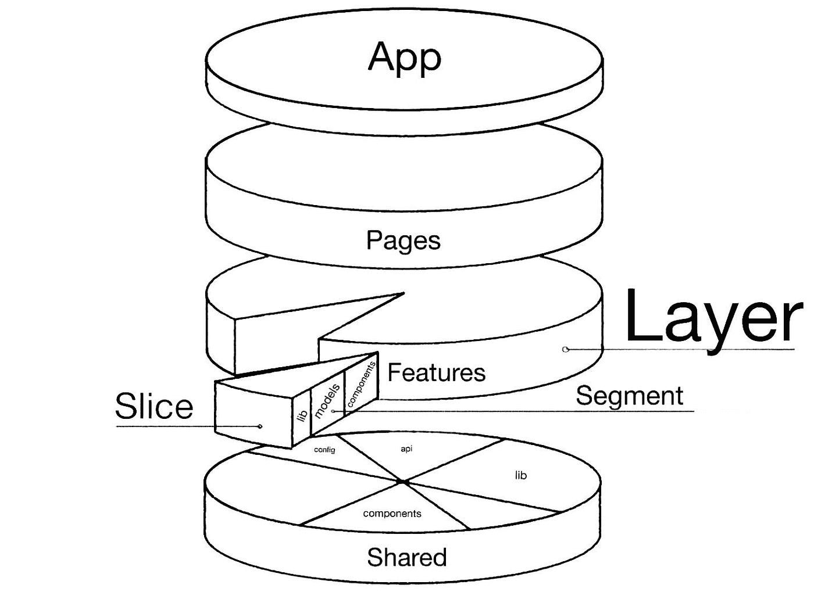

# 特征切片设计:快速实验前端开发的演变

> 原文：<https://javascript.plainenglish.io/feature-sliced-design-the-evolution-of-frontend-development-for-quick-experiments-67089a480439?source=collection_archive---------6----------------------->

## 如今，业务需求和项目开发优先级不断变化并不奇怪。因此，设计一个灵活的、易于扩展和维护的架构，并且有一个通用的术语是很重要的。这将使快速有效地为项目招募新员工成为可能。

我们使用 preact/compat，这使我们能够访问 react 生态系统中的大量库，从而使开发过程更加灵活，同时仍然保留使用 preact 的能力。然而，这些非常好的优势也有不好的一面:例如，应用程序设计项目没有统一的方法，比如 Angular。此外，库的多样性使你很难沉浸在项目中，自由地实现和设计你的想法会导致混乱的代码库，这对开发人员来说是一个可怕的因素，尤其是新手。

我曾经遇到过这样的情况，几个功能相似的组件分散在同一个项目中。例如，同一个按钮的五种变体，其中纯 UI 组件直接链接到应用程序域组件。

对于我们的团队来说，这些问题也是相关的。为了一劳永逸地解决这个问题，我们继续采用了[特征切片设计(FSD)](https://feature-sliced.design/ru/) 方法，这种方法现在正在积极地发展。下面我将介绍它的核心原则，并描述我们的使用经验。哎呀，我忘了介绍我自己。我叫 Zhenya，是 inDrive 快速实验团队的前端开发人员。我要告诉你们，我们如何利用 FSD，基于商业假设发展我们的内部创业。

FSD 方法基于三个抽象层次:

1.层次。这个级别定义了该层的责任范围和变更的风险级别。层级越高，其对其他层级的责任和知识水平就越高。层次越低，它就越抽象，在上层使用得越多，因此，对它进行修改的危险性就越高。

2.切片。切片反映了所使用的业务逻辑的特定功能。这种方法在这个层次上几乎没有任何效果；很大程度上取决于手头的具体项目。基本上，这些文件夹将实现特定模块的文件组合在一起。

3.细分市场。这些是根据模块在代码和实现策略中的用途来分配的。根据这一方法，每个部门负责模块技术实施中自己的部分:

*   api/ —使用 api。该方法的作者建议将 API 逻辑转移到共享层，这样就不会分散到整个项目中。
*   config/ —模块的配置。
*   lib/ —各种实用函数和辅助库。
*   model/ —业务逻辑:存储、动作、效果、reducers 等。
*   ui/ —负责显示。

FSD 方法的图示

我们的团队很少使用第三层，因为它使应用程序的结构过于复杂。我们决定，只有当模块足够大，并且两级分解不足以正确抽象逻辑时，才使用段。

对于 FSD 架构来说，有一个重要的规则需要遵循，在这里我一定要提到:

给定的模块不能使用位于同一层或更高层的另一个模块。例如，特性 A 不能导入特性 b。否则，模块将不再相互隔离，并失去对新需求的弹性。

当我们修改特性 B 时，我们隐式地修改了特性 a。在一个小的应用程序中，这可能不是那么关键。但是参与一个项目的人越多，代码库越大，你就越难记住所有模块之间的联系。这条规则允许您标准化这个过程，并使重构和修改模块变得更加容易。

在我们分别研究每一层之前，这里有一些关于如何实现 FSD 方法的一般提示:

1.  团队中的所有开发人员必须对这种方法有很好的理解。所有新开发人员，无一例外，都需要仔细阅读 FSD 文档。否则，方法论的实施肯定不会带来任何好处。
2.  任何全球性的架构变更都应该由整个团队来讨论。有时，分析架构的交叉导入和代码库中的“痛点”是很重要的。总的来说，这个建议也适用于任何其他类型的架构。
3.  您不必实现 FSD 方法的所有特性，也不必使用所有的抽象级别和层类型。由于项目和开发人员的经验可以有很大的不同，所以最好是在团队内部就期望的分解级别达成一致并做出决定。在开发过程中，这个参数总是可以调整的，这样您就可以在实现的容易性和方法的好处之间找到自己的最佳平衡。

现在让我们从最低到最高，详细地看一下每一层。

1.Shared 是应用程序最抽象的层。它包含与业务逻辑无关的可重用模块。这一层是开始应用 FSD 方法的好地方。在我们的项目中，这个目录分为几个部分，其中一些在 FSD 中是不可用的:

*   共享/api-使用 API。
*   shared/config —应用程序及其环境的配置模块。
*   共享/挂钩—自定义挂钩。
*   shared/lib —各种实用函数和辅助库。
*   共享/主题-应用程序的颜色和主题列表。
*   共享/ui — UI 组件:输入、选择、表格等。

这里最重要的事情是不要将抽象的 UI 组件与实现特定业务实体或功能的组件混淆。例如，Select 是一个共享的/UI 组件，而 CitySelect 是一个功能。创建模块时，您必须评估组件中是否会使用业务实体。如果不是，模块应该以最抽象的方式命名，并放在 Shared 中。否则，建议在其名称中指定模块实现的业务实体或功能，并将其放入实体或功能层。聪明、合理的命名在这种方法中起着重要的作用。

2.实体是与业务实体的表示相关的组件，即用于构建业务逻辑的“砖块”。这一层最好与特性层一起实现，我将在下面讨论。

3.特性是应用程序功能的一部分。这可能是该方法中最难理解和定义的一层，因为“特性”的定义取决于应用程序的特定领域和业务需求。因此，当切换到 FSD 时，只有当您完全确定这不会给开发人员带来额外的麻烦时，才应该实现“特性”。

最初，我们的团队很难定义特征和实体之间的区别。经过几次讨论后，我们达成了一个共识，特性是对用户有用的(最好是单一的)功能，而实体是用来实现该功能的。示例:城市和产品是实体，而 SearchByCity 和 BuyProduct 是功能。

4.小部件是具有特定动作的独立且功能齐全的页面块。这一层也是开始应用 FSD 的好地方:多个部分往往会在同一应用程序的不同页面上重复出现。为了避免重复实现，可以将这些部分移动到小部件中。

5.不过，对于页面层，我认为一切都简单明了——这些是我们应用程序的页面。基于这种方法，每个页面应该有尽可能简单的结构，业务逻辑应该移到更低的层次。因此，页面是由小部件和/或功能组成的组合，显示下面各层之间的交互。

6.FSD 中没有下一层，但我们的团队决定将路由逻辑放在一个单独的层中，以免使 App 或 Pages 层过载。例如，如果开发人员想要添加新的路由或更改现有路由的地址，他们将确切地知道在哪里进行更改，而不必在大量的包装器中进行搜索。

7.Processes 文件夹包含影响多个页面或整个应用程序的逻辑。在我们的项目中，我们将身份验证放在这一层，因为这会影响整个 inDrive 应用程序的操作。

8.该应用程序包含应用程序的整体初始化逻辑——各种包装器、全局存储和样式。本质上，影响整个应用程序如何工作的一切。

就可持续发展部而言，主要困难是与其他常用方法相比，进入门槛较高。开发人员必须学会如何理解用户需求和业务目标。

如果一个项目是基于 FSD 从零开始的，最初上面描述的所有概念看起来都是不必要的和过于复杂的。我的观点是，只有当团队意识到有明确的需求时，才应该实现新的分解层和层次。否则，大量的层会使开发人员的情况变得更糟，并使他们感到困惑。另外，如上所述，方法本身并不需要采用所有的方法。

这些困难被优势完全抵消了，比如精简的入职和团队合作，以及统一的术语。这种方法鼓励开发人员关注业务目标，并在代码中反映出来。然后(当然，在理想世界中)，没有人需要解释创建这个或那个模块的目的。

来源:

1.  [FSD 方法的官方文件](https://feature-sliced.design/ru/)。
2.  [方法论的合著者之一](https://www.youtube.com/watch?v=af-PD2yIUiU)的出色报告。

*更多内容请看*[***plain English . io***](https://plainenglish.io/)*。报名参加我们的* [***免费周报***](http://newsletter.plainenglish.io/) *。关注我们关于*[***Twitter***](https://twitter.com/inPlainEngHQ)[***LinkedIn***](https://www.linkedin.com/company/inplainenglish/)*[***YouTube***](https://www.youtube.com/channel/UCtipWUghju290NWcn8jhyAw)*[***不和***](https://discord.gg/GtDtUAvyhW) *。对增长黑客感兴趣？检查* [***电路***](https://circuit.ooo/) *。***