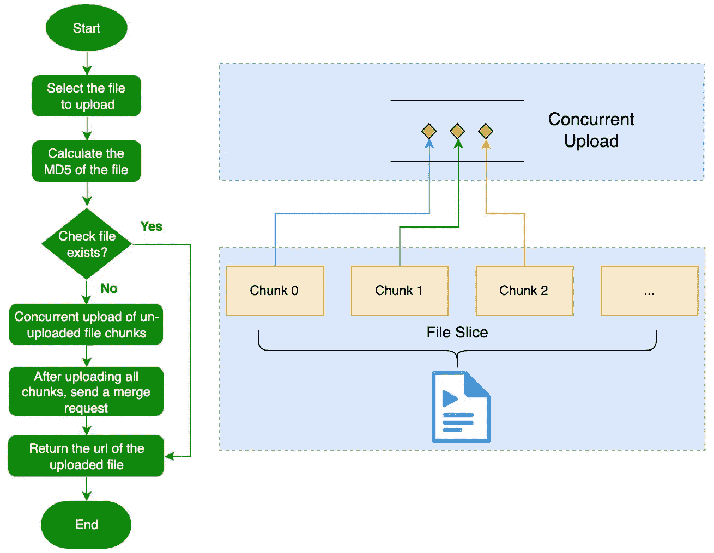

# 文件上传，掌握这 8 个场景就够了

> 原文：<https://javascript.plainenglish.io/file-upload-mastering-these-8-scenarios-is-enough-ef392eda7e68?source=collection_archive---------6----------------------->

## 令人惊讶的是，有 8 种上传文件到服务器的方式，每种方式背后都有不同的技术，其中很多值得我们关注。


Photo by [Compare Fibre](https://unsplash.com/es/@comparefibre?utm_source=medium&utm_medium=referral) on [Unsplash](https://unsplash.com?utm_source=medium&utm_medium=referral)

web 项目开发过程中，文件上传主要有 **8** 种场景，每种场景使用的技术不同，有很多细节需要我们额外注意。

在本文中，我将带您总结这些 **8** 场景。阅读本文后，您将掌握单文件上传、多文件上传、**目录上传、**、**压缩目录上传、**、拖拽上传、**剪贴板上传、**、**大文件并发上传、**以及服务器端上传的相关内容。

# 1.单个文件上传

对于单个文件上传场景，最常见的就是图片上传场景，那么我们就以图片上传为例，先介绍一下单个文件上传的基本流程。

## **1.1 Html 代码**

```
<input id="uploadFile" type="file" accept="image/*" />
<button id="submit" onclick="uploadFile()">Upload</button>h
```

在上面的代码中，我们通过 input 元素的`accept`属性来限制上传文件的类型。使用此处的`image/*`限制仅选择图像文件。当然也可以设置具体的类型，比如`image/png` image/png 或者`image/png,image/jpeg`。

注意，虽然我们将输入元素的`accept`属性设置为`image/png`，但是如果用户将`jpg/jpeg`格式图像后缀更改为`.png`，就可以成功绕过这一限制。为了解决这个问题，我们可以通过读取文件中的二进制数据来识别正确的文件类型。如果你想知道更多关于它是如何实现的，你可以阅读下面的文章:

[](https://medium.com/frontend-canteen/how-to-detect-file-type-using-javascript-251f67679035) [## 如何用 JavaScript 检测文件类型？

### 不要被文件后缀所迷惑！这篇文章向您展示了如何使用 JavaScript 获得文件的真实类型！

medium.com](https://medium.com/frontend-canteen/how-to-detect-file-type-using-javascript-251f67679035) 

## **1.2 JS 代码**

```
const uploadFileEle = document.querySelector("#uploadFile");

const request = axios.create({
  baseURL: "http://localhost:3000/upload",
  timeout: 60000, 
});

async function uploadFile() {
  if (!uploadFileEle.files.length) return;
  const file = uploadFileEle.files[0];
  // Ignore the file verification process, such as file type, size verification
  upload({
    url: "/single",
    file,
  });
}

function upload({ url, file, fieldName = "file" }) {
  let formData = new FormData();
  formData.set(fieldName, file);
  request.post(url, formData, {
    // Monitor upload progress
    onUploadProgress: function (progressEvent) {
      const percentCompleted = Math.round(
        (progressEvent.loaded * 100) / progressEvent.total
      );
      console.log(percentCompleted);
     },
  });
}
```

在上面的代码中，我们首先将 read `File`对象封装成一个`FormData`对象，然后使用 Axios 实例的`post`方法实现文件上传功能。在上传之前，我们可以通过设置请求配置对象的`onUploadProgress`属性来获取文件上传的进度。

在我们有了客户端上传文件的代码后，我们将使用 [**Koa**](https://koajs.com/) 构建一个文件服务，并使用以下中间件实现相应的功能:

*   koa-static:处理静态资源的中间件；
*   @koa/cors:处理跨域请求的中间件；
*   @koa/multer:处理`multipart/form-data`的中间件；
*   @koa/router:处理路由的中间件。

## **1.3 服务器端代码**

```
const path = require("path");
const Koa = require("koa");
const serve = require("koa-static");
const cors = require("@koa/cors");
const multer = require("@koa/multer");
const Router = require("@koa/router");

const app = new Koa();
const router = new Router();
const PORT = 3000;

// The URL address of the uploaded resource
const RESOURCE_URL = `http://localhost:${PORT}`;

// Directory to store uploaded files
const UPLOAD_DIR = path.join(__dirname, "/public/upload");

const storage = multer.diskStorage({
  destination: async function (req, file, cb) {
    // Set file storage directory
    cb(null, UPLOAD_DIR);
  },
  filename: function (req, file, cb) {
    // Set file name
    cb(null, `${file.originalname}`);
  },
});

const multerUpload = multer({ storage });

router.get("/", async (ctx) => {
  ctx.body = "Welcome to File Services（by Bytefer）";
});

router.post(
  "/upload/single",
  async (ctx, next) => {
    try {
      await next();
      ctx.body = {
        code: 1,
        msg: "File upload successfully",
        url: `${RESOURCE_URL}/${ctx.file.originalname}`,
      };
    } catch (error) {
      ctx.body = {
        code: 0,
        msg: "File upload failed"
      };
    }
  },
  multerUpload.single("file")
);

// Register middlewares
app.use(cors());
app.use(serve(UPLOAD_DIR));
app.use(router.routes()).use(router.allowedMethods());

app.listen(PORT, () => {
  console.log(`app starting at port ${PORT}`);
});
```

上面的代码比较简单， [**Koa**](https://koajs.com/) 内核很简单，扩展的功能通过中间件实现。例如，示例中使用的路由、CORS、静态资源处理和其他功能都是通过中间件实现的。因此，要掌握 [**Koa**](https://koajs.com/) 框架，核心就是要掌握它的中间件机制。其实除了单个文件上传，在文件上传场景中，我们也可以同时上传多个文件。

# 2.多文件上传

要上传多个文件，首先我们需要允许用户同时选择多个文件。为此，我们可以使用 input 元素的`multiple`属性。

## **2.1 Html 代码**

与单文件上传的代码相比，多文件上传场景中的 input 元素增加了一个`multiple`属性:

```
<input id="uploadFile" type="file" accept="image/*" multiple />
<button id="submit" onclick="uploadFile()">Upload</button>
```

## **2.2 JS 代码**

在单个文件上传的代码中，我们通过`uploadFileEle.files[0]`获取单个文件，多文件上传需要获取选中文件的列表，也就是通过`uploadFileEle.files`，返回一个 [FileList](https://developer.mozilla.org/en-US/docs/Web/API/FileList) 对象。

```
async function uploadFile() {
  if (!uploadFileEle.files.length) return;
  const files = Array.from(uploadFileEle.files);
  upload({
    url: "/multiple",
    files,
  });
}
```

因为我们希望支持上传多个文件，所以需要更新上传功能。对应的处理逻辑是遍历文件列表，然后使用`FormData`对象的`append`方法添加多个文件。具体代码如下:

```
function upload({ url, files, fieldName = "file" }) {
  let formData = new FormData();
  files.forEach((file) => {
    formData.append(fieldName, file);
  });
  request.post(url, formData, {
    // Monitor upload progress
    onUploadProgress: function (progressEvent) {
      const percentCompleted = Math.round(
        (progressEvent.loaded * 100) / progressEvent.total
      );
      console.log(percentCompleted);
    },
  });
}
```

## 2.3 服务器端代码

在下面的代码中，我们定义了一个新的路由— `/upload/multiple`来处理多个文件上传的功能。当所有文件成功上传后，它将返回已上传文件的 url 列表:

```
router.post(
  "/upload/multiple",
  async (ctx, next) => {
    try {
      await next();
      urls = ctx.files.file.map(file => `${RESOURCE_URL}/${file.originalname}`);
      ctx.body = {
        code: 1,
        msg: "File upload successfully",
        urls
      };
    } catch (error) {
      ctx.body = {
        code: 0,
        msg: "File upload failed",
      };
    }
  },
  multerUpload.fields([
    {
      name: "file", // Corresponds to the fieldName of the FormData form item
    },
  ])
);
```

介绍完单文件和多文件上传的功能后，再来介绍目录上传的功能。

# 3.D **目录上传**

如果您不知道，input 元素上有一个`webkitdirectory`属性。一旦设置了`webkitdirectory`属性，我们就可以选择目录了。

```
<input id="uploadFile" type="file" accept="image/*" webkitdirectory />
```

当我们选择指定的目录时，比如我的电脑桌面上的`cover`目录，会显示如下确认框:


点击上传按钮后，我们可以得到文件列表。列表中的 file 对象包含一个代表当前文件相对路径的`webkitRelativePath`属性。


虽然通过`webkitdirectory`属性可以轻松实现选择目录的功能，但是在实际项目中我们还需要考虑它的[兼容性](https://caniuse.com/?search=webkitdirectory)。比如 IE 11 以下的版本就不支持这个属性。

## 3.1 JS 代码

为了让服务器根据实际的目录结构存储相应的文件，我们需要在添加表单项时向服务器提交当前文件的路径。此外，为了确保`@koa/multer`正确处理文件的路径，我们需要对路径进行特殊处理。也就是说，用`@`符号替换`/`斜线。

```
function upload({ url, files, fieldName = "file" }) {
  let formData = new FormData();
  files.forEach((file, i) => {
    formData.append(
      fieldName, 
      files[i],
      files[i].webkitRelativePath.replace(/\//g, "@");
    );
  });
  request.post(url, formData); 
}
```

## 3.2 服务器端代码

目录上传和多文件上传的主要区别在于`@koa/multer`中间件的配置对象不同。在 destination 属性对应的函数中，我们需要将文件名中的`@`恢复为`/`，然后根据文件的实际路径生成目录。

```
const fse = require("fs-extra");
const storage = multer.diskStorage({
  destination: async function (req, file, cb) {
    // images@image-1.jpeg => images/image-1.jpeg
    let relativePath = file.originalname.replace(/@/g, path.sep);
    let index = relativePath.lastIndexOf(path.sep);
    let fileDir = path.join(UPLOAD_DIR, relativePath.substr(0, index));
    // Make sure the file directory exists, if not, it will be created automatically
    await fse.ensureDir(fileDir); 
    cb(null, fileDir);
  },
  filename: function (req, file, cb) {
    let parts = file.originalname.split("@");
    cb(null, `${parts[parts.length - 1]}`); 
  },
});
```

现在已经实现了目录上传的功能，是否可以将目录中的文件压缩成压缩包再上传？答案是肯定的，那么我们就来介绍一下如何实现上传压缩目录的功能。

# **4。压缩目录上传**

利用 [**JSZip**](https://stuk.github.io/jszip/) 库提供的 API，我们可以将目录中的所有文件压缩成一个 Zip 文件，然后将生成的 ZIP 文件上传到服务器。

## 4.1 JS 代码

JSZip 实例上的`file(name, data[,options])`方法可以将文件添加到 Zip 文件中。基于这个方法，我们可以封装一个`generateZipFile`函数，将目录中的文件列表压缩成一个 ZIP 文件。下面是`generateZipFile`功能的具体实现:

```
function generateZipFile(
  zipName, files,
  options = { type: "blob", compression: "DEFLATE" }
) {
  return new Promise((resolve, reject) => {
    const zip = new JSZip();
    for (let i = 0; i < files.length; i++) {
      zip.file(files[i].webkitRelativePath, files[i]);
    }
    zip.generateAsync(options).then(function (blob) {
      zipName = zipName || Date.now() + ".zip";
      const zipFile = new File([blob], zipName, {
        type: "application/zip",
      });
      resolve(zipFile);
    });
  });
}
```

创建了`generateZipFile`函数后，我们需要更新之前介绍的`uploadFile`函数:

```
async function uploadFile() {
  let fileList = uploadFileEle.files;
  if (!fileList.length) return;
  let webkitRelativePath = fileList[0].webkitRelativePath;
  let zipFileName = webkitRelativePath.split("/")[0] + ".zip";
  let zipFile = await generateZipFile(zipFileName, fileList);
  upload({
    url: "/single",
    file: zipFile,
    fileName: zipFileName
  });
}
```

在上面的`uploadFile`函数中，我们将处理返回的 FileList 对象，即调用`generateZipFile`函数生成 ZIP 文件。另外，为了在服务器接收压缩文件时获取文件名，我们在 upload 函数中增加了一个`fileName`参数，用于在调用`formData.append`方法时设置上传文件的文件名:

```
function upload({ url, file, fileName, fieldName = "file" }) {
  if (!url || !file) return;
  let formData = new FormData();
  formData.append(
    fieldName, file, fileName
  );
  request.post(url, formData);
}
```

以上是压缩目录上传，客户端部分的 JS 代码，服务端的代码可以参考上面单个文件上传的相关代码。

# 5.拖放上传

要实现拖放上传的功能，首先需要了解与拖放相关的事件。如`drag`、`dragend`、`dragenter`、`dragover`或`drop`事件等。这里我们只介绍接下来要用到的拖动事件:

*   `dragenter`:当一个元素或选中的文本被拖动到一个可释放的目标时触发；
*   `dragover`:当一个元素或者选中的文本被拖到一个可释放的目标上时触发(每 100ms)；
*   `dragleave`:当拖动的元素或选择的文本离开一个可释放的目标时触发；
*   `drop`:在可释放目标上释放元素或选定文本时触发。

我们可以基于上述事件来改善用户的拖放体验。**例如，当用户拖动的元素进入目标区域时，目标区域高亮显示。当用户拖动的元素离开目标区域时，取消突出显示。**显然，当 drop 事件被触发时，被拖动的元素已经被放置在目标区域，这时我们需要获取相应的数据。

那么如何获取拖拽对应的数据呢？此时我们需要使用`[DataTransfer](https://developer.mozilla.org/en-US/docs/Web/API/DataTransfer)`对象，它用于在拖放过程中保存数据。它可以保存一个或多个数据项，这些数据项可以是一种或多种数据类型。如果拖动操作包括拖动文件，我们可以通过`[DataTransfer](https://developer.mozilla.org/en-US/docs/Web/API/DataTransfer)`对象的 files 属性获得文件列表。

介绍完拖拽上传的相关知识，我们再来看看如何实现拖拽上传的功能。

## 5.1 Html 代码

```
<div id="dropArea">
   <p>Drag and drop to upload file</p>
   <div id="imagePreview"></div>
</div>
```

## 5.2 CSS 代码

```
#dropArea {
  width: 300px;
  height: 300px;
  border: 1px dashed gray;
  margin-bottom: 20px;
}

#dropArea p {
  text-align: center;
  color: #999;
}

#dropArea.highlighted {
  background-color: #ddd;
}

#imagePreview {
  max-height: 250px;
  overflow-y: scroll;
}

#imagePreview img {
  width: 100%;
  display: block;
  margin: auto;
}
```

## 5.3 JS 代码

为了让大家更好的阅读拖放上传的相关代码，我们将代码拆分成 4 部分来讲解:

**1。防止默认拖放行为**

```
const dropAreaEle = document.querySelector("#dropArea");
const imgPreviewEle = document.querySelector("#imagePreview");
const IMAGE_MIME_REGEX = /^image\/(jpe?g|gif|png)$/i;

["dragenter", "dragover", "dragleave", "drop"].forEach((eventName) => {
   dropAreaEle.addEventListener(eventName, preventDefaults, false);
   document.body.addEventListener(eventName, preventDefaults, false);
});

function preventDefaults(e) {
  e.preventDefault();
  e.stopPropagation();
}
```

**2。切换目标区域的高亮状态**

```
["dragenter", "dragover"].forEach((eventName) => {
    dropAreaEle.addEventListener(eventName, highlight, false);
});
["dragleave", "drop"].forEach((eventName) => {
    dropAreaEle.addEventListener(eventName, unhighlight, false);
});

// Add highlight style
function highlight(e) {
  dropAreaEle.classList.add("highlighted");
}

// Remove highlight style
function unhighlight(e) {
  dropAreaEle.classList.remove("highlighted");
}
```

**3。过程图像预览**

```
dropAreaEle.addEventListener("drop", handleDrop, false);

function handleDrop(e) {
  const dt = e.dataTransfer;
  const files = [...dt.files];
  files.forEach((file) => {
    previewImage(file, imgPreviewEle);
  });
}

function previewImage(file, container) {
  if (IMAGE_MIME_REGEX.test(file.type)) {
    const reader = new FileReader();
    reader.onload = function (e) {
      let img = document.createElement("img");
      img.src = e.target.result;
      container.append(img);
    };
    reader.readAsDataURL(file);
  }
}
```

**4。上传文件**

```
function handleDrop(e) {
  const dt = e.dataTransfer;
  const files = [...dt.files];
  // Omit image preview code
  files.forEach((file) => {
    upload({
      url: "/single",
      file,
    });
  });
}

const request = axios.create({
  baseURL: "http://localhost:3000/upload",
  timeout: 60000,
});

function upload({ url, file, fieldName = "file" }) {
  let formData = new FormData();
  formData.set(fieldName, file);
  request.post(url, formData, {
    // Monitor upload progress
    onUploadProgress: function (progressEvent) {
      const percentCompleted = Math.round(
        (progressEvent.loaded * 100) / progressEvent.total
      );
      console.log(percentCompleted);
    },
  });
}
```

拖拽上传是比较常见的场景，很多成熟的上传组件都支持这个功能。其实除了拖拽上传，还可以使用**剪贴板**来实现复制上传的功能。

# 6.C **立牌上传**

在介绍如何实现剪贴板上传功能之前，我们需要了解一下`Clipboard` API。如果用户授予适当的权限，`Clipboard`接口实现了`Clipboard` API，提供了对系统剪贴板的读写访问。在 web 应用程序中，`Clipboard` API 可以用来实现剪切、复制和粘贴功能。该 API 用于通过`document.execCommand` API 替换剪贴板操作。

在实际项目中，我们不需要手动创建剪贴板对象，而是通过`navigator.clipboard`获取`Clipboard`对象:


得到`Clipboard`对象后，我们可以使用对象提供的 API 来访问剪贴板，比如:

```
navigator.clipboard.readText().then(
  clipText => document.querySelector(".editor").innerText = clipText
);
```

上面的代码用剪贴板的内容替换了 HTML 中第一个元素的内容。如果剪贴板是空的，或者不包含任何文本，元素的内容将被清空。这是因为当剪贴板为空或者不包含文本时，`readText`方法返回一个空字符串。

使用`Clipboard` API，我们可以轻松操作剪贴板，但是在实际项目使用过程中还必须考虑其 [**兼容性**](https://caniuse.com/async-clipboard) 。

要实现剪贴板上传功能，可以分为以下 3 个步骤:

*   侦听容器的粘贴事件；
*   读取并解析剪贴板的内容；
*   动态构建 FormData 对象并上传它。

了解以上步骤后，我们来分析一下具体的实现代码。

## 6.1 Html 代码

```
<div id="uploadArea">
   <p>Please copy the image before you paste it</p>
</div>
```

## 6.2 CSS 代码

```
#uploadArea {
   width: 400px;
   height: 400px;
   border: 1px dashed gray;
   display: table-cell;
   vertical-align: middle;
}
#uploadArea p {
   text-align: center;
   color: #999;
}
#uploadArea img {
   max-width: 100%;
   max-height: 100%;
   display: block;
   margin: auto;
}
```

## 6.3 JS 代码

在下面的代码中，我们使用`addEventListener`方法向 uploadArea 容器添加一个粘贴事件。在相应的事件处理程序中，我们首先会判断当前浏览器是否支持异步`Clipboard` API。如果支持，剪贴板的内容将通过`navigator.clipboard.read`方法读取。在读取内容后，我们会通过正则性来判断剪贴板项是否包含图片资源，如果是，我们会调用`previewImage`方法来执行图片预览操作，并保存返回的 blob 对象，以供后续上传操作使用。

```
const IMAGE_MIME_REGEX = /^image\/(jpe?g|gif|png)$/i;
const uploadAreaEle = document.querySelector("#uploadArea");

uploadAreaEle.addEventListener("paste", async (e) => {
  e.preventDefault();
  const files = [];
  if (navigator.clipboard) {
    let clipboardItems = await navigator.clipboard.read();
    for (const clipboardItem of clipboardItems) {
      for (const type of clipboardItem.types) {
        if (IMAGE_MIME_REGEX.test(type)) {
           const blob = await clipboardItem.getType(type);
           insertImage(blob, uploadAreaEle);
           files.push(blob);
         }
       }
     }
  } else {
      const items = e.clipboardData.items;
      for (let i = 0; i < items.length; i++) {
        if (IMAGE_MIME_REGEX.test(items[i].type)) {
          let file = items[i].getAsFile();
          insertImage(file, uploadAreaEle);
          files.push(file);
        }
      }
  }
  if (files.length > 0) {
    confirm("The clipboard detects the image file, whether to perform the upload operation?") 
      && upload({
           url: "/multiple",
           files,
         });
   }
});
```

如果当前浏览器不支持异步`Clipboard` API，我们将尝试通过`e.clipboardData.items`访问剪贴板内容。需要注意的是，在遍历剪贴板内容项时，我们通过`getAsFile`方法获取剪贴板的内容。当然，这种方法也有 [**兼容性**](https://caniuse.com/mdn-api_datatransferitem_getasfile) 的问题。

如前所述，当从剪贴板解析到图像资源时，用户将能够预览它。该功能基于`FileReader` API 实现。对应的代码如下:

```
function previewImage(file, container) {
  const reader = new FileReader();
  reader.onload = function (e) {
    let img = document.createElement("img");
    img.src = e.target.result;
    container.append(img);
  };
  reader.readAsDataURL(file);
}
```

当用户预览完成后，如果上传被确认，我们将执行文件上传操作。由于文件是从剪贴板中读取的，**在上传之前，我们会根据文件的类型**自动为其生成一个文件名，文件名的形式为时间戳和文件后缀:

```
function upload({ url, files, fieldName = "file" }) {
  let formData = new FormData();
  files.forEach((file) => {
    let fileName = +new Date() + "." + IMAGE_MIME_REGEX.exec(file.type)[1];
    formData.append(fieldName, file, fileName);
  });
  request.post(url, formData);
}
```

我们已经介绍了文件上传的各种不同场景，现在让我们介绍一个“特殊”场景—大文件上传。

# 7.大文件的并发上传

也许你也知道上传大文件的解决方案。为了提高上传的效率，我们一般使用`Blob.slice`的方法，将大文件按照指定的大小进行切片，然后并发上传文件块。**所有组块上传成功后，通知服务器合并组块。**


具体处理方案如下图所示:



了解核心流程后，具体实现可以看我之前写的文章:

[](/implement-concurrent-upload-of-large-files-in-javascript-53519a0d2eee) [## 用 JavaScript 实现大文件的并发上传

### 用动画演示，实现基于 JavaScript 的并发控制，从而实现…的并发上传

javascript.plainenglish.io](/implement-concurrent-upload-of-large-files-in-javascript-53519a0d2eee) 

我们之前介绍过客户端的文件上传场景，但是也有服务器端的文件上传场景。比如在服务器上动态生成海报后，上传到另一台服务器或者云厂商的 OSS(对象存储服务)。下面以 Node.js 为例，介绍一下如何在服务器上上传文件。

# 8.服务器端上传

服务器上传是将文件从一台服务器上传到另一台服务器。借助 Github 上`[**form-data**](https://github.com/form-data/form-data)`库提供的函数，我们可以轻松实现服务器上传功能。下面简单介绍一下单文件和多文件上传的功能:

## 8.1 单个文件上传

```
const fs = require("fs");
const path = require("path");
const FormData = require("form-data");

const form1 = new FormData();
form1.append("file", fs.createReadStream(path.join(__dirname, "images/image-1.jpeg")));
form1.submit("http://localhost:3000/upload/single", (error, response) => {
  if(error) {
    console.log("Single image upload failed");
    return;
  }
  console.log("Single image uploaded successfully");
});
```

## 8.2 多文件上传

```
const form2 = new FormData();
form2.append("file", fs.createReadStream(path.join(__dirname, "images/image-2.jpeg")));
form2.append("file", fs.createReadStream(path.join(__dirname, "images/image-3.jpeg")));
form2.submit("http://localhost:3000/upload/multiple", (error, response) => {
  if(error) {
    console.log("Failed to upload multiple images");
    return;
  }
  console.log("Multiple images uploaded successfully");
});
```

从上面的代码可以看出，创建了`FormData`对象后，我们只需要通过`fs.createReadStream` API 创建一个可读的流，然后调用 FormData 对象的 append 方法添加表单项，最后调用 submit 方法执行提交操作。

事实上，除了`ReadableStream`，`FormData`对象的`append`方法还支持以下类型:

```
const FormData = require('form-data');
const http = require('http');

const form = new FormData();
http.request('http://nodejs.org/images/logo.png', function(response) {
  form.append('my_field', 'my value');
  form.append('my_buffer', new Buffer(10));
  form.append('my_logo', response);
});
```

这里介绍服务器端文件上传的内容。对于`form-data`库的其他用途，如果有兴趣可以阅读相应的使用文档。其实除了上面介绍的 8 种场景，在你的日常工作中，你可能还会用到一些同步工具，比如 [**Syncthing**](https://github.com/syncthing/syncthing) 文件同步工具来实现文件传输。好了，这篇文章的内容都介绍完了，最后来做个总结。

> 完整代码:[文件-上传-演示](https://github.com/semlinker/file-upload-demos)

# 摘要

在这篇文章中，我详细介绍了文件上传的 8 个场景。希望看完这篇文章，你对 8 个场景背后的技术有一定的了解。由于篇幅有限，我就不介绍与`multipart/form-data`类型相关的内容了，大家可以看看相关的文章。

另外，在实际项目中，可以考虑直接使用成熟的第三方组件，比如 Github 上 13K+星的[**【file pond**](https://github.com/pqina/filepond)。该组件采用插件架构，以插件的形式提供许多功能，如**文件编码、文件重命名、文件海报、图像预览和图像裁剪**。

如果你想学习打字稿，那么就不要错过**掌握打字稿**系列。

[](https://medium.com/frontend-canteen/with-these-articles-you-will-not-be-confused-when-learning-typescript-d96a5c99e229) [## 有了 30+篇文章，学习 TypeScript 就不会迷茫了

### 通过生动的动画，让你轻松了解 TypeScript 的难点和核心知识！不断地…

medium.com](https://medium.com/frontend-canteen/with-these-articles-you-will-not-be-confused-when-learning-typescript-d96a5c99e229) 

在 [Medium](https://medium.com/@bytefer) 或 [Twitter](https://twitter.com/Tbytefer) 上关注我，阅读更多关于 TS 和 JS 的内容！

*更多内容请看*[***plain English . io***](https://plainenglish.io/)*。报名参加我们的* [***免费周报***](http://newsletter.plainenglish.io/) *。关注我们上*[***Twitter***](https://twitter.com/inPlainEngHQ)[***LinkedIn***](https://www.linkedin.com/company/inplainenglish/)*[***YouTube***](https://www.youtube.com/channel/UCtipWUghju290NWcn8jhyAw)**和* [***不和***](https://discord.gg/GtDtUAvyhW) *对成长黑客感兴趣？检查* [***电路***](https://circuit.ooo/) ***。*****