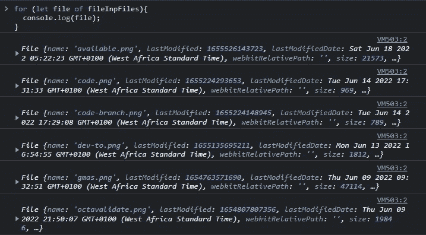

# 使用 JavaScript 中的 FileList API 进行文件验证

> 原文：<https://javascript.plainenglish.io/file-validation-using-the-filelist-api-in-javascript-ab0373d61ff0?source=collection_archive---------5----------------------->

## JavaScript 中的 FileList API 有什么功能以及如何使用它。

Photo by Joan Gamell on Unsplash

FileList API 使您能够完全控制用户选择的文件，通过它，您可以执行文件验证。

我将向您展示一些可以使用 FileList API 在文件上验证的东西。

假设我有一个文件输入如下:

当我重新加载我的 HTML 页面并选择一些图像时，这就是我如何将所选文件作为一个对象进行检索。

以下是预告:

您可以看到，文件列表是一个内部具有其他属性的对象。

在文件列表对象中:

*   您可以通过`length`属性检索用户选择的文件数量。
*   您可以使用数字索引`0...(length - 1)`获得关于所选文件的更多信息

从上图中，你可以看到长度是 6，这意味着用户选择了 **6 个文件**。因此，这些文件的索引为 **0 到(6–1)ie 0 到 5** 。

如果您想遍历用户选择的每个文件，这将非常有用。

# 文件列表 API 对象属性

现在让我们更多地讨论包含在所选文件中的属性。

*   最后修改`timestamp`

这是作为时间戳提供的文件的最后修改日期。

*为了控制日期，将时间戳传递给日期构造函数。*

*   最后修改日期`Date`

这是文件上次修改的完整日期。

*   姓名`string`

这是文件的名称。

*   尺寸`integer`

这是文件的大小，以字节为单位。

*   类型`string`

这是文件的 MIME 类型。

概括地说，下面的图片显示了文件列表 API 的属性:

# 循环浏览文件

现在，让我们学习如何遍历用户选择的每个文件，并对它们执行验证。

FileList Api 将数据作为对象提供，因此我们需要编写一个循环来遍历这个对象并检索我们需要的数据。

如果你还没有看过我之前的一篇关于如何在 JavaScript 中遍历对象的文章，[这里有一篇文章](https://simon-ugorji.medium.com/how-to-loop-through-an-object-in-javascript-e1625a5bc3e7)的链接。

当您执行上面的代码时，您将看到我们能够遍历对象并输出每个文件。

现在我们已经准备好验证文件了。

# 确认

## 尺寸验证

回想一下，特定文件的大小作为`bytes`返回。

假设允许用户选择不超过 2MB 的文件，这就是我将如何执行验证。

*   将 2MB 转换为字节。
*   遍历文件并保存它们的大小。
*   检查总大小是否大于 2MB。

## 类型验证

现在，假设只允许用户选择图像文件，这就是我执行验证的方式。

*   创建一个存储图像文件类型的数组。
*   遍历文件，检查是否有任何文件不符合所需的类型。

当我选择一些不支持的文件时，会发生以下情况。

## 文件扩展名验证

对于我的最后一次验证，我希望用户提供扩展名为”的文件。png，。jpg，。jpeg”，任何与扩展名不匹配的文件都将被标记为不支持的文件类型。

为了执行此验证，我将:

*   将所需的文件扩展名存储在数组中。
*   遍历文件并检索它们的名称。
*   从名称中提取文件扩展名，然后将其与所需的文件扩展名进行比较。

当我选择不支持的文件时，会发生以下情况:

我希望通过我们在这里做的小练习，您能够完全理解 JavaScript 中的 FileList API 的功能，包括如何使用它。

我希望您能为这篇文章做出贡献。

# 额外的

我在 NPM 上构建并启动了一个 JavaScript 库，它能够使用正则表达式、验证规则和表单输入属性来验证您的前端表单。

使用这个库，您可以验证所有类型的表单输入，包括文件验证和长度验证。

*   看看 NPM 的这个图书馆:

 [## octavalidate

### 这个库使用验证规则、复杂的正则表达式和表单输入来帮助验证你的 HTML 表单…

www.npmjs.com](https://www.npmjs.com/package/octavalidate) 

*   在 GitHub 上查看这个库:

 [## 这个库有助于验证你的 HTML 表单，使用…

### 这个库使用验证规则、复杂的正则表达式和表单输入来帮助验证你的 HTML 表单…

github.com](https://github.com/Octagon-simon/octaValidate) 

*   查看文档:

 [## octaValidate:入门

### 欢迎来到这个伟大的库，它使用验证规则、复杂的常规…

八角形-simon.github.io](https://octagon-simon.github.io/projects/octavalidate/) 

谢谢你。

*更多内容请看*[***plain English . io***](https://plainenglish.io/)*。报名参加我们的* [***免费周报***](http://newsletter.plainenglish.io/) *。关注我们关于*[***Twitter***](https://twitter.com/inPlainEngHQ)**和*[***LinkedIn***](https://www.linkedin.com/company/inplainenglish/)*。查看我们的* [***社区不和谐***](https://discord.gg/GtDtUAvyhW) *加入我们的* [***人才集体***](https://inplainenglish.pallet.com/talent/welcome) *。**