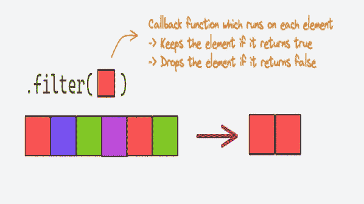
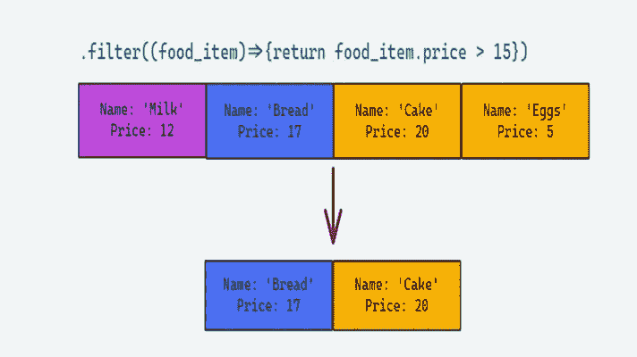

# 过滤 JavaScript 数组中的元素

> 原文：<https://javascript.plainenglish.io/filtering-elements-in-javascript-array-1adc9472d1fd?source=collection_archive---------12----------------------->

## 了解如何使用 JavaScript 过滤器数组方法



我们都在购物网站上看到过帮助我们更容易搜索商品的过滤器，JavaScript filter 方法使我们能够做到这一点。

在本文中，我们将首先讨论什么是`filter()`方法，然后看一些例子来看看它是如何工作的。

# JavaScript filter 方法是做什么的？

`filter()`方法根据特定条件过滤数组数据。它的工作方式是获取满足条件的元素，并在一个新的数组中返回它们。

在内部，`filter()`方法遍历每个元素，并将其传递给回调函数。如果回调函数返回 true，它将包含在返回数组中。

# filter()方法的语法

```
array.filter(function callbackfn(value, index, arr), thisValue);
```

这里的`array`指的是我们想要过滤的原始数组。

## 因素

1.  `callbackfn` **(必选)-** 用于过滤数组中数值的函数。
    a. `value` **(必选)-** 数组中正在处理的当前项。
    b. `index` **(可选)-** 正在处理的数组中当前项的索引。
    c .`arr`(可选)- 调用`filter()`方法的数组。

2.`thisValue` **(可选)-** 执行`callbackFn`时用作`this`的值

# 例子

为了巩固我们所学的，让我们从一组简单的数字开始。

所以，让我们用一组数字来过滤掉所有的奇数

```
**let** numbers = [0, 2, 5, 12, 17, 20];**let** odd_numbers = numbers.**filter**((value) => { 
                    **return** value % 2 == 1;}); console.**log**(odd_numbers);  
//Output = [5, 17]
```


如你所见，我们已经定义了一个函数，它只在数字为奇数时返回 true。

现在，让我们看一个例子，在这个例子中，我们对一个对象数组使用了`filter()`方法。

假设我们有一系列食品，我们想过滤价格超过 15 美元的商品。

```
**let** food_items = [{name: "Milk", price: 12},{name: "Bread", price: 17}, {name: "Cake", price: 20}, {name: "Eggs", price: 5}]; **let** filtered_food_items = food_items.**filter**((food_item) => {     
                          **return** food_item.price > 15; });

console.**log**(filtered_food_items); //Output = [{name: "Bread", price: 17}, {name: "Cake", price: 20}]
```



如您所见，一旦我们理解了`filter()`方法，代码就非常简单了。

在我们结束之前，一定要记住保存过滤后的数组。filter 方法不会改变原始数组。

我希望你已经发现这是有用的。感谢您的阅读。

*更多内容请看*[***plain English . io***](https://plainenglish.io/)*。报名参加我们的* [***免费周报***](http://newsletter.plainenglish.io/) *。关注我们上*[***Twitter***](https://twitter.com/inPlainEngHQ)[***LinkedIn***](https://www.linkedin.com/company/inplainenglish/)*[***YouTube***](https://www.youtube.com/channel/UCtipWUghju290NWcn8jhyAw)**和* [***不和***](https://discord.gg/GtDtUAvyhW) *对成长黑客感兴趣？检查* [***电路***](https://circuit.ooo/) ***。*****