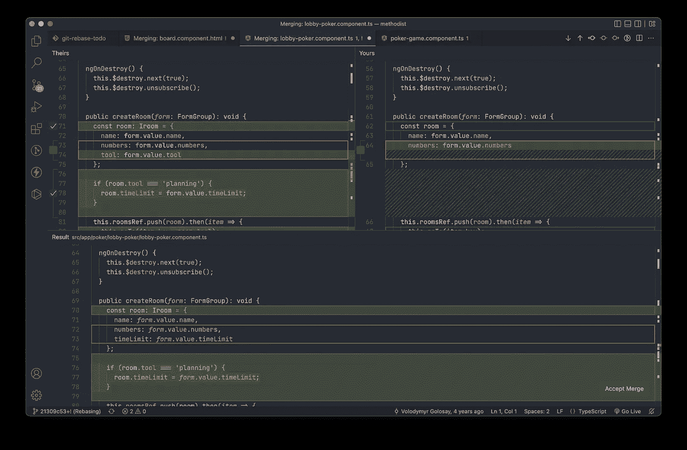
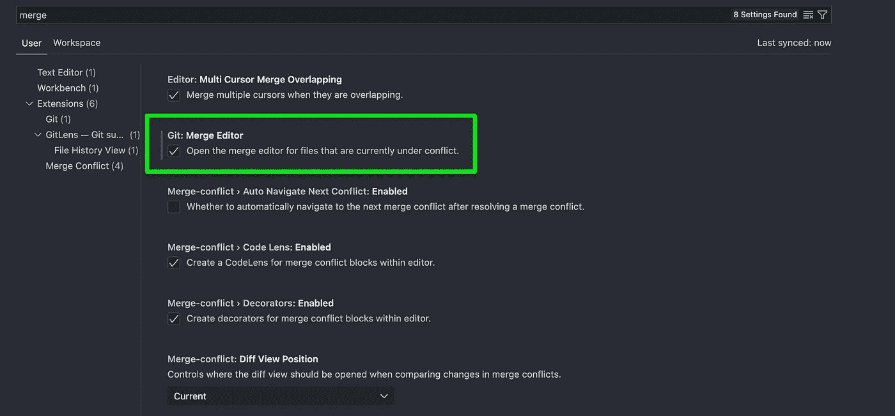
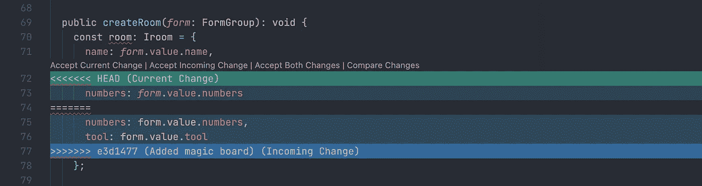
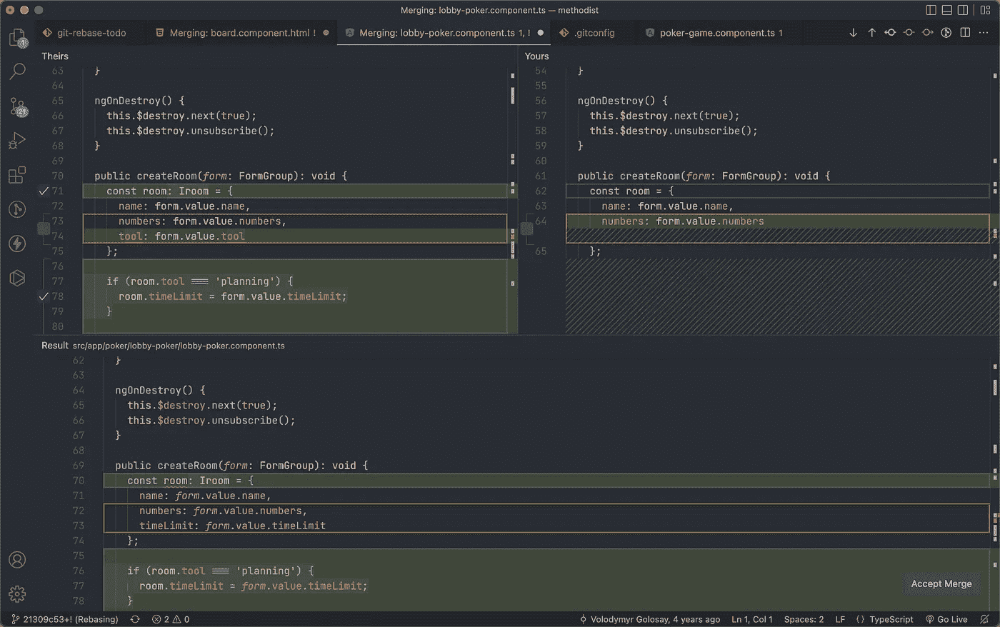
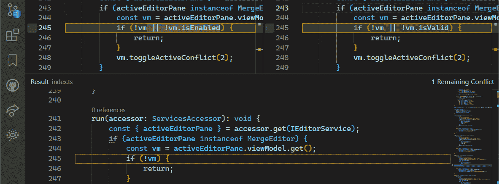
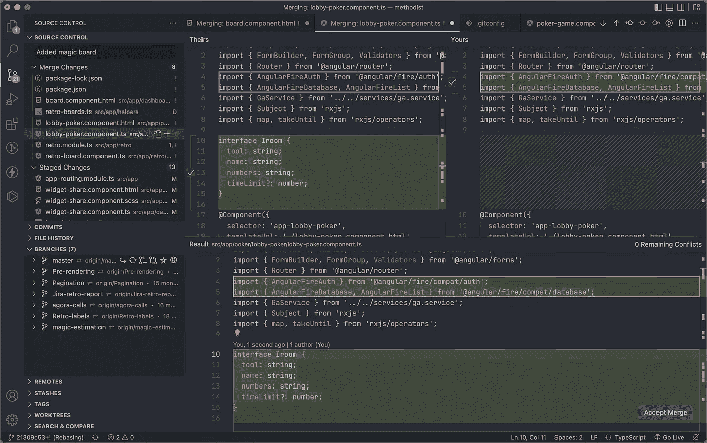

# 最终发布:VS 代码中的 3 列合并编辑器！

> 原文：<https://javascript.plainenglish.io/finally-released-3-column-merge-editor-in-vs-code-8490ef694b3a?source=collection_archive---------1----------------------->

## 使用 VS 代码相比 WebStorm 最大的弊端已经解决。



The 3-way merge editor in Visual Studio Code

我等这个功能已经等了这么多年了！这可能是阻止人们从 WebStorm 迁移到 VS 代码的最大障碍。现在，我们终于有了一个解决合并冲突的三向编辑器，在这里我们可以看到合并的当前、传入和最终结果。

我已经尝试在我的项目中使用不同的 brunches，并使用新的合并编辑器解决大量的合并冲突。所以让我们回顾一下这有多酷，还能更好吗？

首先，我们需要的是启用合并编辑器。目前，我们需要手动操作，但是在未来的版本中，默认情况下会启用它。打开设置，搜索合并编辑器，并将复选框设置为 true。



或者添加到 config.json 的行:`"git.mergeEditor": true`。

现在 VS 代码中的合并冲突将显示在新的合并编辑器中。

## 它是如何工作的

之前是这样的:



变成:



我们可以通过单击复选框从顶部选择任何代码块，该代码块将出现在结果面板中。开发人员可以像往常一样编辑结果。**所有代码编辑器特性，如自动完成、定位或格式化，都在这个面板中工作**。

我发现的一件很酷的事情是它如何自动合并对象。假设你有一个对象:

```
const room = {
  name: ''
};
```

您还添加了一个字段。而你的队友也增加了另一项财产。

```
// My changes
const room = {
  name: '',
  tool: 'planning'
};// Changes from my teammate
const room = {
  name: '',
  numbers: 'fibonacci'
};
```

如您所见，具有新对象属性的行不以逗号结尾。但是在通过 merge editor 选择了这两个更改之后，VS 代码可以智能地将这两个属性添加到结果中，并用逗号将它们分开。

```
// Result
const room = {
  name: '',
  numbers: 'fibonacci',
  tool: 'planning'
};
```

> 你可以说这是一个很小的特点。但是像这样的小事会严重影响我们的舒适度和表现。

还有，如果你和你的队友修改了同一行，VS 代码支持词级比较，尽可能尝试自动合并。



如果合并后应该先做什么是至关重要的，您仍然可以用命令交换单词。

别忘了，在任何错误的情况下，我们可以在结果面板中手动编辑它。幸运的是，我们可以通过点击复选框来合并冲突的主要部分。

## 有哪些可以改进的地方

我遇到的最大问题是突出显示已经合并的代码。即使它是自动解决的，不需要我的任何操作，合并编辑器也会用高亮背景和预先选中的复选框显示这些行。

我不需要突出显示，也不会取消选中它。例如，在传入的更改中，文件顶部有一个新的导入。它与我当前的更改没有冲突，git 设法自动解决了它。



在旧的方法中，VS 代码根本没有显示 git 自动解析的内容。Web Storm 甚至没有突出显示手动修复的冲突。

第二个问题不是一个真正的问题，而是一个功能请求。VS 代码有一个很好的交互式 rebase 视图，在这里你可以挤压或编辑你的提交。但是这个视图目前还没有与新的合并编辑器集成。

因此，在重新定基时，如果有任何冲突，您不能直接进入合并编辑器。但相反，你会看到一个空的交互式 rebase 工具。您需要检查左边的 git 选项卡，以了解您有冲突。在解决了所有冲突之后，它并不建议返回到 rebase 视图。

我希望在重置基础时自动看到合并编辑器，并在解决合并冲突后继续自动重置基础😊。

## 摘要

早先我写了一篇关于从 Web Storm 迁移到自由 VS 代码的教程，其中合并冲突解决可能是最棘手的部分。现在，这个话题解决了，我将使用 VS 代码作为我的项目的主要工具，即使有 Web Storm 许可证。

[](/how-to-switch-from-webstorm-to-vs-code-4e70c3025135) [## 如何从 WebStorm 切换到 VS 代码

### 提示、设置、插件、差异/合并工具等

javascript.plainenglish.io](/how-to-switch-from-webstorm-to-vs-code-4e70c3025135) 

我已经花了几个工作日使用新的合并编辑器，我很高兴！它工作速度快，清晰，非常人性化！👌

## 更新

如果出于某种原因，您需要禁用该功能并返回到以前的合并编辑器，只需再次进入设置并取消选中合并编辑器复选框。


嗨！非常感谢您阅读我的文章！如果你不是一个媒体成员，想要支持我，你可以通过[点击这个链接](https://golosay.medium.com/membership)来支持我。中型会员将允许你阅读我的帖子和其他人的帖子。再次感谢大家的支持！

*更多内容请看*[***plain English . io***](https://plainenglish.io/)*。报名参加我们的* [***免费周报***](http://newsletter.plainenglish.io/) *。关注我们关于*[***Twitter***](https://twitter.com/inPlainEngHQ)*和*[***LinkedIn***](https://www.linkedin.com/company/inplainenglish/)*。查看我们的* [***社区不和谐***](https://discord.gg/GtDtUAvyhW) *加入我们的* [***人才集体***](https://inplainenglish.pallet.com/talent/welcome) *。*