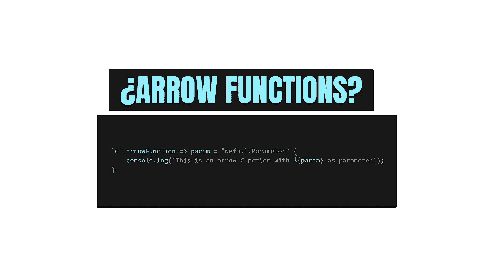

# JavaScript 中的箭头函数是什么

> 原文：<https://javascript.plainenglish.io/finally-understanding-the-arrow-functions-in-javascript-a47eb1f4dbae?source=collection_archive---------5----------------------->

## 了解如何声明箭头函数，成为更好的 web 开发人员。



如果你是一个初级的 JavaScript 开发者，或者你在过去看过一些 JavaScript 代码，你肯定见过箭头函数。但是你也见过保留字*函数*并且你可能见过一些函数是用 let 或 const 声明的。这是因为在 JavaScript 的历史中，有不同的方法来声明和使用函数。

目前，您可以使用几种方法来声明函数。让我给你看一些例子:

## 声明函数的不同方法:

```
function sumNumbers() {} ;
let newVar = function sumNumbers() {} ;
let newVar = (function () {}) ();
let newVar = params => params += 1 ; 
```

除了最后一种方法，以上方法都不难理解。这真的是一种声明函数的方式吗？在哪里指定它是一个函数？用箭头是什么意思？如果你有我过去的疑惑，请冷静下来，因为你将会完全理解箭函数的内容、时间和原因。

所以，首先…

# 箭头函数为什么会存在？

[**2015 版 ECMAScript 规范(ES6)**](https://262.ecma-international.org/6.0/) 增加了箭头函数，为该语言提供了一种使用 **lambda 函数**(匿名函数，允许我们在不命名的情况下编写更快的函数)的方式，就像其他语言一样。通过这样做，他们给语言增加了新的功能，他们允许我们写一个更短的函数语法。这个新功能的语法与 PHP lambda 函数非常相似。

*“好吧，我能理解为什么，但我想象不出那个。到底什么是箭头功能？”*

# 什么是箭头函数？

```
const sum = (firstNumber , secondNumber) => {
    return firstNumber + secondNumber ;
}
```

arrow 函数只是一个使用粗箭头声明匿名函数的新方法。然而，箭头函数在许多方面不同于传统函数。正因为如此，它们在某些情况下非常有用，但我们不必滥用它们(例如，你不能将箭头函数用作构造函数，在箭头函数中使用时必须小心，但这些概念远远超出了本文的范围)。

让我们来看看一个箭头函数的结构。

## 箭头功能结构

```
const absValue = (number) => {
    if (number < 0)
    {
        return -number; 
    }
    return number
}
```

*   **absValue** 。箭头函数是匿名的，你不能命名它。例如，您可以在其他函数中使用它作为回调，或者从保存该函数的变量中推断出它的名称。在这种情况下，absValue 保存函数(例如，如果您想调用它，您必须编写 absValue(5))。
*   **(数字)**。在括号后面，您将包括函数的参数。您可以使用一个或多个默认值… Arrow 函数也不支持括号语法。
*   **= > {}** 。粗箭头和括号会向 JavaScript 表明它是一个箭头函数，以及函数的语句在哪里。
*   **归来**。如果函数返回一些东西，你必须使用保留字 return。然而，箭头函数也支持隐式返回。

# 使用箭头函数缩短代码的方法

创建箭头函数的原因之一是为了缩短代码。因此，如果我们使用箭头函数来进一步缩短代码，我们可以使用一些“技巧”:

*   **含蓄的回报。**我们可以省略花括号和 return 关键字，箭头功能将起作用。

```
// Original
const sum = (a, b) => {
    return a + b ;
}// Implicit return
const sum = (a , b) => a + b; 
```

*   **单参数**。如果我们只有一个参数，我们可以省略括号。

```
// Original
const triangle = (x) => {
    return x*x*x; 
}// Omitting parentheses
const triangle = x => {
    return x*x*x; 
}
```

*   **内嵌箭头功能**。如果我们的 arrow 函数只有一条或几条语句，我们可以只用一行写它。

```
// Original
const square = x => {
    return x*x; 
}// Inline
const square = x => x*x ; 
```

# 实际案例中箭头函数的一些例子

最后，让我为您提供一些真正的箭头函数示例:

```
// Arrow function with no parameters
let sayHello = () => console.log('Hello'); 
sayHello() ; // Hello// Arrow function with parameters
let difference = (a , b) => {
    return a - b; 
}
console.log(difference(1,1)); // 0// Arrow function in a forEach 
array.forEach( (element) => {
    console.log(element); 
}// Arrow function in a forEach with one statement
array.forEach(element => console.log(element)); // Arrow function with default parameter
const myFavouriteSerie = (serie = "Peaky Blinders") => {
    console.log(serie); 
}// Arrow function with implicit return
const aPlus = a => a + 100 ; 
```

如果你想成为一名优秀的 JavaScript 开发者，理解箭头函数是必须的。这个功能为我们提供了编写简短函数定义的能力和编写匿名函数的能力。

用箭头函数缩短代码可以增加代码的可读性，并且可以提高我们作为开发人员的生产力(但是如果你真的想提高你的生产力，看看我的文章 [**成为一个更有生产力的开发人员的 3 个习惯**](https://medium.com/@jesuslagares/3-habits-to-be-a-more-productive-developer-de0320e1b5a5) )。

你喜欢箭头功能吗？你在工作中使用它们吗？请在下面的评论中告诉我！

# 结论👋

谢谢大家！非常感谢您阅读这篇文章。我很想知道你对此的看法，所以不要写在评论里，我会读给你听。

反过来，如果这篇文章已经帮助你记住了，你可以为它鼓掌，并与你的同志分享。如果你不想错过我的任何一篇文章，别忘了关注我。

# 关于作者🤓

我的两个爱好是技术和交流，所以我抓住一切机会谈论或写关于技术的东西。

# 想要连接吗？📲

📩**jesuslagaresgalan@gmail.com**

📸[insta gram](https://instagram.com/jesuslagares_)

💼 [**领英**](https://www.linkedin.com/in/jesus-lagares/)

📹 [**Youtube**](https://www.youtube.com/c/Jes%C3%BAsLagares)

🐦 [**推特**](https://twitter.com/jesuslagares_)

谢谢！❣️

*更多内容请看*[***plain English . io***](https://plainenglish.io/)*。报名参加我们的* [***免费周报***](http://newsletter.plainenglish.io/) *。关注我们关于*[***Twitter***](https://twitter.com/inPlainEngHQ)[***LinkedIn***](https://www.linkedin.com/company/inplainenglish/)*[***YouTube***](https://www.youtube.com/channel/UCtipWUghju290NWcn8jhyAw)*[***不和***](https://discord.gg/GtDtUAvyhW) *。***