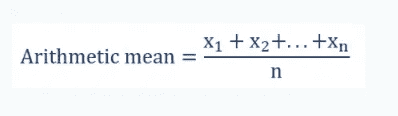
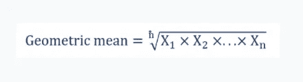
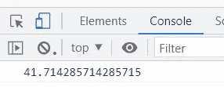

# 使用 JavaScript 求出一组数字的平均值

> 原文：<https://javascript.plainenglish.io/find-the-mean-of-a-collection-of-numbers-using-javascript-4e6fc2605a99?source=collection_archive---------6----------------------->

## 了解什么是均值，它的类型，以及如何使用 JavaScript 计算它。


Photo by [Scott Graham](https://unsplash.com/@homajob?utm_source=medium&utm_medium=referral) on [Unsplash](https://unsplash.com?utm_source=medium&utm_medium=referral)

统计和数学是金融和许多其他领域的两个基本概念。计算大量数据或数字的需要带来了均值、中位数和众数的概念。

在这篇文章中，我将解释什么是均值，它的类型，以及如何使用 JavaScript 计算它。

在数学和统计学中，均值是必不可少的。当我们谈论一组数字的平均值时，我们指的是平均值。

平均值是概率分布集中趋势的量度。分布沿着中位数和众数。

均值在金融中是非常重要的，它被广泛应用于金融计算中。

在统计学中，有许多计算平均值的方法。在这一节中，我将讨论最流行的两个，计算它们的公式，以及如何使用 JavaScript 轻松计算它们。



2.几何平均数—这是集合中所有数字乘积的第 n 个根。



假设你有一组数字:9，10，24，80，70，89，10。

```
// Arithmetic Meanvar values = [9, 10, 24, 80, 70, 89, 10];var findArithmeticMean = () => {var result = 0;for (var i = 0; i < values.length; i++){result += values[i];}console.log(result/values.length);}findArithmeticMean();
```

*   首先，我们用可用的值创建了一个数字数组
*   在下一行中，创建了一个查找算术平均值的函数。
*   创建了一个变量结果，其值被设置为 0。
*   创建了一个循环。该循环将遍历值数组，并将每个数字添加到变量结果中。在循环结束时，它给出了这些值的总和。
*   如公式算术平均值=数值总和/数值个数。结果除以 values.length，它是所有值的个数。
*   这个函数被调用了，它肯定会在控制台上显示平均值。



*进入你的代码编辑器，测试代码，并使用计算器将其与你的计算结果进行比较。*

2.我们可以使用下面的代码块找到几何平均值:

```
// Geometric Meanvar values = [9, 10, 24, 80, 70, 89, 10];var findGeometricMean = () => {var result = 1;for (var i = 0; i < values.length; i++){result *= values[i];}console.log( Math.pow(result, 1/values.length));}findGeometricMean();
```

这和我们做算术平均完全一样，但是有一点不同，因为它们不一样。

1.  创建的循环将每个数字与数组中的下一个数字相乘。
2.  结果在 Math.pow()中声明，它取总乘积和 n 次方根，即 1/values.length。
3.  函数被调用，几何平均值被打印在控制台上。

JavaScript 是一种编程语言，可用于构建应用程序来解决现实生活中的问题。请继续关注我的帖子，了解更多信息。

你有什么建议或问题吗？

【https://tealfeed.com】最初发表于[](https://tealfeed.com/know-find-mean-javascript-xmgpd)**。**

**更多内容请看*[***plain English . io***](https://plainenglish.io/)*。报名参加我们的* [***免费周报***](http://newsletter.plainenglish.io/) *。关注我们关于*[***Twitter***](https://twitter.com/inPlainEngHQ)*和*[***LinkedIn***](https://www.linkedin.com/company/inplainenglish/)*。加入我们的* [***社区不和谐***](https://discord.gg/GtDtUAvyhW) *。**