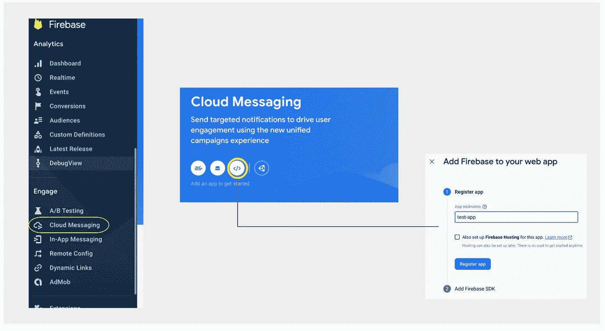
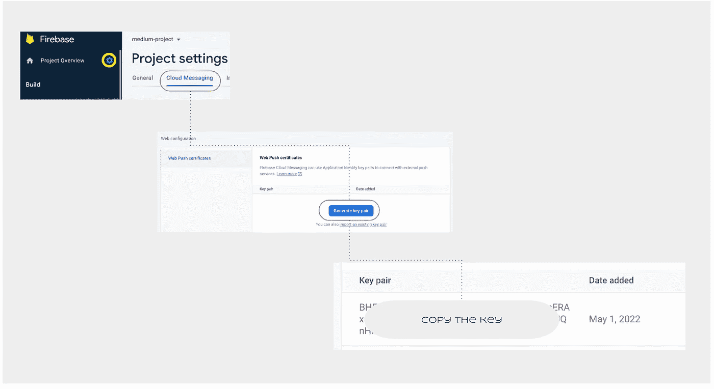
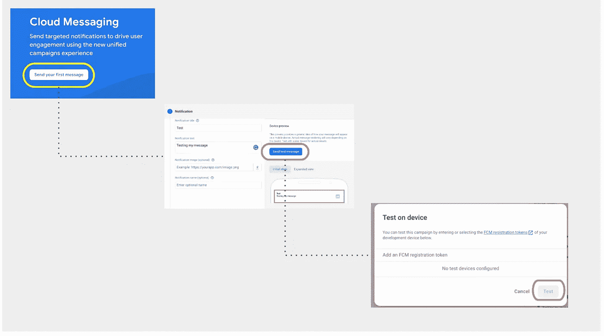

# 使用 Firebase 云消息发送 Web 应用通知

> 原文：<https://javascript.plainenglish.io/firebase-cloud-messaging-on-web-5621dc2d3a26?source=collection_archive---------1----------------------->

## 关于如何使用 Firebase Cloud Messaging 向 web 应用程序用户发送通知的教程。

你是用[亚马逊](https://www.amazon.in/)、 [Tokopedia](https://www.tokopedia.com/) 还是 [Flipkart](https://www.flipkart.com/) ？那你一定在浏览器上收到了一些通知。

嗯，所有这些消息和通知都是通过 Firebase 发送到您的手机、台式机等设备的，今天我将分享我们如何使用 Firebase 云消息向我们的应用程序用户发送通知。

# 什么是 Firebase 云消息传递？

FCM 是一个消息传递解决方案，可以让您实时发送和接收消息。使用 FCM，您可以向客户端设备发送通知和消息。它是独立于平台的，你也可以将消息推送到网络或本地应用。

FCM 提供了各种分发方法，您可以向单个设备或多个设备发送消息和通知。
有关 FCM 工作原理的更多详细信息，您可以在这里找到:

[](https://firebase.google.com/docs/cloud-messaging) [## Firebase 云消息| Firebase 文档

### Firebase 云消息传递(FCM)是一个跨平台的消息传递解决方案，让您能够可靠地免费发送消息…

firebase.google.com](https://firebase.google.com/docs/cloud-messaging) 

# 集成 Firebase 云消息传递

FCM 可以和各种前端平台一起工作，比如 ios，android。但是在这篇文章中，我们将关注如何在网络上使用 FCM，如果你是一个 Android 用户🤖或者 iOS🍏开发商。

Bye Bye

*哦，你是 web 开发人员？恭喜你！你选择了正确的职业🤪。* 
好的，我们知道 Firebase 是由 Google 支持的，所以我们需要满足一些要求:

*   创建一个谷歌账户(*如果你还没有的话😳*)。
*   在 [Firebase 控制台](https://console.firebase.google.com/?pli=1)创建一个 Firebase 项目。
*   创建应用程序后，您将登陆 Firebase 控制台仪表板。
*   导航至 Engage 下的云消息传递。
*   将 Firebase 添加到 web 应用程序并注册。



## 使用 npm 安装 Firebase

现在让我们把手弄脏。
运行下面的命令在你的项目中安装 Firebase。

```
npm install firebase --save
```

在你的应用中初始化 Firebase。

```
import { initializeApp } from "firebase/app";
import { getAnalytics } from "firebase/analytics";

const firebaseConfig = {
  apiKey: <your-api-key>,
  authDomain: "medium-project-9adf6.firebaseapp.com",
  projectId: "medium-project-9adf6",
  storageBucket: "medium-project-9adf6.appspot.com",
  messagingSenderId: "<your-messaging-id>",
  appId: <your-app-id>,
  measurementId: <your-measurement-id> // should start with G
};// Initialize Firebase
const app = initializeApp(firebaseConfig);
const analytics = getAnalytics(app);
Note: The below steps are shown to set up FCM version 9.
```

只需复制上面共享的片段并粘贴到您的 index.html。
如果你正在使用 Next.js 或任何 React 框架，你可以将其粘贴到你的应用中的任何条目文件，可以是 app.js 或 index.js 等。

# 使用 FCM 配置 Web 凭据

初始化之后，我们将配置凭证。
FCM 使用称为 VAPID 密钥的授权密钥来授权发送请求。
要订阅我们的应用程序来推送通知，我们需要将一对键映射到我们的 Firebase 项目。我们可以通过如下所示的设置生成新的密钥对:



*   转到项目设置
*   导航至云消息选项卡
*   生成并复制密钥

我们有 VAPID 密钥可用，我们将在我们的项目中使用它。我们将首先创建一个名为`firebase-messaging-sw.js`的文件，并将其放在我们的域的根目录下。
我说的 root 是指我们可以很容易地以`www.mysite.com/firebase-messaging-sw.js`的身份访问这个文件，如果你使用的是 nextJs place，你可以把它放在 public 文件夹中。当浏览器不在焦点上或在后台时，需要这个文件来设置后台通知处理程序。

## 访问 FCM 令牌

在应用程序初始化之后，我们需要一个在向不同的推送服务发送消息请求时所需的令牌。对于每个应用程序实例，令牌都是唯一的。FCM 令牌可以在重新安装或删除应用程序时更改。

我们可以通过`getToken()`方法获得 FCM 令牌。分享完整的片段:

```
import { getMessaging, getToken } from "firebase/messaging";

const messaging = getMessaging();
getToken(messaging, { vapidKey: '**<YOUR_PUBLIC_VAPID_KEY_HERE>**' }).then((currentToken) => {
  if (currentToken) {
    // Send the token to your server and update the UI if necessary
    // ...
  } else {
    // Show permission request UI
    console.log('No registration token available. Request permission to generate one.');
    // ...
  }
}).catch((err) => {
  console.log('An error occurred while retrieving token. ', err);
  // ...
});
```

从客户端获得令牌后，我们可以将它发送到我们的应用服务器，并使用一些 API 或广播接口存储它。

# 接收消息

有了以上所有的设置，我们就可以向用户发送或推送消息了。在深入之前，我们应该知道有两种类型的消息可以发送给用户，它可以是前台和后台消息。

两种重要的方法在后台运行以接收数据:

*   onMessage
*   onBackgroundMessage

## 履行

首先，我们需要注册一名服务人员。

如果你不知道什么是服务人员，请阅读以下内容:

[](https://developer.mozilla.org/en-US/docs/Web/API/Service_Worker_API) [## 服务工作者 API-Web API | MDN

### 服务人员本质上充当代理服务器，位于 web 应用程序、浏览器和网络之间(当…

developer.mozilla.org](https://developer.mozilla.org/en-US/docs/Web/API/Service_Worker_API) 

如果您的应用程序不使用服务人员，您可以使用以下代码片段注册服务人员:

```
const ua = navigator.userAgent;navigator.serviceWorker
   .register(`service-worker.js`).then((registration) => {
     console.log('Registration successful, scope is:',registration.scope);
```

共享接收前台和后台消息的完整实现:

上面的代码不言自明。如果有任何疑问，让我们从第 10 行开始，这里我们注册了一个服务人员，从第 14-22 行开始，我们用可用的密钥初始化 firebase。
我们还使用两种方法`onMessage`和`onBackgroundMessage`来接收消息，如第 26 行和第 31 行所示。您可以在`onMessage`回调中更新 react 组件或进行 DOM 操作。
如果窗口不在焦点上，我们使用`showNotification`函数弹出通知。

最后，一切都设置好了。

## 发送您的第一条消息

我们如何测试我们的通知？让我们回到 Firebase 仪表板。Firebase dashboard 使我们能够在投入生产之前向我们的设备发送测试消息，您可以在云消息传递菜单下找到相同的内容。



正如您在共享的插图中看到的，我们需要为我们的消息添加标题和文本，因为它们是必填字段。此外，我们应该有一个我们需要发送通知或消息的应用程序或设备的 FCM 令牌。

您可以从`getToken()`方法获得 FCM 令牌。

只需点击测试按钮，看看神奇。您将在设备上收到通知。

我们走吧。这就是我们如何将 Firebase 云消息集成到 web 应用程序中。感谢您的阅读。如果你学到了新东西，就鼓掌。

在推特上关注我 [@aatifbandey](https://twitter.com/aatifbandey)

*更多内容尽在* [***说白了. io***](https://plainenglish.io/) *。报名参加我们的* [***免费周报***](http://newsletter.plainenglish.io/) *。关注我们关于* [***推特***](https://twitter.com/inPlainEngHQ) *和*[***LinkedIn***](https://www.linkedin.com/company/inplainenglish/)*。加入我们的* [***社区***](https://discord.gg/GtDtUAvyhW) *。*