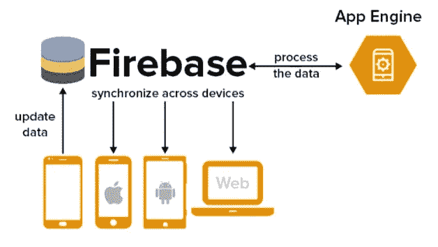

# Firebase 与 MongoDB —两个最佳数据库的比较

> 原文：<https://javascript.plainenglish.io/firebase-vs-mongodb-ab462c1de085?source=collection_archive---------7----------------------->

## Firebase 与 MongoDB 的比较，帮助您为 web 和移动应用程序开发选择一个完美、健壮和可靠的后端解决方案。

当今竞争异常激烈的商业环境要求他们创建的最终解决方案应该是健壮、可用和可扩展的。所有这些都是为了让他们的价值最大化。这就是为什么在构建移动应用解决方案的过程中，开发人员专注于使用数据库来实现这一任务。这还包括同时提高生产力水平和数据利用率。

为此，开发人员最需要两个数据库。他们是 **Firebase 和 MongoDB** 。当你阅读这篇文章时，你会通过比较获得这两者的知识。看完这个你就明白了，手机 app 后端开发哪个最好了。

所以事不宜迟，让我们开始吧。

然而，在此之前，让我们先解释一下数据库的含义。

# 什么是数据库？

*数据库用于存储、维护和访问任何种类的数据。*

*一个* [*数据库*](https://en.wikipedia.org/wiki/Database) *大多是以电子形式存储在计算机系统内的结构化信息或数据的有组织的集合。在 DBMS 或数据库管理系统的控制下，数据和 DBMS 一起编译，以确保数据处理和查询可以很容易地完成。最终，这使得数据可以被轻松地访问、管理、更新和组织，从而保持最高的效率。*

**组织使用数据库的一些方式:**

*   改进业务流程
*   跟踪客户
*   保护个人健康信息
*   存储个人数据

## 数据库是用来做什么的？

*   银行系统
*   电信公司
*   大学
*   航空交通
*   信用卡交易
*   金融部门
*   电子商务企业
*   人力资源
*   制造企业

有了这方面的知识，您就可以理解为什么数据库如此受欢迎，为什么在管理数据、确保轻松更新等方面需要数据库。

现在有了对这个领域的了解，在这里补充一下是很重要的；许多数据库在后端开发方面非常突出。然而，两个特别受欢迎的是， **Firebase 和 MongoDB** 。

两者都受到开发人员的欢迎，以确保实时应用程序开发是一项无缝任务，并执行数据检索和存储等任务。

所以让我们先了解一下这两者。

# 关于 Firebase 的一切

请看下图，了解一下 [**Firebase**](https://firebase.google.com/) 及其全部内容。

Image source: thirdrocktechkno.com

从上面看，你可以理解 Firebase 数据库类似于一个拥有后台连接的实时引擎。多了解一下，谷歌收购的数据库是一个适合 web app 开发和构建移动 app 解决方案的生态系统。除了在应用程序开发方面提供支持，它还在托管、存储和云功能方面提供帮助。

因此，如果你在谈论一个用于移动应用后端开发的数据库，Firebase 就是你的答案。除了健壮的客户端库之外，还提供了对一组全面的安全规则的支持，并且能够很好地实时工作，在更改发生时获取更改变得很容易执行。

因此，从所有这些方面来看，Firebase 是一个最适用于构建游戏应用、聊天等任务的数据库。

## 使用 Firebase 的顶级公司

了解了一些关于 Firebase 的知识，现在让我们了解一下它的优点和缺点，以及数据库可以使用和不可以使用的场景。

## Firebase 的利弊

**优点:**

*   提供安全的托管服务。这是通过非零配置 SSL 的存在来增强安全级别。
*   为开发人员提供了在真实环境中免费执行移动应用后端开发的灵活性。因此，对他们来说，在这个领域内找到立足点变得轻而易举。这也包括方便用户的付费套餐。这为开发专业人员提供了使用定价计算器来确定总体项目成本的灵活性。
*   在谷歌的支持下，Firebase 支持新的设置来执行产品推广。这是因为 Firebase 应用程序索引工具的存在，允许应用程序的搜索排名上升。

**缺点:**

*   由于从谷歌获得的支持，更倾向于 Android，对 iOS 及其各自功能的支持不足。接下来是(Firebase)版本中不断发生的更新。
*   定价不靠谱。因此，选择预算变得困难。这最终可能会对你的企业财务不利。
*   SQL 特性的缺乏使得在产品增长期间很难执行数据迁移。此外，由于 SQL 中的书面查询是无人值守的，大型数据块变得难以移动。

## 针对 Firebase 建议和不建议的方案

*   如果您需要频繁缩放应用程序，请使用。
*   如果您需要直观的 API 来帮助查看第三方集成，请使用。
*   如果执行 iOS 应用程序开发，请不要使用它。
*   当愿意拥有用户数据时，不要使用它。

除了可以使用 Firebase 的场景之外，了解了优缺点之后，现在让我们了解一下 MongoDB。

# 关于 MongoDB 的一切

一个源代码可用的跨平台面向文档的数据库程序， [**MongoDB**](https://www.mongodb.com/) 是开发人员对具有灵活性和可伸缩性的数据库文档的首选。这是为了让像索引和查询这样的任务无缝地进行。

其次是拥有一个简单的学习曲线，以便满足复杂的要求是可以实现的。除此之外，还要确保高数据量的轻松存储。

## 使用 MongoDB 的顶级公司

了解了一些关于 MongoDB 的知识，现在让我们了解一下它的优点和缺点，以及适合和不适合使用它的场景。

## MongoDB 的利与弊

**优点:**

*   以文档格式存储和表示数据可确保数据结构保持该语言的原生特性。因此，从任何语言进行访问都变得很容易。
*   拥有 BSON 格式:该数据库使得在一个集合中包含不同的字段集变得容易。
*   简化数据分析。这是因为 MongoDB 查询语言的出现使得深入查询文档成为一项无缝的任务。

**缺点:**

*   由于缺少连接功能，会出现数据冗余。因此，通过它可以最大限度地使用内存。
*   尽管可以通过手动执行添加和编码等任务来灵活地使用数据库，但由于数据库没有提供足够的支持，执行过程变得缓慢。
*   文档嵌套不能超过 100 层，文档大小不能超过 16 MB。因此，整体数据大小和嵌套能力是有限的。

## MongoDB 推荐和不推荐的场景

*   如果应用程序更改了数据要求，请使用。
*   使用它来实现可伸缩性和更好的缓存。
*   如果你想建立一个详细的设计系统，不要使用它。
*   如果数据模型设计已经提前完成，就不要使用它。

记住这些场景，您就可以了解 Firebase 和 MongoDB 的优缺点，以及推荐和不推荐使用它们的理想情况。

这将确保您为应用程序开发选择的数据库是健壮的，并保持最终解决方案的安全性完好无损。

# Firebase 与 MongoDB —比较

*   对于不依赖于单一云提供商的专用移动应用程序开发，Firebase 是您应该选择的。然而，当您想要一个能够最好地执行高级查询的解决方案时，MongoDB 是您的不二之选。
*   当追求接收实时更新时，Firebase 可以做得更好。但是，在执行任务以确保快速数据处理时，建议使用 MongoDB。
*   为了确保您在移动应用后端开发中投入最少的精力，Firebase 应该是您的首选。然而，当需要支持在同一系统中处理事务性和仓库式工作负载时，MongoDB 是开发人员推荐的。

因此，在最终选择 Firebase 还是 MongoDB 来构建移动应用解决方案之前，请记住这些方面。

## 包扎

通过对 [**Firebase 与**](https://www.xongolab.com/blog/firebase-vs-mongodb/)MongoDB 的对比分析，了解到两者在数据管理和处理海量数据方面都有过人之处。但是，在您进行选择之前，请提前了解您的需求，以便最终的解决方案能够带来价值。

*更多内容看* [***说白了就是***](https://plainenglish.io/) *。报名参加我们的* [***免费周报***](http://newsletter.plainenglish.io/) *。关注我们关于*[***Twitter***](https://twitter.com/inPlainEngHQ)*和*[***LinkedIn***](https://www.linkedin.com/company/inplainenglish/)*。查看我们的* [***社区不和谐***](https://discord.gg/GtDtUAvyhW) *加入我们的* [***人才集体***](https://inplainenglish.pallet.com/talent/welcome) *。*