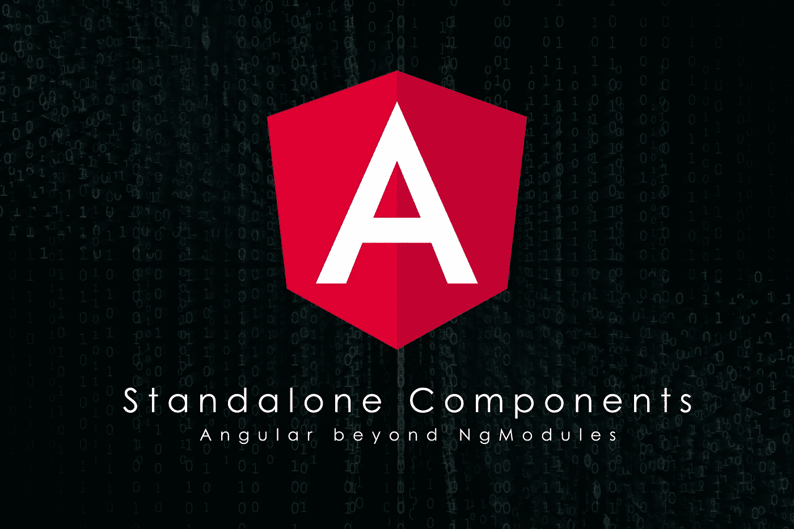
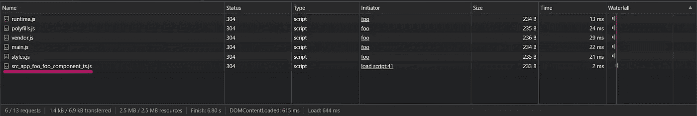

# 首先看一下独立组件:角度超过 NgModules

> 原文：<https://javascript.plainenglish.io/first-look-at-standalone-components-angular-beyond-ngmodules-6360d30fca0d?source=collection_archive---------1----------------------->

## Angular 中独立元件的概述。



伟大的 Angular 团队已经发布了关于它的两个 RFC，具体来说就是 CLI 14.0.0-next.12 和 Core 14.0.0-next.15。

当您使用以下方式生成新项目时:

```
npx @angular/cli@next new ng14
```

感觉还是一样的，同样的交互问题，同样的项目结构用`AppModule`创建。

但是那里有一个隐藏的复活节彩蛋，所以我一直在探索，看看它在未来会是什么样子。

# 第一件事是删除 AppModule

有史以来第一次，我没有使用`AppModule`或任何`NgModule`来制作我的棱角分明的作品，但几乎不需要什么改变。

第一件事是在`AppComponent`中添加一个独立的标志，然后更改`main.ts`，仅用`AppComponent`初始化应用程序。为此，您需要使用新功能`bootstrapApplication`。它看起来会像这样:

```
import { enableProdMode } from '[@angular/core](http://twitter.com/angular/core)';
import { bootstrapApplication } from '[@angular/platform-browser](http://twitter.com/angular/platform-browser)';
import { AppComponent } from './app/app.component';
import { environment } from './environments/environment';if (environment.production) {
  enableProdMode();
}bootstrapApplication(AppComponent)
  .catch(err => console.error(err));
```

但是事情没有那么简单，因为现在它不知道什么是路由器出口，但是这是一个简单的解决方案，只需在`AppComponent`中导入`RouterModule`，是的，你现在就可以这样做。

但是显示了一个更严重的错误，不是在您的终端中，而是在浏览器中(换句话说，运行时不是编译时错误):

```
ERROR NullInjectorError: R3InjectorError(Standalone[AppComponent])[ChildrenOutletContexts -> ChildrenOutletContexts -> ChildrenOutletContexts]: 
  NullInjectorError: No provider for ChildrenOutletContexts!
```

经过几次搜索，我发现这是因为我需要在我的应用程序中的某个地方调用`RouterModule.forRoot()`来让 router-outlet 工作。对于独立组件的初始化，有一种新的方法可以使用新函数`importProvidersFrom`来完成。下面是代码的样子:

```
import { enableProdMode, importProvidersFrom } from '[@angular/core](http://twitter.com/angular/core)';
import { bootstrapApplication } from '[@angular/platform-browser](http://twitter.com/angular/platform-browser)';
import { RouterModule, Routes } from '[@angular/router](http://twitter.com/angular/router)';
import { AppComponent } from './app/app.component';
import { environment } from './environments/environment';const routes: Routes = [];if (environment.production) {
  enableProdMode();
}bootstrapApplication(AppComponent, **{
  providers: [
    ...importProvidersFrom(RouterModule.forRoot(routes)),
  ],
}**)
  .catch(err => console.error(err));
```

最后，它工作了，现在我们有了一个没有`NgModule`的角度应用。

# 然后，让我们有一个懒惰加载的组件

在此之前，你只能延迟加载一个模块。要延迟加载一个组件，您必须为这个组件创建一个模块，然后延迟加载这个模块，但是现在简单多了。下面我们来看看怎么做。

首先，让我们使用新标志`--standalone`创建一个新的独立组件。

```
ng g c foo --standalone
```

为了使用它，Routes 中有一个名为 loadComponent 的新选项，它的工作方式与它处理模块的方式非常相似。

```
const routes: Routes = [
  {
    path: 'foo',
    loadComponent: () => import('./app/foo/foo.component').then(c => c.FooComponent),
  },
];
```

在生产应用程序中，您应该从另一个文件中导出路由器，并将它们导入 main.ts，但是我想让事情变得非常简单。

现在如果你导航到[http://localhost:4200/Foo](http://localhost:4200/foo)你会看到 *Foo works* ！如果你看一下 devtool 中的 network 选项卡，你会看到它。



为了确保它确实是惰性加载的，您需要启动应用程序，然后导航到它，这是我们下一个也是最后一个部分的内容。

**最后，创建一个可重用的独立组件**

我觉得对于旧的应用程序来说，这将是最有益的部分。现在，拥有一个可重用的组件从来都不容易，没有共享的`NgModule`，你需要加载所有的组件来使用其中的一个，或者每个组件有一个模块，你必须创建许多不必要的文件。

我们将像以前一样开始，使用新的`--standalone`标志创建它。

```
ng g c header --standalone
```

在 HTML 中，我们只需简单地输入:

```
<a routerLink="">home</a> | <a routerLink="foo">foo</a>
```

您会发现链接不起作用，这是因为您需要再次将`RouterModule`导入到您的组件中，然后将`HeaderComponent`导入到`AppComponent`中，然后瞧，它起作用了！

下面是它们的样子:

**AppComponent**

```
import { Component } from '@angular/core';
import { RouterModule } from '@angular/router';
import { HeaderComponent } from './header/header.component';

@Component({
  selector: 'app-root',
  templateUrl: './app.component.html',
  styleUrls: ['./app.component.scss'],
  standalone: true,
  imports: [RouterModule, HeaderComponent],
})
export class AppComponent {
}
```

**头部组件**

```
import { Component, OnInit } from '[@angular/core](http://twitter.com/angular/core)';
import { RouterModule } from '[@angular/router](http://twitter.com/angular/router)';[@Component](http://twitter.com/Component)({
  selector: 'app-header',
  standalone: true,
  templateUrl: './header.component.html',
  styleUrls: ['./header.component.scss'],
  imports: [RouterModule],
})
export class HeaderComponent implements OnInit {constructor() {
  }ngOnInit(): void {
  }}
```

你可以在我的 GitHub robertIsaac/ng14 中看到完整的代码:

[](https://github.com/robertIsaac/ng14) [## GitHub - robertIsaac/ng14

### 此项目是使用 Angular CLI 版本 14.0.0-next.12 生成的。导航到…

github.com](https://github.com/robertIsaac/ng14) 

*更多内容看* [***说白了就是***](https://plainenglish.io/) *。报名参加我们的* [***免费每周简讯***](http://newsletter.plainenglish.io/) *。关注我们*[***Twitter***](https://twitter.com/inPlainEngHQ)*和*[***LinkedIn***](https://www.linkedin.com/company/inplainenglish/)*。加入我们的* [***社区不和谐***](https://discord.gg/GtDtUAvyhW) *。*