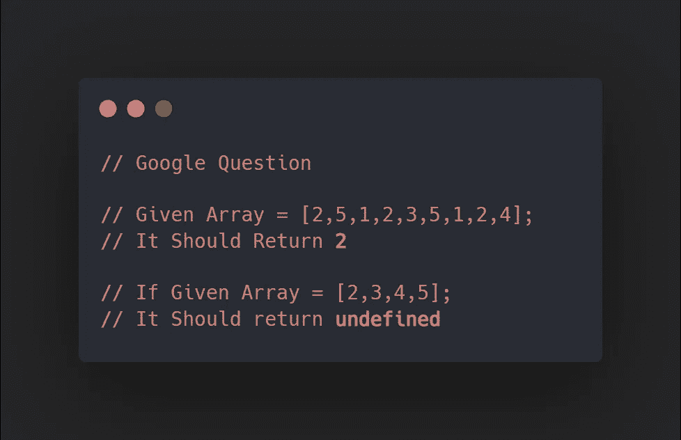

# 数组中第一个重复出现的字符

> 原文：<https://javascript.plainenglish.io/first-recurring-character-in-an-array-88f3dcca1638?source=collection_archive---------11----------------------->

## JavaScript 中的数据结构和算法

与任何其他编程语言一样， **JavaScript** 中的数据结构非常难学，在这篇文章中，你将了解被称为 ***哈希表*** &的数据结构，以及如何使用遵循所有 ***BigO*** 规则的高效代码实现哈希表。

# 哈希表

在开始实现部分之前，让我们先了解一下表面上的哈希表是什么&如果您已经使用 JavaScript 很长时间了，那么哈希表可能看起来与您很相似，因为它们是 JavaScript 中的对象。为了理解散列表，让我们举一个蹩脚的例子。

*   比方说，我们在教室里有一个学生列表，我们根据他们的**名字**和 **id** 来识别他们，每个**学生的 id** 对应于其**名字**，这就是 JavaScript 或散列表中的对象的确切样子。

# 第一个循环字符

为了解释哈希表，我回答了一个谷歌面试问题，这将有助于你更清楚地理解。根据我们的问题，如果给我们一个数组，里面有重复项，我们应该能够返回*第一个循环项* &如果它不存在，那么我们应该返回**未定义的**。

> 在实现之前，让我们为解决这个问题的方法做一个思维导图。

*   我们可以定义一个新的空数组，并开始从给定的数组中选取第一个字符。
*   如果我们用给定数组中的所有项目交叉检查那个被挑选的项目，如果它找到另一个相似的项目，那么返回它。

# 履行

请注意，以下问题可以在不使用哈希表的情况下解决，我们将在使用和不使用 Hast 表的情况下解决这个问题，以便我们可以比较两种方法的**空间** & **时间**复杂性。

## 没有哈希表

*   比方说，我们有一个名为***first recurring character***的函数，它以一个**数组**作为输入，其中包含我们需要检查的项目。
*   我们的代码从循环的**开始，初始化 **i = 0** ，并检查**索引**是否小于数组中索引总数( ***array.length*** )。**
*   在此阶段， 循环的第一个 ***用于拾取**索引 0 处的项目，**仅此而已。***
*   我们将循环 的第一个 ***包装在循环*的另一个*中，它负责将数组中的每一项与其他项进行比较。***
*   你可能已经注意到，在第二个循环中，我们将索引 **j** 作为 **i+1** ，这是因为我们想要比较下一个项目。 ***例如*** ，在索引 **0** 处我们拾取了 **2** ，这需要与索引 **0+1** 处的项目进行比较，这就是我们将 **j** 作为 **i+1** 的原因。
*   最后， **if** 条件检查两个项目是否相似，如您所见，如果 **array[i]** 等于 **array[j]** ，则它捕捉数组中第一个相似的项目。
*   如果所有这些都没有发生，那么我们简单地返回 ***未定义的*** 。

> 然而，我们能够解决这个问题，但是如果我们深入研究我们的代码，有两个 for 循环会一直运行，直到找到一个类似的项目。这种方法工作得很好，但是我们处理 O2n 的时间复杂度，这在处理数组时效率不是很高。

## 使用哈希表

*   在我们解决这个问题的第二个方法中，将使用哈希表，它在处理数组时更有效。
*   此时我们有一个名为**firstrecuringcharacter 2**的函数，它接受一个输入**数组**。
*   我们定义了一个名为 **map** 的空对象，这将是我们在这个解决方案中的主要关注点。
*   在这个方法中，我们使用了一个*散列表*，它的工作方式与前面的方法不同。现在我们用一个特殊的**键**映射我们的**数组**中的每一个项目，然后将它们添加到我们的空地图对象中。
*   我们有一个类似的 ***for*** 循环，其工作方式与上面的方法类似，在我们的 for 循环中，我们正在检查我们是否有**数组[i]** (本例中为 2)存在于对象**图中。如果它确实存在，我们就简单地返回它。**
*   否则，我们将使用 **map[array[i]] = i** 将索引与条目进行映射。
*   如果这一切都没有发生，那么我们返回**未定义的**，就像我们在前面的方法中一样。
*   注意，在 **if** 条件里面我们已经用**映射了【数组[i]】！== undefined，**我们正在避免任何失败，因为如果没有它，我们的代码可能会由于 *JavaScript 强制*而崩溃。

 [## 作为高级开发人员，你必须知道的 3 个高级 JavaScript 概念

### 引用类型、上下文和实例化

javascript.plainenglish.io](/3-advanced-javascript-concepts-you-must-know-as-a-senior-developer-b1f4e8379305)  [## Ultra 4 分钟指南:一个新的 React Web 框架

### 解开网络捆绑

javascript.plainenglish.io](/4-minute-guide-to-ultra-a-new-react-web-framework-7f12a853f58)  [## CSS 中的 z 索引

### 3 分钟解释 z 指数和堆叠指数

javascript.plainenglish.io](/z-index-in-css-6576cfdaa3ad) 

*更多内容请看*[***plain English . io***](https://plainenglish.io/)*。报名参加我们的* [***免费周报***](http://newsletter.plainenglish.io/) *。关注我们关于*[***Twitter***](https://twitter.com/inPlainEngHQ)[***LinkedIn***](https://www.linkedin.com/company/inplainenglish/)*[***YouTube***](https://www.youtube.com/channel/UCtipWUghju290NWcn8jhyAw)*[***不和***](https://discord.gg/GtDtUAvyhW) *。对增长黑客感兴趣？检查* [***电路***](https://circuit.ooo/) *。***