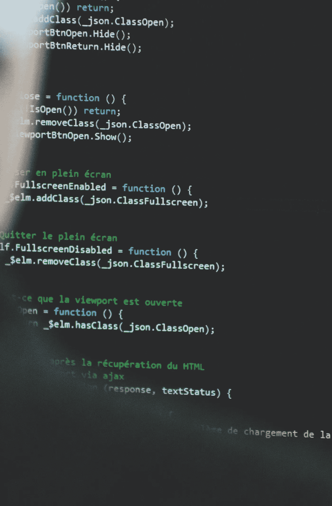

# 软件工程师可以证实的五个准确的人物暗杀

> 原文：<https://javascript.plainenglish.io/five-accurate-character-assassinations-software-engineers-can-confirm-7a0eadeb4da4?source=collection_archive---------18----------------------->

## 软件开发人员是一种特殊的物种。

你是软件工程师/程序员/开发者吗？为编码而疯狂？爱编程至死？这是给你的，呆子:)

(注意:没有程序员在这个过程中受到伤害。)

事不宜迟。

Photo by Sigmund

# 五个准确的文字暗杀软件工程师可以证实。

Photo by Stefano Pollio

## 1.他们消失了。

很多。典型软件工程师的消失远非不可预料。他们热爱独立。有一天给他们发一条“你好吗”的信息，不要指望一个月后会有回复。可以理解的是，编程是一项智力要求很高的工作，需要长时间的非正常工作，尤其是当你在一个紧迫的期限内从事一个巨大的项目时。由于一天只有 24 个小时，在 5-8 个小时的睡眠后，剩下的大部分时间都用来做程序员最喜欢做的事情，*工作*。这些工作狂可能会选择工作而不是社交，因为对他们来说*时间就是金钱，宝贝*。简单地说，对程序员来说，如果他们必须在人类伴侣和计算机之间做出选择，后者会胜出。几乎每一次。

Photo by The Organic Crave Co.

## 2.他们不在乎人们对他们的看法。

有时是一个错误。有时，你的软件开发朋友不会在意你的感受。对他们来说，逻辑压倒了情感。毕竟他们大多是一个人类机器人(有隐情)。此外，你的编程伙伴将精通当前编程语言的更新，但与此同时，他们对这一季流行的服装趋势一无所知。通常，他们的观点对一些人来说可能是古怪的，但对另一些人来说却是真实的。其他时候，他们的习惯可能看起来与大众的不和谐。

“所有的女士都化妆了。我会反其道而行之。”

“什么是洗衣机？”

“等等，你们用盘子吗？我直接出锅吃。”

"薯片是我的主食。"

“我已经三个星期没离开过房子了。”

“律师是职业骗子。”

"健身房会员资格是浪费金钱。"

这就是他们的想法，这就是他们的感受，不要质疑。

Photo by Duane Mendes

## 3.他们真有耐心。

还是那句话，有时是错误的。软件开发人员花费大量时间编码、编辑、测试、调试、重复、搜索、学习、提问、思考、白日梦、更多思考、更多白日梦、打字、重新打字、编辑、复制、粘贴和重复所有这些，没有任何特定的顺序。

你可以一遍又一遍地问他们同样的问题，他们也会以同样的方式回答。对他们来说，这是一个谜。任务完成，问题解决。然而，他们也只是人。他们有自己的转折点，可以折断。当软木塞再也装不下溢出的情感之瓶的内容时，你的工程师会发疯的。不久之后，一切都好了，瓶子空了，可以灌装了。事实上，软件工程师无法在缺乏耐心的环境中生存。耐心是一种美德，毫无疑问！

Photo by Sigmund B

## 4.他们并不总能得到暗示。

软件开发人员喜欢直截了当。在他们面前，说话要清晰简洁。拼写正确。我是认真的。告诉我你想要什么，直截了当地告诉我——这就是他们的心态。如果你喜欢拐弯抹角、粉饰太平、含蓄暗示，你会大吃一惊。软件工程师不会活在谜语里。也许二进制，黑白对话是他们首选的交流方式。人们可能经常想知道这是不是语言障碍，或者说这个软件工程师只是很难相处，假装误解了想要表达的意思。不管怎样，不要试图迷惑软件工程师，因为他们会在迷惑游戏中胜过你，这就引出了最后一点:

Photo by Alex Vamos

## 5.过度思考

计算机工程师可以是*巨大的*、**T3、巨大的**、**巨大的**过度思考者。的确，编码需要关注细节。推而广之，软件工程师倾向于过度分析每一件…最后一件…事情。对他们来说，总有隐藏的意义，即使没有隐藏的意义。事情是这样的，人是复杂的——我们的功能不像计算机。众所周知，软件工程师可能会墨守成规，试图像调试计算机一样调试和解码人类思维和人类行为。也许这也是为什么他们倾向于独行侠和长期单身(想想，[承诺问题](https://medium.com/illumination/three-reasons-why-you-cant-commit-and-how-to-fix-it-6be0fbd60be1))。有时，他们需要冷静下来，给人以怀疑的好处。是的，亲爱的软件工程师，计算机会按照你说的去做，你喜欢常规，你喜欢可预测性，但是你猜怎么着，[生活发生了](https://medium.com/illumination/be-thankful-just-enjoy-the-moment-e7f0d44fb0d2)！一点点自发性和一些突如其来的惊喜绝对值得！相信我:)

## 特殊种类的物种。

总之，软件工程师是有趣的人。事实上，他们中的一些人可以证明上述人物暗杀是正当的。有时，软件工程师可能是神秘的、非凡的、不自信的、简单而复杂的存在。他们可能很难相处。他们可能是*难以理解的*。他们可能很难接通*到*。尽管如此，他们还是成为了好朋友。谁不想要一个诚实、耐心、直爽、细致、自信、独立的朋友呢？是的，我们爱你们(只是一点点)，

**只针对一个**

medium.com/@onlyfortheone

*如果你做到了这一步，感谢你的阅读，在我的个人资料中还有更多* [*仅供参考*](https://medium.com/u/56ea9150ee1f?source=post_page-----7a0eadeb4da4--------------------------------) *。感谢您的支持、关注、分享和参与！*

*更多内容请看* [***说白了就是***](https://plainenglish.io/) *。*

*报名参加我们的* [***免费每周简讯***](http://newsletter.plainenglish.io/) *。关注我们关于* [***推特***](https://twitter.com/inPlainEngHQ) ，[***LinkedIn***](https://www.linkedin.com/company/inplainenglish/)*，*[***YouTube***](https://www.youtube.com/channel/UCtipWUghju290NWcn8jhyAw)*，以及* [***不和***](https://discord.gg/GtDtUAvyhW)*****。*****

***有兴趣缩放你的软件启动*** *？检查出* [***电路***](https://circuit.ooo?utm=publication-post-cta) *。*