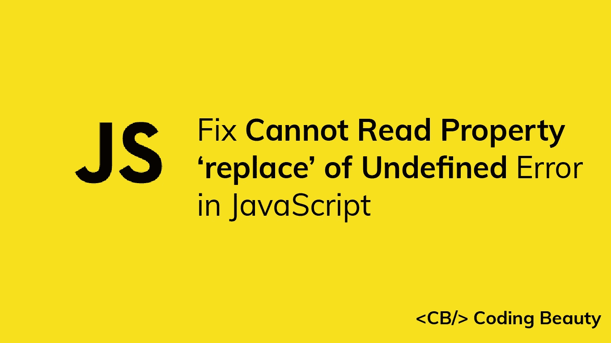

# 修复:无法读取 JavaScript 中未定义错误的属性“replace”

> 原文：<https://javascript.plainenglish.io/fix-cannot-read-property-replace-of-undefined-error-in-javascript-a8ebd23de9a3?source=collection_archive---------4----------------------->



你在 JavaScript 中遇到过“无法读取 undefined 的‘replace’属性”错误吗？当您试图对值为`undefined`的变量调用`replace()`方法时，会出现此错误。

```
const str = undefined;// TypeError: Cannot read properties of undefined (reading 'replace')
const newStr = str.replace('old', 'new');console.log(newStr);
```

要修复“无法读取 undefined 的属性‘replace’”错误，请在对变量调用`replace()`方法之前对变量执行`undefined`检查。有各种方法可以做到这一点。

# 检查变量是否为真

我们可以使用一个`if`语句来检查变量是否为真:

```
const str = undefined;let result1 = undefined;
// Check if truthy
if (str) {
  result1 = str.replace('old', 'new');
}
console.log(result1); // undefined
```

# 使用可选链接

如果变量为 nullish ( `null`或`undefined`)，我们可以使用可选的链接操作符(`?.`)返回`undefined`并阻止属性访问:

```
// Optional chaining
const result2 = str?.replace('old', 'new');
console.log(result2); // undefined
```

# 使用后备字符串进行替换

我们可以使用 nullish 合并操作符(`??`)来提供一个可替换的字符串来执行搜索和替换。

```
const result3 = (str ?? 'old str').replace('old', 'new');
console.log(result3); // 'new str'
```

零合并运算符(`??`)是一个逻辑运算符，当其左侧操作数为`null`或`undefined`时，返回其右侧操作数。

# 使用回退字符串代替替换

我们可以将可选的链接操作符和 nullish 合并操作符结合起来，提供一个默认的字符串作为结果，而不是执行替换。

```
const result4 = str?.replace('old', 'new') ?? 'no matches';
console.log(result4); // 'no matches'
```

## 注意

如果变量不是 nullish，但是没有`replace()`方法，您将得到一种不同的错误:

```
const obj = {};// TypeError: obj.replace is not a function
const result = obj.replace('old', 'new');console.log(result);
```

*更新于:*[*codingbeautydev.com*](https://codingbeautydev.com/blog/javascript-cannot-read-property-replace-of-undefined?utm_source=medium&utm_medium=social&utm_campaign=blog-promo)

所有疯狂的事情

一本关于 JavaScript 微妙的警告和鲜为人知的部分的迷人指南。


点击 免费获得 [**。**](https://codingbeautydev.com/crazy-js-book/)