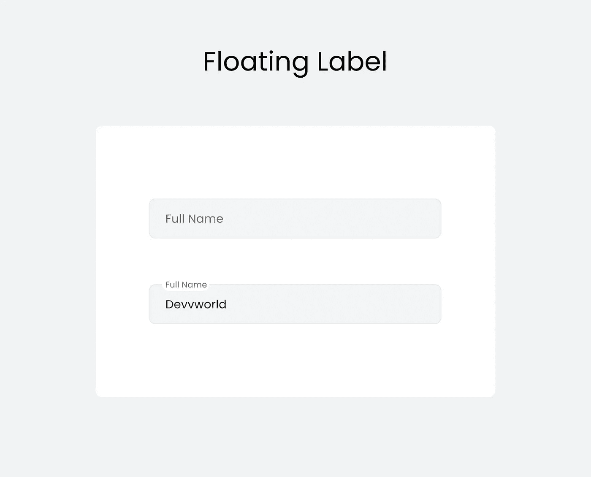
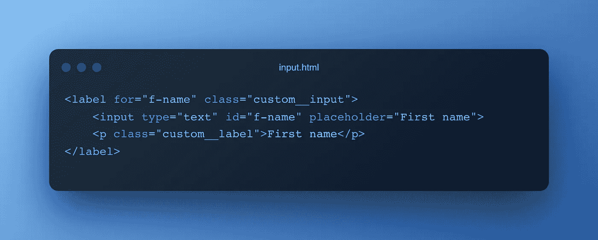
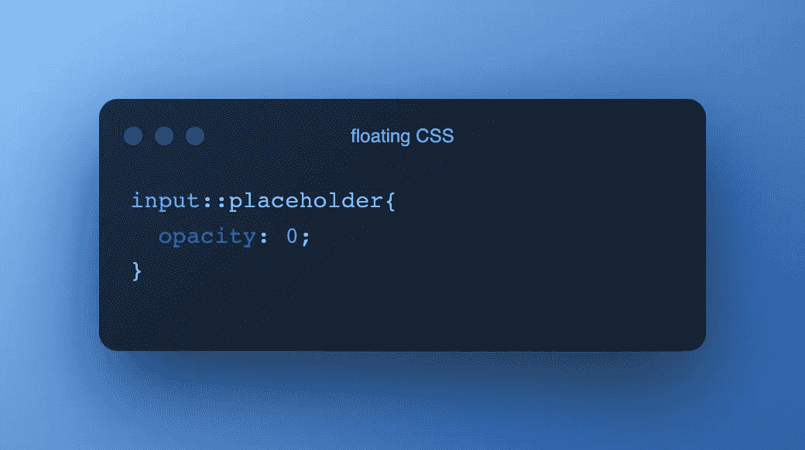
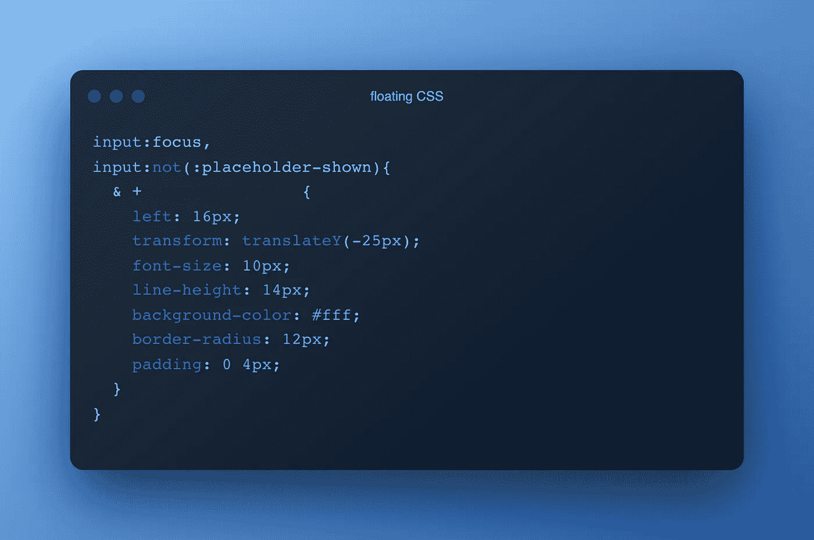

# 使用纯 CSS 🫡的浮动标签

> 原文：<https://javascript.plainenglish.io/floating-labels-with-pure-css-c70a199f0351?source=collection_archive---------4----------------------->

你可能已经注意到了一种模式。👀在这种情况下，如果您单击该输入并在其中键入一些内容，那么一个占位符将滑动到该输入字段。它在网站上看起来很棒，也是很好的用户体验。

我看过很多使用 JavaScript 的演示，但是我观察了一下，我认为没有 JavaScript 我也能做到。😏所以让我们开始吧🚀。

是啊，是啊，我知道你在想为什么你在标签里面用了 ***< p >*** 标签！所以基本上，我们使用那个 ***< p >*** 标签作为输入字段的占位符，我们将使用一些 CSS 魔法隐藏输入字段的默认占位符。因此，请参考下面的 CSS 代码。

因此，使用`*:placeholder*`选择器，我们可以设置占位符的 CSS 属性，这里我设置了`*opacity: 0;*`来隐藏占位符。这样，我们的第一步就完成了。🤩

现在在焦点上，或者如果输入了数据，占位符应该停留在输入字段的顶部。因此，同样，我们需要写下一些 CSS 代码，而不是冗长或忙乱的 JavaScript 代码。

基本上，在**焦点&上，如果文本在输入字段中可用，**我们将应用一些 CSS 属性来滑动标签(如果您记得这里我们的浮动标签是 **< p >** )。

咯咯嘣！💥

什么是`*:placeholder-shown*` *？*

> 我知道你在想什么。所以我来澄清一下 CSS 的这个属性。当表单输入中存在占位符文本时，`:placeholder-shown`伪类选择**输入元素本身**。

是啊，你说得对！就是这样。🤓以后谢我吧！😌 ❤

还可以访问我的网站[www.devvworld.com](https://devvworld.com/)🙏🏼

*更多内容请看*[***plain English . io***](https://plainenglish.io/)*。报名参加我们的* [***免费周报***](http://newsletter.plainenglish.io/) *。关注我们关于* [***推特***](https://twitter.com/inPlainEngHQ)[***领英***](https://www.linkedin.com/company/inplainenglish/)**和* [***不和***](https://discord.gg/GtDtUAvyhW) ***。****