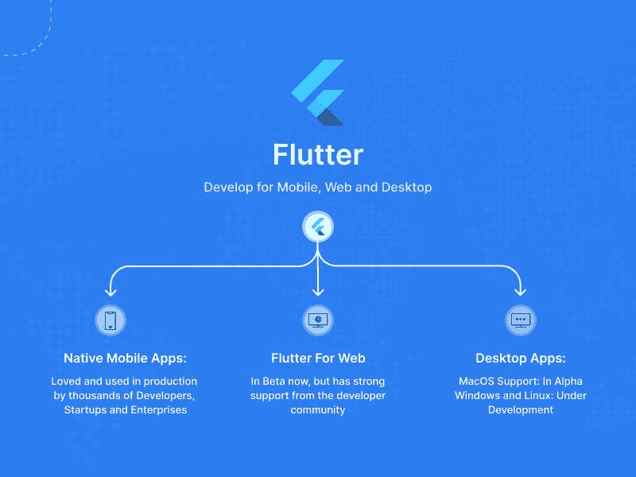
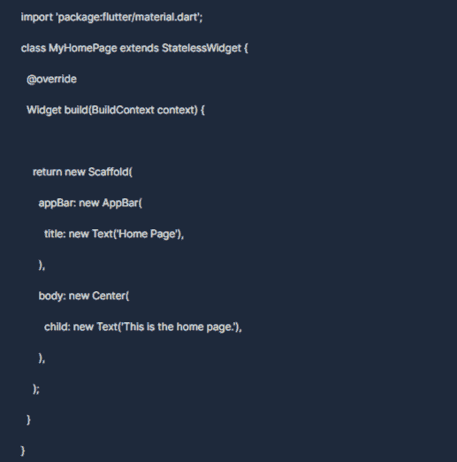
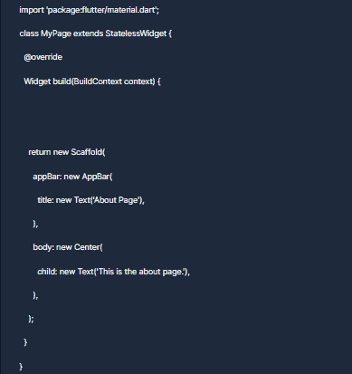

# Web 颤振:颤振 Web 开发的最终指南

> 原文：<https://javascript.plainenglish.io/flutter-for-web-an-ultimate-guide-to-flutter-web-development-650549055ccd?source=collection_archive---------2----------------------->

## 探索 web 开发中 Flutter 的所有方面，从安装到创建布局和动画。


Flutter 是最受欢迎的技术之一，它允许开发者创建交互式 web 应用。Flutter web 开发为构建具有统一代码库的跨平台应用程序开辟了可能性。

本指南将探索 web 开发中 Flutter 的所有方面，从安装到创建布局和动画。所以让我们开始吧！

# 什么是颤振？



Flutter 是谷歌开发的开源移动应用 SDK，帮助 **Flutter 应用开发者**用 Dart 编写应用，然后编译成原生代码。换句话说，它允许开发人员在 Android 和 iOS 上创建应用程序，而不必学习 Swift 或 Java 编程语言。

此外，Flutter for the web 是一个新项目，它将允许您使用 Flutter 开发 web 应用程序。这意味着你可以使用你现有的关于 Flutter 如何工作的知识，可以构建桌面应用程序和移动应用程序。您将能够在两个平台之间共享您的大部分代码。

它开辟了许多可能性，例如在 Android 和 iOS 两个平台之间共享资产和逻辑，同时仍然能够控制特定于平台的功能，例如动画和 UI 组件！

# web 的 Flutter 有何不同？

面向 web 的 Flutter 不同于 React Native 和 Cordova 等其他跨平台框架。虽然 React Native 和 Cordova 本质上是运行在浏览器中的移动应用程序，但 Flutter for web 在设备的操作系统上构建了真正的原生应用程序。

您可以使用 JavaScript、CSS 和 HTML 的任何现有技能来构建 web 应用程序。你不需要学习一门全新的语言或框架。相反，您可以利用您现有的这些语言知识来快速轻松地创建高质量的应用程序。

此外，因为 Flutter for web 使用 JavaScript 和 HTML 等标准技术，所以很容易与现有的代码库集成。

例如，如果你有一个已经使用 Angular 或 Vue.js 的现有网站，在不重写大部分代码的情况下加入 Flutter 将会很容易。

此外，假设你[雇佣了 Flutter 应用开发者](https://www.valuecoders.com/hire-developers/hire-flutter-developers ?utm_source=mediumjavascript&utm_medium=organic&utm_campaign=flutterforweb)，他们已经知道如何使用 Java 或 Swift 编写 android 或 iOS 应用，但不知道如何使用 JavaScript/HTML/CSS。在这种情况下，他们仍然可以使用他们喜欢的语言编写前端代码，同时在后端使用他们的 Android/iOS 开发技能。

**Flutter web 应用开发**利用了两个额外的渲染引擎，它们是

*   **CanvasKit–**该模型允许浏览器利用硬件加速
*   这是一个基于 HTML DOM 的模型，用于在 web 上创建和设计 Flutter 小部件。

# 颤振腹板开发的逐步过程

以下步骤将帮助你开发 Flutter web:

# 步骤 1:开始项目

在开始 Flutter web 应用程序开发之前，您首先需要安装 Flutter SDK 并设置您的开发环境。

一旦你安装了 Flutter SDK，你就可以创建一个新的项目。

# 步骤 2:创建项目

第一步是创建一个新的 Flutter 项目，然后将 flutter_web 依赖项添加到 pubspec.yaml 文件中。这种依赖将允许您访问使用 Flutter 开发 web 应用程序所需的所有工具和软件包。

接下来，您需要更新 pubspec.yaml 文件中的 web 入口点。它将告诉 Flutter 工具在哪里可以找到 web 应用程序的主 Dart 文件。

最后，您需要更新项目的构建设置，以便它知道如何为 web 编译您的 Dart 代码。您可以通过向项目的 pubspec.yaml 文件添加一个新的 flutter_web 目标来实现这一点。

# 步骤 3:了解项目结构

现在您已经创建了一个新的 Flutter 项目，是时候了解项目结构了。任何 Flutter 项目中最重要的两个目录是 lib 和 test 目录。

lib 目录包含所有的 Dart 代码。在使用 Flutter 开发 web 应用程序时，这是您编写大部分代码的地方。

测试目录包含您的单元和小部件测试。当运行颤振测试命令时，这些测试会自动运行。

除了这两个目录之外，您还应该知道其他一些重要的文件和目录:

pubspec.yaml 文件是您配置项目的依赖项和其他设置的地方。

-那个。元数据文件夹包含 Flutter 工具使用的文件。

-那个。dart_tool 文件夹是 Dart SDK 存储临时文件的地方。

# 步骤 4 —设计网页

了解项目结构后，下一步是设计您的网页。您可以向 lib/main.dart 文件添加 HTML 和 CSS 代码。

您还可以使用内置的 Flutter 小部件来设计您的网页。这些小部件位于 flutter:ui 库中。

要向页面添加小部件，首先需要导入包含小部件的库。一旦小部件被导入，您就可以使用小部件类将其添加到您的页面中。例如，要将文本小部件添加到您的页面，您可以使用以下代码:

```
Widget text = new Text(‘Hello World’);
```

将小部件添加到页面后，您可以通过设置小部件的属性来自定义它。

此外，您还可以向小部件添加事件处理程序。事件处理程序是在事件发生时调用的函数。例如，您可以向按钮小部件添加 onClick()事件处理程序，以便在单击按钮时调用一个进程。

# 步骤 5 —创建主页

现在你已经设计好了你的网页，是时候创建一个主页了。主页是第一页，用户在访问您的 web 应用程序时会看到它。

要创建主页，您需要在 lib 目录中创建一个新文件，并将其命名为 main.dart。

创建 main.dart 文件后，需要向其中添加以下代码:



这段代码将创建一个包含标题和正文的主页。您可以通过添加小部件和事件处理程序来自定义这个页面。

# 步骤 6 —从一个页面导航到另一个页面

创建主页后，您需要添加代码，以便用户可以从一个页面导航到另一个页面。为此，您需要使用 Navigator 类。

Navigator 类用于管理一堆页面。导航器可以从页面堆中推送和弹出页面，并提供关于当前页面的信息。

要从一个页面导航到另一个页面，您必须创建一个新页面。新页面完成后，您可以使用 push()方法将其推送到导航器的堆栈中。例如，要从主页导航到名为 MyPage 的新页面，可以使用以下代码:


这段代码会将新页面推送到导航器的堆栈中。当用户导航到新页面时，将显示该页面。

您还可以使用 pop()方法从导航器的堆栈中弹出页面。此方法将从堆栈中移除当前页面，并显示上一页。

您还可以使用导航器的堆栈来获取当前页面的信息。例如，您可以使用以下代码来获取当前页面的名称:


这段代码将返回当前页面的名称。您可以使用此信息根据当前页面执行不同的操作。

# 步骤 7-创建“关于”页面

现在您已经知道如何从一个页面导航到另一个页面，是时候创建 about 页面了。“关于”页面将包含关于您的 web 应用程序的信息。

要创建 about 页面，您需要在 lib 目录中创建一个新文件，并将其命名为 mypage.dart。

创建 mypage.dart 文件后，需要向其中添加以下代码:



这段代码将创建一个包含标题和正文的 about 页面。您可以通过添加小部件和事件处理程序来自定义这个页面。

如果你想在 Flutter web 开发中大量使用 Flutter，请联系 [Flutter app 开发公司](https://www.valuecoders.com/flutter-app-development-company)。它将帮助你让专家从头开始设计一个领先的应用程序。

# 步骤 8–运行并测试应用程序

现在您已经创建了主页和 about 页面，是时候运行应用程序了。为此，您需要使用 flutter_web 工具。

flutter_web 工具为 web 编译和运行 flutter 应用程序。要使用 flutter_web 工具，您需要在您的机器上安装它。您可以通过运行以下命令来实现这一点:

```
$ pub global activate flutter_web
```

一旦安装了 flutter_web 工具，您就可以使用它来编译和运行您的应用程序。要编译您的应用程序，您需要运行以下命令:

```
$ flutter_web build
```

这个命令将把你的 Flutter 代码编译成 JavaScript。代码编译完成后，您可以使用 web 服务器运行您的应用程序。

您还可以使用 flutter_web 工具来热重载您的应用程序。热重新加载允许您更改代码并在浏览器中立即看到结果。要使用热重装，您需要运行以下命令:

**$ flutter _ web serve—hot reload**

每当您更改代码时，此命令将启动 web 服务器并热重新加载您的应用程序。

您还可以使用 flutter_web 工具将您的应用程序部署到 web 服务器上。为此，您需要运行以下命令:

**$ flutter_web deploy**

此命令将编译您的代码并将其部署到 web 服务器。然后，您可以通过 flutter_web 工具提供的 URL 访问您的应用程序。

既然您已经知道如何使用 flutter_web 工具，那么是时候测试您的应用程序了。为此，您可以进行手动测试，或者使用 Selenium 之类的工具。

# 选择 Flutter 进行 Web 应用程序开发的好处

选择 Flutter 进行 web app 开发有很多好处。这些优势包括:

**稳定&产品就绪:** Flutter 是一个稳定且产品就绪的平台，被谷歌、阿里巴巴和腾讯这样的大公司所使用。

开源: Flutter 是一个开源平台，允许你创建定制的应用程序。

**快速开发:** Flutter 的热重装功能可以让你修改代码，立刻看到结果。这使得开发更快更容易。

**多平台:** Flutter 可以用来创建多平台的应用，包括 web、移动、桌面等等。

**可定制:** Flutter 的小部件是高度可定制的。这允许您创建外观独特的自定义应用程序。

# 结尾词

Flutter 是一个很好的 web 应用开发平台。它提供了许多优势，使其成为各种规模企业的良好选择。如果你正在寻找一个易于使用和快速的平台，那么 Flutter 是正确的选择。而且，颤振是开源的；您可以创建自定义应用程序。

如果你正面临任何与颤振相关的问题，那么不要担心。在印度，你可以从一家可靠的 **Flutter 应用开发公司**获得 Flutter 应用开发服务。通过这样做，你将得到有经验的 Flutter 开发者，他们将在 [Flutter web 开发](https://www.valuecoders.com/flutter-app-development-company?utm_source=mediumjavascript&utm_medium=organic&utm_campaign=flutterforweb)中帮助你。

立即开始使用 Flutter！

*更多内容看* [***说白了就是***](https://plainenglish.io/) *。报名参加我们的* [***免费周报***](http://newsletter.plainenglish.io/) *。关注我们关于*[***Twitter***](https://twitter.com/inPlainEngHQ)*和*[***LinkedIn***](https://www.linkedin.com/company/inplainenglish/)*。查看我们的* [***社区不和谐***](https://discord.gg/GtDtUAvyhW) *加入我们的* [***人才集体***](https://inplainenglish.pallet.com/talent/welcome) *。*