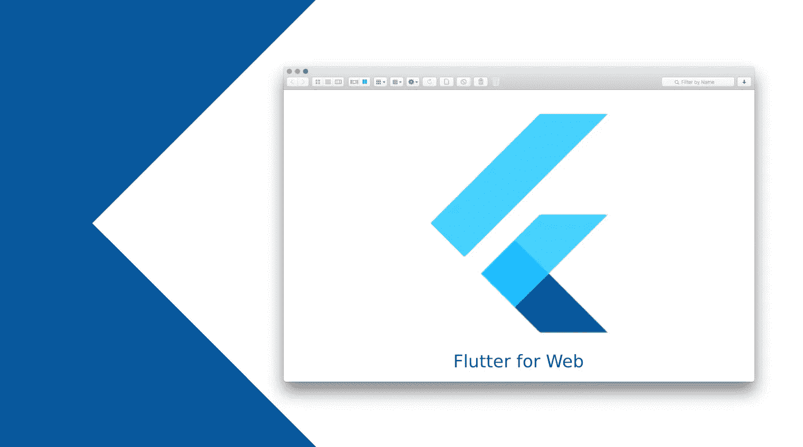

# 为您的下一个 Web 应用程序开发项目驾驭 Flutter 的力量

> 原文：<https://javascript.plainenglish.io/flutter-for-web-app-development-85ef4d0987c?source=collection_archive---------16----------------------->

## 为什么您应该为您的下一个 web 应用程序开发项目选择 Flutter。

作为一名企业家，他正在寻找将自己的下一款应用展示给你的观众，我们肯定你在选择发布它的完美平台时会感到困惑。

企业通常在两个平台上发布他们的解决方案，一个是移动平台，另一个是网络平台。不管前者有多受欢迎，重要的是要注意到，对于一个希望获得越来越广泛的受众的企业来说，网络平台确实是一个更好的主意。

为什么你会问？很简单，因为你的客户可以很容易地从他们获得你提供的服务的小屏幕上扩展他们的视野。此外，在竞争激烈的数字时代，您的发展将呈指数级增长。

令人兴奋，不是吗？

然而，这并不像看起来那么容易。因此，选择一个合适的框架，选择一套合适的工具是很重要的，最重要的是，联系一个知名 web 应用开发公司的专门开发团队。凭借他们在最新技术堆栈和工具方面的知识，他们将创建一个保证直观用户体验的解决方案，并为您的企业带来巨大的价值。

现在你需要明白一些事情，仅仅有一个 web app 是远远不够的。您还需要确保它具有正确的功能集，可以让您的最终用户在最长的时间内保持参与。

你如何着手实现这一目标？简单地通过选择合适的框架和工具。

在本文中，当我们讨论 web 平台时，有几个框架可以帮助我们完成这个任务，比如 Django、Vue.js、Laravel 和 Flutter。

然而，最近成为开发人员最喜欢的一个是 Flutter。由于它在使用单一代码库构建应用程序方面提供了支持，开发人员推荐使用相同的代码库，尤其是对于 web 应用程序开发任务。

它如此受欢迎的其他一些原因列举如下。

# 颤振流行的原因是什么？

Flutter 是 Google 推出的一个 UI 工具箱，为开发人员提供了从单一代码库构建应用程序的灵活性。这不仅有助于加速整个[应用程序的开发](https://www.xongolab.com/blog/why-flutter-is-ideal-to-build-app/)，而且也降低了整体生产成本。因此，总的来说，这是一个为创业公司带来巨大财富的框架。

**其他原因如下:**

1.  该框架使用 Google 的编程语言 Dart 构建，具有非常强大的基础。
2.  它为开发人员提供了使用单一代码库构建应用程序所需的便利。这可以防止错误的发生，并确保在开发人员找到错误的情况下，可以对其进行检查。
3.  由于单一代码库的存在，节省了时间和金钱。
4.  消除由于分层架构的存在而导致的 UI 不一致。这保证了无缝的组件定制，没有任何形式的复杂性。
5.  它拥有一个已经存在的开发团队，从而向新的开发人员承诺所需的支持，以无缝和轻松地构建一个解决方案，没有任何可能的障碍。

因此，对于无缝的 web 应用程序开发过程，建议您选择 Flutter。在进行这个过程时，请同时遵循这些步骤。它将通过您创建的解决方案帮助您提供极其惊人的用户体验。

这也将确定你的业务可以产生最大的利润。

**这里同样列举如下。**

## 安装最新的颤振版本

首先，确保您安装了 Flutter 版本 1.5.4 或更高版本。接下来，分别键入颤振通道稳定、颤振升级和颤振配置—启用 web 和颤振诊断。这将有助于您获得安装状态的更新。然后，您应该运行命令 flutter packages pub global activate web dev，并确保 HOME/pub-cache/bin 直接位于路径中。它将有助于直接从终端使用 webdev 命令。执行完这一步后，键入命令 HOME/flutter/发布缓存/bin。

## 重启系统

键入并运行上面列出的命令后，选择一个合适的 IDE。您可以从 IntelliJ、Android Studio 和 Visual Studio 代码中选择。然而，我建议你去找 VS 代码。你所要做的就是打开 VS 代码，然后，键入 ctrl+shift+p。这将为你打开命令面板。一旦打开，输入 Flutter:New Web Project。键入这个，您将获得 Stagehand 安装的许可。在接受相同的内容后，您可以简单地为您的项目提供一个位置和名称，从而轻松开发一个基本的项目演示。此后，pubget 命令将自动运行整个项目，以便加载您的项目所必需的包。

## 在命令行中键入 web serve

执行完这些步骤后，在命令行中键入 webdev serve。这将帮助你无缝地运行你的项目，并确保在支持的 Chrome 窗口中同样的可访问性。

除了遵循这些步骤，我建议你也把一些要点放在手边。这包括。

*   由于 flutter web 只能帮助你构建单页应用程序，因此，努力使它尽可能响应迅速。这将有助于用户在任何可能的屏幕尺寸上无缝地打开网站。
*   运行 flutter build web 命令来部署 Flutter web 应用程序。
*   在进入编码阶段之前，检查 web 支持的平台。

随着这些领域的实现，您可以肯定，所创建的解决方案将为您带来巨大的商业价值，以及庞大的客户群。

**总结线—选择 Flutter 进行无缝 Web 应用开发**

作为效率的结果，Flutter 在加快 web 应用程序开发的步伐方面提供了，毫无疑问，它是一个非常富有成效的商业主张，可以用来构建您的下一个解决方案。

这不仅会减少开发人员的代码开发时间，而且还会以指数级的速度加快解决方案的上市速度，并向您保证您的解决方案能够以本机方式运行，始终提供相似的 UI。

因此，如果你还在考虑是否选择这个框架，不要。它具备所有的先决条件，将确保您的业务走向新的利润高度。

*更多内容看* [***说白了。报名参加我们的***](https://plainenglish.io/)***[***免费周报***](http://newsletter.plainenglish.io/) *。关注我们关于*[***Twitter***](https://twitter.com/inPlainEngHQ)*和*[***LinkedIn***](https://www.linkedin.com/company/inplainenglish/)*。加入我们的* [***社区***](https://discord.gg/GtDtUAvyhW) *。****