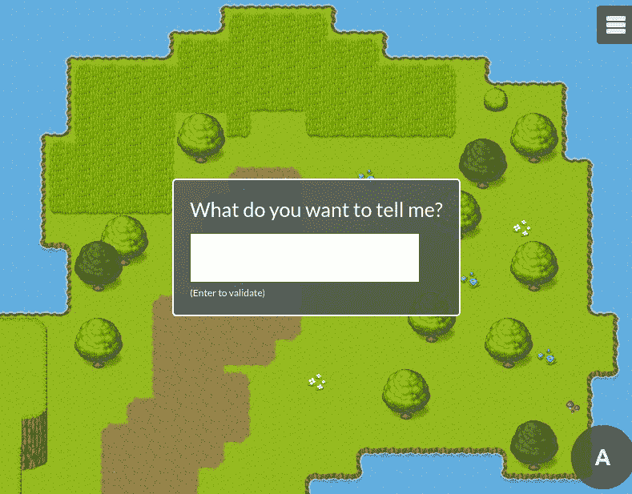
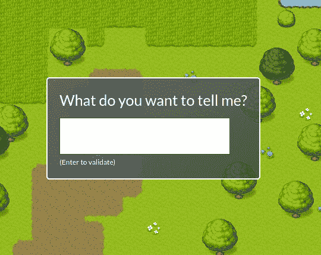
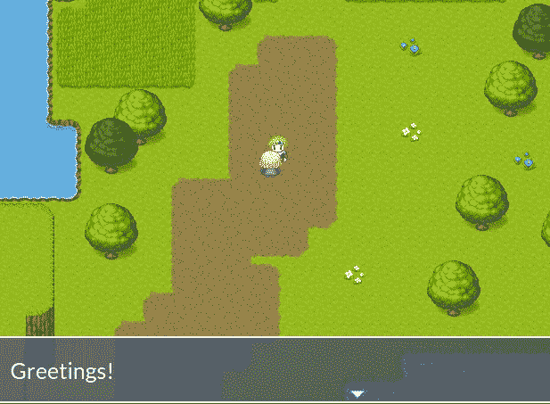

# 对于 JavaScript 中的 2D·元宇宙:在多人游戏中添加聊天机器人

> 原文：<https://javascript.plainenglish.io/for-a-2d-metaverse-in-javascript-add-a-chatbot-in-a-multiplayer-game-f291f22fe9d1?source=collection_archive---------4----------------------->



# 介绍

我开发了聊天机器人和游戏，我想:我们能不能把两者都放在一个游戏里:一个聊天机器人？现在有很多关于元宇宙的讨论，也许这个想法并不愚蠢:带着开放性的问题与一个非玩家角色交谈

# 堆

我用一个框架来创建 2D 游戏:RPGJS。这里有你的介绍:[https://JavaScript . plain English . io/create-an-RPG-MMORPG-game-in-JavaScript-in-a-rpgjs-8a 86 a 713 C2 Fe](/create-an-rpg-mmorpg-game-in-javascript-in-a-few-minutes-with-rpgjs-8a86a713c2fe)

这里，我将使用一个 Node.js 包:node-nlp。目标是:建立一个 NLP(自然语言处理)系统

# 开始

# 先决条件

您必须拥有 Node.js 14 版本。该框架在版本 15+上不工作。

# 装置

打开终端，运行以下命令行:

```
npx degit rpgjs/starter my-rpg-game
cd my-rpg-game
npm install
npm install node-nlp # NLP installation
npm run dev
```

安装需要一点时间。别担心。然后去 [http://localhost:3000](http://localhost:3000/) 看第一张渲染图。

# 创建聊天机器人

## 第 1 部分—创建 GUI



Talking with the chatbot: put “hello

首先，我们将创建菜单。我们会用 Vue.js 来做，别担心，挺快的

创建这个新文件:*src/modules/main/client/GUI/prompt . vue*

1.  第 3 行:我们已经使用了一个名为“ *rpg-window* ”的组件。它已经包含模块[*@ rpgjs/default-gu*](http://twitter.com/rpgjs/default-gui)*I*中存在的设计
2.  第 15 行:作为输入，我们有一个*文本*属性。该文本是服务器发送的起始消息
3.  第 16 行:我们用 name 属性给菜单命名。它将用于打开菜单
4.  第 17 行:我们使用 RPGJS 引擎的两个实例: *rpgKeyPress* 和 *rpgGuiClose*
5.  第 24 行: *rpgKeyPress* 允许看到按键被按下。我们用一个可观察的来听不同的键。为什么我们不用 Javascript 直接监听，还要经过 *rpgKeyPress* ？因为 *rpgKeyPress* 还会监听一个操纵杆或者其他未来潜在的控制器。此外，这里我们听到的是动作键(默认情况下是 Enter 或 Space ),但是开发者或玩家可以通过菜单来改变它
6.  第 26 行:然后，如果玩家按下 action 键，当前菜单被关闭，输入的文本被发送到服务器
7.  第 40 行:在 CSS 中，我放置了一个绝对位置来显示地图上的菜单

接下来，记得在模块中添加新菜单:

在*src/modules/main/client/index . ts*中:

## 第 2 部分—在村民中添加 NLP

现在，我们将创建一个事件(服务器端)1。打开菜单
2。将玩家的请求传递给 NLP
3。显示答案(NLG)



The chatbot responds to “hello”.

转到现有文件:*src/modules/main/server/events/village . ts*

这是代码:

1.  第 4 行:我们使用节点 NLP 训练句子和答案(来自 https://github.com/axa-group/nlp.js#example-of-use 的[的例子)](https://github.com/axa-group/nlp.js#example-of-use)
2.  第 36 行:我们在事件初始化时(当地图开始时)进行训练
3.  第 39 和 40 行:我们打开名为“*提示*”的菜单(在第 1 部分中一起创建时)。我们得到玩家发送的数据*提示文本*

*1。****waiting action****参数允许在继续指令列表之前等待玩家按下动作键(即，直到承诺被解决)
2。* ***区块玩家输入*** *参数防止玩家在菜单打开时在地图上移动*

4.第 46 和 47 行:聊天机器人的响应是根据玩家的输入得到的。如果没有找到结果，聊天机器人会说“什么”缺席

5.第 48 行:对话框显示在屏幕上(如上图)

****talk with****参数表示对话框打开时角色会转向玩家(会更自然)**

# *结论*

*正如您所看到的，设置这种类型的功能非常快。也许是为了 2D·元宇宙？*

*文档: [https://docs.rpgjs.dev](https://docs.rpgjs.dev/)*

*帮助:[https://community . rpgjs . dev](https://community.rpgjs.dev/)*

**更多内容请看*[***plain English . io***](https://plainenglish.io/)*。报名参加我们的* [***免费周报***](http://newsletter.plainenglish.io/) *。关注我们关于*[***Twitter***](https://twitter.com/inPlainEngHQ)[***LinkedIn***](https://www.linkedin.com/company/inplainenglish/)*[***YouTube***](https://www.youtube.com/channel/UCtipWUghju290NWcn8jhyAw)*[***不和***](https://discord.gg/GtDtUAvyhW) *。对增长黑客感兴趣？检查* [***电路***](https://circuit.ooo/) *。****