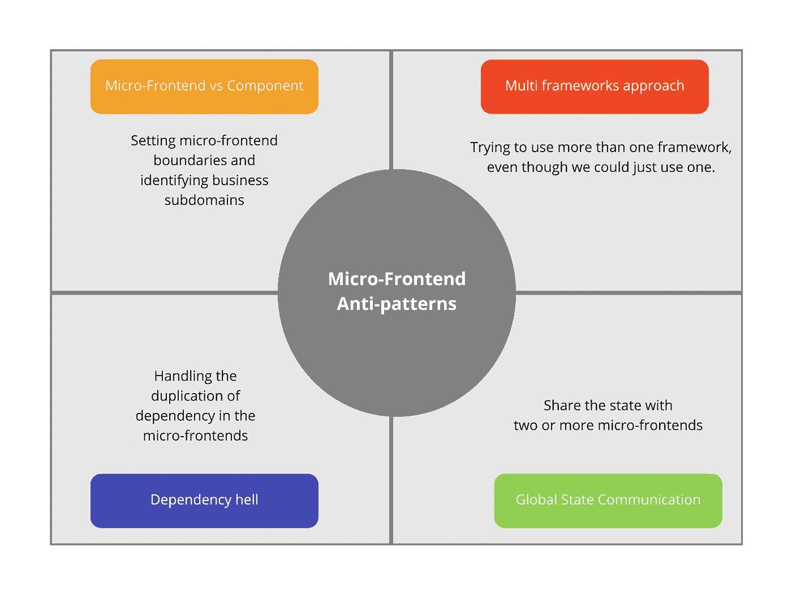
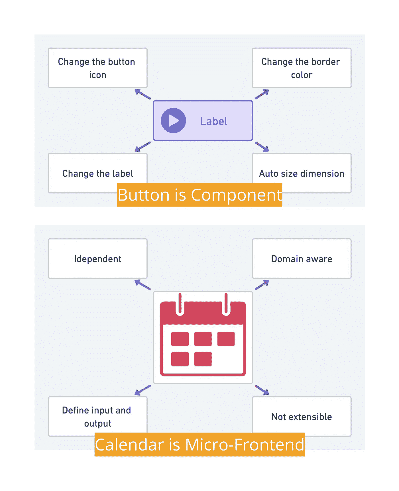
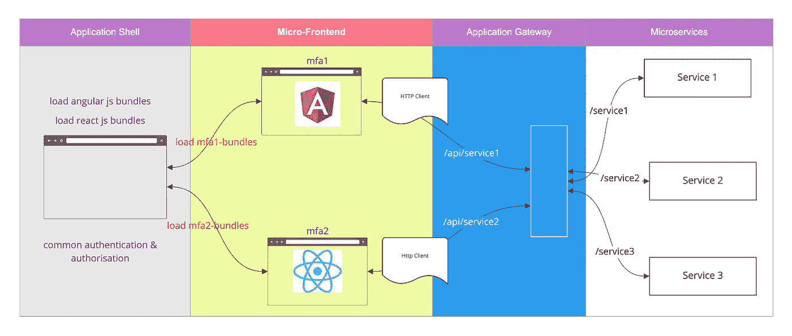
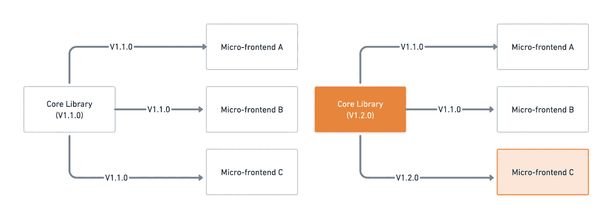
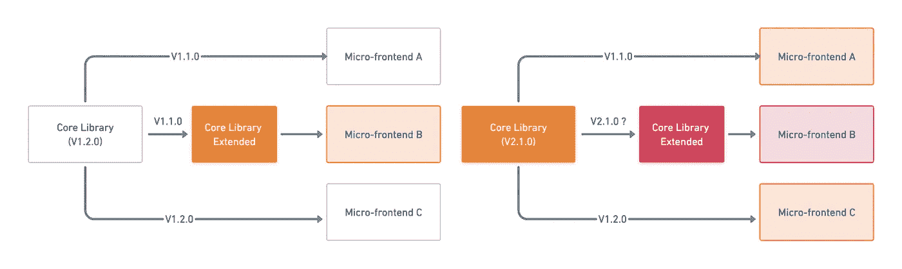
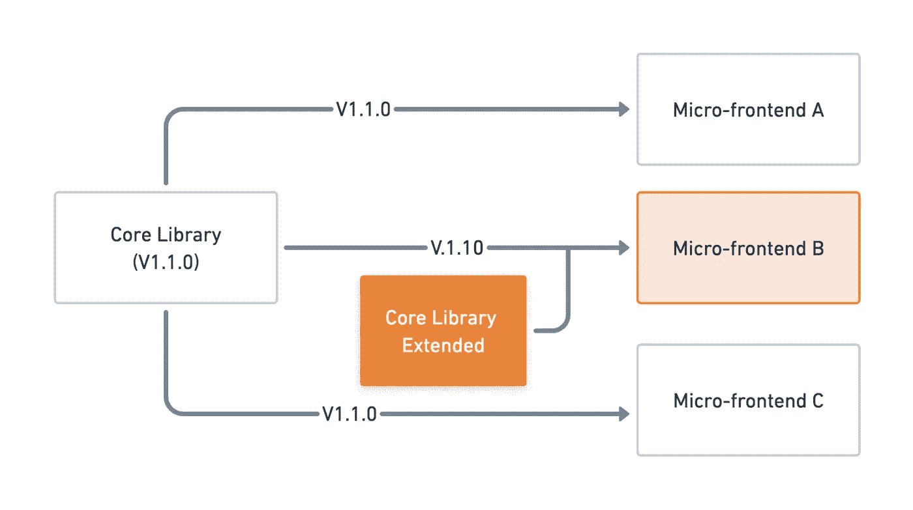
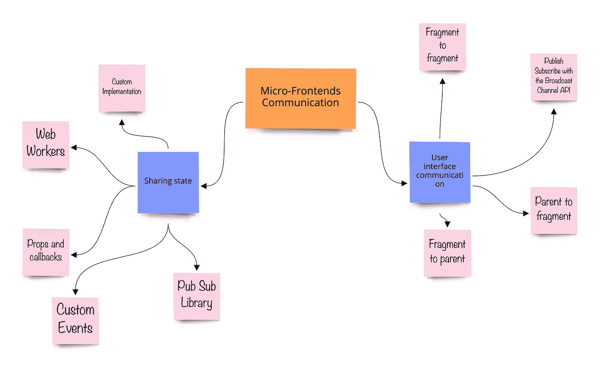
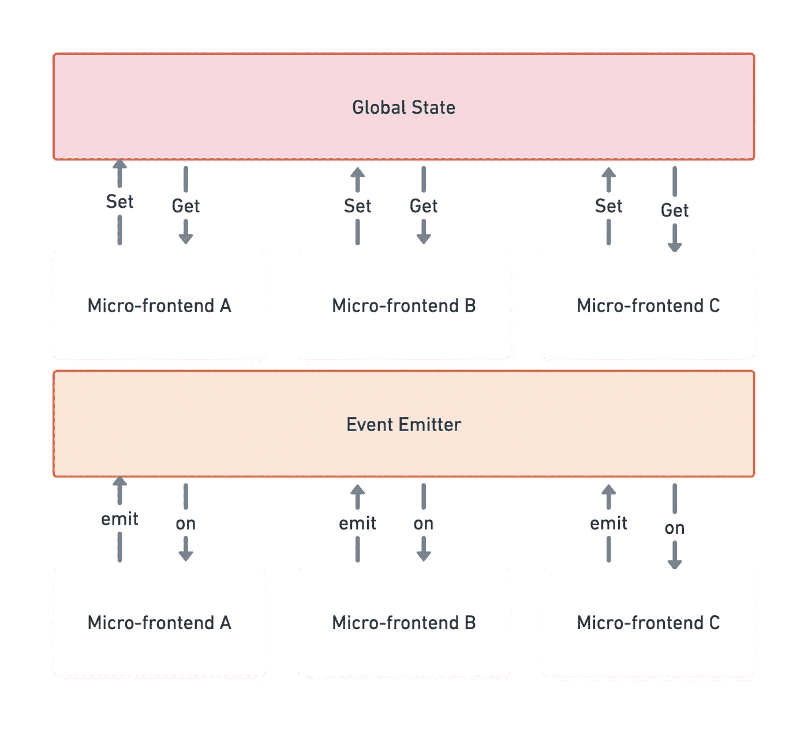

# 4 个微前端反模式

> 原文：<https://javascript.plainenglish.io/four-micro-frontend-anti-patterns-58aaa9fe19d5?source=collection_archive---------1----------------------->

## 在基于微前端的应用中造成混乱的 4 种常见方式。

Photo by [Joshua Reddekopp](https://unsplash.com/@joshuaryanphoto?utm_source=medium&utm_medium=referral) on [Unsplash](https://unsplash.com?utm_source=medium&utm_medium=referral)

# 介绍

众所周知，微前端并不是开发前端应用的新方案，它或直接或间接地来源于微服务架构。

我们知道在 JavaScript 世界中有许多不同的工具、库和框架，但是也有很多困惑。

我们主要考虑微前端架构来解决这个问题，因为我们知道它给了我们选择前端库和框架的自由。是的，这是真的，但它会给我们带来应用程序性能的问题，并带来许多其他困难。

尼尔·福特在他的书《持续交付的工程实践》中写道。

## "昨天的最佳实践是明天的反模式."

## 什么是反模式？

[反模式](http://en.wikipedia.org/wiki/Anti-pattern)是软件开发中被认为是糟糕的编程实践的特定模式。

Four Micro-frontend Anti-patterns

## **1。微前端 Vs 组件**

> *定义来自本书* [*构建微前端*](https://www.buildingmicrofrontends.com/) *由* [*卢卡·梅扎拉*](https://medium.com/u/9119c54d607d?source=post_page-----43aefd0af062--------------------------------)

微前端是业务子域的技术表示，它们允许使用相同和不同的技术独立实现。

微前端背后的原则是:

1.  业务领域表示
2.  自主代码库
3.  独立部署
4.  单一团队所有权

然而，我们经常混合组件和微前端，因为我们不确定它们的区别，这将是我们的第一个反模式。所以我们的第一个挑战是设置微前端边界和识别业务子域。

因此，根据业务子域设置微前端的边界，找出哪些子域在用户流中相互交互，并避免使用组件作为微前端，因为根据定义，微前端代表业务域。

更多信息请参考我之前的帖子，[组件和微前端有什么区别？](https://blog.santoshshinde.com/whats-the-difference-between-a-component-and-a-micro-frontend-43aefd0af062)

Micro-Frontend Vs Component

## 2.多框架方法

一旦确定了域，下一步就是建立微前端和应用程序外壳。

有了从多个微前端 web 应用程序创建统一 UI 的能力，我们可以进一步改善客户的价值流以及业务变化压力流。

由于微前端给了我们选择任何开发框架的自由，我们必须首先确定它是否是真正需要的。如果你正在开发一个新的应用程序，并且你可以为所有的微前端选择一个框架，那么最好的选择就是使用一个框架。

当您组织中的不同团队使用多种技术时，一个领域的不一致可能会导致其他团队陷入类似的困境，从而导致总体的负面用户体验。

在一些用例中，微前端具有多框架方法的好处，一个例子是当我们可以为开发人员创建一个健康的飞轮时，这加快了他们的业务逻辑的上市时间，而不影响生产流量。

以下是由此可能导致的一些潜在问题:

1.  表演
2.  依赖性冲突
3.  捆绑包的大小将得到提升。

Multi-Framework Approach

## 3.依赖地狱

根据维基百科的说法，[依赖地狱](https://en.wikipedia.org/wiki/Dependency_hell)是，

> 依赖地狱是一个通俗的术语，指的是一些软件用户的挫折感，他们安装的软件包依赖于其他软件包的特定版本

众所周知，独立性是微服务的特性，微前端也是如此。因此，为了实现这一点，我们需要额外的应用程序开发依赖项(实用程序和模块)，这将使我们能够加速和利用现有的功能。然而，问题是一个依赖项也依赖于另一个依赖项，这导致我们在向后和向前兼容性方面存在问题。

让我们通过一个例子来理解这一点，

我们用的是核心库，每个微前端用的都是 1.1.0 版本。一段时间后，该库发布了版本 1.2.0 的新特性。幸运的是，我们的一个微前端(mfa-c)对实现新特性感兴趣，并且想要那个功能。

Core Library conflicts

同时，另一个微前端(mfa-b)想要扩展其中的一些功能，所以它通过在其上编写代码来扩展。然而，核心库在主要版本 2.1.0 中发布了一个新特性，这导致了扩展特性中的冲突，需要为它创建一个新的扩展版本。

Core Library Extended

为了避免这个问题，通过使用与核心库的功能不冲突的包装器，将库从它们支持的任何特性扩展中分离出来。此外，确保所有微前端都使用相同版本的库。

1.  这种外部依赖真的有必要吗？如果没有，就避开。
2.  解耦您的库
3.  准确的文档

Decouple your libraries

## 4.全局状态通信

有时候会有属于不同团队的 UI 片段需要交互或者交流。当用户通过点击购买按钮将商品添加到购物篮时，其他微前端(如迷你购物篮)希望得到通知以相应地更新它们的内容，并且有各种方法来这样做。

1.  用户界面通信
2.  共享状态

Micro-Frontends Communication

大多数时候，我们认为全局状态是在所有应用程序之间建立通信的最佳选择。作为微前端的一个基本原则，应该是独立的，就像微服务一样，但上面的例子违背了这个原则。因此，不要使用共享状态，因为这会违反隔离的概念。

很多时候我们并不需要它，例如，来自服务器的每一个信息/状态(例如:“用户”信息)都可以在每个 MFE 需要时被单独请求。

这种模式存在于所有微服务架构中，因为它应该消除单点故障和维护大型商店的其他复杂性。常见的方法是让每个“微前端”拥有自己的存储(即 Redux)。

为了解决这个问题，您可以使用基于事件发射器的通信方法。

Global State VS Event Emitter

我知道还有其他的反模式，但是本文主要关注四种主要的反模式。请分享您的想法，我们应该关注哪些其他反模式来减少微前端架构中的挑战。

感谢阅读，请分享你的评论，如果这个博客增加了你的学习价值，请鼓掌。

# 参考

Micro frontends anti-patterns — Luca Mezzalira

 [## GitHub-Santosh shinde 2012/微前端-思维导图:总结微前端概念的思维导图

### 总结微前端概念的思维导图。为 Santosh shinde 2012/微前端-思维导图开发做出贡献…

github.com](https://github.com/santoshshinde2012/micro-frontends-mindmaps) 

*更多内容请看*[***plain English . io***](https://plainenglish.io/)*。报名参加我们的* [***免费周报***](http://newsletter.plainenglish.io/) *。关注我们关于*[***Twitter***](https://twitter.com/inPlainEngHQ)*和*[***LinkedIn***](https://www.linkedin.com/company/inplainenglish/)*。查看我们的* [***社区不和谐***](https://discord.gg/GtDtUAvyhW) *加入我们的* [***人才集体***](https://inplainenglish.pallet.com/talent/welcome) *。*