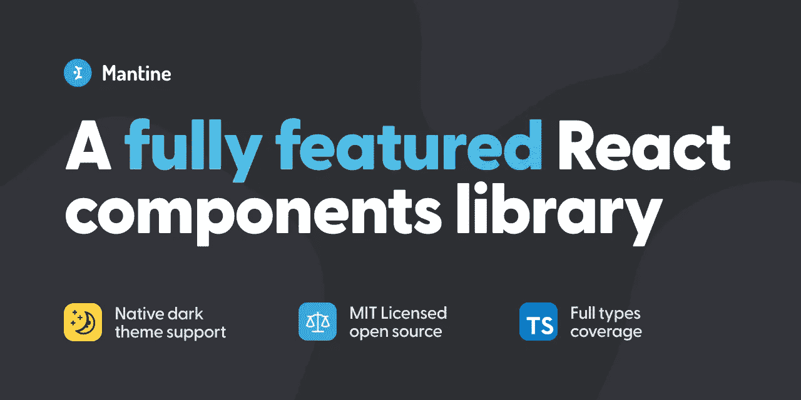
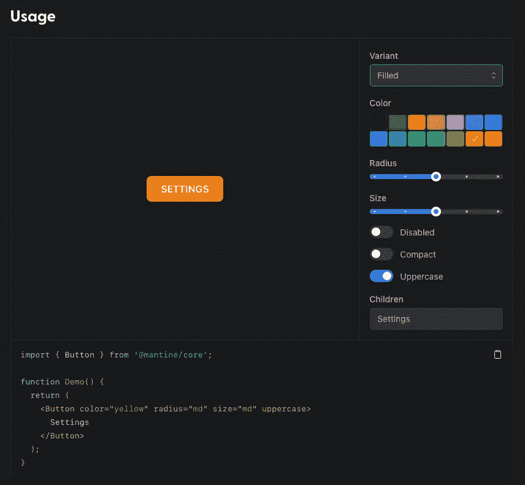

# 框架展示:Mantine

> 原文：<https://javascript.plainenglish.io/framework-showcase-mantine-a464e3400b47?source=collection_archive---------9----------------------->

## React 街区的新成员

The thumbnail of the Mantine framework

是一只口袋妖怪！我听到你说。你是对的。但它也是我们今天要检验的一个新的全功能 React 框架！

Mantine 是一个新的 UI React 框架，2021 年 5 月才发布。这是一个非常**雄心勃勃的项目，有可能攻击像[梅](https://mui.com)或 [Bootstrap](https://getbootstrap.com) 这样的行业巨头**。但它也有更高的目标——提供用户界面可能需要的一切。从组件和样式到挂钩、通知和表单！

让我们来看看它的**优势**(💚)、**弱点** ( ❗️)，以及它的去向！

## 💚钩子会让你上瘾的！

Mantine 提供了一个强大的反应钩子库。目前的数字是 45，并且随着每个版本的发布而增加。这些挂钩的范围从简单的包装器到编码杰作。例如用于检测用户操作系统的[钩子](https://mantine.dev/hooks/use-os/)就是一个非常方便的例子。另一方面，[组件的完全可见性](https://mantine.dev/hooks/use-intersection/)或[热键挂钩](https://mantine.dev/hooks/use-hotkeys/)让我大吃一惊！

关于这些钩子最好的部分是，与其他框架不同，它们不以任何方式绑定到 Mantine 组件。也就是说，如果你不喜欢 UI(或者你现在不能切换)，只需安装挂钩并尝试一下！

## ❗️:这基本上是一个人的工作

截至目前，Mantine 的作者 Vitaly 是整个框架的主要贡献者。这个框架是作者在日常工作中使用的。这太棒了，因为这确保了它在可预见的未来保持相关性和最新性。但作为一种附带项目，这意味着增加新功能的速度可能会受到限制。

此外，维塔利不接受任何形式的赞助或捐赠。

然而，在第一次正式发布的前 10 个月，Mantine 已经积累了 **9.4k Github 明星** ⭐️和 120 多个贡献者！该项目几乎每天都在更新，漏洞也很快得到修复。可以肯定地说，这个框架是有生命力的，并且目标远大！

## 💚证明文件

*嗯，咄。当然，它有文档。当然可以。但却是杰出的一个！让我快速地解释一下:*

1.  它有现场演示。这意味着您可以尝试不同风格的组件，并立即看到代码中反映的变化。
2.  真正的富有。每个组件、每个挂钩都有一个真实的例子。探索或解释了样式的所有选项。在我和 Mantine 一起工作的这段时间里，我甚至从未觉得有必要去谷歌一些东西。**你需要的一切都在那里。**
3.  类似聚光灯的功能。🔍不仅 Mac 用户会喜欢这个。搜索文档现在升级为点击`Cmd+K`并输入你想要查找的表达式。非常快，非常容易。也可以作为一个独立的组件提供给您！

Live preview of Button styling

## ⚔️主题可能不适合所有人

在这个问题上我有点矛盾。组件主题化有很多方法。它们确保你可以使用 Mantine 提供的工具做任何事情。但是所有的选项都会有点混乱。以下是主要概要:

*   **MantineProvider** 组件及其主题对象。似乎是受到了[主题 UI](https://theme-ui.com) 的启发。在包装的组件中提供级联样式。
*   **createStyles** 和 **sx prop** 利用了 emotion 的 *css-in-js* 系统。如果您使用 createStyles，您可以非常容易地利用 MantineProvider 提供的主题。MUI 用户应该很熟悉`sx` prop 的语法。
*   **组件道具**往往会影响组件的外观。我几乎只使用这个选项，如果你不需要对外表有绝对的控制，它很简单而且很有效。
*   **内联样式**对于小的调整变得非常方便，因为所有的组件都已经很好的主题化了！

…以及更多！例如，你甚至可以直接使用 Mantine 的内部 CSS 类。但在这一点上，我会说去找一个特定的 CSS 框架。

## ❗️它很年轻

有企业支持、大量引用和社区的经过战斗考验的框架就在那里。跨越多个开发团队多年的项目更喜欢这种类型。

相比较而言，Mantine 是一个**没有前科，潜力大**的小混混。和谁一起跑由你自己决定！

## 💚一个屋檐下的一切

对我来说，这是这个框架的主要卖点。它提供了从样式组件到复杂的形式检查挂钩的一切。前端 JS 应用程序是一堆粘在一起的库，外加一些 CSS 模板，这种情况并不少见。随着时间的推移，事情会发生变化，需要更新——由于大量的依赖性，事情会很快失控。

不再是了。Mantine 提供了**你的前端需要的一切**。组件？当然可以。情态动词和松饼？是的，先生！复杂任务的挂钩以及简单的便利工具？你打赌！以及通知、日期、拖放区、代码荧光笔和富文本编辑器。欢迎你用 Next.js 或者 Gatsby…

我可以一直继续下去。

# 那么你应该在你的下一个项目中使用 Mantine 吗？

如果你的目标是创建一个高度定制的非常规网站，拥有疯狂的图像、过渡、动画和定制的 3D 效果……那么，你可能已经知道如何做了。

但是如果你的目标是创建好看的、**功能**的网站，这是完美的匹配！框架的年轻实际上对你有利。很久以前，[材料设计](https://material.io/components)是一种全新而闪亮的做事方式——现在它看起来已经过时了。Mantine 的**圆滑干净的设计**就像一股清新的空气。

我认为，例如媒体本身可以很好地用 Mantine 编写！简单好看的设计。复杂的布局变得简单。可以利用内置挂钩的高级功能。

可能性的世界是你的🌍

*PS:如果你喜欢这篇文章，请告诉我！这可能是我们探索这个框架更多的 Mantine 主题系列的开始！*

*更多内容看* [***说白了。报名参加我们的***](https://plainenglish.io/) **[***免费周报***](http://newsletter.plainenglish.io/) *。关注我们关于*[***Twitter***](https://twitter.com/inPlainEngHQ)*和*[***LinkedIn***](https://www.linkedin.com/company/inplainenglish/)*。加入我们的* [***社区不和谐***](https://discord.gg/GtDtUAvyhW) *。***